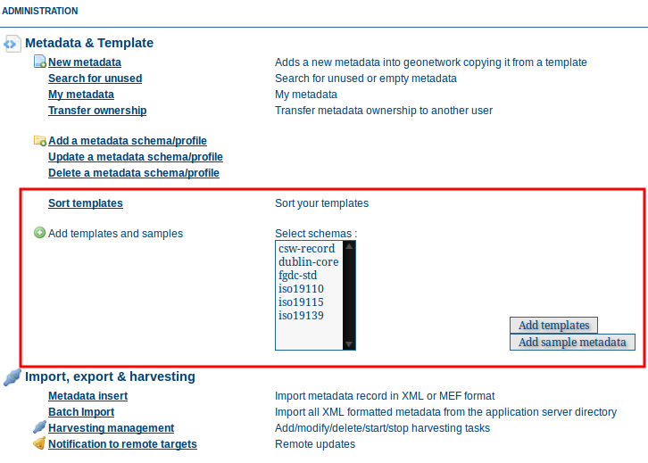
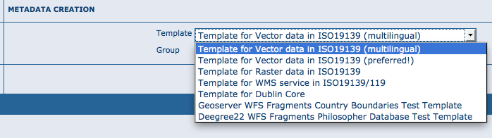

.. _templates:

Templates
=========

The *Metadata and Templates* options in the Administration page allows you to manage the metadata templates in the catalog. You have to be logged in as an administrator to access this page and function. 

Sort templates
--------------

You can define the order in which Templates are listed when an Editor creates a new metadata record. 

	*The listing as shown to Editors*

Use drag and drop to re-order the templates.

.. figure:: templates-sort.png

	*Sort Templates panel*

Add templates
-------------

This option allows the user to select the metadata templates from any schema and add them to the catalogue.

.. warning:: This will add the default templates available for each schema in ``GEONETWORK_DATA_DIR/config/schema_plugins`` - it should be used with care by an Administrator.

.. figure:: templates-add.png

Select the metadata schemas to add templates from (multiple selections can be made) and click on the  *Add templates* button to import them into the catalogue. They will then be available for creating new metadata records.
