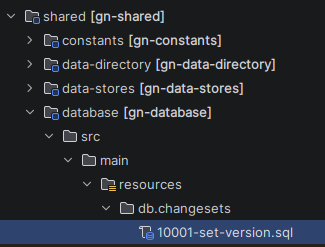

# Database module

## Database initialization

Liquibase is used to manage database schema creation and changes and the configuration is made in [`changelog.xml`](src/main/resources/db/changelog.xml).

When adding new entities or making changes to existing ones, please make sure 
to update the database changelog accordingly by adding a new file in the [`changesets directory`](src/main/resources/db/changesets).

Numbering is important to keep track of the order of changes, so please follow the existing pattern when naming new changeset files.
When a feature is backported in various branches, the numbering ensure that the changesets are applied in the correct order.

eg. `main` can contain changesets 001 to 010, while `4.2.x` contains changesets 001 to 006 and 009 which was backported.

Liquibase track changes applied to the current database in the `DATABASECHANGELOG` and `DATABASECHANGELOGLOCK` tables.


## Old database initialization and migration system proposal

GeoNetwork using its own mechanism based on Java and SQL to migrate from version to version.
This mechanism does not work well when backporting changes to previous versions and does not support all possible migration paths.

It is proposed the following strategy to move to Liquibase: **Old GeoNetwork system is used until version 4.4.x, then starting from version 4.6.x Liquibase only is used.**

This means:
* Users upgrading to version 4.6.x will first have to migrate to the latest 4.4.x version using the old system, then upgrade to 4.6.x which will use Liquibase.
* New installations of version 4.6.x and later will use Liquibase only.

This approach avoid to migrate all existing migration steps to Liquibase, which is hard to do because of:
* Java migration steps
* Hibernate automatic schema generation not described in SQL
* Complexity to test all migration paths (which are not even working well with the old system)


## Liquibase implementation status

Draft experiment to implement initial database creation and initial data loading using Liquibase.

- [ ] Databases tested (test: first run works, restart works)
  - [x] Postgres
  - [x] H2 (needed for test in GN4)
  - [ ] Other - discuss which database do we support and test?
- [x] [Liquibase bean configuration](../domain/src/main/resources/config-spring-geonetwork.xml) with  [`changelog.xml`](src/main/resources/db/changelog.xml) as main changelog file
- [x] [Schema creation](src/main/resources/db/changesets/00000-initial-schema.xml) / Precondition: no table metadata exists
- [x] [Initial data](src/main/resources/db/changesets/00001-initial-data.sql) / Precondition: table settings is empty
- [x] [Initial languages](src/main/resources/db/changesets/00002-initial-data-languages-eng.sql) / Precondition: table language does not have eng
- [ ] Other languages
- [ ] Remove past database migrations 
- [ ] Remove old configuration `initial_data.xml` and `database_migration.xml`
- [ ] Remove `db.migration_onstartup` property / Hibernate `hbm2ddl` property set to `none`
- [ ] Remove `TestDatabasePopulator`
- [ ] ...

## GeoNetwork 5 and Liquibase

GeoNetwork 5 can depend on the GeoNetwork 4 database module to initialize the database using Liquibase.

To enable liquibase in GeoNetwork 5 by:

* Adding liquibase dependency in `pom.xml`:

```xml
<dependency>
  <groupId>org.liquibase</groupId>
  <artifactId>liquibase-core</artifactId>
  <version>4.29.2</version>
  <exclusions>
    <exclusion>
      <artifactId>liquibase-commercial</artifactId>
      <groupId>org.liquibase</groupId>
    </exclusion>
  </exclusions>
</dependency>
```

* Create a new GeoNetwork 5 database module which will contains changesets specific to GeoNetwork 5:



* Adding dependency on GeoNetwork 4 database module and GeoNetwork 5 database module in `shared/gn-domain/pom.xml`: 

```xml
    <dependency>
      <groupId>org.geonetwork-opensource</groupId>
      <artifactId>gn-database</artifactId>
      <version>4.4.10-SNAPSHOT</version>
    </dependency>
    <dependency>
      <groupId>org.geonetwork</groupId>
      <artifactId>gn-database</artifactId>
      <version>${project.version}</version>
    </dependency>
```

* Adding the following properties to `application.yml`:

```yaml
 spring:
   application:
     name: GeoNetwork
   liquibase:
     enabled: true
     change-log: classpath:/db/changelog.xml
```

Then both GeoNetwork 4 and GeoNetwork 5 can use Liquibase to initialize the database schema and data. 
Liquibase has a lock mechanism to avoid multiple instances to apply changes at the same time.


## Questions

To be investigated:
* Check context and labels to flag GN4/GN5 changesets? (See https://docs.liquibase.com/reference-guide/changelog-attributes/what-are-contexts)
* Define process to manage changes from GN4 and GN5?
* How to generate changelogs? Intellij has support for liquibase https://www.jetbrains.com/help/idea/liquibase.html

