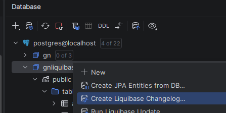

# Database module

[Liquibase](https://www.liquibase.com/) is used to manage database schema creation and changes on a per-feature basis.

Documentation about Liquibase can be found in the [Liquibase documentation](https://docs.liquibase.com/oss/implementation-guide-4-33/intro-to-liquibase).

## Database initialization

The configuration is made in [`changelog.xml`](src/main/resources/db/changelog.xml).

When adding new entities or making changes to existing ones, please make sure 
to update the database changelog accordingly by adding a new file in the [`changesets directory`](src/main/resources/db/changesets).

Numbering is important to keep track of the order of changes, so please follow the existing pattern when naming new changeset files.
When a feature is backported in various branches, the numbering ensure that the changesets are applied in the correct order.

eg. `main` can contain changesets 001 to 010, while `4.2.x` contains changesets 001 to 006 and 009 which was backported.

Liquibase track changes applied to the current database in the `DATABASECHANGELOG` and `DATABASECHANGELOGLOCK` tables.


If required, database values can be customized using variables. Variables are defined in [geonetwork_db.properties](src/main/resources/db/geonetwork_db.properties).
Variables can then be used in changesets and can be overridden using JVM args or env vars when starting the application or liquibase utility.

eg.
* `-Dgeonetwork.settings.system.server.host=data.myorg.org -Dgeonetwork.settings.system.server.protocol=https -Dgeonetwork.settings.system.server.port=443`.
* `-Dgeonetwork.users.admin.username=XYZ -Dgeonetwork.users.admin.passwordhash=1eB2....`


## Databases tested

Currently, Liquibase is tested with the following databases:
* Postgres
* H2 (needed for test in GN4)


## Custom GeoNetwork 4.4.x database initialization and migration system proposal 

GeoNetwork 4.4.x is using a custom mechanism based on Java and SQL to migrate from version to version.
This mechanism does not work well when backporting changes to previous versions and does not support all possible migration paths.

It is proposed the following strategy to move to Liquibase: **Custom GeoNetwork system is used until version 4.4.x, then starting from version 4.6.x Liquibase only is used.**

This means:
* Users upgrading to version 4.6.x will first have to migrate to the latest 4.4.x version using the old system, then upgrade to 4.6.x which will use Liquibase.
* New installations of version 4.6.x and later will use Liquibase only.

This approach avoid to migrate all existing migration steps to Liquibase, which is hard to do because of:
* Java migration steps
* Hibernate automatic schema generation not described in SQL
* Complexity to test all migration paths (which are not even working well with the old system)


## Liquibase utilities

From the database module, liquibase command line tool can be used:

```bash
mvn liquibase:help
```

### Testing connection

Testing liquibase connection to a database can be done using:

```bash
mvn liquibase:status \
  -Dliquibase.url=jdbc:postgresql://localhost:5432/geonetwork \
  -Dliquibase.username=www-data \
  -Dliquibase.password=www-data
```

### Populating a database

To populate a database using liquibase, configure the database connection in `liquibase.properties` (or set command parameters) and run:

```bash
mvn liquibase:update \
  -Dliquibase.url=jdbc:postgresql://localhost:5432/geonetwork \
  -Dliquibase.username=www-data \
  -Dliquibase.password=www-data \
  -Dliquibase.logLevel=info \
  -Dgeonetwork.system.site.name="My catalogue"
```


### Diff between 2 databases

Use [Liquibase command line tool](https://docs.liquibase.com/oss/implementation-guide-4-33/generate-changelog-from-existing-database) support to generate change logs from an existing database.

```bash
mvn liquibase:diff
```
or
```bash
mvn liquibase:diff \
  -Dliquibase.url=jdbc:postgresql://localhost:5432/geonetwork-dev \
  -Dliquibase.username=www-data \
  -Dliquibase.password=www-data \
  -Dliquibase.referenceUrl=jdbc:postgresql://localhost:5432/geonetwork-prod \
  -Dliquibase.referenceUsername=www-data \
  -Dliquibase.referencePassword=www-data
```

Diff Results:

```
Reference Database: www-data @ jdbc:postgresql://localhost:5432/geonetwork-prod (Default Schema: public)
Comparison Database: www-data @ jdbc:postgresql://localhost:5432/geonetwork-dev (Default Schema: public)
Compared Schemas: public'
Changed Index(s): NONE
Missing Primary Key(s): 
     anonymousaccesslink_pkey on public.anonymousaccesslink(id)
Unexpected Primary Key(s): 
     databasechangeloglock_pkey on public.databasechangeloglock(id)
Changed Primary Key(s): NONE
Missing Schema(s): NONE
Unexpected Schema(s): NONE
Changed Schema(s): NONE
Missing Sequence(s): 
     anonymous_access_link_id_seq
Unexpected Sequence(s): NONE
Changed Sequence(s): NONE
Missing Table(s): 
     anonymousaccesslink

...
```

### Generating change logs from existing database using Liquibase command line tool

Use the following to generate change logs from an existing database using Liquibase command line tool:

```bash
mvn liquibase:generateChangeLog \
  -Dliquibase.url=jdbc:postgresql://localhost:5432/geonetwork-dev \
  -Dliquibase.username=www-data \
  -Dliquibase.password=www-data \
  -Dliquibase.outputChangeLogFile=your_changelog.xml
```

Output change log file extension can be `.xml`, `.json` or `.yaml` depending on the format you want to use for your change log file.

### Generating change logs from existing database in Intellij

In Intellij, you can generate change logs from an existing database using the following steps:
1. Open the Database tool window (View | Tool Windows | Database).
2. Select the database connection for which you want to generate the change log.
3. Right-click on the database connection and select "Generate Liquibase Changelog".
4. In the "Generate Liquibase Changelog" dialog, specify the output file for the change log and select the options for the generation process.
5. Click "OK" to generate the change log file.




### Generating a changeset

For every change in the database, add your changeset to [changesets](src/main/resources/db/changesets).

Create it manually in one of the supported formats (XML, JSON, SQL or YAML) or use the Liquibase command line tool to generate it from an existing database (see above).

Changeset can have a `context` which can be used to specify in which context the changeset should be applied. Current values are:
* `schema-only` to only apply schema changes (eg. create table, add column, etc.). It is used by [`gn-domain` module for tests](../domain/src/test/resources/domain-repository-test-context.xml)
* `test` to only load main data for tests. It is used by [core-repository-test-context.xml](../core/src/test/resources/core-repository-test-context.xml) to only load English language during testing.
* `prod`


```bash
mvn liquibase:update \
  -Dliquibase.changeLogFile=src/main/resources/db/changelog.xml \
  -Dliquibase.url=jdbc:postgresql://localhost:5432/gnliquibasetest \
  -Dliquibase.username=www-data \
  -Dliquibase.password=www-data \
  -Dliquibase.logLevel=info \
  -Dliquibase.contexts=prod
```

## Liquibase logging

To test:

* `-Dliquibase.logLevel=INFO` or `LIQUIBASE_LOG_LEVEL=WARNING`
* [`liquibase-slf4j` dependency](https://github.com/mattbertolini/liquibase-slf4j) is used to log Liquibase output using SLF4J.


## Language data

Language data is loaded using Liquibase changesets `db/changesets/000X-initial-data-language-{iso3code}`.
This is also used in admin > settings > languages.


Q: One limitation in future changes, is how do we load additional language specific data not in initial changeset?


## GeoNetwork 5 and Liquibase

See https://github.com/geonetwork/geonetwork/pull/153
