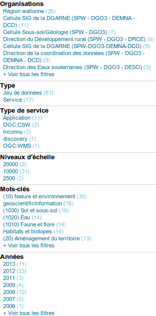

.. _adv_configuration:

Advanced configuration
======================

.. _Database_JNDI_configuration:

Database configuration
----------------------

GeoNetwork has two options for pooled connections to the relational database:

#. Manage its own database configuration and pool directly using Apache Commons Database Connection Pool (DBCP)
#. Use database configuration and pool managed by the web application server (also known as the container) such as tomcat or jetty via the Java Naming and Directory Interface (JNDI).

Managing the database connection pool through Apache DBCP
~~~~~~~~~~~~~~~~~~~~~~~~~~~~~~~~~~~~~~~~~~~~~~~~~~~~~~~~~

This option is the one that most users would use as it is the default option for managing the database in GeoNetwork. A typical configuration in the resources element of `INSTALL_DIR/web/geonetwork/WEB-INF/config.xml` uses the `jeeves.resources.dbms.ApacheDBCPool` class and looks something like:

::

	<resource enabled="true">
		<name>main-db</name>
		<provider>jeeves.resources.dbms.ApacheDBCPool</provider>
		<config>
			<user>www-data</user>
			<password>www-data</password>
			<driver>org.postgis.DriverWrapper</driver>
			<url>jdbc:postgresql_postGIS://localhost:5432/geonetwork</url>
			<poolSize>10</poolSize>
			<validationQuery>SELECT 1</validationQuery>
		</config>
	</resource>	 

The parameters that can be specified to control the Apache Database Connection Pool are described at http://commons.apache.org/dbcp/configuration.html. You can configure a subset of these parameters in your resource element. The parameters that can be specified are:

===================================   ============================================================================   =========================================
Parameter                             Description                                                                    Default               
===================================   ============================================================================   =========================================
maxActive                             pool size/maximum number of active connections                                 10                     
maxIdle                               maximum number of idle connections                                             maxActive             
minIdle                               minimum number of idle connections                                             0                     
maxWait                               number of milliseconds to wait for a connection to become available            200                   
validationQuery                       sql statement for verifying a connection, must return a least one row          no default            
timeBetweenEvictionRunsMillis         time between eviction runs (-1 means next three params are ignored)            -1                    
testWhileIdle                         test connections when idle                                                     false                 
minEvictableIdleTimeMillis            idle time before connection can be evicted                                     30 x 60 x 1000 msecs  
numTestsPerEvictionRun                number of connections tested per eviction run                                  3                     
maxOpenPreparedStatements             number of sql statements that can be cached for reuse (-1 none, 0 unlimited)   -1                    
defaultTransactionIsolation           see http://en.wikipedia.org/wiki/Isolation_%28database_systems%29              READ_COMMITTED
===================================   ============================================================================   =========================================

For performance reasons you should set the following parameter *after* GeoNetwork has created and filled the database tables it has been configured to use:

- maxOpenPreparedStatements="300" (at least) 

The following parameters are set by GeoNetwork and cannot be configured by the user:

- removeAbandoned - true
- removeAbandonedTimeout - 60 x 60 seconds = 1 hour
- logAbandoned - true
- testOnBorrow - true
- defaultReadOnly - false
- defaultAutoCommit - false
- initialSize - maxActive
- poolPreparedStatements - true, if maxOpenPreparedStatements >= 0, otherwise false 

Note: Some firewalls kill idle connections to databases after say 1 hour (= 3600 secs). To keep idle connections alive by testing them with the validationQuery, set minEvictableIdleTimeMillis to something less than timeout, interval (eg. 2 mins = 120 secs = 120000 millisecs), set testWhileIdle to true and set timeBetweenEvictionRunsMillis and numTestsPerEvictionRun high enough to visit connections frequently eg 15 mins = 900 secs = 900000 millisecs and 4 connections per test. For example:

::

	<testWhileIdle>true</testWhileIdle>
	<minEvictableIdleTimeMillis>120000</minEvictableIdleTimeMillis>
	<timeBetweenEvictionRunsMillis>900000</timeBetweenEvictionRunsMillis>
	<numTestsPerEvictionRun>4</numTestsPerEvictionRun>

**Note:**

- When GeoNetwork manages the database connection pool, PostGIS database is the only database that can hold the spatial index in the database. All other database choices hold the spatial index as a shapefile. If using PostGIS, two pools of database connections are created. The first is managed and configured using parameters in this section, the second is created by GeoTools and cannot be configured. This approach is now *deprecated*: if you want to use the database to hold the spatial index you *should* use the JNDI configuration described in the next section because it uses a single, configurable database pool through GeoTools as well as the more modern NG (Next Generation) GeoTools datastore factories. 
- For more on transaction isolation see http://en.wikipedia.org/wiki/Isolation_%28database_systems%29.

Database connection pool managed by the container
~~~~~~~~~~~~~~~~~~~~~~~~~~~~~~~~~~~~~~~~~~~~~~~~~

A typical configuration in the resources element of `INSTALL_DIR/web/geonetwork/WEB-INF/config.xml` uses the `jeeves.resources.dbms.JNDIPool` class and looks something like:

::

	<resource enabled="true">
		<name>main-db</name>
		<provider>jeeves.resources.dbms.JNDIPool</provider>
		<config>
			<context>java:/comp/env</context>
			<resourceName>jdbc/geonetwork</resourceName>
			<url>jdbc:oracle:thin:@localhost:1521:XE</url>
			<provideDataStore>true</provideDataStore>
		</config>
	</resource>	

The configuration parameters and their meanings are as follows:

===========================   =======================================================================================================
Config Parameter              Description
===========================   =======================================================================================================
context                       The name of the context from which to obtain the resource - almost always this is java:/comp/env
resourceName                  The name of the resource in the context to use
url                           The URL of the database - this is needed to let GeoTools know the database type
provideDataStore              If set to true then the database will be used for the spatial index, otherwise a shapefile will be used
===========================   =======================================================================================================

The remainder of the configuration is done in the container context. eg. for tomcat this configuration is in conf/context.xml in the resource called jdbc/geonetwork. Here is an example for the Oracle database:

::

	<Resource name="jdbc/geonetwork"
		auth="Container"
		type="javax.sql.DataSource"
		username="system"
		password="oracle"
		factory="org.apache.commons.dbcp.BasicDataSourceFactory"
		driverClassName="oracle.jdbc.OracleDriver"             
		url="jdbc:oracle:thin:@localhost:1521:XE"
		maxActive="10"
		maxIdle="10"
		removeAbandoned="true"
		removeAbandonedTimeout="3600"
		logAbandoned="true"
		testOnBorrow="true"
		defaultAutoCommit="false" 
		validationQuery="SELECT 1 FROM DUAL"
		accessToUnderlyingConnectionAllowed="true"
	/>

eg. for jetty, this configuration is in `INSTALL_DIR/web/geonetwork/WEB-INF/jetty-env.xml`. Here is an example for the Postgis database:

::

  <Configure class="org.eclipse.jetty.webapp.WebAppContext">
    <New id="gnresources" class="org.eclipse.jetty.plus.jndi.Resource">
      <Arg></Arg> 
      <Arg>jdbc/geonetwork</Arg>
      <Arg>
        <New class="org.apache.commons.dbcp.BasicDataSource">
          <Set name="driverClassName">org.postgis.DriverWrapper</Set>
          <Set name="url">jdbc:postgresql_postGIS://localhost:5432/gndb</Set>
          <Set name="username">geonetwork</Set>
          <Set name="password">geonetworkgn</Set>
          <Set name="validationQuery">SELECT 1</Set>
          <Set name="maxActive">10</Set>
          <Set name="maxIdle">10</Set>
          <Set name="removeAbandoned">true</Set>
          <Set name="removeAbandonedTimeout">3600</Set>
          <Set name="logAbandoned">true</Set>
          <Set name="testOnBorrow">true</Set>
          <Set name="defaultAutoCommit">false</Set>
          <!-- 2=READ_COMMITTED, 8=SERIALIZABLE -->
          <Set name="defaultTransactionIsolation">2</Set>
          <Set name="accessToUnderlyingConnectionAllowed">true</Set>
        </New>
    	</Arg>
      <Call name="bindToENC">
        <Arg>jdbc/geonetwork</Arg>  
      </Call>
   	</New>
  </Configure>

The parameters that can be specified to control the Apache Database Connection Pool used by the container are described at http://commons.apache.org/dbcp/configuration.html.

The following parameters *must* be set to ensure GeoNetwork operates correctly:

============================================   ============================================================
Tomcat Syntax                                  Jetty Syntax                                                  
============================================   ============================================================
defaultAutoCommit="false"                      <Set name="defaultAutoCommit">false</Set>             
accessToUnderlyingConnectionAllowed="true"     <Set name="accessToUnderlyingConnectionAllowed">true</Set>     
============================================   ============================================================

For performance reasons you should set the following parameters *after* GeoNetwork has created and filled the database it has been configured to use:

============================================   ============================================================
Tomcat Syntax                                  Jetty Syntax                                                  
============================================   ============================================================
poolPreparedStatements="true"                  <Set name="poolPreparedStatements">true</Set>
maxOpenPreparedStatements="300" (at least)     <Set name="maxOpenPreparedStatements">300</Set>
============================================   ============================================================

Notes:

- both PostGIS and Oracle will build and use a table in the database for the spatialindex if provideDataStore is set to true. Other databases could be made to do the same if a spatialindex table is created - see the definition for the spatialIndex table in `INSTALL_DIR/web/geonetwork/WEB-INF/classes/setup/sql/create/create-db-postgis.sql` for example.
- you should install commons-dbcp-1.3.jar and commons-pool-1.5.5.jar in the container class path (eg. `common/lib` for tomcat5 or `jetty/lib/ext` for Jetty) as the only supported DataSourceFactory in geotools is apache commons dbcp. 
- the default tomcat-dbcp.jar version of apache commons dbcp for tomcat appears to work correctly for geotools and PostGIS but does not work for those databases that need to unwrap the connection in order to do spatial operations (eg. Oracle).
- Oracle ojdbc-14.jar or ojdbc5.jar or ojdbc6.jar (depending on the version of Java being used) and sdoapi.jar should also be installed in the container class path (for tomcat: `common/lib` or `lib` and for jetty: `jetty/lib/ext`). 
- advanced: you should check the default transaction isolation level for your database driver. READ_COMMITTED appears to be a safe level of isolation to use with GeoNetwork for commonly used databases. Also note that McKoi can only support SERIALIZABLE (does anyone still use McKoi?). For more on transaction isolation see http://en.wikipedia.org/wiki/Isolation_%28database_systems%29.

.. _database_specific_issues:

Specific Database Issues
~~~~~~~~~~~~~~~~~~~~~~~~

Oracle
''''''

ORACLE on Linux (x86_64): if your connection with the database takes a long time to establish or frequently times out then adding `-Djava.security.egd=file:/dev/../dev/urandom` to your JAVA_OPTS environment variable (for tomcat) or the startup.sh script may help. For more information on this see https://kr.forums.oracle.com/forums/thread.jspa?messageID=3699989.

ORACLE returns `ORA-01000: maximum open cursors exceeded` whilst filling the tables in a newly created GeoNetwork database. This occurs because you have enabled the prepared statement pool in either the container database configuration or the GeoNetwork database configuration in `WEB-INF/config.xml`. Until the database fill statements used by GeoNetwork are refactored, you will not be able to use a prepared statement cache with ORACLE if you are creating and filling a new GeoNetwork database so you should set the DBCP maxOpenPreparedStatements parameter to -1. *However*, after the database has been created and filled, you *can* use a prepared statement cache so, you should stop GeoNetwork and configure the prepared statement cache as described above before restarting.

DB2
'''

DB2 may produce an exception when GeoNetwork is started for the first time::

        DB2 SQL error: SQLCODE: -805, SQLSTATE: 51002, SQLERRMC: NULLID.SYSLH203

There are two possible solutions to this problem:

- Setup the database manually using a procedure like the following::

        db2 create db geonet
        db2 connect to geonet user db2inst1 using mypassword
        db2 -tf INSTALL_DIR/WEB-INF/classes/setup/sql/create/create-db-db2.sql > res1.txt
        db2 -tf INSTALL_DIR/WEB-INF/classes/setup/sql/data/data-db-default.sql > res2.txt
        db2 connect reset

After execution, check **res1.txt** and **res2.txt** if errors have occurred.

- Drop the database, re-create it, locate the file db2cli.lst in the db2 installation folder and execute the following command::

        db2 bind @db2cli.lst CLIPKG 30**

.. _adv_configuration_larger_catalogs:

Advanced configuration for larger catalogs
------------------------------------------

There are a number of steps you must consider if you are going to use GeoNetwork for catalogs with 20,000 
or more metadata records:

#. **Consider the hardware you have available** GeoNetwork uses a database as a transactional store and does 
   all metadata searches using Lucene. Lucene is very fast and scale for large catalogs if you supply
   fast disk (solid state disk is best by far), lots of memory/RAM (16Gb+) and multiple processors as part of a 64bit 
   environment. Linux is probably the best operating system to take advantage of such an environment.

#. **Build the spatial index into your database ie. Use PostGIS (Postgres+PostGIS) or Oracle as your database** GeoNetwork has to build a spatial index containing all 
   metadata bounding boxes and polygons, in order to support spatial queries for the Catalog Services Web (CSW) 
   interface eg. select all metadata records that intersect a search polygon. By default GeoNetwork uses a 
   shapefile but the shapefile quickly becomes costly to maintain during reindexing usually after the number 
   of records in the catalog exceeds 20,000. If you select PostGIS or Oracle as your database via JNDI (see previous section), GeoNetwork will build the 
   spatial index in a table (called spatialindex). The spatialindex table in the database is much faster to 
   reindex. But more importantly, if appropriate database hardware and configuration steps are taken, it should 
   also be faster to query than the shapefile when the number of records in the catalog becomes very large.

#. **Consider the Java heap space** Typically as much memory as you can give GeoNetwork is the answer here. 
   If you have a 32bit machine then you are stuck below 2Gb (or maybe a little higher with some hacks). A 64bit machine 
   is best for large catalogs. Jetty users can set the Java heap space in `INSTALL_DIR/bin/start-geonetwork.sh` (see 
   the -Xmx option: eg. -Xmx4g will set the heap space to 4Gb on a 64bit machine). Tomcat users can set an environment 
   variable JAVA_OPTS eg. export JAVA_OPTS="-Xmx4g"

#. **Consider the number of processors you wish to allocate to GeoNetwork** GeoNetwork 2.8 allows you to use 
   more than one system processor (or core) to speed up reindexing and batch operations on large numbers of metadata 
   records. The records to be processed are split into groups with each group assigned to an execution thread. 
   You can specify how many threads can be used in the system configuration menu. A reasonable value for the 
   number of threads is the number of processors or cores you have allocated to the GeoNetwork Java Virtual 
   Machine (JVM) or just the number of processors on the machine that you have dedicated to GeoNetwork.

#. **Consider the number of database connections to be allocated to GeoNetwork** GeoNetwork uses 
   and reuses a pool of database connections. This is configured in `INSTALL_DIR/web/geonetwork/WEB-INF/config.xml` or in the container via JNDI. 
   To arrive at a reasonable number for the pool size is not straight forward. You need to consider 
   the number of concurrent harvesters you will run, the number of concurrent batch import and batch 
   operations you expect to run and the number of concurrent users you are expecting to arrive. 
   The default value of 10 is really only for small sites. The more connections you can allocate, the less 
   time your users and other tasks will spend waiting for a free connection.

#. **Consider the maximum number of files your system will allow any process to have open** Most operating 
   systems will only allow a process to open a limited number of files. If you are expecting a large number 
   of records to be in your catalog then you should change the default value to something larger (eg. 4096) 
   as the lucene index in GeoNetwork will occasionally require large numbers of open files during reindexing. 
   In Linux this value can be changed using the ulimit command (ulimit -a typically shows you the current setting). 
   Find a value that suits your needs and add the appropriate ulimit command (eg. ulimit -n 4096) to the 
   GeoNetwork startup script to make sure that the new limit is used when GeoNetwork is started.

#. **Raise the stack size limit for the postgres database** Each process has some memory allocated as a stack. 
   The stack is used to store process arguments and variables as well as state when functions are called. 
   Most operating systems limit the size that the stack can grow to. With large catalogs and spatial searches, 
   very large SQL queries can be generated on the PostGIS spatial index table. This can cause postgres to 
   exceed the process stack size limit (typically 8192k on smaller machines). You will know when this 
   happens because a very long SQL query will be output to the GeoNetwork log file prefixed with a cryptic 
   message something along the lines of::
        
        java.util.NoSuchElementException: Could not acquire 
        feature:org.geotools.data.DataSourceException: Error Performing SQL query: SELECT .........
        
   In Linux the stack size can be changed using the ulimit command (ulimit -a typically shows you 
   the current setting). You will need to choose a value and set it (eg. ulimit -s 262140) in the 
   shell startup script of the postgres user (eg. .bashrc if using the bash shell). The setting may 
   also need to be added to the postgres config - see "max_stack_depth" in the postgresql.conf file for 
   your system. You may also have to enable to postgres user to change the stack size in `/etc/security/limits.conf`. 
   After this has been done, restart postgres.

#. **If you need to support a catalog with more than 1 million records** GeoNetwork creates a 
   directory for each record that in turn contains a `public` and a `private` directory for holding 
   attached data and thumbnails. These directories are in the GeoNetwork `data` directory - 
   typically: `INSTALL_DIR/web/geonetwork/WEB-INF/data` - see :ref:`geonetwork_data_dir`. This can exhaust the number of inodes 
   available in a Linux file system (you will often see misleading error reports saying that 
   the filesystem is 'out of space' - even though the filesystem may have lots of freespace). 
   Check this using `df -i`. Since inodes are allocated statically when the filesystem is created 
   for most common filesystems (including extfs4), it is rather inconvenient to have to backup all 
   your data and recreate the filesystem! So if you are planning a large catalog with over 1 million 
   records, make sure that you create a filesystem on your machine with the number of inodes set to at 
   least 5x (and to be safe 10x) the number of records you are expecting to hold and let 
   GeoNetwork create its `data` directory on that filesystem.

.. index:: GEONETWORK_DATA_DIR

.. _geonetwork_data_dir:

GeoNetwork data directory
-------------------------

When customizing Geonetwork for a specific deployment server you need to be able to modify the configuration for that specific server.  One way is to 
modify the configuration files within Geonetwork web application, however this is a problematic method because you essentially need either a different
web application for each deployment target or need to patch each after deployment.  Geonetwork provides two methods for addressing this issue

 #. GeoNetwork data directory
 #. Configuration override files (See :ref:`adv_configuration_overriddes`)

The GeoNetwork data directory is the location on the file system where GeoNetwork stores much of its custom configuration. 
This configuration defines such things as: What thesaurus is used by GeoNetwork? What schema is plugged in GeoNetwork? 
The data directory also contains a number of support files used by GeoNetwork for various purposes (eg. Lucene index, spatial index, logos).

It is a good idea to define an external data directory when going to production in order to make upgrade easier.

Creating a new data directory
~~~~~~~~~~~~~~~~~~~~~~~~~~~~~

The data directory needs to be created before starting the catalogue. It must be readable and writable by the user starting the catalogue. 
If the data directory is an empty folder, the catalogue will initialize the directory default structure. The easiest way to create a 
new data directory is to copy one that comes with a standard installation - 
you can find this in ``INSTALL_DIR/web/geonetwork/WEB-INF/data``.

Setting the data directory
~~~~~~~~~~~~~~~~~~~~~~~~~~

The data directory variable can be set using:

 - Java environment variable
 - Servlet context parameter
 - System environment variable

For java environment variable and servlet context parameter use:

 - <webappName>.dir and if not set using geonetwork.dir

For system environment variable use:

 - <webappName>_dir and if not set using geonetwork_dir

Resolution order is:
 
 #. <webappname>.dir
  #. Java environment variable (ie. -D<webappname>.dir=/a/data/dir)
  #. Servlet context parameter (ie. web.xml)
  #. Config.xml appHandler parameter (ie. config.xml)
  #. System environment variable (ie. <webappname>_dir=/a/data/dir). "." is not supported in env variables
 #. geonetwork.dir
  #. Java environment variable (ie. -Dgeonetwork.dir=/a/data/dir)
  #. Servlet context parameter (ie. web.xml)
  #. Config.xml appHandler parameter (ie. config.xml)
  #. System environment variable (ie. geonetwork_dir=/a/data/dir). "." is not supported in env variables

Java System Property
~~~~~~~~~~~~~~~~~~~~

Depending on the servlet container used it is also possible to specify the data directory location with a Java System Property.

For Tomcat, configuration is::

  CATALINA_OPTS="-Dgeonetwork.dir=/var/lib/geonetwork_data"

Run the web application in read-only mode
~~~~~~~~~~~~~~~~~~~~~~~~~~~~~~~~~~~~~~~~~

In order to run GeoNetwork with the webapp folder in read-only mode, the user needs to set two variables:

 - <webappName>.dir or geonetwork.dir for the data folder.
 - (optional) config overrides if configuration files need to be changed (See :ref:`adv_configuration_overriddes`).
 
 
For Tomcat, configuration could be::

  CATALINA_OPTS="-Dgeonetwork.dir=/var/lib/geonetwork_data -Dgeonetwork.jeeves.configuration.overrides.file=/var/lib/geonetwork_data/config/my-config.xml"

Structure of the data directory
~~~~~~~~~~~~~~~~~~~~~~~~~~~~~~~

The structure of the data directory is::

 data_directory/
  |--data
  |   |--metadata_data: The data related to metadata records
  |   |--resources:
  |   |     |--htmlcache
  |   |     |--images
  |   |     |   |--harvesting
  |   |     |   |--logos
  |   |     |   |--statTmp
  |   |
  |   |--metadata_subversion: The subversion repository
  |
  |--config: Extra configuration (eg. could contain overrides)
  |   |--schemaplugin-uri-catalog.xml
  |   |--codelist: The thesauri in SKOS format
  |   |--schemaPlugins: The directory used to store new metadata standards
  |
  |--index: All indexes used for search
  |   |--nonspatial: Lucene index
  |   |--spatialindex.*: ESRI Shapefile for the index (if not using spatial db)
  | 
  |--removed: Folder with removed metadata.
  
  

Advanced data directory configuration
~~~~~~~~~~~~~~~~~~~~~~~~~~~~~~~~~~~~~

All sub-directories could be configured separately using java system property. For example, to put index directory in a custom location use:

 - <webappName>.lucene.dir and if not set using:
 - geonetwork.lucene.dir

Example:

 - Add the following java properties to start-geonetwork.sh script::
    
    java -Xms48m -Xmx512m -Xss2M -XX:MaxPermSize=128m -Dgeonetwork.dir=/app/geonetwork_data_dir -Dgeonetwork.lucene.dir=/ssd/geonetwork_lucene_dir

 - Add the following system properties to start-geonetwork.sh script::

    # Set custom data directory location using system property
    export geonetwork_dir=/app/geonetwork_data_dir
    export geonetwork_lucene_dir=/ssd/geonetwork_lucene_dir

System information
~~~~~~~~~~~~~~~~~~

All catalogue configuration directory can be found using the ``System Information`` in the ``Administration`` page.

.. figure:: geonetwork-data-dirs.png

Other system properties
~~~~~~~~~~~~~~~~~~~~~~~

In Geonetwork there are several system properties that can be used to configure different aspects of Geonetwork.  When a webcontainer
is started the properties can be set.  For example in Tomcat one can set either JAVA_OPTS or CATALINA_OPTS with -D<propertyname>=<value>.

 * <webappname>.jeeves.configuration.overrides.file - See :ref:`adv_configuration_overriddes`
 * jeeves.configuration.overrides.file - See :ref:`adv_configuration_overriddes`
 * mime-mappings -  mime mappings used by jeeves for generating the response content type
 * http.proxyHost - The internal geonetwork Http proxy uses this for configuring how it can access the external network (Note for harvesters there is also a setting in the Settings page of the administration page)
 * http.proxyPort - The internal geonetwork Http proxy uses this for configuring how it can access the external network (Note for harvesters there is also a setting in the Settings page of the administration page)
 * geonetwork.sequential.execution - (true,false) Force indexing to occur in current thread rather than being queued in the ThreadPool.  Good for debugging issues.

There is a usecase where multiple geonetwork instances might be ran in the same webcontainer, because of this many of the system properties 
listed above have <webappname>.  When declaring the property this should be replaced with the webapp name the setting applies to. Typically this will
be geonetwork.

.. _adv_configuration_overriddes:

Configuration override
----------------------

Configuration override files allow nearly complete access to all the configuration allowing nearly any configuration parameter to be overridden 
for a particular deployment target.  The concept behind configuration overrides is to have the basic configuration set in the geonetwork webapplication,
the application is deployed and a particular set of override files are used for the deployment target.  The override files only have the settings that need
to be different for the deployment target, alleviating the need to deploy and edit the configuration files or have a different web application per deployment target.

Configuration override files are also useful for forked Geonetwork applications that regularly merge the changes from the true Geonetwork code base.

A common scenario is to have test and production instances with different configurations. In both configurations 90% of the configuration is the same 
but certain parts need to be updated.

An override file to be specified as a system property or as a servlet init parameter: jeeves.configuration.overrides.file.

The order of resolution is:
 * System property with key: {servlet.getServletContext().getServletContextName()}.jeeves.configuration.overrides.file
 * Servlet init parameter with key: jeeves.configuration.overrides.file
 * System property with key: jeeves.configuration.overrides.file
 * Servlet context init parameters with key: jeeves.configuration.overrides.file
 
The property should be a path or a URL.  The method used to find a overrides file is as follows:
 #. It is attempted to be used as a URL.  if an exception occurs the next option is tried
 #. It is assumed to be a path and uses the servlet context to look up the resources.  If it can not be found the next option is tried
 #. It is assumed to be a file.  If the file is not found then an exception is thrown

An example of a overrides file is as follows::
   
   <overrides>
       <!-- import values.  The imported values are put at top of sections -->
       <import file="./imported-config-overrides.xml" />
        <!-- properties allow some properties to be defined that will be substituted -->
        <!-- into text or attributes where ${property} is the substitution pattern -->
        <!-- The properties can reference other properties -->
        <properties>
            <enabled>true</enabled>
            <dir>xml</dir>
            <aparam>overridden</aparam>
        </properties>
        <!-- A regular expression for matching the file affected. -->
        <file name=".*WEB-INF/config\.xml">
            <!-- This example will update the file attribute of the xml element with the name attribute 'countries' -->
            <replaceAtt xpath="default/gui/xml[@name = 'countries']" attName="file" value="${dir}/europeanCountries.xml"/>
            <!-- if there is no value then the attribute is removed -->
            <replaceAtt xpath="default/gui" attName="removeAtt"/>
            <!-- If the attribute does not exist it is added -->
            <replaceAtt xpath="default/gui" attName="newAtt" value="newValue"/>

            <!-- This example will replace all the xml in resources with the contained xml -->
            <replaceXML xpath="resources">
              <resource enabled="${enabled}">
                <name>main-db</name>
                <provider>jeeves.resources.dbms.DbmsPool</provider>
                 <config>
                     <user>admin</user>
                     <password>admin</password>
                     <driver>oracle.jdbc.driver.OracleDriver</driver>
                     <!-- ${host} will be updated to be local host -->
                     <url>jdbc:oracle:thin:@${host}:1521:fs</url>
                     <poolSize>10</poolSize>
                 </config>
              </resource>
            </replaceXML>
            <!-- This example simple replaces the text of an element -->
            <replaceText xpath="default/language">${lang}</replaceText>
            <!-- This examples shows how only the text is replaced not the nodes -->
            <replaceText xpath="default/gui">ExtraText</replaceText>
            <!-- append xml as a child to a section (If xpath == "" then that indicates the root of the document),
                 this case adds nodes to the root document -->
            <addXML xpath=""><newNode/></addXML>
            <!-- append xml as a child to a section, this case adds nodes to the root document -->
            <addXML xpath="default/gui"><newNode2/></addXML>
            <!-- remove a single node -->
            <removeXML xpath="default/gui/xml[@name = countries2]"/>
            <!-- The logging files can also be overridden, although not as easily as other files.  
                 The files are assumed to be property files and all the properties are loaded in order.  
                 The later properties overriding the previously defined parameters. Since the normal
                 log file is not automatically located, the base must be also defined.  It can be the once
                 shipped with geonetwork or another. -->
            <logging>
                <logFile>/WEB-INF/log4j.cfg</logFile>
                <logFile>/WEB-INF/log4j-jeichar.cfg</logFile>
            </logging>
        </file>
        <file name=".*WEB-INF/config2\.xml">
            <replaceText xpath="default/language">de</replaceText>
        </file>
        <!-- a normal file tag is for updating XML configuration files -->
        <!-- textFile tags are for updating normal text files like sql files -->
        <textFile name="test-sql.sql">
            <!-- each line in the text file is matched against the linePattern attribute and the new value is used for substitution -->
            <update linePattern="(.*) Relations">$1 NewRelations</update>
            <update linePattern="(.*)relatedId(.*)">$1${aparam}$2</update>
        </textFile>
       <!-- configure the spring aspects of geonetwork -->
       <spring>
         <!-- import a complete spring xml file -->
         <import file="./config-spring-overrides.xml"/>
         <!-- declare a file as a spring properties override file: See http://static.springsource.org/spring/docs/3.0.x/api/org/springframework/beans/factory/config/PropertyOverrideConfigurer.html -->
         <propertyOverrides file="./config-property-overrides.properties" />
         <!-- set a property on one bean to reference another bean -->
         <set>beanName.propertyName=beanName</set>
         <!-- add a references to a bean to a property on another bean.  This assumes the property is a collection -->
         <add>beanName.propertyName=beanName</add>
       </spring>
    </overrides>

.. _adv_configuration_lucene:

Lucene configuration
--------------------

`Lucene <http://lucene.apache.org/java/docs/index.html>`_ is the search engine used by GeoNetwork. All Lucene configuration 
is defined in WEB-INF/config-lucene.xml.

Add a search field
~~~~~~~~~~~~~~~~~~

Indexed fields are defined on a per schema basis on the schema folder (eg. xml/schemas/iso19139) in index-fields.xsl file.
This file define for each search criteria the corresponding element in a metadata record. For example, indexing the title
of an ISO19139 record::

                <xsl:for-each select="gmd:identificationInfo/gmd:MD_DataIdentification/
                                       gmd:citation/gmd:CI_Citation/
                                       gmd:title/gco:CharacterString">
                    <Field name="mytitle" string="{string(.)}" store="true" index="true"/>
                </xsl:for-each>

Usually, if the field is only for searching and should not be displayed in search results the store attribute could 
be set to false. 

Once the field added to the index, user could query using it as a search criteria in the different kind
of search services. For example using::

    http://localhost:8080/geonetwork/srv/en/q?mytitle=africa

If user wants this field to be tokenized, it should be added to the tokenized section of config-lucene.xml::

  <tokenized>
    <Field name="mytitle"/>
    
    
If user wants this field to be returned in search results for the search service, then the field should be added to 
the Lucene configuration in the dumpFields section::

    <dumpFields>
      <field name="mytitle" tagName="mytitle"/>

Boosting documents and fields
~~~~~~~~~~~~~~~~~~~~~~~~~~~~~
Document and field boosting allows catalogue administrator to be able to customize default Lucene scoring
in order to promote certain types of records.

A common use case is when the catalogue contains lot of series for aggregating datasets. 
Not promoting the series could make the series "useless" even if those records contains important content.
Boosting this type of document allows to promote series and guide the end-user from series to related records (through 
the relation navigation).

In that case, the following configuration allows boosting series and minor importance of records part of a series::

  <boostDocument name="org.fao.geonet.kernel.search.function.ImportantDocument">
    <Param name="fields" type="java.lang.String" value="type,parentUuid"/>
    <Param name="values" type="java.lang.String" value="series,NOTNULL"/>
    <Param name="boosts" type="java.lang.String" value=".2F,-.3F"/>
  </boostDocument>
  

The boost is a positive or negative float value.

This feature has to be used by expert users to alter default search behavior scoring according 
to catalogue content. It needs tuning and experimentation to not promote too much some records.
During testing, if search results looks different while being logged or not, it could be relevant
to ignore some internal fields in boost computation which may alter scoring according to current user. 
Example configuration::

 <fieldBoosting>
   <Field name="_op0" boost="0.0F"/>
   <Field name="_op1" boost="0.0F"/>
   <Field name="_op2" boost="0.0F"/>
   <Field name="_dummy" boost="0.0F"/>
   <Field name="_isTemplate" boost="0.0F"/>
   <Field name="_owner" boost="0.0F"/>
 </fieldBoosting>

Boosting search results
~~~~~~~~~~~~~~~~~~~~~~~

By default Lucene compute score according to search criteria
and the corresponding result set and the index content.
In case of search with no criteria, Lucene will return top docs
in index order (because none are more relevant than others).

In order to change the score computation, a boost function could
be define. Boosting query needs to be loaded in classpath.
A sample boosting class is available. RecencyBoostingQuery will promote recently modified documents::

    <boostQuery name="org.fao.geonet.kernel.search.function.RecencyBoostingQuery">
      <Param name="multiplier" type="double" value="2.0"/>
      <Param name="maxDaysAgo" type="int" value="365"/>
      <Param name="dayField" type="java.lang.String" value="_changeDate"/>
    </boostQuery>

Faceted search configuration
----------------------------

Faceted search provides a way to easily filter search:

In WEB-INF/config-summary.xml, catalogue administrator can configure the faceted search displayed in the search page.

In the hits section, new facet could be added::

    <hits>
      <item name="keyword" plural="keywords" indexKey="keyword" max="15"/>

An item element defines a facet with the following parameters:

* name: the name of the facet (ie. the tag name in the XML response)
* plural: the plural for the name (ie. the parent tag of each facet values)
* indexKey: the name of the field in the index
* (optional) sortBy: the ordering for the facet. Defaults is by count.
* (optional) sortOrder: asc or desc. Defaults is descendant.
* (optional) max: the number of values to be returned for the facet. Defaults is 10.

When an item is modified or added, reload the lucene configuration and rebuild the index from the administration panel.

For easier update, config overrides could be used to modify the config-summary file (See :ref:`adv_configuration_overriddes`).

Character Set
-------------

By default the character set of geonetwork is UTF-8.  This works well for many locales in the world and is compatible with ASCII
that is typically used in US and Canada.  However, if UTF-8 is not a compatible characterset in your environment you can change
the default.  

To change it within GeoNetwork simply start the application with the system property geonetwork.file.encoding set to the desired character set name.

For example if you are running tomcat you can set 

JAVA_OPTS="-Dgeonetwork.file.encoding=UTF-16"

to the startup script and the default codec in Geonetwork will be UTF-16.  

It is also recommended to set the file.encoding parameter to the same codec as this dictates to the default encoding 
used in Java and the Web Server may reference at times use the default codec.  

Finally, by default the URL parameters are typically interpretted as ASCII characters which can be a problem when searching
for metadata that are not in the english language.  Each Web Server will have a method for configuring the encoding
used when reading the parameters.  For example, in Tomcat the encoding/charset configuration is in the server.xml Connector 
element. 