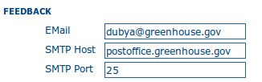

.. _authentication:

.. toctree::
   :maxdepth: 2

Authentication
==============


In this section you define the source against which the catlaog will authenticate users and passwords.


By default, users are authenticated against info held in the catalog database. When the catalog
database is used as the authentication source, the user self-registration function can be enabled. 
A later section (see :ref:`authentication_self_register`) discusses user self-registration and the 
configuration options it requires.

You may choose to authenticate logins against either the catalog database tables or LDAP 
(the lightweight directory access protocol) or both. The next section describes how to authenticate
against the different authentication providers:

.. contents:: 
    :depth: 1
    :local:

In addition to either of these options, you may also configure other authentication sources. 
At present, Shibboleth is one additional authentication source that can be configured. 
Shibboleth is typically used for national access federations such as the Australian Access Federation. 
Configuring shibboleth authentication in the catalog to use such a federation would allow not only users 
from a local database or LDAP directory to use your installation, but any user from such a federation.

Authentication is using Spring Security framework and could support multiple 
`authentication providers <http://static.springsource.org/spring-security/site/docs/3.1.x/reference/introduction.html#modules>`_.


Authentication configuration is defined in WEB-INF/config-security.properties file. When making a change to that
configuration file, the catalog need to be restarted to take parameters into account.


.. _authentication_ldap:

LDAP
----

Connection Settings
```````````````````
To enable LDAP support:


#. add the LDAP base URL property in config-security.properties::
 
    # LDAP security properties
    ldap.base.provider.url=ldap://localhost:389
    ldap.base.dn=dc=fao,dc=org
    ldap.security.principal=cn=admin,dc=fao,dc=org
    ldap.security.credentials=ldap


   - ldap.base.provider.url: This tells the portal where the LDAP server is located. 
     Make sure that the computer with the catalog can hit the computer with the LDAP server. 
     Check to make sure that the appropriate ports are opened, etc.
   - ldap.base.dn=dc=fao,dc=org: this will usually look something like: "dc=organizationnamehere,dc=org"
   - ldap.security.principal & ldap.security.credentials: Define LDAP administrator user to use to bind to LDAP. 
     If not define, an anonymous bind is made. Principal is the username and credentials property the password.
   - To verify that you have the correct settings, try to connect to the LDAP server using an LDAP browser application.

#. define where to find users in LDAP structure for authentication::

    ldap.base.search.base=ou=people
    ldap.base.dn.pattern=uid={0},${ldap.base.search.base}
    #ldap.base.dn.pattern=mail={0},${ldap.base.search.base}

   - ldap.base.search.base: this is where the catalog will look for users (for authentication)
   - ldap.base.dn.pattern: this is the distinguished name for the user to bind with. {0} is replaced by
     the user name typed in the sign in screen.


#. add the following import to config-security.xml::

    <import resource="config-security-ldap.xml"/>


Authorization Settings
``````````````````````

When using LDAP, user information and privileges could be defined from the LDAP attributes.

User details
~~~~~~~~~~~~

All user informations could be retrieved from the LDAP as defined in the config-security-overrides.properties.
This property file defined for each user attribute in the catalog database which LDAP attributes match.
If the attribute is empty or not defined, a default value could be defined. The configuration is the following::

    # Map user information to LDAP attributes and default values
    # ldapUserContextMapper.mapping[name]=ldap_attribute,default_value
    ldapUserContextMapper.mapping[name]=givenName,
    ldapUserContextMapper.mapping[surname]=sn,
    ldapUserContextMapper.mapping[mail]=mail,data@myorganization.org
    ldapUserContextMapper.mapping[organisation]=,myorganization
    ldapUserContextMapper.mapping[kind]=,
    ldapUserContextMapper.mapping[address]=,
    ldapUserContextMapper.mapping[zip]=,
    ldapUserContextMapper.mapping[state]=,
    ldapUserContextMapper.mapping[city]=,
    ldapUserContextMapper.mapping[country]=,


Privileges configuration
~~~~~~~~~~~~~~~~~~~~~~~~

When using LDAP, user groups and user profiles could be set from LDAP information or not.
To manage user privileges from the local database, set the ldap.privilege.import property in
config-security.properties to false::

    ldap.privilege.import=false

If LDAP information should be used to define user privileges, set it to true::

    ldap.privilege.import=true

When importing privileges from LDAP, the catalog administrator could decide to create groups
defined in the LDAP and not defined in local database. For this set the following property to true::

    ldap.privilege.create.nonexisting.groups=false


Simple privileges configuration
"""""""""""""""""""""""""""""""


In order to define which groups the user is member of and which profile is the user::

    ldapUserContextMapper.mapping[privilege]=groups,sample
    # If not set, the default profile is RegisteredUser
    # Valid profiles are http://geonetwork-opensource.org/manuals/trunk/eng/developer/apidocs/geonetwork/org/fao/geonet/constants/Geonet.Profile.html
    ldapUserContextMapper.mapping[profile]=privileges,RegisteredUser


Attributes configuration:

 - privilege attribute contains the group this user is member of. More than one group is allowed.
 - profile attribute contains the profile of the user

User valid profiles are:

 - Administrator
 - UserAdmin
 - Reviewer
 - Editor
 - RegisteredUser
 - Guest


Profile mapping configuration
"""""""""""""""""""""""""""""

If LDAP attribute containing profiles does not match the catalog profile list, a mapping could be defined
in config-security-overrides.properties::

    # Map LDAP custom profiles to catalog profiles. Not used if ldap.privilege.pattern is defined.
    ldapUserContextMapper.profilMapping[Admin]=Administrator
    ldapUserContextMapper.profilMapping[Editeur]=Reviewer
    ldapUserContextMapper.profilMapping[Public]=RegisteredUser

For example, in the previous configuration, the attribute value Admin will be mapped to Administrator (which
is a valid profile for the catalog).


Advanced privileges configuration
"""""""""""""""""""""""""""""""""

An attribute could define both the profile and the group for a user. To extract this information, 
a custom pattern could be defined to populate user privileges according to that attribute::

    # In config-security-overrides.properties
    ldapUserContextMapper.mapping[privilege]=cat_privileges,sample
    
    # In config-security.properties
    ldap.privilege.pattern=CAT_(.*)_(.*)
    ldap.privilege.pattern.idx.group=1
    ldap.privilege.pattern.idx.profil=2

The LDAP attribute can contains the following configuration to define the different type of users::

    -- Define a catalog admin:
    cat_privileges=CAT_ALL_Administrator
    
    -- Define a reviewer for the group GRANULAT
    cat_privileges=CAT_GRANULAT_Reviewer
    
    -- Define a reviewer for the group GRANULAT and editor for MIMEL
    cat_privileges=CAT_GRANULAT_Reviewer
    cat_privileges=CAT_MIMEL_Editor
    
    -- Define a reviewer for the group GRANULAT and editor for MIMEL and RegisteredUser for NATURA2000
    cat_privileges=CAT_GRANULAT_Reviewer
    cat_privileges=CAT_MIMEL_Reviewer
    cat_privileges=CAT_NATURA2000_RegisterdUser
    
    -- Only a registered user for GRANULAT
    cat_privileges=CAT_GRANULAT_RegisteredUser


Synchronization
```````````````

A synchronization task is taking care of removing LDAP user which may be deleted. For example:

 - T0: a user A sign in the catalog. A local user A is created in the user database
 - T1: A is deleted from the LDAP (A could not sign in in the catalog anymore)
 - T2: the synchronization task will check that all local LDAP users exist in LDAP:
 
   - if user is not owner of any records, it will be deleted
   - if user is owner of metadata records, warning message is avaialable on the catalog logging system. 
     record's owner should be changed to another user before the task could remove the user.

By default the task is runned once every day. Configuration could be changed in config-security.properties::

    # Run LDAP sync every day at 23:30
    ldap.sync.cron=0 30 23 * * ?

Debugging
`````````

If connection fails, try to increase logging for LDAP in log4j.cfg::

    log4j.logger.geonetwork.ldap          = DEBUG
    log4j.logger.org.springframework = DEBUG, console, jeeves
    log4j.logger.org.springframework.* = DEBUG
    log4j.logger.org.springframework.security.ldap = DEBUG


.. _authentication_cas:

CAS
---

To enable CAS support:

#. add the CAS base URL property in config-security.properties::
 
    cas.baseURL=https://localhost:8443/cas
    cas.ticket.validator.url=${cas.baseURL}
    cas.login.url=${cas.baseURL}/login
    cas.logout.url=${cas.baseURL}/logout?url=${geonetwork.https.url}/
 

#. add the following import to config-security.xml::

    <import resource="config-security-cas.xml"/>
    <import resource="config-security-cas-ldap.xml"/>


.. _authentication_shibboleth:

Shibboleth authentication
-------------------------

When using either the GeoNetwork database or LDAP for authentication, you can also configure shibboleth
to allow authentication against access federations.

.. figure:: web-config-options-shibboleth.png

    *The Shibboleth configuration options*

Shibboleth authentication requires interaction with Apache web server. In particular, the apache web server
must be configured to require Shibboleth authentication to access the path entered in the configuration. 
The apache web server configuration will contain the details of the shibboleth server that works out where 
a user is located (sometimes called a 'where are you from' server).

The remainder of the shibboleth login configuration describes how shibboleth authentication attributes are 
mapped to GeoNetwork user database fields as once a user is authenticated against shibboleth, their details 
are copied to the local GeoNetwork database.


.. _authentication_self_register:

User Self-Registration
----------------------

From Administration, system configuration, GeoNetwork has a self-registration function which allows a user to request a login which provides access to 'registered-user' functions.  By default this capability is switched off. To configure this capability you must complete the following sections in the 'System configuration' menu:

- configure the site name and organization name as these will be used in emails from this GeoNetwork site to newly registered users. An example of how to config these fields at the top of the system configuration form is:

.. figure:: web-config-name-organization.png

- configure feedback email address, SMTP host and SMTP port. The feedback email address will be sent an email when a new user registers and requests a profile other than 'Registered User'. An example of how to config these fields in the system configuration form is:



- check the box, enable user self-registration in the Authentication section of the system configuration form as follows:

.. figure:: web-config-authentication-self-registration-checked.png

When you save the system configuration form, return to the home page and log out as admin, your banner menu should now include two new options, 'Forgot your password?' and 'Register' (or their translations into your selected language) as follows:

.. figure:: web-config-banner-with-self-registration.png

You should also configure the xml file that includes contact details to be 
displayed when an error occurs in the registration process. This file is 
localized - the english version is located in 
INSTALL_DIR/web/geonetwork/loc/en/xml/registration-sent.xml.

Finally, if you want to change the content of the email that contains registration details for new users, you should modify INSTALL_DIR/web/geonetwork/xsl/registration-pwd-email.xsl.

