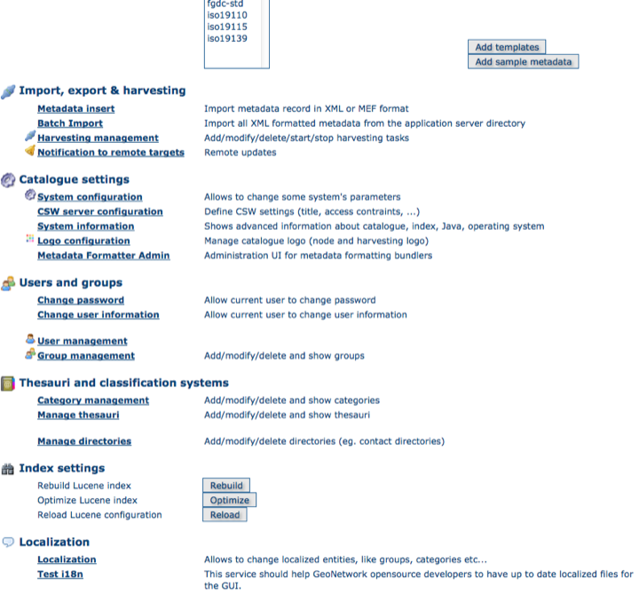

.. _localization:

Localization
============

Localization of dynamic user interface elements
-----------------------------------------------

The user interface of GeoNetwork can be localized into several languages
through XML language files. Beside static text, there
is also more dynamic text that can be added and changed interactively.
This text is stored in the database and is translated
using the Localization form that is part of the administrative functions.

    *How to open the Localization form*
    
The form allows you to localize the following entities:
*Groups*, *Categories*, *Operations* and *Regions*. 
The localization form is subdivided in a left and a right panel.

The left panel allows you to choose which elements you want to edit. On the top,
a dropdown let you choose which entity to edit. All elements of the selected
type are shown in a list.

When you select an element from the list, the right panel will show the text as
it will be displayed in the user interface. The text in the source
language is read only while you can update the text in the target language field.

.. note:: You can change the source and target languages to best suit your needs.
   Some users may for instance prefer to translate from French to Spanish,
   others prefer to work with English as the source language.

Use the Save button to store the updated label and move to the next element.

.. warning:: If the user changes a label and chooses another target language without saving, the label change is lost.

.. figure:: localization.png

    *The Localization form*

