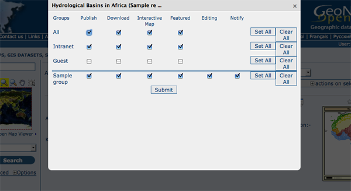

.. _user_admin:

User and Group Administration
=============================

GeoNetwork uses the concept of Users, Groups and User Profiles. 

- A User can be part of one or more Groups.

- A User has a User Profile. 

- A User can only have one User Profile associated.

The combination of User Profile and Group defines what tasks the User can perform on the system or on specific metadata records.

Creating new user Groups
------------------------

The administrator can create new groups of users. User groups can correspond
to logical units within an organisation. For example groups for Fisheries, Agriculture, Land
and Water, Health etcetera.

To create new groups you should be logged on with an account that has Administrative privileges.

#. Select the *Administration* button in the menu. On the Administration page, select *Group management*.

    .. figure:: admin-group-management.png

        *Administration page - Group management*

#. Select *Add a new group*. You may want to remove the *Sample* group;

    .. figure:: GroupManag.png

        *Group management*

#. Fill out the details. The email address will be used to send feedback on data downloads when they occur for resources that are part of the Group.

    .. warning:: 
        The Name should *NOT* contain spaces! You can use the Localization panel to provide localized names for groups.

    .. figure:: addGroup.png

        *Group edit form*

#. Click on *Save*

Access privileges can be set per metadata record. You can define privileges on a per Group basis.

Privileges that can be set relate to visibility of the Metadata (*Publish*),
data *Download*, *Interactive Map* access and display of the record in the *Featured* section of the home page.

*Editing* defines the groups for which editors can edit the metadata record.

*Notify* defines what Groups are notified when a file managed by GeoNetwork is downloaded.

Below is an example of the privileges management table related to a dataset.

  *Privilege settings*

Creating new Users
------------------

To add a new user to the GeoNetwork system you do the following:

#. Select the *Administration* button in the menu. On the Administration page, select *User management*.

      .. figure:: admin-user-management.png
    
        *Administration page - User management*

#. Click the button *Add a new user*;

  .. figure:: AddUser.png
  
    *User administration form*

#. Provide the *information* required for the new user;

  .. figure:: InsertUserInfo.png
  
    *User information form*

#. Assign the correct *profile*;

#. Assign the user to a *group*;

#. Click on *Save*.

.. _user_profiles:

User Profiles
-------------

Users can have different profiles depending on their role in the GeoNetwork system.
A profile defines what tasks the user can perform.

User profiles are hierarchical and based on inheritance. This means that a user with an Editor profile can create and modify new metadata records, but can also use all functions a Registered user can use.

Rights associated with the profiles are illustrated in detail in the list below:

#.  **Administrator Profile**

    The Administrator has special privileges that give access to all available functions.
    
    These include:
    
    - Full rights for creating new groups and new users
    - Rights to change users/groups’ profiles
    - Full rights for creating/editing/deleting new/old metadata
    - Perform system administration and configuration tasks.

#.  **User Administrator Profile**

    The User Administrator is the administrator of his/her own group with the
    following privileges:
    
    - Full rights on creating new users within the own group
    - Rights to change users profiles within the own group
    - Full rights on creating/editing/ deleting new/old data within the own group

#.  **Content Reviewer Profile**

    The content reviewer is the only person allowed to give final clearance on    the metadata publication on the Intranet and/or on the Internet:
    
    - Rights on reviewing metadata content within the own group and authorising its publication

#.  **Editor Profile**

    The editor works on metadata with following privileges:
    
    - Full rights on creating/editing/ deleting new/old data within the own group

#.  **Registered User Profile**

    The Registered User has more access privileges than non-authenticated Guest users:
    
    - Right to download protected data

User Self-Registration
----------------------

See :ref:`user_self_registration`.
