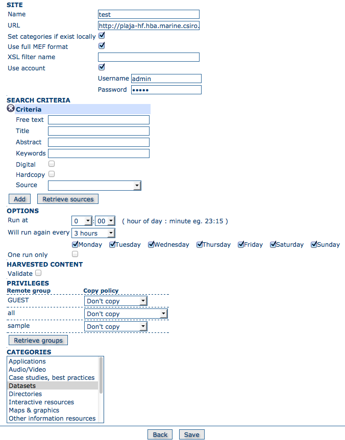

.. _harvesting_gn:

GeoNetwork Harvesting
---------------------

This is the standard and most powerful harvesting protocol used in GeoNetwork. It is able to log in into the remote site, to perform a standard search using the common query fields and to import all matching metadata. Furthermore, the protocol will try to keep both remote privileges and categories of the harvested metadata if they exist locally. 


Adding a GeoNetwork harvester
`````````````````````````````



*Adding a GeoNetwork Harvester*

A description of the options follows:

- **Site** - Information about the GeoNetwork site you wish to harvest from. The **URL** should have the format: ``http[s]://server[:port]/geonetwork``. If you want to search privileged metadata you have to specify account credentials that are valid on the remote GeoNetwork site. The **Name** parameter is a short description of the remote site that will be used as the name for this instance of the GeoNetwork harvester.

  - **Set categories if exist locally** - This option allows to maintain category assignments. If the metadata belongs to a category on the remote site and a category with the same name is present on the local site, then the harvested metadata will be assigned to that category if this option is checked on.

  - **Use full MEF format** - If checked, then the remote site will include any thumbnails and data files with the metadata record they are attached too. The option refers to the fact that the MEF file type used to in this case will be the **full** export type.

  - **XSL filter name** - This option will apply a custom XSL filter to the metadata record before it is inserted into the local database. A common use case is to anoymize metadata records using the anonymizer process which remove or rename contact personal information (See the :ref:`processing` section for more information).


- **Search criteria** - In this section you can specify search parameters to select metadata records for harvesting. The parameters are the same or similar to those found on the GeoNetwork search form.

  - *source*: A GeoNetwork site can contain both its own metadata and metadata harvested from other sources. Use the **Retrieve sources** button to retrieve the sources from the remote site. You can then choose a source name to constrain the search to a particular source. eg. You could constrain the search to the source representing metadata that has not been harvested from other sites. Leaving **source** blank will retrieve *all* metadata from the remote site. 

  You can add multiple search criteria through the **Add** button: multiple searches will be performed and results merged. Search criteria sets an be removed using the small cross button at the top left of the criteria set. If no search criteria are added, a global unconstrained search will be performed. 

- **Options** - Scheduling Options.

.. include:: ../common_options.rst
    
- **Harvested Content**

  - *Validate* - if checked then harvested metadata records will be validated
    against the relevant metadata schema. Invalid records will be rejected.

- **Privileges** - Use this section to handle remote group privileges. Press the **Retrieve groups** button and the list of groups on the remote site will be returned. You can then assign a copy policy to each group. 

    - The **All** group has a different policy to the other groups:

        #.  Copy: Privileges are copied.
        #.  Copy to Intranet: Privileges are copied but to the Intranet group.
            This allows public metadata to be protected.
        #.  Don't copy: Privileges are not copied and harvested metadata will 
				    not be publicly visible.

    - For all other groups the policies are these:

        #.  Copy: Privileges are copied only if there is a local group with the
            same (not localised) name as the remote group.
        #.  Create and copy: Privileges are copied. If there is no local group
            with the same name as the remote group then it is created.
        #.  Don't copy: Privileges are not copied.

.. note:: The Intranet group is not considered because it does not make sense to copy its privileges. 

- **Categories**

  - Select one or more categories from the scrolling list. The harvested metadata will be assigned to the selected categories (except where the **Set categories if exist locally** option described above causes the metadata to be assigned to a matching local category).

Notes
`````

- This harvester will not work if the remote site has a version prior to GeoNetwork 2.1 eg. GeoNetwork 2.0.2.
- During harvesting, site icons are harvested and local copies are updated. Icons are propagated to new sites as soon as those sites harvest from this one.
- The metadata record uuid is taken from the info.xml file of the MEF bundle.

.. include:: ../common_notes.rst

