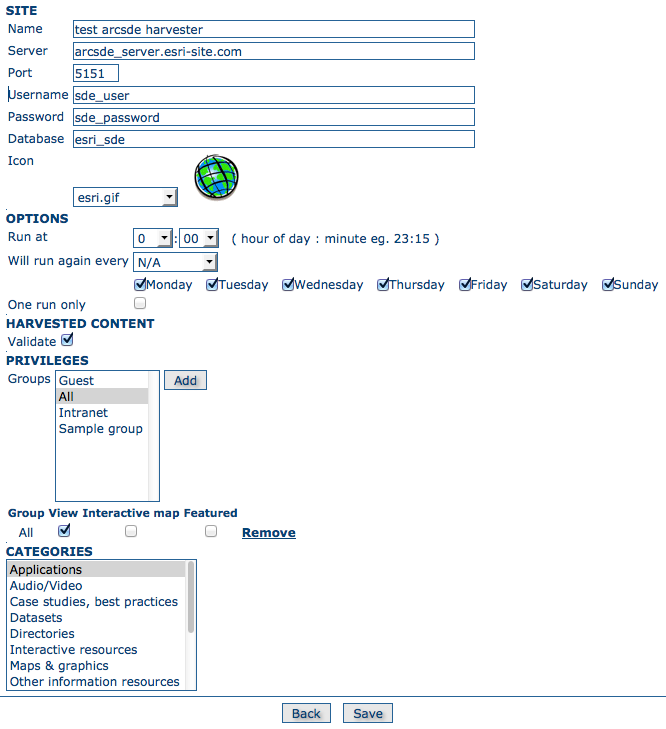

.. _sde_harvester:

Harvesting an ARCSDE Node
-------------------------

This is a harvesting protocol for metadata stored in an ArcSDE installation.

Adding an ArcSDE harvester
``````````````````````````

.. note :: Additional installation steps are required to use the ArcSDE harvester because it needs proprietary ESRI java api jars to be installed. See the Developers Manual, Settings for Harvester type arcsde

The harvester identifies the ESRI metadata format: ESRI ISO, ESRI FGDC to apply the required xslts to transform metadata to ISO19139



    *Adding an ArcSDE harvesting node*

Configuration options:

- **Site** 

	- *Name* - This is a short description of the node. It will be shown in the harvesting main page.  
	- *Server* - ArcSde server IP address or name
	- *Port* - ArcSde service port (typically 5151)
	- *Username* - Username to connect to ArcSDE server
	- *Password* - Password of the ArcSDE user
	- *Database name* - ArcSDE instance name (typically esri_sde)

- **Options**

.. include:: ../common_options.rst

- **Harvested Content**

  - *Validate* - if checked then harvested metadata records will be validated
    against the relevant metadata schema. Invalid records will be rejected.

- **Privileges**

.. include:: ../common_privileges.rst

- **Categories** 

.. include:: ../common_categories.rst
