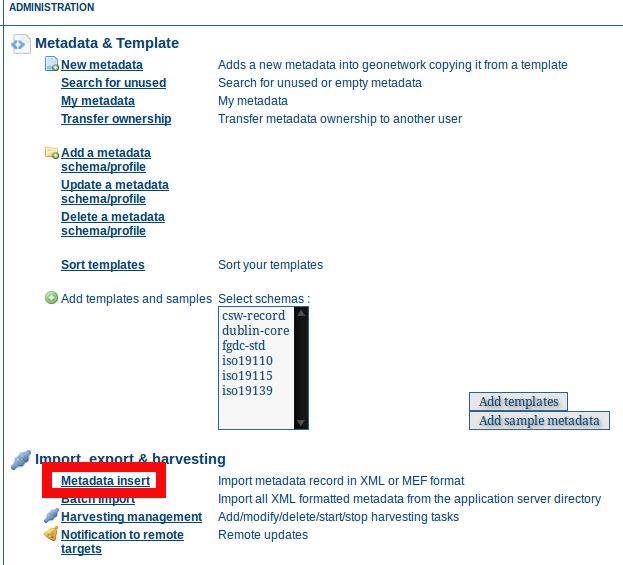
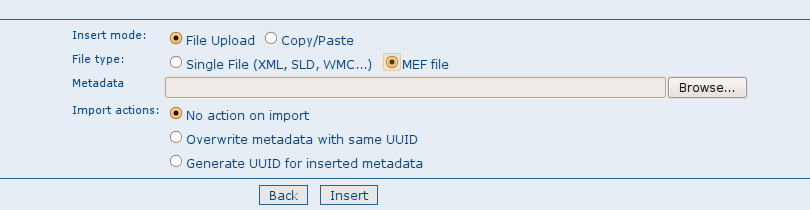
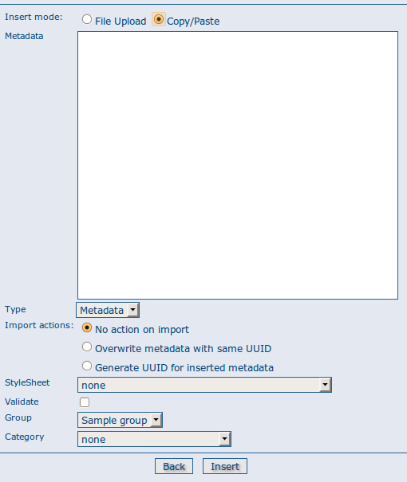

.. _import1:

Import facilities
=================

.. index:: pair: MEF; import
.. index:: pair: XML; import

Importing a metadata record from XML or a MEF file
--------------------------------------------------

The file import facility allows you to import metadata records in three ways:

#. XML file from the filesystem on your machine.
#. MEF file from the filesystem on your machine
#. Copy/Paste XML

In order to use this facility, you have to be logged in as an editor. After the login step, go to the administration page and select the Metadata insert link.



Clicking the link will open the metadata import page. You will then have to specify a set of parameters. The following screenshot shows the parameters for importing an XML file.

.. figure:: xmlfileimport-options.png

    *The XML file import options*

We'll describe the options you see on this page because they are common ways you can import metadata records in this interface. 

.. include:: importActions.rst

MEF file import
```````````````



    *The MEF file import options*

If you select *MEF file* in the *File type* option, only the Import actions option group is show. See above for more details. Note: a MEF file can contain more than one metadata record.

Copy/Paste XML
``````````````



    *The XML insert options*

If you select *Copy/Paste* in the Insert mode option, then a text box appears. You can copy the XML from another window and paste it into that text box. The options for loading that XML are the same as those for loading an XML file - see above. 

Batch import
------------

The batch import facility allows you to import a set of metadata records in the form of XML or MEF files. In order to use this facility, you have to be logged in as an administrator. After the login step, go to the administration page and select the *Batch Import* link.

.. figure:: web-batchimport-where.png

    *How to reach the batch import page*

Clicking the link will open the batch import page. You will then have to specify a set of parameters. The following screenshot shows the parameters for batch import of a set of XML or MEF files.

.. figure:: web-batchimport-options.png

    *The batch import options*

- *Directory* This is the full path on the server’s file system of the directory to scan. GeoNetwork will look for and try to import all XML or MEF files present into this directory. It is important to notice that this is the directory on the *server* machine and *not* on the client of the user that is doing the import.

.. include:: importActions.rst

At the bottom of the page there are two buttons:

- *Back* Goes back to the administration form. 
- *Upload* Starts the import process.

Notes on the batch import process
`````````````````````````````````

- When the import process ends, the total count of imported metadata will be shown
- The import is transactional: the metadata set will be fully imported or fully discarded (there are no partial imports)
- Files that start with ’.’ or that do not end with ’.xml’ or '.mef' are ignored


Structured batch import using import-config.xml
```````````````````````````````````````````````

Finer control of the batch import process can be obtained by structuring the metadata files into directories mapped to categories and metadata schemas and describing the mapping in a file called import-config.xml.

The import-config.xml should be placed in the directory from which you will batch import (see *Directory* parameter above). It has a config root element with the following children:

#.  categoryMapping \[1]: this element specifies the mapping of
    directories to categories.
    
    #.  mapping \[0..n]: This element can appear 0 or more times
        and maps one directory name to a category name. It must have
        a "dir" attribute that indicates the directory and a "to"
        attribute that indicates the category name.
    #.  default \[1]: This element specifies a default mapping of
        categories for all directories that do not match the other
        mapping elements. The default element can only have one 
        attribute called "to".

#.  schemaMapping \[1]: this element specifies the mapping of
    directories to metadata schemas.
    
    #.  mapping \[0..n]: This element can appear 0 or more times
        and maps one directory to the schema name that must be used
        when importing. The provided schema must match the one used
        by the metadata contained into the specified directory,
        which must all have the same schema. It must have a "dir"
        attribute that indicates the directory and a "to" attribute
        that indicates the schema name.
        
    #.  default \[1]: default behaviour to use when all other
        mapping elements do not match. The default element can only have one 
        attribute called "to".

Here is an example of the import-config.xml file:

.. sourcecode:: xml

	<config>
		<categoryMapping>
			<mapping dir="1" to="maps" />
			<mapping dir="3" to="datasets" />
			<mapping dir="6" to="interactiveResources" />
			<mapping dir="30" to="photo" />
			<default to="maps" />
		</categoryMapping>
		<schemaMapping>
			<mapping dir="3" to="fgdc-std" />
			<default to="dublin-core" />
		</schemaMapping>
	</config>

As described above, the import procedure starts by scanning the specified *Directory*. Apart from the import-config.xml file, this directory should only contain subdirectories - these are the category directories referred to in the categoryMapping section of the import-config.xml file described above. Each of the category directories should only contain subdirectories - these are the schema directories referred to in the schemaMapping section of the import-config.xml file described above.
