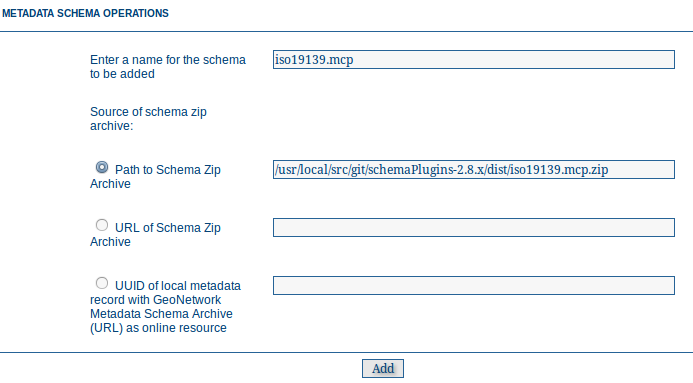

.. _schemas:

Schemas 
=======

Metadata records in GeoNetwork are described by a schema. The schema sets out the structuring of the metadata record and provides all the ancillary data and functions to use the schema in GeoNetwork. 

A metadata schema plugin capability has been introduced in GeoNetwork 2.8.0. This allows the administrator to add, update and delete metadata schemas in GeoNetwork without the need to stop and restart GeoNetwork.

.. note:: Adding a metadata schema to GeoNetwork that is incorrect or invalid can thoroughly break your GeoNetwork instance. This section is for catalogue administrators who are confident about metadata schemas and understand the different technologies involved with a GeoNetwork metadata schema.

A detailed description of what constitutes a metadata schema for GeoNetwork can be found in the GeoNetwork Developers Manual. This section will describe how to access the schema add, update and delete functions and how those functions should be used. To access these functiuons you need to be logged in to GeoNetwork as an Administrator. The schema functions are on the Administration page as shown below.

.. figure:: metadata-schema-functions.png

*The Administration page with the metadata schema functions highlighted*

.. note:: Metadata schemas should be thoroughly tested in a development instance of GeoNetwork **before** they are added to a production instance. Errors in a schema plugin (particularly in the presentation XSLTs) may make your GeoNetwork instance unusable.

Adding a schema
```````````````
To a metadata schema to GeoNetwork, click on the **Add a metadata schema/profile** link in the Administration page as shown above.

This will bring up a menu from which you can specify the location of a metadata schema in a ZIP archive to add to GeoNetwork. 



There are three possible locations for the ZIP archive:

#. on the server filesystem - you specify the path of the ZIP archive on the server filesystem
#. on a web server accessible via a http link - you specify the URL of the ZIP archive on the web server.
#. Attached to a metadata record describing the schema which is present in the local GeoNetwork catalog - you specify the UUID of that metadata record which must be an iso19139 metadata record.

Updating a schema
`````````````````

To update a metadata schema in GeoNetwork, click on the **Update a metadata schema/profile** link in the Administration page as shown above. You will be presented with a menu that is the same as the one for adding a metadata schema, except that instead of a text box for typing in the name of the new metadata schema, you select a metadata schema to update from a drop down menu of those already present in GeoNetwork.

Deleting a schema
`````````````````

To delete a metadata schema from GeoNetwork, click on the **Delete a metadata schema/profile** link in the Administration page as shown above. You will be presented with a drop down list of the current metadata schemas in GeoNetwork from which you can select one to delete.

.. note:: You cannot delete a metadata schema if there are records that belong to that schema in the catalog. You must delete all the records that belong to that schema first before you can delete the schema itself.

.. note:: You cannot delete a metadata schema if another schema depends upon that schema eg. you cannot delete the iso19139 schema if the iso19139.mcp schema is present because the iso19139.mcp schema is a profile that depends on iso19139. Schema dependencies can be found/specified in the schema-ident.xml file.

