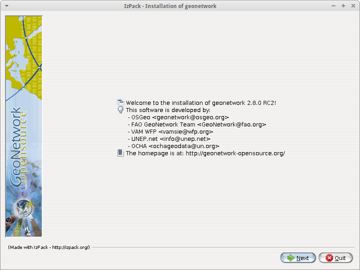
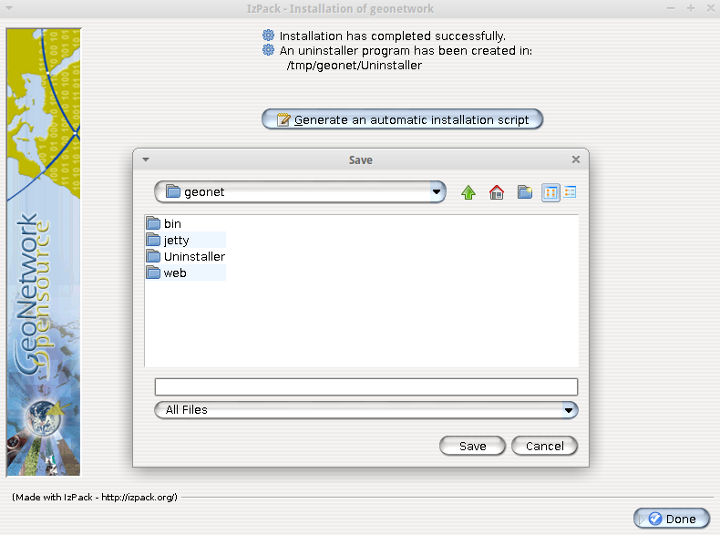

.. _installing:

Installing the software
=======================

Where do I get the installer?
-----------------------------

The software is distributed through the SourceForge.net Website at http://sourceforge.net/projects/geonetwork.

Use the platform independent installer (.jar) for all platforms except Windows. Windows has a .exe file installer.

System requirements
-------------------

GeoNetwork can run either on **MS Windows** , **Linux** or **Mac OS X** .

Some general system requirements for the software to run without problems are listed below:

**Processor** : 1 GHz or higher

**Memory (RAM)** : 1 GB or higher

**Disk Space** : Minimum of 512MB of free disk space. Additional space is required depending on the amount of spatial data that you expect to upload.

**Other Software requirements** : A Java Runtime Environment (JRE 1.7.0). For server installations, Apache Tomcat and a dedicated JDBC compliant DBMS (MySQL, Postgresql, Oracle) can be used instead of Jetty and H2.

Additional Software
```````````````````

The software listed here is not required to run GeoNetwork, but can be used for custom installations.

#. MySQL DBMS v5.5+ (All) [#all_os]_
#. Postgresql DBMS v7+ (All) [#all_os]_
#. Apache Tomcat v5.5+ (All) [#all_os]_

Supported browsers
``````````````````

GeoNetwork should work normally with the following browsers:

#. Firefox, Chrome, Safari
#. Internet Explorer 8+


How do I install GeoNetwork opensource?
---------------------------------------

Before running the GeoNetwork installer, make sure that all system requirements are satisfied, and in particular that the Java Runtime Environment version 1.6.0 is set up on your machine.

On Windows
``````````

If you use Windows, the following steps will guide you to complete the installation (other FOSS will follow):

.. warning:: Avoid installing in a directory containing spaces. Best is to install in ``c:\programs`` and not in ``c:\program files``

1. Double click on **geonetwork-install-develop.exe** to start the GeoNetwork opensource desktop installer
2. Follow the instructions on screen. You can choose to install the embedded map server (based on `GeoServer <http://www.geoserver.org>`_ and the European Union Inspire Directive configuration pack. Developers may be interested in installing the source code and installer building tools. Full source code can be found in the GeoNetwork github code repository at http://github.com/geonetwork.
3. After completion of the installation process, a 'GeoNetwork desktop' menu will be added to your Windows Start menu under 'Programs'
4. Click Start\>Programs\>GeoNetwork desktop\>Start server to start the Geonetwork opensource Web server. The first time you do this, the system will require about 1 minute to complete startup.
5. Click Start\>Programs\>Geonetwork desktop\>Open GeoNetwork opensource to start using GeoNetwork opensource, or connect your Web browser to `http://localhost:8080/geonetwork/ <http://localhost:8080/geonetwork/>`_



   *Installer*

.. figure:: install_packages.png

   *Packages to be installed*

The installer allows to install these additional packages:

1. GeoNetwork User Interface: Experimental UI for GeoNetwork using javascript components based on ExtJs library.
2. GeoServer: Web Map Server that provides default base layers for the GeoNetwork map viewer.
3. European Union INSPIRE Directive configuration pack: Enables INSPIRE support in GeoNetwork.

 - INSPIRE validation rules.
 - Thesaurus files (GEMET, Inspire themes).
 - INSPIRE search panel.
 - INSPIRE metadata view.

Installation using the platform independent installer
`````````````````````````````````````````````````````

If you downloaded the platform independent installer (a .jar file), you can in most cases start the installer by simply double clicking on it.

Follow the instructions on screen (see also the section called On Windows).

At the end of the installation process you can choose to save the installation script.


   
   *Save the installation script for commandline installations*


Commandline installation
````````````````````````

If you downloaded the platform independent installer (a .jar file), you can perform commandline installations on computers without a graphical interface. You first need to generate an install script (see Figure Save the installation script for commandline installations). This install script can be edited in a text editor to change some installation parameters.

To run the installation from the commandline, issue the following command in a terminal window and hit enter to start::

    java -jar geonetwork-install-2.8.0.jar install.xml
    [ Starting automated installation ]
    Read pack list from xml definition.
    Try to add to selection [Name: Core and Index: 0]
    Try to add to selection [Name: GeoServer and Index: 1]
    Try to add to selection [Name: European Union INSPIRE Directive configuration pack and Index: 2]
    Modify pack selection.
    Pack [Name: European Union INSPIRE Directive configuration pack and Index: 2] added to selection.
    [ Starting to unpack ]
    [ Processing package: Core (1/3) ]
    [ Processing package: GeoServer (2/3) ]
    [ Processing package: European Union INSPIRE Directive configuration pack (3/3) ]
    [ Unpacking finished ]
    [ Creating shortcuts ....... done. ]
    [ Add shortcuts to uninstaller  done. ]
    [ Writing the uninstaller data ... ]
    [ Automated installation done ]

You can also run the installation with lots of debug output. To do so run the installer with the flag *-DTRACE=true*::

  java -DTRACE=true -jar geonetwork-install-2.8.0.jar

.. [#all_os] All = Windows, Linux and Mac OS X


XSLT processor configuration
----------------------------

The file ``INSTALL_DIR/web/geonetwork/WEB-INF/classes/META-INF/javax.xml.transform.TransformerFactory`` defines the XSLT processor to use in GeoNetwork. The allowed values are:

#. ``de.fzi.dbs.xml.transform.CachingTransformerFactory``: This is the Saxon XSLT processor with caching (recommended value for production use). However, when caching is on, any updates you make to stylesheets may be ignored in favour of the cached stylesheets.
#. ``net.sf.saxon.TransformerFactoryImpl``: This is the Saxon XSLT processor *without* caching. If you plan to make changes to any XSLT stylesheets you should use this setting until you are ready to move to production.

GeoNetwork sets the XSLT processor configuration using Java system properties for an instant in order to obtain its TransformerFactory implementation, then resets it to the original value, to minimize affect the XSL processor configuration for other applications that may be running in the same container.

.. _basic_database_config:

Database configuration
----------------------

Geonetwork uses the `H2 database engine <http://www.h2database.com/>`_ as default. The following additional database backends are supported (listed in alphabetical order):

* DB2
* H2
* MS SqlServer 2008
* MySQL
* Oracle
* PostgreSQL (or PostGIS)

To configure one of these databases for use by GeoNetwork, three steps are required.

Choose a Database Connection Pool
`````````````````````````````````
To manage connections with the database efficiently, a database connection pool is used.  GeoNetwork uses the `Apache Database Connection Pool (DBCP) <http://commons.apache.org/dbcp/>`_. This connection pool can be configured directly in the config.xml file described below or in Jetty/tomcat through the Java Naming and Directory Interface (JNDI).

* **ApacheDBCPool**: This pool is recommended for smaller catalogs (less than 10,000 records).
* **JNDIPool**: This pool is configured in Jetty or Tomcat. It is recommended for larger catalogs (especially those with more than approx 30,000 records).

More details about the DBCP configuration parameters that can be used here are in the advanced configuration section of this manual (See :ref:`Database_JNDI_configuration`).

Download and install JDBC Drivers
`````````````````````````````````
For the Apache DBCP pool, JDBC database driver jar files should be in **INSTALL_DIR/WEB-INF/lib**.  For Open Source databases, like MySQL and PostgreSQL, the jar files are already installed. For commercial databases like Oracle, the jar files must be downloaded and installed manually. This is due to licensing issues.

* `DB2 JDBC driver download <https://www-304.ibm.com/support/docview.wss?rs=4020&uid=swg27016878>`_
* `MS Sql Server JDBC driver download <http://msdn.microsoft.com/en-us/sqlserver/aa937724>`_
* `Oracle JDBC driver download <http://www.oracle.com/technetwork/database/features/jdbc/index-091264.html>`_

Specify configuration in GeoNetwork
```````````````````````````````````

You can manually configure the database by editing **INSTALL_DIR/WEB-INF/config-node/*.xml** and **INSTALL_DIR/WEB-INF/config-db/*.xml**.


Starting up GeoNetwork with a new database
------------------------------------------

At startup, GeoNetwork checks if the database tables it needs are present in the currently configured database.  If not, the tables are created and filled with initial data. 

If the database tables are present but were created with an earlier version of GeoNetwork, then a migration script is run.

An alternative to running these scripts automatically is to execute them manually. This is preferable for those that would like to examine and monitor the changes being made to their database tables.

* The scripts for initial setup are located in **INSTALL_DIR/WEB-INF/classes/setup/sql/create/**
* The scripts for inserting initial data are located in **INSTALL_DIR/WEB-INF/classes/setup/sql/data/**
* The scripts for migrating are located in **INSTALL_DIR/WEB-INF/classes/setup/sql/migrate/**

Issues or exceptions with databases
-----------------------------------

If you run into problems when you start GeoNetwork with a particular database, you may find a solution in the :ref:`database_specific_issues` section of this manual.


Install standards
-----------------

By default, the catalogue provides the following standards:

* ISO19139
* ISO19110
* Dublin core

Additional standards are available in the `schema plugin repository <https://github.com/geonetwork/schema-plugins/>`_.

For using the following standard, version 2.10.x or ealier must be used:
* ISO19115-FDIS
* FGDC


Upgrading to a new Version
==========================

The upgrade process from one version to another is typically a fairly simple process.  Following the normal setup instructions, should result in Geonetwork successfully upgrading the internal datastructures from the old version to the new version.  The exceptions to this rule are:

* Migration to Geonetwork 2.8 will reset all harvesters to run every 2 hours. This is because the underlying harvester scheduler has been changed and the old schedules are not longer supported.  In this case one must review all the harvesters and define new schedules for them.
