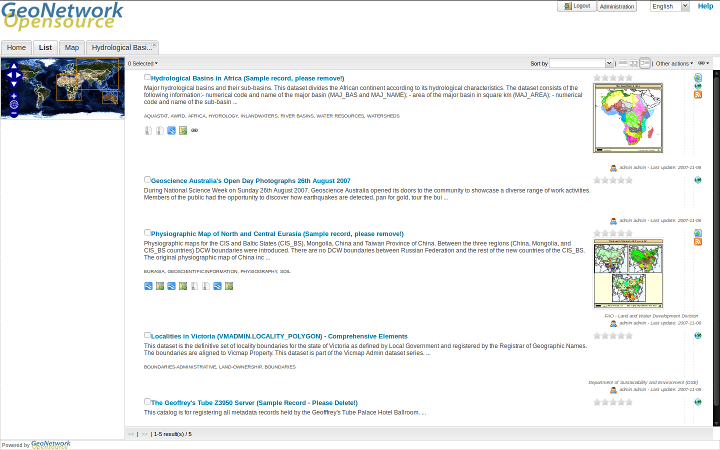

.. _newfeatures:

New Features 
============

The new GeoNetwork opensource comes with substantial upgrades of different components. 

User interface 
--------------
- **Javascript widget user interface:** A new user interface using one of the latest Javascript widget libraries (extJS) has been added to support searching, editing and viewing metadata records. The user interface is now much easier for Javascript developers to reorganize and customize. GeoNetwork comes with two flavours of home page: one has the sidebar search similar to the old interface and the other uses a tabbed search layout. The 2.6.x user interface is still available as the default and has been updated.

    *New home page of GeoNetwork opensource using JavaScript Widgets - tab layout*

.. figure:: Home_page_n.png

    *New home page of GeoNetwork opensource using JavaScript Widgets- sidebar layout*

Administration
--------------
- **Search Statistics:** Captures and displays statistics on searches carried out in GeoNetwork. The statistics can be summarized in tables or in charts using JFreeChart. There is an extensible interface that you can use to display your own statistics. See :ref:`search_statistics`.
- **New Harvesters:** OGC Harvesting: Sensor Observation Service, Z3950 harvesting, Web Accessible Folder (WAF), GeoPortal 9.3.x via REST API See :ref:`harvesting`.
- **Harvest History and Scheduling:** Harvesting events are now recorded in the database for review at any time. See :ref:`harvest_history`. Harvester scheduling is now much more flexible, you can start a harvest at any time of the day and at almost any interval (weekly etc).
- **Extended Metadata Exchange Format (MEF):** More than one metadata file can be present in a MEF Zip archive. This is MEF version 2. See :ref:`export`.
- **System Monitoring:** Automatically monitoring the health of a Geonetwork web application. See :ref:`monitoring`.

Metadata
--------
- **Metadata Status:** Allows finer control of the metadata workflow. Records can be assigned a status that reflects where they are in the metadata workflow: draft, approved, retired, submitted, rejected. When the status changes the relevant user is informed via email. eg. when an editor changes the status to 'submitted', the content reviewer receives an email requesting review. See :ref:`metadata_status`.
- **Metadata Versioning:** Captures changes to metadata records and metadata properties (status, privileges, categories) and records them as versions in a subversion respository. See :ref:`metadata_versioning`.
- **Publishing data to GeoServer from GeoNetwork:** You can now publish geospatial information in the form of GeoTIFF, shapefile or spatial table in a database to GeoServer from GeoNetwork. See :ref:`GeoPublisher`.
- **Custom Metadata Formatters:** You can now create your own XSLT to format metadata to suit your needs, zip it up and plug it in to GeoNetwork. See :ref:`formatter`.
- **Assembling Metadata Records from Reusable Components:** Metadata records can now be assembled from reusable components (eg. contact information). The components can be present in the local catalog or brought in from a remote catalog (with caching to speed up access). A component directory interface is available for editing and viewing the components. See :ref:`fragments`.
- **Editor Improvements:** Picking terms from a thesaurus using a search widget, selecting reusable metadata components for inclusion in the record, user defined suggestions or picklists to control content, context sensitive help, creating relationships between records.
- **Plug in metadata schemas:** You can define your own metadata schema and plug it into GeoNetwork on demand. Documentation to help you do this and example plug in schemas can be found in the Developers Manual. Some of the most common community plug in schemas can be downloaded from the GeoNetwork source code repository. See :ref:`schemas`.
- **Multilingual Indexing:** If you have to cope with metadata in different languages, GeoNetwork can now index each language and search all across language indexes by translating your search terms. See :ref:`multilingual`.
- **Enhanced Thesaurus support:** Thesauri can be loaded from ISO19135 register records and SKOS files. Keywords in ISO records are anchored to the definition of the concept in the thesaurus.  See :ref:`thesaurus`.

CSW service
-----------
- **Virtual CSW Endpoints:** Now you can define a custom CSW service that works with a set of metadata records that you define. See :ref:`VirtualCSW`.

INSPIRE Directive
-----------------
- **Support for the INSPIRE Directive:** Indexing and user interface extensions to support those who need to implement the INSPIRE metadata directive (EU).
- **Installer package to enable INSPIRE options:** An optional new package in the installer enables GeoNetwork INSPIRE features if selected, avoiding manual steps to enable INSPIRE support.

Other
-----
- **Improved Database Connection Handling and Pooling:** Replacement of the Jeeves based database connection pool with the widely used and more robust Apache Database Connection Pool (DBCP). Addition of JNDI or container based database connection support. See :ref:`Database_JNDI_configuration`.
- **Configuration Overrides:** Now you can add your own configuration options to GeoNetwork, keep them in one file and maintain them independently from GeoNetwork. See :ref:`adv_configuration_overriddes`.
- **Many other improvements:** charset detection and conversion on import, batch application of an XSLT to a selected set of metadata records (see :ref:`processing`), remote notification of metadata changes, automatic integration tests to improve development and reduce regression and, of course, many bug fixes.

