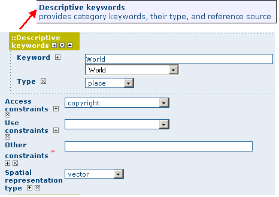
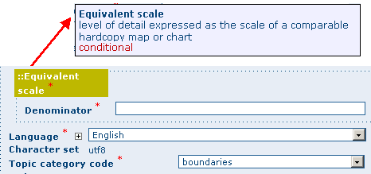
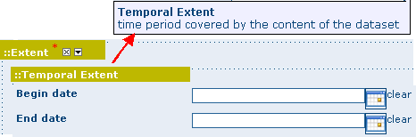
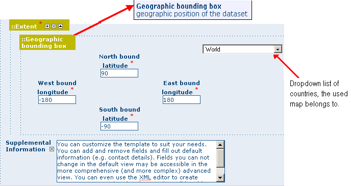
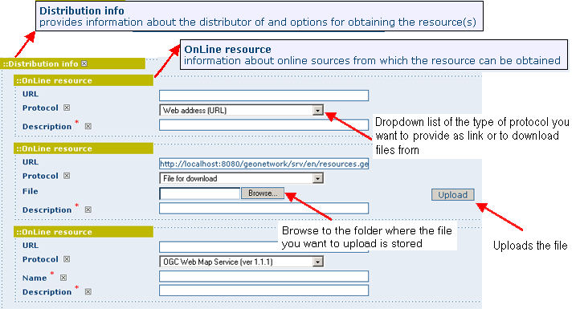
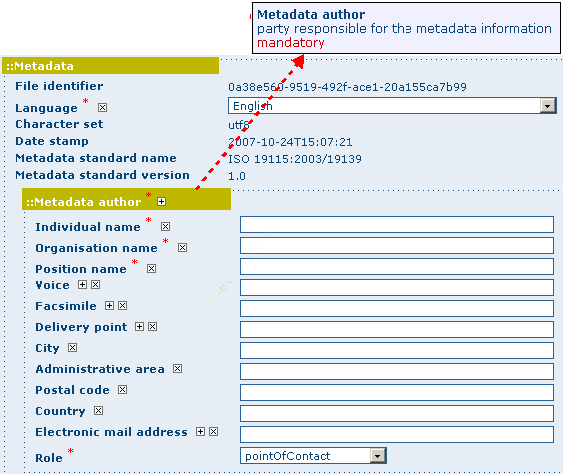

.. _viewing:

Viewing and Analysing the Data
==============================

Once you have completed your search, you view details of a particular record by clicking on the *Metadata* button.

The metadata profiles used by GeoNetwork opensource to present and describe geographic data and general documents stored in the catalogue are based on the *International Standard ISO 19115:2003*, encoded according to the *implementation schema 19139:2007*, the *FGDC* and the international standard *Dublin Core*.

In this guide the *ISO 19139* metadata implementation will be described in details since it is also suggested as profile for the creation of new metadata records.

Metadata Description
--------------------

The metadata ISO 19139 profile used by GeoNetwork opensource to describe the geographic data and services is based on the ISO standard 19115:2003 and provides information related to the identification, the maintenance and constraints, the spatial and temporal extent, the spatial representation and reference, the quality and distribution of a geographic dataset.

The metadata profile is organised in sections and the most important, illustrated below, are the: *Identification Section, Distribution Section, Reference System Section, Data Quality Section and Metadata Section*. These sections are described here in details.

.. figure:: mainSections.png

  *Main metadata sections*

Identification Section
``````````````````````

This section includes information on the citation of the resource (*title, date of creation or publication, edition, presentation form*), the *abstract*, the *purpose* and the present*status* of the resource that can be defined among the options: completed, historical archive, obsolete, ongoing, planned, required or under development.

.. figure:: Ident_Info_1.png

  *Identification information*

This section also contains information about the person or organisation responsible for the data and who is considered to be a *point of contact* for the resource i.e. the dataset owner, originator, distributor, publisher, etc. and it provides information on *data maintenance* i.e. annually, monthly, daily, not planned, as needed, etc.

.. figure:: PoC_Maint.png

  *Point of Contact*

Elements for *keywords* and for describing restrictions on *data access* and *use* are also included in this section in addition to *spatial representation info* like data type (vector, raster, text table, etc.)



  *Descriptive keywords*

The identification section provides information about the *scale*, the *language* and *character set* used within the resource and the list of *ISO categories* through which your map could be classified.



  *Scale and other data properties*

Finally, the temporal and spatial extent are also defined in this section. The temporal extent is defined through the starting and ending date of data validation.



  *Temporal extent*

The spatial extent of the interested area is defined through geographic coordinates or through the selection of a country or region from a predefined list. Free text *supplemental information* can be added to complete the data identification section.



  *Geographic bounding box*

Distribution Section
````````````````````

This section provides metadata elements for *accessing* other useful *on-line resources* available *through the web*. The distribution elements allow for on-line access using an URL address or similar addressing scheme and provide the protocol for the proper connection *for accessing geographic data* or any other types of digital documents *using the download* *function*. Furthermore, it is possible *to link* a metadata with a *predefined map service* through the *online resource* and see the map interactively.



  *Distribution information*

Reference System Section
````````````````````````

The Spatial Reference System section *defines metadata* required *to describe* the *spatial reference system* of a dataset. It contains one element to identify the name of the reference system used. Using elements *from the advanced form*, this section may be modified to provide more *details* on *data projection*, *ellipsoid* and *datum*. Note that if this information is provided, a reference system identifier is not mandatory.

.. figure:: RefSystem.png

  *Reference system*

Data Quality Section
````````````````````

The Data Quality section provides a *general assessment* of the *quality of the data*. It describes the*different hierarchical levels of data quality*, namely a *dataset series*, *dataset*, *features*, *attributes*, etc. This section also contains information about *sources of the input data*, and a *general explanation of the production processes* (lineage) used for creating the data.

.. figure:: dataQuality.png

  *Data quality*

Metadata Information Section
````````````````````````````

This section contains information about the metadata itself: the Universally Unique Identifier (UUID) assigned to the record (this is the ‘File identifier’), *language* and *characterset* used, *date* of *last edit* (‘Date stamp’) and the *metadata standard* and *version name* of the record. It also contains information on the *metadata author* responsible for the metadata record; this person can also be a point of contact for the resource described. Information on the Metadata author is mandatory.



  *Metadata properties*
