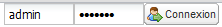

.. include:: ../../substitutions.txt

.. _user_admin:

Utilisateurs et groupes
=======================

|project_name| utilise les concepts suivants : "utilisateurs", "groupes" et "profils d'utilisateurs". Un utilisateur peut appartenir à plusieurs groupes. 
Chaque utilisateur possède un ou plusieurs profils. Les combinaisons de profils et des groupes, auxquels l’utilisateur appartient, définit le périmètre
des tâches qu’il peut réaliser au sein du catalogue.

Les groupes d'utilisateurs peuvent par exemple correspondre à des services, des secteurs d'activités ou des éléments structurels au sein d'une entité 
ou d'une organisation. Exemple de groupes : Pêche, Agriculture, Eau, Santé etc.

Créer de nouveaux groupes d'utilisateurs
----------------------------------------

L'administrateur peut créer de nouveaux groupes d'utilisateurs. 

Pour créer de nouveaux groupes, il faut être identifié à l'aide d'un compte ayant les privilèges d'administrateur. Pour s'identifier:

- Dans la page d'accueil : Entrer votre nom d'utilisateur et votre mot de passe;
- Cliquer sur le bouton "Connecter" dans la partie supérieure-droite de l'IHM.

.. warning:: 
    Par défaut, une version fraichement installée de |project_name| dispose d'un compte administrateur dont le nom et le mot de passe sont "admin".
    Pour une question de sécurité, il est très important de modifier le mot de passe de ce compte dans la page Administration après s'être identifié sous ce compte.

  *Formulaire de connexion*
    
#. Cliquer sur le bouton Administration du menu. Dans la page Administration, sélectionner le lien Gestion des groupes.
    
      .. figure:: administrationPanel.png
    
        *Page Administration*

#. Cliquer sur *Ajouter un groupe*.
  
      .. figure:: groupManag.png
    
        *Gestion des groupes*

#. Remplir le formulaire. L'adresse e-mail sera utilisée pour informer du téléchargement de ressources qui appartiennent au groupe.
    
      .. figure:: addGroup.png
      
        *Formulaire d'édition d'un groupe*

#. Cliquer sur *Sauver*

.. warning:: 
    Le nom ne doit pas contenir d'espace ! Les descriptions des groupes peuvent être traduites 
    (cf. :ref:`localization`).

Les privilèges d'accès peuvent être définis pour chaque fiche de métadonnées. Ils peuvent être définis sur la base des groupes d'utilisateurs.
Les privilèges concernent la publication des métadonnées (Publier), le téléchargement des données (Télécharger), la consultation cartographique des données (Carte interactive), la capacité à ajouter la ressource dans le panneau "la sélection" de la page d'accueil (Epingler), la possibilité de modifier les métadonnées (Editer), la réception d'une notification lorsque un fichier géré par le catalogue est téléchargé (Notifier).

L'image ci-dessous donne un exemple de privilèges associés à une ressource cataloguée.

.. figure:: privilegesSetting1.png

  *Paramétrage des privilèges pour une ressource*

Créer de nouveaux utilisateurs
------------------------------

Pour ajouter un nouvel utilisateur il faut réaliser les opérations suivantes :

#. Dans la page Administration, cliquer sur *Gestion des utilisateurs* ;

      .. figure:: addUser.png
  
    *Interface de gestion des utilisateurs*
    
#. Cliquer sur le bouton *Ajouter un utilisateur* ;

      .. figure:: insertUserInfo.png
  
    *Formulaire d'ajout d'un utilisateur*
    
#. Saisir les informations requises pour la création de l'utilisateur ;

#. Affecter un ou plusieurs groupes avec un profil pour chaque groupe à l’utilisateur ;

#. Cliquer sur *Sauver*.

.. _user_profiles:

Profils d'utilisateurs
----------------------

Les profils d’un utilisateur définissent quelles actions sont autorisés à cet utilisateur.

Les profils de utilisateurs sont hiérarchiques et exploitent des mécanismes d’héritage. 
Cela signifie qu’un utilisateur disposant d’un profil Editeur peut créer et modifier des
fiches de métadonnées et qu’il peut également utiliser les fonctions accessibles à tout 
utilisateur dont le profil est Utilisateur enregistré. Cependant, un utilisateur étant 
Administrateur d’utilisateur ne pourra pas créer de fiches.

Les droits associés aux profils sont décrits ci-dessous :

#.  Administrateur

    L'administrateur a accès à toutes les fonctions du catalogue. Cela inclut :
    
    - Création de nouveaux groupes et utilisateurs
    - Modification du profil et des groupes des utilisateurs
    - Création, modification et suppression de fiches de métadonnées
    - Réalisation de tâches d'administration et de configuration du catalogue

#.  Administrateur d'Utilisateurs

    L'administrateur d'utilisateurs est l'administrateur de son propre groupe d'utilisateurs. Il dispose des privilèges suivants :
    
    - Création de nouveaux utilisateurs dans son propre groupe
    - Modification des privilèges des utilisateurs de son groupe

#.  Relecteur

    Le relecteur est l'utilisateur donnant l'autorisation finale de publication d'une fiche de métadonnées de son groupe sur l'Intranet ou Internet.

#.  Editeur

    L'éditeur dispose des droits suivants lui permettant de travailler sur les fiches de métadonnées :
    
    - Création, modification et suppression de fiches de métadonnées au sein de son groupe (publication sur Internet impossible)

#.  Utilisateur Enregistré

    L'utilisateur enregsitré dispose de droits supplémentaires par rapport aux utilisateurs anonymes :
    
    - Téléchargement de données protégées

