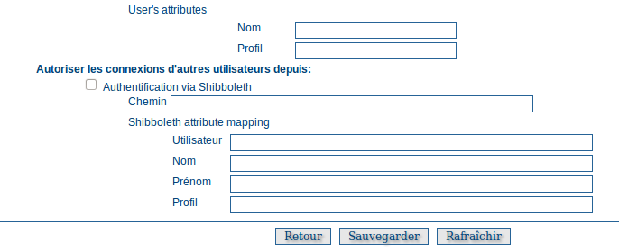
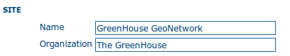

.. _authentication:

.. toctree::
   :maxdepth: 2

Configuration de l'authentication
=================================

Cette section permet de définir le mode d'authentification pour le catalogue.


Par défaut, les utilisateus sont identifiés par la base de données du catalogue. 
Dans ce mode là, il est possible d'activer l'option d'enregistrement libre des 
internautes alors membre du groupe invité (cf. :ref:`authentication_self_register`).

Les chapitres à venir décrivent la configuration pour les différents mécanismes d'authentification supportés:

.. contents:: 
    :depth: 1
    :local:

Le mécanisme d'authentification utilise le framework Spring Security et permet de supporter plusieurs 
`fournisseurs d'authentification <http://static.springsource.org/spring-security/site/docs/3.1.x/reference/introduction.html#modules>`_.

La configuration de l'authentification se fait via le fichier WEB-INF/config-security.properties. Pour prendre en compte
les changements, il est nécessaire de relancer l'application.


.. _authentication_ldap:

LDAP
----

Paramètres de connexion
```````````````````````
Pour activer le support LDAP:


#. ajouter l'URL du LDAP dans config-security.properties::
 
    # LDAP security properties
    ldap.base.provider.url=ldap://localhost:389
    ldap.base.dn=dc=fao,dc=org
    ldap.security.principal=cn=admin,dc=fao,dc=org
    ldap.security.credentials=ldap


   - ldap.base.provider.url: URL du serveur LDAP (il doit être accessible pour la machine où le catalogue est installé).
   - ldap.base.dn=dc=fao,dc=org: En général, quelquechose comme "dc=organizationnamehere,dc=org" en fonction de la structure de l'annuaire
   - ldap.security.principal & ldap.security.credentials: Identifiant et mot de passe de l'utilisateur se connectant au LDAP. 
     Si ces paramètres ne sont pas définis, une connexion anonyme est utilisée. Dans ce cas, l'annuaire doit autoriser ce type de connexion
   - Pour vérifier la connexion à l'annuaire, utiliser un client LDAP depuis le serveur afin de vérifier l'ensemble des paramètres.
   
#. définir comment identifier les utilisateurs dans l'annuaire::

    ldap.base.search.base=ou=people
    ldap.base.dn.pattern=uid={0},${ldap.base.search.base}
    #ldap.base.dn.pattern=mail={0},${ldap.base.search.base}

   - ldap.base.search.base: Position où se trouve les utilisateurs dans l'annuaire (dépend de ldap.base.dn également).
   - ldap.base.dn.pattern: Attribut contenant l'identifiant de l'utilisateur. {0} est remplacé par ce que l'utilisateur saisie
     dans l'interface de connexion.


#. activer le LDAP dans le fichier config-security.xml::

    <import resource="config-security-ldap.xml"/>


Paramètres des utilisateurs
```````````````````````````

Avec l'annuaire, il est possible de définir les propriétés de l'utilisateur dans le catalogue.

Information sur l'utilisateur
~~~~~~~~~~~~~~~~~~~~~~~~~~~~~

Toutes les informations concernant l'utilisateur peuvent être récupérées au sein de l'annuaire. 
Pour cela, définir les correspondance dans le fichier config-security-overrides.properties.
Ce fichier permet de définir pour chaque information, l'attribut de l'annuaire à utiliser 
ainsi qu'une valeur par défaut.

Exemple de configuration::

    # Map user information to LDAP attributes and default values
    # ldapUserContextMapper.mapping[name]=ldap_attribute,default_value
    ldapUserContextMapper.mapping[name]=givenName,
    ldapUserContextMapper.mapping[surname]=sn,
    ldapUserContextMapper.mapping[mail]=mail,data@myorganization.org
    ldapUserContextMapper.mapping[organisation]=,myorganization
    ldapUserContextMapper.mapping[kind]=,
    ldapUserContextMapper.mapping[address]=,
    ldapUserContextMapper.mapping[zip]=,
    ldapUserContextMapper.mapping[state]=,
    ldapUserContextMapper.mapping[city]=,
    ldapUserContextMapper.mapping[country]=,


Privilèges de l'utilisateur
~~~~~~~~~~~~~~~~~~~~~~~~~~~

Les rôles et groupes d'appartenance d'un utilisateur peuvent être éventuellement récupérés
dans l'annuaire.

Pour utiliser la base de données locale pour la gestion des privilèges, il faut
définir la propriété ldap.privilege.import property dans le fichier config-security.properties::

    ldap.privilege.import=false

Pour utiliser l'annuaire::

    ldap.privilege.import=true


Lorsque les groupes sont importés depuis l'annuaire, il est possible de créer les groupes non existant
dans la base locale. Pour cela::

    ldap.privilege.create.nonexisting.groups=false


Configuration simple des privilèges
"""""""""""""""""""""""""""""""""""

Afin de définir les groupes et profils d'un utilisateur, utiliser le fichier config-security-overrides.properties 
permettant de définir quels attributs utilisés ::

    ldapUserContextMapper.mapping[privilege]=groups,sample
    # If not set, the default profile is RegisteredUser
    # Valid profiles are http://geonetwork-opensource.org/manuals/trunk/eng/developer/apidocs/geonetwork/org/fao/geonet/constants/Geonet.Profile.html
    ldapUserContextMapper.mapping[profile]=privileges,RegisteredUser


Configuration des attributs :

 - privilege : Attribut indiquant le ou les groupes de l'utilisateur.
 - profile : Attribut indiquant le profil de l'utilisateur.

Les profils possibles sont :

 - Administrator
 - UserAdmin
 - Reviewer
 - Editor
 - RegisteredUser
 - Guest


Correspondance de profiles
""""""""""""""""""""""""""

Si l'annuaire contient des valeurs de profils ne correspondant pas à celle attendue par le catalogue,
il est possible de définir une correspondance dans le fichier config-security-overrides.properties::

    # Map LDAP custom profiles to catalog profiles. Not used if ldap.privilege.pattern is defined.
    ldapUserContextMapper.profilMapping[Admin]=Administrator
    ldapUserContextMapper.profilMapping[Editeur]=Reviewer
    ldapUserContextMapper.profilMapping[Public]=RegisteredUser

Dans l'exemple ci-dessus, l'attribut de l'annuaire contenant la valeur "Admin" correspondra à
"Administrator" qui est une valeur valide pour le catalogue.


Configuration avancée
"""""""""""""""""""""

Il est possible d'utiliser un seul attribut pour définir les profils et groupes de l'utilisateur.
Pour extraire ces informations, une expression peut être définie. Par exemple::

    # In config-security-overrides.properties
    ldapUserContextMapper.mapping[privilege]=cat_privileges,sample
    
    # In config-security.properties
    ldap.privilege.pattern=CAT_(.*)_(.*)
    ldap.privilege.pattern.idx.group=1
    ldap.privilege.pattern.idx.profil=2

L'attribut "cat_privileges" peut alors contenir différentes combinaisons pour les différents types d'utilisateur ::

    -- Define a catalog admin:
    cat_privileges=CAT_ALL_Administrator
    
    -- Define a reviewer for the group GRANULAT
    cat_privileges=CAT_GRANULAT_Reviewer
    
    -- Define a reviewer for the group GRANULAT and editor for MIMEL
    cat_privileges=CAT_GRANULAT_Reviewer
    cat_privileges=CAT_MIMEL_Editor
    
    -- Define a reviewer for the group GRANULAT and editor for MIMEL and RegisteredUser for NATURA2000
    cat_privileges=CAT_GRANULAT_Reviewer
    cat_privileges=CAT_MIMEL_Reviewer
    cat_privileges=CAT_NATURA2000_RegisterdUser
    
    -- Only a registered user for GRANULAT
    cat_privileges=CAT_GRANULAT_RegisteredUser


Synchronisation
```````````````

Une tâche de fond s'occupe de supprimer de la base locale des utilisateurs les utilisateurs supprimés
du LDAP. Par exemple:

 - T0: un utilisateur A se connecte au catalogue. Un utilisateur A est ajouté dans la base de données des utilisateurs (identifié comme venant d'un annuaire).
 - T1: l'utilisateur A est supprimé du LDAP (A ne peut plus se connecter au catalogue).
 - T2: la tâche de fond vérifie que tous les utilisateurs de l'annuaire, qui se sont connectés au catalogue, sont toujours présents dans le LDAP:
 
   - si l'utilisateur n'a créé aucune fiche, il est supprimé
   - si l'utilisateur a créé des fiches, un message d'alerte est affiché dans les logs de l'application. 
     Un administrateur du catalogue doit utiliser l'interface d'administration pour transférer les fiches
     de cet utilisateur vers un autre.

Par défaut, cette tâche est exécutée une fois par jour. La configuration se trouve dans config-security.properties::

    # Run LDAP sync every day at 23:30
    ldap.sync.cron=0 30 23 * * ?

Debugging
`````````

Si la connexion échoue, il est possible d'augmenter le niveau d'information dans les logs en modifiant dans le fichier log4j.cfg::

    log4j.logger.geonetwork.ldap          = DEBUG
    log4j.logger.org.springframework = DEBUG, console, jeeves
    log4j.logger.org.springframework.* = DEBUG
    log4j.logger.org.springframework.security.ldap = DEBUG


.. _authentication_cas:

CAS
---

Pour activer le support de CAS :


#. ajouter l'URL du serveur CAS dans le fichier config-security.properties ::
 
    cas.baseURL=https://localhost:8443/cas
    cas.ticket.validator.url=${cas.baseURL}
    cas.login.url=${cas.baseURL}/login
    cas.logout.url=${cas.baseURL}/logout?url=${geonetwork.https.url}/
 

#. activer dans config-security.xml ::

    <import resource="config-security-cas.xml"/>
    <import resource="config-security-cas-ldap.xml"/>


.. _authentication_shibboleth:

Shibboleth authentication
-------------------------

When using either the GeoNetwork database or LDAP for authentication, you can also configure shibboleth
to allow authentication against access federations.



    *The Shibboleth configuration options*

Shibboleth authentication requires interaction with Apache web server. In particular, the apache web server
must be configured to require Shibboleth authentication to access the path entered in the configuration. 
The apache web server configuration will contain the details of the shibboleth server that works out where 
a user is located (sometimes called a 'where are you from' server).

The remainder of the shibboleth login configuration describes how shibboleth authentication attributes are 
mapped to GeoNetwork user database fields as once a user is authenticated against shibboleth, their details 
are copied to the local GeoNetwork database.


.. _authentication_self_register:

User Self-Registration
----------------------

From Administration, system configuration, GeoNetwork has a self-registration function which allows a user to request a login which provides access to 'registered-user' functions.  By default this capability is switched off. To configure this capability you must complete the following sections in the 'System configuration' menu:

- configure the site name and organization name as these will be used in emails from this GeoNetwork site to newly registered users. An example of how to config these fields at the top of the system configuration form is:



- configure feedback email address, SMTP host and SMTP port. The feedback email address will be sent an email when a new user registers and requests a profile other than 'Registered User'. An example of how to config these fields in the system configuration form is:

.. figure:: web-config-options-feedback.png

- check the box, enable user self-registration in the Authentication section of the system configuration form as follows:

.. figure:: web-config-authentication-self-registration-checked.png

When you save the system configuration form, return to the home page and log out as admin, your banner menu should now include two new options, 'Forgot your password?' and 'Register' (or their translations into your selected language) as follows:

.. figure:: web-config-banner-with-self-registration.png

You should also configure the xml file that includes contact details to be 
displayed when an error occurs in the registration process. This file is 
localized - the english version is located in 
INSTALL_DIR/web/geonetwork/loc/en/xml/registration-sent.xml.

Finally, if you want to change the content of the email that contains registration details for new users, you should modify INSTALL_DIR/web/geonetwork/xsl/registration-pwd-email.xsl.

