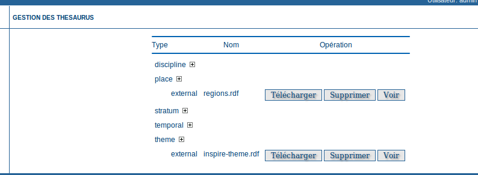
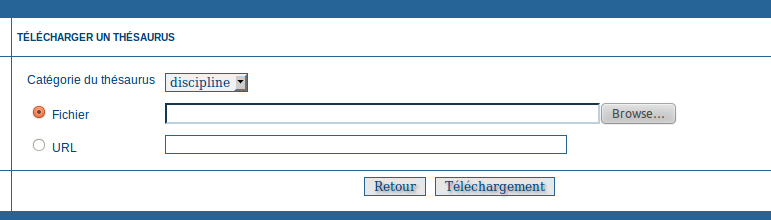
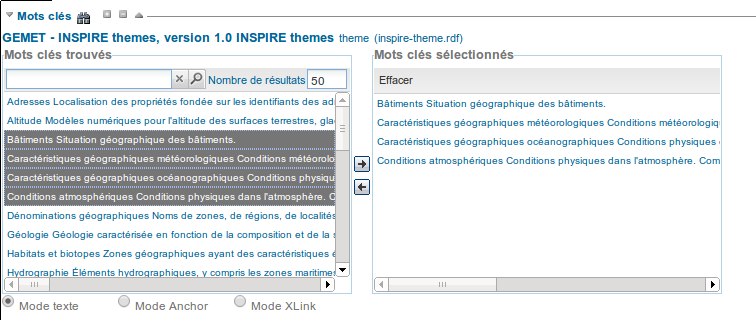
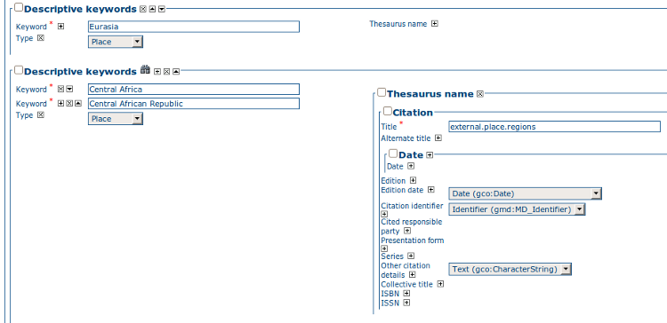
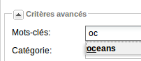

.. _Thésaurus:
.. include:: ../../../substitutions.txt

Thésaurus
=========

Introduction
------------

La prise en charge des thésaurus dans |project_name| permet:

- *Edition de Métadonnées*: Le vocabulaire est contrôlé dans l’interface d’édition des métadonnées par les normes ISO et Dublin Core;
- *Interface d’administration*: Permet d’importer/exporter/créer/parcourir le thésaurus;
- *Interface de recherche*: Une liste de Mots-clés est proposée pour les critères de mots-clés.

Les types de thésaurus peuvent être définis comme :

- *Externe*: Lorsqu’un thésaurus est importé, il est signalé comme « externe », ce qui signifie que les utilisateurs ne sont pas autorisés à le modifier. Ce thésaurus est géré par une organisation extérieure;
- *Local*: Lorsqu’un thésaurus est créé dans |project_name|, il est signalé comme « local », ce qui signifie que les utilisateurs sont autorisés à le modifier.

Thésaurus / Format SKOS
-----------------------

Le Simple Knowledge Organisation Systems (SKOS) http://www.w3.org/2004/02/skos/ est un espace de travail pour développer des spécifications et des normes à l’appui de l’utilisation du knowledge organisation systems (KOS) comme le thésaurus et les schémas de classification. Ce format est utilisé par |project_name| pour stocker les informations du thésaurus.
Un concept est défini par un identifiant, un en-tête prioritaire, une définition et des liens vers d’autres concepts. Les en-têtes et les définitions peuvent être stockées dans de multiples langues (en utilisant l’attribut XML:lang). Trois types de liens entre les concepts ont été définis dans le format SKOS :

- Apparentés étymologiques;
- Général;
- Etroit.

Par exemple, un concept « ABLETTE » pourrait être défini avec une étiquette en français et en anglais, liée à un concept plus large::

    <skos:Concept rdf:about="http://www.oieau.org/concept#c4fc54576dc00227b82a709287ac3681">
        <skos:prefLabel xml:lang="fr">ABLETTE</skos:prefLabel>
        <skos:prefLabel xml:lang="en">BLEAK</skos:prefLabel>
        <skos:broader rdf:resource="http://www.oieau.org/concept#9f25ece36d04776e09492c66627cccb9"/>
    </skos:Concept>


|project_name| supporte des Thesaurus multilingues (e.g. Agrovoc). La recherche et l’édition sont basées sur la langue d’interface de l’utilisateur actuel (C’est-à-dire si l’interface est en anglais, en éditant des métadonnées, |project_name| cherchera seulement le concept en anglais).

Administration du thésaurus
---------------------------

Pour accéder à la page d’administration du thésaurus vous devez être connecté en tant qu’administrateur. Depuis la page d’administration, cliquez sur le lien « Gestion des thésaurus ». La page affiche une liste des thésaurus qui ont été créés ou importés. La partie supérieure de la page utilisateur permet d'éditer/ajouter/modifier/consulter les thésaurus. La partie inférieure permet de télécharger un thésaurus au format SKOS.

Création d’un nouveau thesaurus
```````````````````````````````

Pour créer un nouveau thésaurus dans une catégorie, cliquez sur le signe « + » de cette catégorie. Une fois créé, le thésaurus pourra être mis à jour par le biais de l’interface d’édition. Les colonnes ont pour signification:

- **Type** - Permet de classer les thésaurus selon leur type. Les types de thésaurus sont définis par rapport à la liste des types de mots-clés ISO. De plus, le type indique si le thesaurus est en local ou en externe.
- **Nom** - Dénomination du thésaurus fourni par l’administrateur lors de la création ou le nom du fichier de téléchargement. Lorsque vous créez un thésaurus, le nom de celui-ci sera le nom du fichier du thésaurus.



    *Interface d’administration de thésaurus.*

Pour chaque thésaurus, les boutons suivants sont disponibles :

- **Télécharger** - Lien vers le fichier RDF;
- **Supprimer** - Suppression du thésaurus dans le répertoire actuel;
- **Voir** - Si le type est externe, le bouton “Afficher” permet d’effectuer des recherches et visualiser les concepts;
- **Editer** - Si le type est local, le bouton "éditer" permet de rechercher, d’ajouter, de supprimer et d’afficher les concepts.

Importer des thésaurus existants
````````````````````````````````

|project_name| permet d’importer des thésaurus au format SKOS. Une fois téléchargé, un thésaurus externe peut ne pas être à jour. Sélectionnez la catégorie, parcourir le fichier du thésaurus et cliquez sur Téléchargement. Le fichier se trouve dans /web/xml/codelist/external/thesauri/category/.



    *Interface de téléchargement pour le thésaurus.*

En bas de page, les boutons suivants sont disponibles:

#. *Retour*: Revenir à la page principale d’administration;
#. *Télécharger*: Téléchargement du fichier RDF sélectionné dans le répertoire.

Editer/parcourir  le thésaurus: Ajouter/Supprimer/Parcourir les Mots-clés
-------------------------------------------------------------------------

Dans l’interface d’administration de thésaurus, cliquez sur le bouton Modifier pour un thésaurus local ou sur le bouton Voir pour un thésaurus externe. Cette interface permet :

- Rechercher des mots-clés;
- Ajouter/supprimer des mots-clés du thésaurus interne.

Utilisez la zone de texte et le type de recherche afin de rechercher des mots-clés.

.. figure:: thesaurus-KeywordSearch.png

    *Parcourir l’interface du thésaurus.*

.. figure:: thesaurus-KeywordDesc.png

    *Description des mots-clés*

Edition de métadonnées : Ajouter des mots-clés
----------------------------------------------

L’édition de métadonnées selon les normes ISO permet aux éditeurs de:

- Faire une ou plusieurs recherches dans tous les thésaurus enregistrés dans le catalogue;
- Sélectionner un ou plusieurs mots-clés à ajouter à la liste des éléments sélectionnés (en utilisant les flèches ou glisser-déplacer) sur la droite;
- Ajouter les mots-clés choisis directement dans les métadonnées, regrouper les mots-clés par thésaurus.

L’interface de recherche permet aux éditeurs de choisir le nombre maximum de mots-clés en retour et 
dans quel thésaurus la recherche doit se faire (valeur par défaut: “tous”).



    *Interface de sélection de mots-clés (mode d’édition).*



    *Sélection de mots-clés (mode d’affichage).*


Les différents modes d'ajouts
`````````````````````````````


3 modes d'ajout de mots clés sont disponibles :
 
 - Mode texte (recommandé)
 - Mode Anchor
 - Mode XLink

Le mode texte ajoute les mots clés en utilisant la balise gco:CharacterString. Celui-ci est préférable car géré par la plupart
des outils de catalogage.

.. code-block:: xml

  <?xml version="1.0" encoding="UTF-8"?>
  <gmd:MD_Keywords>
   <gmd:keyword>
      <gco:CharacterString>Bâtiments</gco:CharacterString>
   </gmd:keyword>
   <gmd:type>
      <gmd:MD_KeywordTypeCode codeList="http://www.isotc211.org/2005/resources/codeList.xml#MD_KeywordTypeCode"
                              codeListValue="theme"/>
   </gmd:type>
   <gmd:thesaurusName>
      ...
      

Le mode Anchor utilise la balise gmx:Anchor pour les mots clés. En complément de la valeur du mots clés, un lien vers le
concept est ajouté via l'attribut href. Cette information peut être utilisé pour faire un simple lien vers une page web
ou vers la description du concept en RDF. Dans le dernier cas, les moteurs sémantiques peuvent exploiter cette information
pour associer les ressources entre elles.

.. code-block:: xml
      
   <gmd:MD_Keywords>
     <gmd:keyword>
       <gmx:Anchor xlink:href="http://rdfdata.eionet.europa.eu/inspirethemes/themes/15">Bâtiments</gmx:Anchor>
     </gmd:keyword>


Le mode XLink ajoute un lien entre la fiche et le thésaurus. Ce lien est résolu lors de la consultation de la fiche
si la résolution des XLinks est activée dans l'administration  (cf. :ref:`admin_xlink`) .

.. code-block:: xml

  <?xml version="1.0" encoding="UTF-8"?>
  <gmd:MD_Keywords
                 xlink:href="http://localhost/geonetwork/srv/fre/xml.keyword.get?thesaurus=external.theme.inspire-theme&amp;amp;id=http://rdfdata.eionet.europa.eu/inspirethemes/themes/15&amp;amp;multiple=false"
                 xlink:show="replace"/>


Critères de recherche : Mots-clés
---------------------------------

Il est possible de rechercher par mots-clés dans l'interface de recherche. Un mécanisme d'autocomplétion aide à la recherche :



