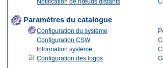
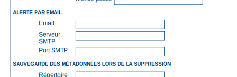
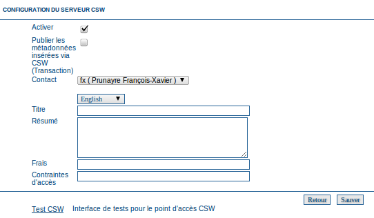
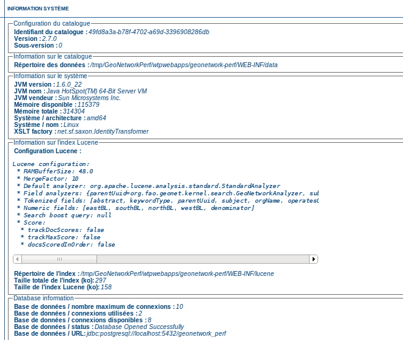
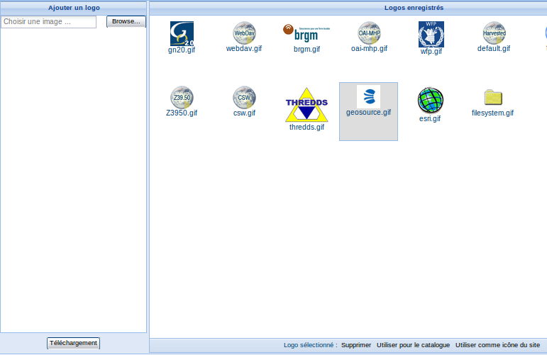
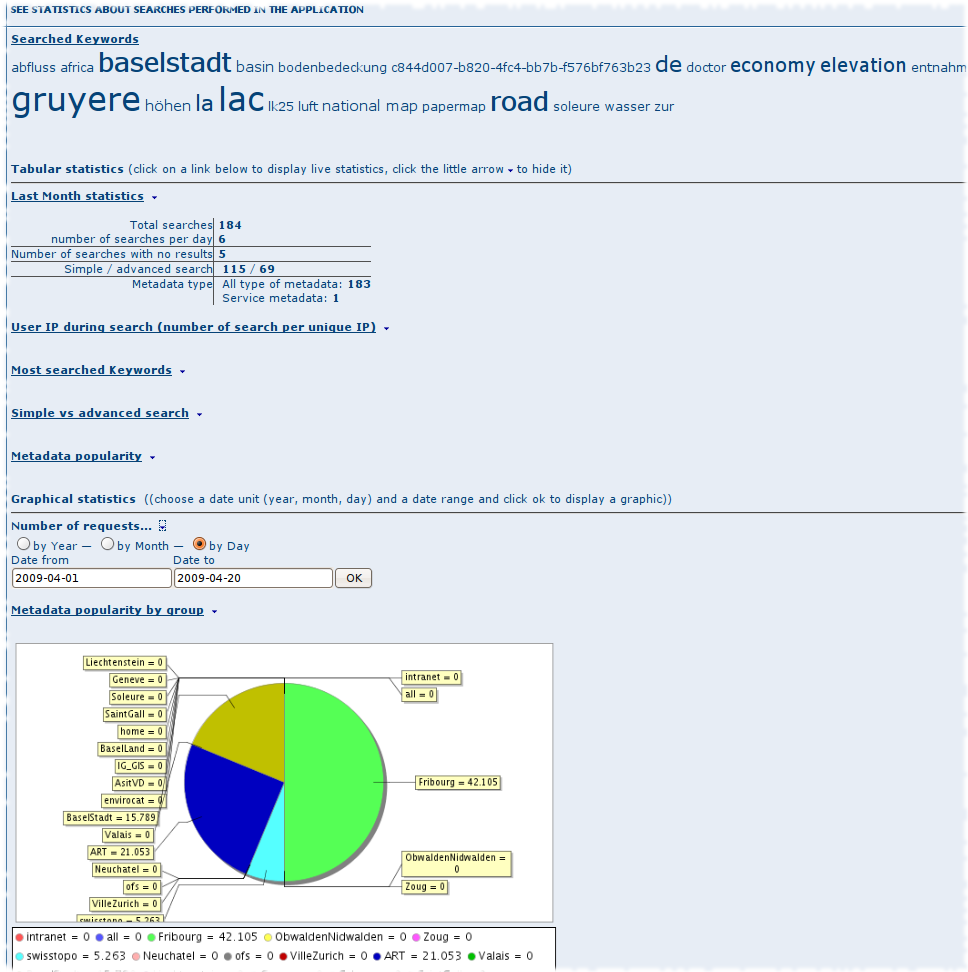

.. _configuration:
.. include:: ../../substitutions.txt

.. toctree::
   :maxdepth: 2

Paramètres du catalogue
=======================

.. _configuration_system:

Configuration du système
------------------------

La majorité des options de configuration du catalogue sont accessibles depuis la page
web d'administration. Il est important de bien configurer ces options, car un catalogue
mal configuré pourrait avoir des problèmes pour permettre le téléchargement des fichiers, 
des imagettes, ou lors du moissonnage par d'autres catalogues.

Pour configurer le catalogue, l'utilisateur doit être connecté en tant qu'administrateur.

Aller à la page d'administration, puis sélectionner configuration du système.


.. important:: Lors d'une installation par défaut du catalogue, l'utilisateur admin est identifié
    par le mot de passe admin. Il est important de changer ces valeurs par défaut.




    Lien vers la page de configuration du système


.. FIXME too large ::figure:: web-config-options.png

    Les options de configuration

Les boutons au bas de la page permettent de retourner à la page administration, de sauver les changements
ou recharger la configuration.


Paramètres du catalogue
```````````````````````

Ces 2 paramètres sont utilisés dans les cas suivants :

#. Lors d'une session d'édition, lors de l'ajout de données associées à une métadonnée. 
    ces paramètres sont utilisés pour construire l'URL pour le téléchagement dans la métadonnée

#. Lors de requête CSW. Le document GetCapabilities retourne des liens HTTP vers le service CSW. 


- Site

 - Nom : Le nom du catalogue est utilisé dans le critère de recherche **catalogue**, ou dans le moissonnage

 - Organisme : Le nom de l'organisation à laquelle appartient le catalogue

- Serveur reseigne sur l'adresse publique du catalogue

 - **Hôte** L'URL publique ou l'adresse IP du catalogue. 
 
 - **Port** Le port est en général 80 (ie. http) ou plus rarement 8080.

 - **Protocol** HTTP ou HTTPS.


- Intranet est utilisé pour distinguer les utilisateurs du catalogue sur le réseau Intranet de l'organisation

 - **Network** adresse IP du réseau

 - **Masque de sous réseau**


Paramètre de recherches et indexation
`````````````````````````````````````

- Nombre maximum d'items sélectionnés permet de limiter la sélection d'un trop grand nombre d'enregistrement à la fois. 
   Ce paramètre évite des problèmes de performance sur les opérations sur un groupe de fiches.
    
- Optimisation de l'index : Activé par défaut. Ce processus permet de régulièrement "ranger" l'index Lucene.
  L'opération est rapide pour des catalogues peu volumineux.

TODO
- *Number of processing threads* The maximum number of processing threads that can be allocated to an indexing task. 


Paramètre de configuration du services Z39.50
`````````````````````````````````````````````

Le catalogue supporte le protocol serveur Z39.50 qui est un protocole d'interrogation de métadonnées.

- **Activé** : Cette option permet d'activer ou pas au démarrage le protocole. Le redémarrage est nécessaire 
  pour la prise en compte de ce paramètre. Activé par défaut.

- **port** : Port d'écoute pour les requêtes Z39.50. Par défaut ce port est le 2100. 
  Il est possible de changer ce port, si plusieurs catalogues sont déployés sur le même serveur. 
  Ce port doit être ouvert si un pare-feu se trouve devant le catalogue.


Paramètre de configuration du services OAI-PMH
``````````````````````````````````````````````

Le catalogue support le protocol serveur OAI-PMH.

Les paramètres suivants sont disponibles :

- Datesearch : Utilisé l'étendue temporelle ou la date de modification sur les recherches temporelles

- Resumption token timeout

- Taille du cache

.. _admin_xlink:

XLink
`````

La résolution des XLinks consiste à remplacer les éléments ayant un attribut @xlink:href dans les métadonnées
(à l'exception de quelques éléments tel que srv:operatesOn, gmx:Anchor) par le contenu de l'URL indiquée dans le XLink. 
La résolution des XLinks doit être active si:

- le moissonnage de fragments est utilisés

- l'association d'élément d'annuaire avec des XLinks est utilisée


Activé ou désactivé la résolution des XLinks présents dans les métadonnées.


Note: pour améliorer les performances, le catalogue maintient un cache des XLink.


Statistique sur les recherches
``````````````````````````````

Activé ou désactivé la génération de statistique sur les recherches (cf :ref:`stat_config`).


Recherche multilingue
`````````````````````

Les paramètres suivant définissent comment la recherche sur du contenu multilingue doit être réalisée :


*Activer l'auto-détection langage de requête de recherche :* Si actif, le catalogue tentera de détecter la langue de la requête. Si la détection échoue, la langue de l'interface est utilisée.

*Résultats de la recherche dans la langue demandée triés sur le dessus :* Si actif, le catalogue ajoute une clause afin de trier les fiches dans la langue de recherche en premier.
Cela est différent de l'augmentation de la pertinence des résultats dans une langue. En effet, un fiche en allemand avec une forte pertinence (calculée par rapport
aux critères de recherche) sera retournée après les résultats en français si la langue de recherche est le français (même si les résultats en français sont moins
pertinent).


*Search only in requested language* Cette option permet de définir le niveau de priorité par rapport à la langue de la recherche.

- *All documents in all languages (No preferences)* - la langue de la recherche est ignorée - aucun effet sur l'ordre des résultats

- *Prefer documents with translations requested language* - les fiches avec des traductions dans la langue de la recherche (n'importe où dans le document) seront prioritaires 

- *Prefer documents whose language is the requested language* - les fiches dans la langue de la recherche (ie. les documents dont la langue principale correspond à la langue de la recherche) seront prioritaires

- *Translations in requested language* - seules les fiches avec des traductions dans la langue de la recherche seront retournées.  

- *Document language is the requested language* - seules les fiches dans la langue de la recherche seront retournées


Service de téléchargement
`````````````````````````

Les fichiers associés aux métadonnées peuvent être accessible au téléchargement selon 3 modes :

- Utiliser le service de téléchargement |project_name| (resources.get)

- Utiliser le service analysant les contraintes d'accès |project_name| (file.disclaimer)

- Utiliser les liens de la section distribution - sans changement


Hyperliens cliquables
`````````````````````

Activé ou désactivé la recherche de liens dans le contenu des métadonnées. Ces liens sont transformés
en lien <a href=".."> pour les url http et les adresses emails. Cette option affecte légérement les performances d'affichage.


Evaluation locale
`````````````````

Activé ou désactivé l'évaluation locale des métadonnées. Lorsqu'un utilisateur note une métadonnée, la note est transmie 
au catalogue source lorsque cette métadonnée est moissonnée selon le protocol |project_name|.


Correction automatique
``````````````````````

Activé ou désactivé la correction automatique. Lors de la sauvegarde d'une métadonnée des informations sont mises à jour
automatiquement par le catalogue (eg. ajout des attributs gco:isoType obligatoire, gco:nilReason pour les champs textes vide
définition des liens pour le téléchargement).
Il est fortement recommandé de conserver cette option activée sauf si vous savez ce que vous faites !


INSPIRE
```````
Activé ou désactivé les options INSPIRE :

- L'opération GetCapabilities du CSW contient alors une section INSPIRE (ie. ExtendedCapabilities). Il est possible de modifier
  cette section dans le fichier xml/csw/capabilities_inspire.xml. Le paramètre LANGUAGE est alors supporté de la manière suivante :
  
 - Les champs d'information titre, résumé, contrainte d'accès et frais sont retournés dans la langue demandée (cf :ref:`csw_configuration`)

 - Les URL des end-points sont retournées dans la langue demandée

- Les thèmes INSPIRE sont alors indexés (nécessite de vérifier la présence du thésaurus INSPIRE et de relancer l'indexation)

- Le formulaire de recherche INSPIRE est ajouté dans les critères avancés (selon l'interface)


Mode d'affichage des métadonées
```````````````````````````````

Il est possible de configurer quels onglets doivent être affichés en consultation et en édition.


*Activer la vue simple*: La vue par défaut:
- ne présente pas les nombreux niveaux de hiérarchie présents dans certains standards (tel que ISO19115/19139)
- ne permet par à l'utilisateur d'ajouter des éléments non présent dans la fiche
- cette vue permet d'avoir une vue simple et complète de la fiche
*Activer la vue ISO*: Le standard ISO19115/19139 défini 3 groupes d'éléments :
- Minimum: éléments obligatoires
- Core: éléments obligatoires pour décrire une donnée géographique
- All: tous les éléments
*Activer la vue INSPIRE*: Vue correspondant aux règles d'implémentation sur les métadonnées de la Directive INSPIRE.
*Activer la vue XML*: Vue proposant l'édition du document XML.


Privilèges des métadonnées
``````````````````````````

*Définir les privilèges uniquement pour les groupes de l'utilisateur*: Si cette option est activée alors seul le groupe
auquel appartient l'utilisateur sera affiché dans la page des privilèges des métadonnées (sauf si l'utilisateur est administrateur).


Moissonnage
```````````

Permettre ou non l'édition de fiche moissonnée (sachant que fonction du protocol de moissonnage, la fiche pourra
être écrasé si le moissonnage est relancé).

Configuration du proxy
``````````````````````


Dans certaines situations, le catalogue doit être capable d'accèder à des sites distants. Il est 
alors nécessaire pour lui de passer par le proxy de l'organisation.

.. figure:: web-config-options-proxy.png


- *Hôte*: Adresse IP ou nom du proxy

- *Port*: Le port du proxy

- *Utilisateur* (optionel)

- *Mot de passe* (optionel)


Configuration du proxy pour le proxy du catalogue
~~~~~~~~~~~~~~~~~~~~~~~~~~~~~~~~~~~~~~~~~~~~~~~~~

L'interface cliente javascript du catalogue à parfois besoin de réaliser des appels vers d'autres
sites (eg. récupération d'un GetCapabilities par le module cartographique). Pour cela, 
elle a besoin d'un proxy au niveau du serveur. Si vous utilisez le proxy par défaut
du catalogue et que ce proxy doit passer par un proxy côté serveur pour accèder à Internet, il est alors nécessaire de
définir les variables d'environnement http.proxyHost et http.proxyPort [#fproxy]_ au lancement de l'application.
Il est possible d'ajouter ces paramètres au lancement du container Java avec les paramètres suivants ::

  -Dhttp.proxyHost=my.proxy.org -Dhttp.proxyPort=8080


.. _configuration_system_email:

Alerte et notification
``````````````````````

Le catalogue peut notifier par email lorsqu'une métadonnée est téléchargée ou lorsqu'un utilisateur
rempli le formulaire de contact. Dans ce cas, il est nécessaire de configurer le serveur de mail



    Configuration du serveur de mail

- **Email**: adresse utilisée pour l'envoi des mails (ie. From:)

- **Serveur SMTP**: IP du serveur de mail

- **Port SMTP**: Port du serveur de mail (en général 25).

Métadonnée supprimée
````````````````````

Permet de définir le répertoire à utiliser pour la sauvegarde lors de la suppression d'une métadonnée.
Ce répertoire permet pour les administrateurs du système de récupérer des métadonnées supprimées par erreur.


.. _csw_configuration:

Configuration CSW
-----------------

Configuration minimale
``````````````````````

Lorsqu'une application cliente appelle un service conforme au standard CSW (Catalogue Service for the Web) 
de l'OGC, une description de ce service sera fournie au travers d'un document XML (getCapabilities). La page 
de configuration du service CSW permet de définir les éléments de description suivants :

*Activer*: Cette option permet d'activer ou désactiver le service. Si elle est désactivée, les autres catalogues
ne pourront pas moissonner le catalogue avec le protocole CSW.

*Contact*: contact principal défini dans le document getCapabilities.

*Titre*: titre du service CSW.

*Résumé*: résumé du service CSW.

*Frais* : Frais éventuels pour utiliser le service.

*Contraintes d'accès* : contraintes d'accès au service.

La description du service contient également les principaux mots-clés du catalogue. La liste de ces mots-clés 
est générée automatiquement à partir des métadonnées du catalogue.

*Publier les métadonnées insérées via CSW (transaction)*: Par défaut, les métadonnées insérées à l'aide de l'opération CSW-T (Transaction)
ne sont pas visibles à des utilisateurs non enregistrés. Pour les rendre visibles sélectionner cette option.





Configuration minimale
``````````````````````

Lorsqu'une application cliente appelle un service conforme au standard CSW (Catalogue Service for the Web) 
de l'OGC, une description de ce service sera fournie au travers d'un document XML (getCapabilities). La page 
de configuration du service CSW permet de définir les éléments de description suivants :

*Activer*: Cette option permet d'activer ou désactiver le service. Si elle est désactivée, les autres catalogues
ne pourront pas moissonner le catalogue avec le protocole CSW.

*Contact*: contact principal défini dans le document getCapabilities.

*Titre*: titre du service CSW.

*Résumé*: résumé du service CSW.

*Frais* : Frais éventuels pour utiliser le service.

*Contraintes d'accès* : contraintes d'accès au service.

La description du service contient également les principaux mots-clés du catalogue. La liste de ces mots-clés 
est générée automatiquement à partir des métadonnées du catalogue.

*Publier les métadonnées insérées via CSW (transaction)*: Par défaut, les métadonnées insérées à l'aide de l'opération CSW-T (Transaction)
ne sont pas visibles à des utilisateurs non enregistrés. Pour les rendre visibles sélectionner cette option.


Configuration avancée
`````````````````````

Une configuration plus fine du CSW est possible via le fichier **WEB-INF/config-csw.xml**. Les options suivantes sont disponibles :

- Nombre de mots clés retournés dans la réponse du GetCapabilities

- Nombre de métadonnées analysées pour le calcul des mots clés les plus fréquents::

        <operation name="GetCapabilities">
            <!-- Defines the number of keywords displayed in capabilities, ordered by frequency -->
            <numberOfKeywords>10</numberOfKeywords>
            <!-- Defines the number of records that will be processed to build the keyword frequency list  -->
            <maxNumberOfRecordsForKeywords>1000</maxNumberOfRecordsForKeywords>
        </operation>

- La section GetRecord indique les correspondances entre les champs définis dans la spécification CSW (ou INSPIRE) et les champs
  de l'index Lucene. Un champ non présent dans cette liste et existant dans l'index est intérrogeable avec le nom de ce champ dans l'index.

  
.. _csw_virtuel_configuration:

Configuration CSW virtuels
--------------------------

Cette fonctionnalité permet de créer un ou plusieurs services CSW donnant accès à un sous-ensemble du catalogue, contrairement au service CSW proposé par défaut lors de l’installation, qui donne accès à l’ensemble des fiches publiées au sein du catalogue (voir précédemment).

Configuration
`````````````

- Le nom du service doit obligatoirement être renseigné. Celui-ci ne doit pas comporter d’espace ni de caractères spéciaux. L’adresse du service est alors de la forme (par exemple pour le getCapabilities) :

http://[host]/geosource/srv/fre/[Nom du service]?service=CSW&REQUEST=GetCapabilities&version=2.0.2 Si cette information est renseignée, elle apparaîtra dans le getCapabilities dans l’élément “title”.


- La description du service est optionnelle. Si cette information est renseignée, elle apparaîtra dans le getCapabilities dans l’élément “abstract”.

Critères de recherche sur le contenu des métadonnées :

*Texte libre*: filtre sur l’ensemble de la fiche de métadonnées

*Titre*: filtre sur le titre

*Résumé*: filtre sur le résumé

*Mot-clé*: filtre sur les mots-clés

*Echelle*: filtre sur l’échelle

	
Par exemple, si le filtre est défini sur le mot-clé “Géologie”, seules les fiches contenant le mot-clé “Géologie” seront retournées par le service CSW virtuel.

Autres filtres :

*Catalogue*: seules les fiches rattachées au catalogue spécifié seront remontées par le service

*Groupe*: seules les fiches rattachées au groupe spécifié seront remontées par le service

*Catégorie*: seules les fiches rattachées à la catégorie spécifiée seront remontées par le service

	
Par exemple, si la catégorie “Jeux de données” est sélectionnée, seules les fiches rattachées à cette catégorie seront retournées par le service CSW virtuel. Par exemple, il est possible de faire moissonner uniquement les fiches concernées par INSPIRE en créant dans l’administration une nouvelle catégorie “INSPIRE” (cf. chapitre sur la gestion des catégories), puis en affectant les fiches INSPIRE à cette catégorie depuis la page de résultats (Actions sur la sélection, puis Mettre à jour les catégories).

A noter qu’il est possible de combiner plusieurs fitres.

A noter également que tous ces filtres sont proposés dans l’interface de recherche. Il est alors possible en mode non authentifié (seules les fiches publiées sont remontées) de vérifier quelles fiches seront remontées par le CSW virtuel en lançant une recherche sur les critères qui ont été définis.

En principe, il n’est pas utile de relancer le serveur ni de lancer une ré-indexation pour que le CSW virtuel créé soit opérationnel.
  
  
.. _system_info:

Information sur le système
--------------------------

La page d'information permet de récupérer les principales caractéristiques du catalogue. Ces informations
peuvent être utils pour la résolution des problèmes.




.. _logo_config:

Configuration et gestion des logos
----------------------------------

A partir de la page administration il est possible de gérer les logos. Les actions possibles sont :

- ajout de logo dans le catalogue (utilisé pour la définition du logo du catalogue et ceux des points de moissonnage)

- définition du logo du catalogue

- définition de l'icône favorite du catalogue (il est recommandé d'utiliser une image de forme carrée pour cela car elle
  sera redimmensionnée au format 16x16 px)
    
    



.. _stat_config:

Statistique sur les recherches
------------------------------

Une fois activé, il est possible d'accéder à la page de consultation des statistiques.

Cette page présente un certain nombre d'indicateurs produit à partir des logs de recherches.

Par exemple :

- Mots les plus recherchés
- Nombre de recherche (par an/mois/jours, par type)
- Adresse IP des clients
- Popularité des métadonnées





Ces statistiques peuvent être téléchargé au format CSV.


Dans le fichier de configuration WEB-INF/config.xml, des options avancées sont disponibles pour choisir les champs
de recherche à enregistrer, activé ou pas le log des critéres géographiques ... ::

        <!-- search statistics stuff -->
        <!-- true to log into DB WKT of spatial objects involved in a search operation
        CAUTION ! this can lead to HUGE database and CSV export if detailed geo objects are used:
        several Gb for instance...-->
        <param name="statLogSpatialObjects" value="false" />
        <param name="statLogAsynch" value="true" />
        <!-- The list of Lucene term fields to exlucde from log, to avoid storing unecessary information -->
        <param name="statLuceneTermsExclude" value="_op0,_op1,_op2,_op3,_op4,_op5,_op6,_isTemplate,_locale,_owner,_groupOwner,_dummy,type" />
    </appHandler>


.. rubric:: Footnotes

.. [#fproxy] http://docs.oracle.com/javase/6/docs/technotes/guides/net/proxies.html
