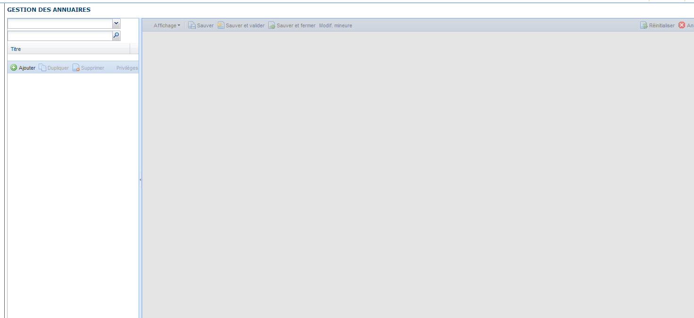
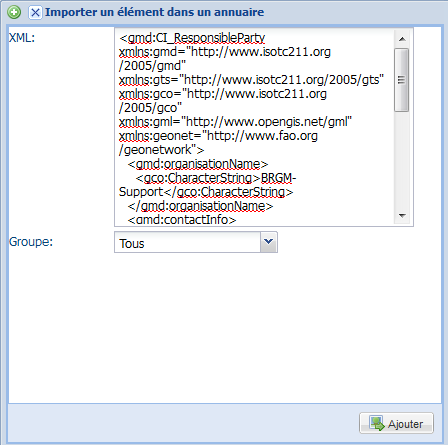
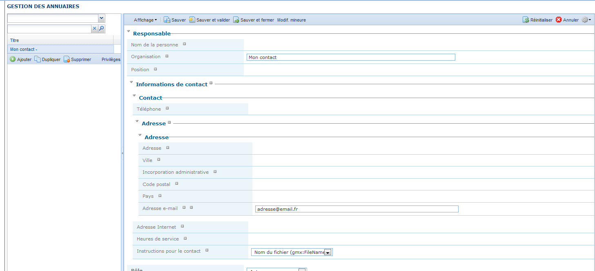

.. _Contacts:
.. include:: ../../substitutions.txt

Annuaires de contacts
#####################

Introduction
------------

L'application permet de créer des annuaires de contacts partagés. Les utilisateurs peuvent ensuite dans l'interface d'édition ajouter les informations 
associés à ces contacts (nom de l'organisme, adresse, email, ...) à leurs métadonnées.

Cette fonctionnalité permet de ne pas saisir plusieurs fois les mêmes informations dans des champs de métadonnées particuliers (responsable sur la 
ressource, sur la métadonnée, distributeur, ...).

Depuis la version 2.7.1, il est possible de créer différents types d'annuaires, correspondant à des classes particulières (CI_ResponsibleParty 
pour les contacts, chargé par défaut dans l'application). Ces annuaires sont stockés en base de données en tant que métadonnées à part entière, ce 
qui permet de gérer des priviléges sur celles-ci.

Créer un annuaire
-----------------

L'interface est disponible dans Administration puis Gestion des annuaires.

Cliquer sur Ajouter puis copier-coller un fragment XML dans la zone de texte. Sélectionner un groupe auquel rattacher cet annuaire puis cliquer sur Ajouter.

Par exemple pour un contact:

.. code-block:: xml

  <?xml version="1.0" encoding="UTF-8"?>
  <gmd:CI_ResponsibleParty xmlns:gmd="http://www.isotc211.org/2005/gmd"
  xmlns:gts="http://www.isotc211.org/2005/gts" xmlns:gco="http://www.isotc211.org/2005/gco"
  xmlns:gml="http://www.opengis.net/gml">
  <gmd:individualName>
    <gco:CharacterString>Name of the responsible person- surname, given name, title separated by a
      delimiter</gco:CharacterString>
  </gmd:individualName>
  <gmd:organisationName>
    <gco:CharacterString>Name of the responsible organization</gco:CharacterString>
  </gmd:organisationName>
  <gmd:positionName>
    <gco:CharacterString>Function performed by the responsible party</gco:CharacterString>
  </gmd:positionName>
  <gmd:contactInfo>
    <gmd:CI_Contact>
      <gmd:phone>
        <gmd:CI_Telephone>
          <gmd:voice>
            <gco:CharacterString>Telephone number at which the organization or individual may be
              contacted</gco:CharacterString>
          </gmd:voice>
          <gmd:facsimile>
            <gco:CharacterString>Telephone number of a facsimile machine for the responsible
              organization or individual</gco:CharacterString>
          </gmd:facsimile>
        </gmd:CI_Telephone>
      </gmd:phone>
      <gmd:address>
        <gmd:CI_Address>
          <gmd:deliveryPoint>
            <gco:CharacterString>Address line for the location</gco:CharacterString>
          </gmd:deliveryPoint>
          <gmd:city>
            <gco:CharacterString>City of the location</gco:CharacterString>
          </gmd:city>
          <gmd:administrativeArea>
            <gco:CharacterString/>
          </gmd:administrativeArea>
          <gmd:postalCode>
            <gco:CharacterString>ZIP or other postal code</gco:CharacterString>
          </gmd:postalCode>
          <gmd:country>
            <gco:CharacterString>Country of the physical address</gco:CharacterString>
          </gmd:country>
          <gmd:electronicMailAddress>
            <gco:CharacterString>Address of the electronic mailbox of the responsible organization
              or individual</gco:CharacterString>
          </gmd:electronicMailAddress>
        </gmd:CI_Address>
      </gmd:address>
    </gmd:CI_Contact>
  </gmd:contactInfo>
  <gmd:role>
    <gmd:CI_RoleCode codeList="./resources/codeList.xml#CI_RoleCode" codeListValue="pointOfContact"
    />
  </gmd:role>
  </gmd:CI_ResponsibleParty>

Modifier un contact
-------------------

Sélectionner un annuaire dans la liste déroulante. Cette étape n'est pas nécessaire si un seul annuaire existe, ou si l'on souhaite rechercher dans 
l'ensemble des annuaires.

Sélectionner un contact dans le tableau de résultats. Les informations associées s'affichent dans la partie droite. L'interface d'édition des contacts 
est similaire à celle des fiches de métadonnées des jeux de données avec les éléments permettant de changer la vue en cours, de sauver, etc.

A noter qu'il n'est pas nécessaire de renseigner le rôle du contact car celui-ci devra être précisé au moment d'ajouter le contact dans l'édition d'une 
fiche de métadonnées.

Ajouter un contact
------------------

Pour ajouter un nouveau contact dans un annuaire, sélectionner un contact existant (voir ci-dessus), puis cliquer sur Dupliquer.

Il est également possible de supprimer un contact ou modifier les privilèges sur le contact sélectionné.