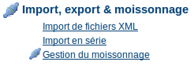

.. _batch_import:
.. include:: ../../../substitutions.txt

Import en série
===============

L'utilitaire d'import en série permet d'importer un groupe de fiches de métadonnées dans le catalogue en une seule fois.
Pour utiliser cette fonction vous devez être administrateur. Pour la lancer, allez dans la page Administration et cliquer sur le lien *Import en série* de la rubrique *Import, export & moissonnage*.

    *Détail de la rubrique Import, export & moissonnage de la page Administration*

En cliquant sur le lien, vous faites apparaitre le formulaire d'import en série.

.. figure:: web-batchimport-options.png

    *Le formulaire d'import en série*

La signification des différents champs de ce formulaire est donnée ci-dessous :

- Répertoire : Chemin complet du répertoire dont le contenu sera importé. Il est important de noter qu'il s'agit du répertoire du serveur sur lequel le catalogue s'exécute et non l'ordinateur de l'utilisateur.
- Type de fichier : Le type de fichier à importer. le catalogue peut importer les fichiers XML ou les fichiers MEF présent dans le répertoire.
- Actions à l'import : cf. :ref:`file_import` pour la description de cette option.
- Feuille de style : Cette option de spécifier une feuille de style appliquant une transformation XSL. La liste déroulante reprend les fichiers présents dans le répertoire web/xsl/conversion/import : tous les fichiers XSL que vous mettez dans ce répertoire sont présents dans cette liste. Ce processus est dynamique. Vous n'avez donc pas besoin de redémarrer le catalogue pour la mettre à jour. L'objectif de cette option est de réaliser une version des métadonnées dans un format supporté par le catalogue. Par conséquent, il est important que le format en sortie de la transformation soit compatible avec la valeur sélectionné du paramètre *Type de fichier*.
- Valider : Il s'agit d'une validation simple des métadonnées. Si cette option est cohée, le contrôle de la conformité des métadonnées au schéma de métadonnées sera réalisée.
- Groupe : Il s'agit du groupe d'utilisateurs auquel les métadonnées importées seront associées.
- Categorie : Vous pouvez associer une catégorie aux métadonnées importées afin d'en faciliter la recherche.

Les boutons suivants sont présents sous le formulaire :

- Retour : renvoie vers la page Administration sans réaliser l'import.
- Téléchargement : lance le processus d'import en série.

Lorsque le processus s'achève, le nombre total de métadonnées est affiché. Notez que l'import est un processus transactionnel : soit l'ensemble des métadonnées est importé, soit il est intégralement rejeté. Les fichiers dont le nom commence par "." ou dont le nom ne finit pas par ".xml" sont ignorés.
