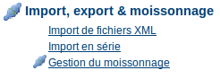
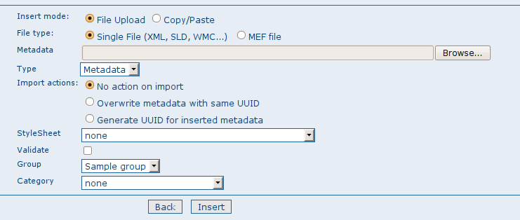

.. include:: ../../../substitutions.txt

.. _file_import:

Import unitaire
===============

L'utilitaire d'import de fichier permet d'importer des métadonnées au format XML ou MEF (cf. :ref:`mef`), d'importer un fichier 
ou un contenu issu d'un copier/coller. Pour utiliser cette fonction, vous devez être authentifié comme Editeur. 
Allez dans la page Administration et cliquez sur le lien *Import de métadonnées*.

En cliquant sur le lien, vous faites apparaitre le formulaire d'import de métadonnées. Le paramétrage de ce formulaire est différent pour chaque type d'import :

Import d'un fichier
-------------------

    *Le formulaire pour l'import d'un fichier XML*

- Actions à l'import : Pour les fichiers XML et MEF, vous devez choisir une action à réaliser lors de l'import parmi les suivantes :
    - *Aucune action à l'import*,
    - *Ecraser les métadonnées de même identifiant* : l'ancienne fiche de métadonnées sera effacée et remplacée par la fiche de métadonnées importée,
    - *Générer un nouvel identifiant pour les métadonnées insérées* : cette option affectera un nouvel identifiant à la fiche de métadonnées importée.
- Feuille de style : Cette option de spécifier une feuille de style appliquant une transformation XSL. La liste déroulante reprend les fichiers présents dans le répertoire web/xsl/conversion/import : tous les fichiers XSL que vous mettez dans ce répertoire sont présents dans cette liste. Ce processus est dynamique. Vous n'avez donc pas besoin de redémarrer le catalogue pour la mettre à jour. L'objectif de cette option est de réaliser une version des métadonnées dans un format supporté par le catalogue. Par conséquent, il est important que le format en sortie de la transformation soit compatible avec la valeur sélectionné du paramètre *Type de fichier*.
- Valider : Il s'agit d'une validation simple des métadonnées. Si cette option est cohée, le contrôle de la conformité des métadonnées au schéma de métadonnées sera réalisée.
- Groupe : Il s'agit du groupe d'utilisateurs auquel les métadonnées importées seront associées.
- Categorie : Vous pouvez associer une catégorie aux métadonnées importées afin d'en faciliter la recherche.

Copier/coller
-------------

.. figure:: xmlinsert-options.png

    *Le formulaire pour l'import de métadonnées issues d'un copier/coller*

Dans le cas d'un import de données par copier/coller, les options sont identiques à l'import d'un fichier à l'exception du champ *Métadonnées* dans lequel vous pouvez coller directement vos métadonnées.
