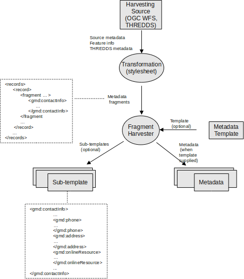
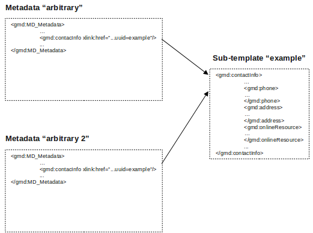
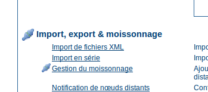
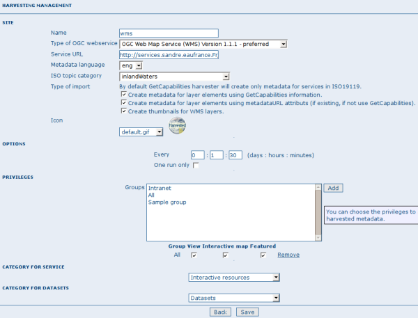
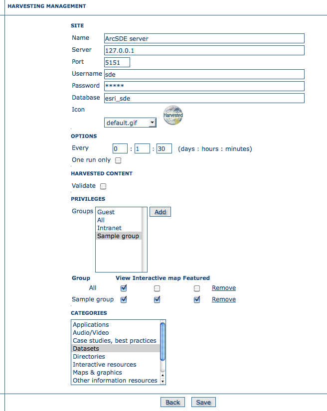
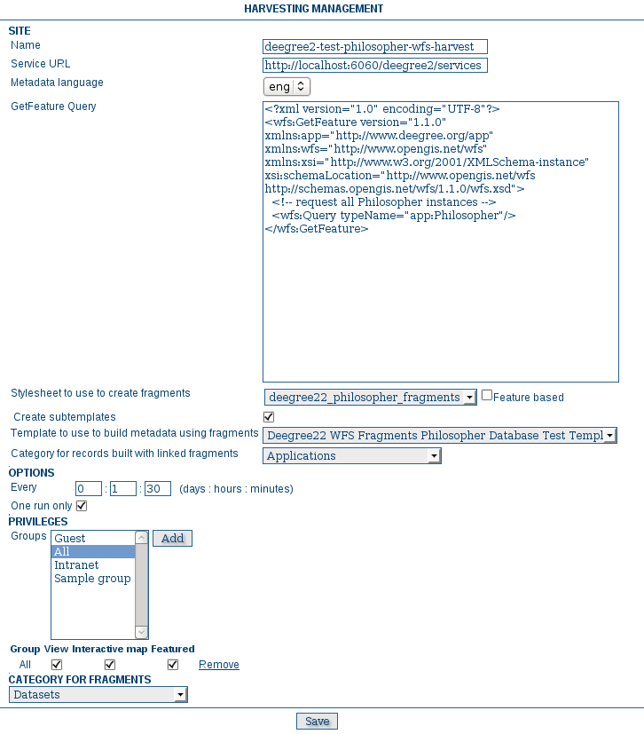
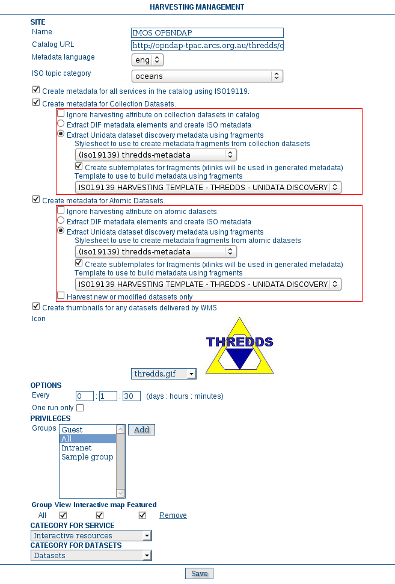
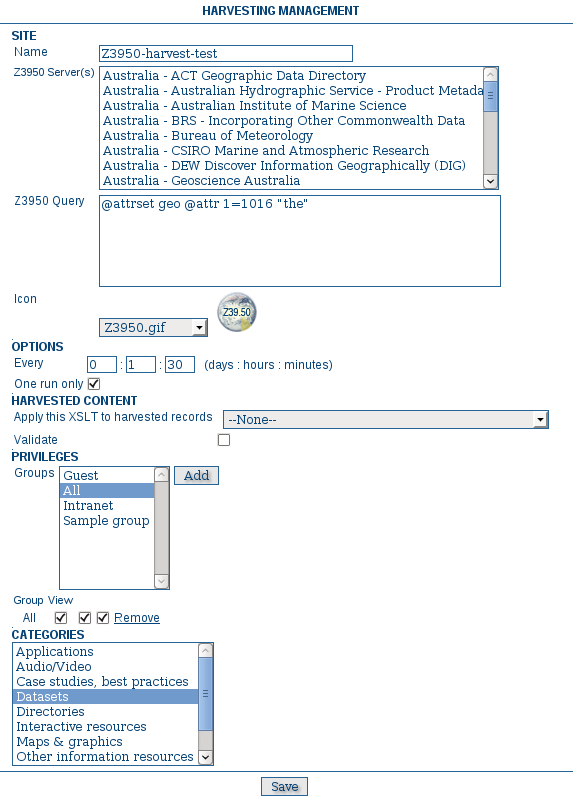

.. include:: ../../../substitutions.txt

.. _how_to_harvest:

Moissonnage
===========

Introduction
------------

Depuis le début du projet en 2000, le besoin de partage des métadonnées entre
différents nœuds était présent. En général, chaque nœud se focalise sur une région
d'intérêt, il est donc nécessaire de pouvoir réaliser des recherches sur ces
différents catalogues. Ce mécanisme est appelé recherche décentralisée et utilise le
réseau Internet. Dans notre cas, cette recherche distribuée peut être complexe à
réaliser dans le cas ou de nombreuses données et imagettes doivent être échangées.
De plus, |project_name| est fréquemment utilisé dans des régions (tel que l'Afrique,
l'Asie) où la connectivité peut être limité rendant les recherches décentralisées
impossible ou du moins délicates.

Le moissonnage et un mécanisme permettant de collecter des métadonnées sur un
catalogue distant et de les stocker sur le nœud local pour un accès plus rapide.
Cette action de moissonnage est une action périodique, par exemple, une fois par
semaine. Le moissonnage n'est pas un import simple : les métadonnées locale et celle
du catalogue distant sont synchronisées. En effet, un catalogue |project_name| est
capable de découvrir quelles sont les métadonnées ayant été ajoutée, supprimée ou
mise à jour dans le nœud distant.

|project_name| peut moissonner les ressources suivantes (pour plus de détail, voir plus
bas):

#. Un nœud |project_name| (version 2.1 ou plus).
#. Un nœud |project_name| 2.0.
#. Un serveur `WebDAV <http://fr.wikipedia.org/wiki/WebDAV>`_.
#. Un catalogue supportant CSW 2.0.1 or 2.0.2.
#. Un serveur `OAI-PMH <http://www.openarchives.org/OAI/openarchivesprotocol.html>`_.
#. Un service OGC en utilisant le document GetCapabilities. Incluant les services WMS, WFS, WPS, CSW et WCS.
#. Un serveur ESRI ArcSDE.
#. Un catalogue `THREDDS <http://www.unidata.ucar.edu/projects/THREDDS/>`_.
#. Des entités venant d'un serveur OGC WFS (Requête GetFeature).
#. Un serveur `Z3950 <http://fr.wikipedia.org/wiki/Z39.50>`_.


Présentation du mécanisme
-------------------------

Le moissonnage repose sur le concept **d'identifiant unique
(uuid)**. Cet identifiant est en effet particulier car il n'est pas
seulement unique au sein du catalogue mais dans le monde entier. Celui-ci est une
combinaison entre l'adresse MAC, la date et l'heure ainsi qu'un nombre aléatoire.
Chaque fois que vous créz des métadonnées dans |project_name|, un nouvel uuid est généré
puis assigné à la métadonnée.

Un autre concept important derrière la notion de moissonnage est la **date
de dernière mise à jour**. Chaque fois que vous modifiez une
métadonnée, la date est mise à jour. En comparant cette information, il est possible
de savoir si la métadonnée a été mise à jour.

Ces deux concepts permettent à |project_name| de récupérer les métadonnées distantes,
vérifier leur mise à jour et les supprimer si elles ont été supprimées. Par
ailleurs, grâce aux identifiants uniques, une hiérarchie de nœuds peut être
moissonnée où un nœud B moissonne un nœud C C et un nœud A moissonne B. Des boucles
peuvent être créées car les métadonnées moissonnées ne peuvent pas être modifiées.

A noter, qu'il est possible de rendre les métadonnées moissonnées éditables en sélectionnant
cette option dans l'interface de configuration du catalogue (cf. :ref:`configuration_system`).

Cycle de vie du moissonnage
---------------------------

Lors de la configuration d'un nœud, il n'y a pas de métadonnées. Pendant la
première itération, toutes les métadonnées qui correspondent au paramétrage sont
récupérées et stockées localement. Ensuite, seulement les changements sont
retournés. Les métadonnées moissonnées ne sont pas éditables :

#. Le moissonnage est périodique donc les changements sur le nœud local seraient perdus.
#. La date de mise à jour est utilisée pour garder trace des changements, à chaque édition elle est mise à jour en dehors du site originel, le mécanisme de moissonnage serait compromi.

Au delà des métadonnées, ceci implique que l'utilisateur ne peut pas changer les
autres propriétés (catégories, privilèges etc...).

Le moissonnage fonctionne jusqu'à rencontrer un des cas suivantes :

#. Un administrateur arrête le nœud.
#. Une exception.

Lorsqu'un nœud est supprimé, toutes les métadonnées associées sont également
supprimées.

Moissonnages multiples et hiérarchie
------------------------------------

Les catalogues fournissant des identifiants uniques (par exemple un nœud
|project_name| et un serveur CSW) peuvent être moissonnés plusieurs fois sans craindre les
doublons.

Ce mécanisme permet aux différents types de moissonnage de |project_name| de réaliser
des moissonnages avec des hiérarchies complexes de nœuds. De cette façon, une
métadonnée peut être moissonnée à partir de différents nœuds. Par exemple, dans les
cas suivants :

#. Nœud (A) créé la métadonnée (a)
#. Nœud (B) moissonne (a) depuis (A)
#. Nœud (C) moissonne (a) depuis (B)
#. Nœud (D) moissonne depuis (A), (B) et (C)

Dans ce scénario, le nœud (D) aura la même métadonnée (a) à partir des 3 nœuds
(A), (B), (C). La métadonnée va remonter dans le nœud (D) en suivant 3 voies
différentes mais les uuid permettent de stocker une seule copie. Lorsque la
métadonnée (a) change au sein du nœud (A), une nouvelle version remonte au nœud
(D) mais, en utilisant la date de mise à jour, la copie dans le nœud (D) sera mise
à jour avec la version la plus récente.

Autres remarques
----------------

Principes
`````````

#. Le moteur de moissonnage ne stocke pas les métadonnées.
#. Un changement des paramètres du moissonnage (par exemple les privilèges et catégories) sera pris en compte au prochain moissonnage.

Moissonnage de catalogue |project_name|
```````````````````````````````````````

#. Au cours du moissonnage, les icônes sont moissonnées et les copies locales mises à jour. Les icônes sont également propagées aux autres nœuds.
#. L'identifiant unique des métadonnées est récupéré dans le fichier info.xml du format MEF. Tout uuid stocké dans les métadonnées est remplacé par celui-ci.

Moissonnage de répertoire WebDAV
````````````````````````````````

#. La même métadonnée peut être moissonnée plusieurs fois sur différents nœuds. Cependant, ce n'est pas une bonne pratique car chaque copie auront un uuid différent et le système se rempliera de la même copie de métadonnées.

Moissonnage de service CSW
``````````````````````````

#. Si le champ dct:modified est absent de la réponse GetRecords la métadonnées sera toujours moissonnée.
#. Toute exception ayant lieu lors de l'opération getRecordById est annulée et la métadonnée passée.

Moissonnage de serveur OAI-PMH
``````````````````````````````

#. L'identifiant du serveur distant doit être un uuid. Dans le cas contraire, la métadonnée peut être moissonnée mais des problèmes peuvent se produire dans le cas de hiérarchie.
#. Au cours du moissonnage, |project_name| essaye de détecter automatiquement le schéma de chaque métadonnée. Si le schéma est inconnu, la métadonnée n'est pas importée.

Moissonnage de service OGC
``````````````````````````

#. Chaque fois que le moissonnage fonctionne, |project_name| supprime les informations moissonnées auparavant et en crée de nouvelles. |project_name| génére les identifiants pour toutes les métadonnées (aussi bien pour les services que les données). Cependant, pour les données, si la métadonnée est créée en utilisant document XML distant si un attribut MetadataUrl est présent dans le document GetCapability), l'identifiant de ce document est conservé.
#. Les imagettes sont générées pour les services WMS uniquement. Le service doit de plus supporter la projection WGS84.


Catalogue THREDDS
`````````````````

#.  A chaque lancement, il y a suppression des fragments/métadonnées puis création.

Entités OGC WFS (Requête GetFeature)
````````````````````````````````````

#.  Au premier lancement, des nouveaux enregistrements sont créés avec des XLinks vers les fragments.
#.  Ensuite, à chaque moissonnage, suppresion et création

Serveur Z3950
`````````````

#.  A chaque lancement, suppression puis création

Moissonnage de fragments de métadonnées
`````````````````````````````````````````

Tous les types de moissonnage à l'exception de THREDDS et entités OGC WFS générent des fiches de métadonnée complète. 
C'est à dire, les informations moissonnées sont utilisées pour constituer un enregistrement complet de métadonnée
qui est inséré dans le catalogue.
Cependant, il est fréquent que le contenu moissonné ne soit qu'une portion de métadonnée nécessaire à la description d'une
ressource.
Par exemple, un utilisateur peut ne vouloir moissonner que les étendues et/ou les information sur les contacts à partir d'un
entrepôt externe. Pour cela, le moissonnage d'entité via WFS ou via THREDDS, permet le moissonnage de fraguments qui peuvent
par la suite être associés à une métadonnée. Les fragments peuvent être sauvegarder directement dans le catalogue en tant
que sous-modèles ou utilisés comme un enregistrment complet.




        Moissonnage de fragment de métadonnées


Les métadonnées sont générées par l'insertion de fragment ou lien vers les sous-modèles.

Comme présenté ci-dessus, un exemple de fragment est l'élément gmd:contactInfo d'une métadonnée iso19139.
Cet élément contient les informations sur un individu ou une organisation. Si un fragment est stocké
dans la base du catalogue en tant que sous-modèle, celui-ci peut être référencé dans différents enregistrements
associés à ce contact en utilisant le mécanisme des XLinks.

Un exemple est présenté ci-dessous :




La page principale
------------------

Pour accéder à l'interface de configuration du moissonnage, vous devez vous
identifier en tant qu'administrateur. A partir de la page d'administration, cliquer
sur le lien Gestion du moissonnage.



  **Interface de configuration du moissonnage**

L'interface ci-desous apparait :

.. figure:: web-harvesting-list.png

  **La page de moissonnage**

Elle présente la liste des nœuds moissonnés qui ont été créés. Au
bas de la page, les buttons permettent de gérer les actions des nœuds. La
définition des colonnes est la suivante :

#. **Sélectionner**: Case à cocher pour la sélection d'un nœud. Fonction des actions lancées (Activer, Désactiver, Lancer, ...), le nœud sélectionné sera impacté. Par exemple, si vous sélectionnez 3 nœuds, ceux là seront supprimés.
#. **Nom**: Nom du nœud tel que défini par l'administrateur.
#. **Type**: Type de nœud (|project_name|, CSW, WebDav, ...).
#. **Status**: Cf. `Icônes représentant les différents états`_.
#. **Erreur**: Status du dernier moissonnage joué. Les informations sur le moissonnage (nombre de résultats, ajouts, suppression sont disponibles dans l'infobulle de l'icône). Cf. `Icônes pour les erreurs`_.
#. **Fréquence (j:h:m)**: Fréquence de moissonnage.
#. **Dernière exécution**: Date du dernier moissonnage.
#. **Opération**: Opérations possibles sur le nœud dont l'édition des propriétés.

Le bas de la page présente deux rangés de bouttons. La première ligne peuvent
réaliser des actions sur un ou plusieurs nœuds. Vous pouvez sélectionner les nœuds
en utilisant les case à cocher dans la première colonne et presser sur le bouton
correspondant à l'action souhaitée. Lorsque le bouton termine son action, la case à
cocher est désactivée. La deuxième ligne contient des boutons correspondant à des
actions générales. Les actions possibles sont les suivantes :

Activer : Lors de la création d'un nœud, son état est
**inactif**. L'utilisation de ce bouton le rend
**actif** et permet de commencer le moissonnage du nœud distant.
Désactiver permet l'arrêt du moissonnage périodique du nœud. Ceci ne signifie pas
qu'un moissonnage en cours sera arrêté mais que le nœud sera ignoré lors des
moissonnages futurs. Lancer permet de réaliser le moissonnage immédiatement. Ceci
permet de tester facilement les paramètres de configuration d'un nœud. Supprimer
permet la suppression d'un ou plueiurs nœuds. Un message demande confirmation avant
suppression. Retour permet de retourner à la page d'administration. Ajouter permet
la création d'un nouveau nœud. Rafraîchir permet de mettre à jour la liste des
nœuds et leur état.

.. |fcl| image:: icons/fileclose.png
.. |clo| image:: icons/clock.png
.. |exe| image:: icons/exec.png

.. _Icônes représentant les différents états:

=====    ========    =======================================================
Icône    Status      Description
=====    ========    =======================================================
|fcl|    Inactif     Le moissonnage est désactivé pour ce nœud.
|clo|    Actif       Le moteur de moissonnage attend la prochaine exécution
                     pour ce nœud. Lorsque l'heure est arrivée, le
                     moissonnage est lancé.
|exe|    En cours    Le moteur de moissonnage est en cours, récupérant les
                     métadonnées depuis le nœud distant. Lorsque le
                     processus est terminé, l'état revient à actif.
=====    ========    =======================================================

**Icônes représentant les différents états**

.. _Icônes pour les erreurs:

.. |ok| image:: icons/button_ok.png
.. |imp| image:: icons/important.png

=====    ==============================================================
Icône     Description
=====    ==============================================================
|ok|     Le moissonnage s'est bien déroulé, pas d'erreur rencontrée.
         Dans ce cas, une info bulle présente une synthèse du
         moissonnage (nombre de métadonnées ...).
|imp|    Le moissonnage a été annulé suite à une erreur. L'info bulle
         présente alors l'erreur rencontrée.
=====    ==============================================================

**Icônes pour les erreurs**


Info-bulle présentant les résultats du moissonnage
``````````````````````````````````````````````````

Si le moissonnage s'est déroulé correctement, une info-bulle présente les
informations détaillée au sujet du processus. De cette façon il est possible de
vérifier que le moissonneur a fonctionné ou s'il y a des paramètres à préciser.
L'info bulle est un tableau présentant :

- Total est le nombre total de métadonnées trouvées dans le nœud distant. Les métadonnées avec le même identifiant sont considérées comme une seule.
- Ajoutés correspond au nombre de métadonnées ajoutées au système car elle n'était pas présente localement.
- Supprimés correspond au nombre d'enregistrement supprimés car non présent dans le nœud distant.
- Mis à jour indique le nombre de métadonnées mises à jour du fait d'un changement de date de dernière mise à jour.
- Inchangés présente le nombre de métadonnées non modifiées.
- Schéma inconnu indique le nombre de métadonnées non intégrées du fait d'un schéma non reconnu par |project_name|.
- Irrécupérables correspond à des erreurs de transfert d'information lors du moissonnage.
- Mauvais format correspond à des métadonnées ayant un document XML invalide.
- Validation correspond aux métadonnées invalides par rapport à leur schéma.

Types d'information selon le type de moissonnage
^^^^^^^^^^^^^^^^^^^^^^^^^^^^^^^^^^^^^^^^^^^^^^^^

=====================================   ==========  ======     ======   =======  ===========  ================  =======  ===============
Informations par type de moissonnage    GeoNetwork  WebDAV     CSW      OAI-PMH  OGC Service  OGC WFS Features  THREDDS  Z3950 Server(s)
=====================================   ==========  ======     ======   =======  ===========  ================  =======  ===============
Total                                   |ok|        |ok|       |ok|     |ok|     |ok|         |ok|              |ok|     |ok|
Ajoutés                                 |ok|        |ok|       |ok|     |ok|     |ok|                                    |ok|
Supprimés                               |ok|        |ok|       |ok|     |ok|     |ok|                                    |ok|
Mis à jour                              |ok|        |ok|       |ok|     |ok|                                             |ok|
Inchangés                               |ok|        |ok|       |ok|     |ok|                                             |ok|
Schéma inconnu                          |ok|        |ok|       |ok|     |ok|     |ok|                                    |ok|
Irrécupérables                          |ok|        |ok|       |ok|     |ok|     |ok|                           |ok|     |ok|
Mauvais format                                      |ok|                |ok|                                             |ok|
Non valides                                         |ok|                |ok|                  |ok|                       |ok|
Imagettes                                                                        |ok|                           |ok|
Utilisation de MetadataURL                                                       |ok|
Services ajoutés                                                                                                |ok|
Collections ajoutées                                                                                            |ok|
Atomics ajoutés                                                                                                 |ok|
Fragments ajoutés                                                                             |ok|              |ok|
Sub-templates ajoutés                                                                                           |ok|
Fragments supprimés                                                                           |ok|              |ok|
Sub-templates supprimés                                                                                         |ok|
Fragments avec schéma inconnu                                                                 |ok|              |ok|
Fragments retournés                                                                           |ok|              |ok|
Fragments avec correspondance                                                                 |ok|              |ok|
Jeux de données existants                                                                                       |ok|
Enregistrements construits                                                                    |ok|              |ok|
Echecs d'insertion                                                               |ok|                                    |ok|
=====================================   ==========  ======     ======   =======  ===========  ================  =======  ===============


Ajouter de nouveaux nœuds
-------------------------

Le bouton ajouter de la page principale permet l'ajout de nouveaux nœuds. En
cliquant sur ce bouton, vous accédez à la page présentée ci-dessous :

.. figure:: web-harvesting-add.png

  **Ajouter un nouveau nœud**

Lors de la création d'un nouveau nœud, vous
devez choisir le type de moissonnage du serveur distant. Les protocoles supportés
sont les suivants :

#. |project_name| est le protocole le plus avancé utilisé dans |project_name|. Celui-ci permet de se connecter à un nœud distant et de réaliser une recherche utilisant les critères de recherche et importer les métadonnées correspondantes. De plus, ce protocol permet de transférer les privilèges et les catégories des métadonnées moissonnées si ils existent localement. Notez que depuis la version 2.1 de |project_name| protocole de moissonnage s'est amélioré. Il n'est pas possible de moissonner les anciennes version de |project_name|.
#. Web DAV permet d'utiliser les répertoires Web DAV (Distributed Authoring and Versioning) . Il peut être pratique pour des utilisateurs souhaitant publier leurs métadonnées via un serveur web supportant l'interface DAV. Le protocole permet de récupérer le contenu d'une page (la liste des fichiers présent sur le webdav) avec leur date de mise à jour.
#. CSW correspond à **Catalogue Services for the Web** et est une interface de recherche pour les catalogues développé par l'Open Geospatial Consortium. |project_name| est compatible avec la version 2.0.1 et 2.0.2 de ce protocole.
#. Ancienne version de |project_name| permet de moissonner d'ancien nœud |project_name| car depuis la version 2.1 le mécanisme de moissonnage a fortement évolué. Un catalogue en version 2.0 peut toujours moissonner un catalogue en version 2.1 mais un catalogue 2.1 doit utiliser ce protocole pour moissonner un ancien nœud. Ce mécanisme est conservé tant que les versions 2.1 et sup. ne sont pas largement déployée.
#. L'acronyme OAI-PMH correspond à **Open Archive Initiative Protocol for Metadata Harvesting**. C'est un protocole largement utilisé. |project_name| est compatible avec la version 2.0 de ce protocole.
#. ArcSDE
#. Un catalogue THREDDS décrit des inventaires de données. Leur organisation est hiérarchique, 
    Les jeux de données sont en général au format netCDF, mais pas seulement. Le moissonnage récupére
    les métadonnées de données et les métadonnées de services.
#. Entité OGC WFS Metadata peut être utilisé au dessus d'une base relationnelle.
    En accédant à la base relationnelle avec un WFS, il est possible d'extraire des informations avec un mécanisme
    standard d'interrogation. Ce mécanisme permet de décrire la requête GetFeature et la correspondance des informations
    vers le standard de métadonnée.
#. Serveur Z3950

.. note :: La configuration des serveurs Z3950 doit être faite dans ``INSTALL_DIR/web/geonetwork/WEB-INF/classes/JZKitConfig.xml.tem``

La liste déroulante présente la liste des protocoles disponibles. En cliquant sur
Ajouter, vous accédez la page d'édition des paramètres qui dépend du type de
protocole choisi. Le bouton retour permet de revenir à la page principale.


Ajouter un nœud |project_name|
``````````````````````````````

Ce type de moissonnage permet de se connecter à un catalogue et |project_name| et
de réaliser des recherches simples. La recherche permet ainsi d'obtenir les
métadonnées utiles uniquement. Une fois le nœud ajouté, vous accédez à la page
suivante :

.. figure:: web-harvesting-gn.png

  **Paramètre pour les nœuds de type |project_name|**

La définition des paramètres est la suivante :

* Site : permet d'attribuer un nom au nœud moissonné en précisant le nom d'hôte, le port et le nom du servlet (en général |project_name|). Si vous souhaitez accéder à des métadonnées protégées, vous devez spécifier un compte utilisateur.
* Recherche : les paramètres présentés correspondent à ceux disponibles dans l'interface de recherche du catalogue. Avant de paramètrer cette information vous devez vous rappeler qu'un catalogue |project_name| peut moissonner de manière hierarchique et donc que les catalogues sont susceptibles de contenir à la fois leur métadonnée mais aussi celles moissonnées à partir d'autres nœuds. Le bouton obtenir les sources permet d'avoir la liste des nœuds du catalogue distant. Une fois obtenu, vous pouvez donc restreindre votre recherche à cette source uniquement. Sinon la recherche portera sur l'ensemble des métadonnées (moissonnées ou non). Il est possible d'ajouter plusieurs critères de recherche avec le bouton ajouter. Les recherches seront réalisées et les résultats conbinés. Le bouton à la gauche du bloc de critère permet la suppresion de chaque bloc. Si aucun critère n'est défini, la recherche récupérer l'ensemble du catalogue distant. La section Option correspond aux options générales.

- Options :
    - Fréquence : permet de définir l'interval entre chaque itération du moissonnage. Elle peut être défini entre 1 min et 100 jours maximum.
    - Une seule exécution : permet de faire la recherche une fois et de désactiver le moissonnage ensuite.
- Privilèges : permet de définir les privilèges selon les groupes. Il est possible de copier des privilèges pour chaque groupe. Le groupe Intranet n'est pas pris en compte car ça n'a pas de sens de copier les privilèges pour ce groupe.
    - Le groupe Internet a des privilèges différents :
        - Copier : copier les privilèges.
        - Copier pour le groupe Intranet : Les privilèges sont copiés mais pour le groupe Intranet. De cette façon les métadonnées ne sont pas publiques.
        - Ne pas copier : Les privilèges ne sont pas copiés et les métadonnées ne seront pas publiques.
    - Pour les autres groupes :
        - Copier : Les privilèges sont copiés uniquement si un groupe ayant exactement le même nom existe dans le catalogue.
        - Créer et copier : Les privilèges sont copiés. Si le groupe n'existe pas, celui-ci est également créé.
        - Ne pas copier : Les privilèges ne sont pas copiés.

En bas de page le bouton retour permet de revenir à la page de configuration
du moissonnage. Le bouton sauver permet de sauver la configuration en cours.
Lors de la création d'un nœud, le nœud sera créé lors de cette action de
sauvegarde.

Ajouter un nœud de type Web DAV
````````````````````````````````

Dans ce cas, les métadonnées sont récupérées depuis une page web. Les options
disponibles se présentent de la manière suivante :

.. figure:: web-harvesting-webdav.png

  **Ajouter un nœud de type Web DAV**

La section site donne les informations de connexion :

Le nom permet d'attribuer un nom au nœud distant L'URL correspond à l'URL du
répertoire Web DAV Pour chaque fichier ayant une extension .xml sera considéré
comme une métadonnée et sera importé. L'icône permet d'assigner une icône aux
métadonnées moissonnées . Celle-ci sera visible dans les résultats de recherche.
La section compte utilisateur permet de définir les paramétres d'identification
nécessaire à une authorisation basique HTTP. Les options générales sont :

Les paramètres fréquence et une seule éxecution sont présentés dans le type de
moissonnage |project_name|. L'option valider permet de valider les métadonnées
pendant l'import. Si la validation est réussie, la métadonnée est importée sinon
elle est rejetée. Lorsque le moteur de moissonnage rencontre un répertoire, il
parcourt le répertoire si l'option récursif est sélectionnée. Les privilèges
peuvent être assignés aux différents groupes du catalogue locale. Pour cela,
sélectionnez un ou plusieurs groupes, cliquez sur ajouter puis définissez les
privilèges pour chacun. La section catégories permet d'attribuer une catégorie à
l'ensemble des métadonnées récupérées.

En bas de page le bouton retour permet de revenir à la page de configuration
du moissonnage. Le bouton sauver permet de sauver la configuration en cours.
Lors de la création d'un nœud, le nœud sera créé lors de cette action de
sauvegarde.


Ajouter un nœud de type CSW
````````````````````````````

Ce type permet de se connecter à un catalogue supportant le protocle CSW . Les
métadonnées doivent avoir un schéma connu par |project_name|. L'illustration ci-dessous présente les options de configuration :

.. figure:: web-harvesting-csw.png

  **Ajouter un nœud de type CSW**

Le site permet de définir les paramètres de connexion de la même manière que
pour le type Web DAV . Dans ce cas, l'URL pointe vers le document
GetCapabilities du serveur CSW. Ce document permet d'obtenir les adresses pour
réaliser les recherches distantes. 

Quelques exemples d'URL CSW GetCapabilities :

 - FAO : http://www.fao.org/geonetwork/srv/en/csw?version=2.0.2&service=CSW&REQUEST=GetCapabilities

 - Géocatalogue : http://www.geocatalogue.fr/api-public/servicesRest?version=2.0.2&service=CSW&REQUEST=GetCapabilities
 
 - Cartorisque : http://www.mongeosource.fr/geosource-1033/srv/fr/csw?version=2.0.2&service=CSW&REQUEST=GetCapabilities

 - Sandre : http://services.sandre.eaufrance.fr/geonetwork_CSW/srv/fr/csw?service=CSW&version=2.0.2&request=GetCapabilities
 
 - Adélie : http://adelie.application.developpement-durable.gouv.fr/minicsw.do?REQUEST=GetCapabilities&SERVICE=CSW


Ajouter des critères de recherche de la même
manière que pour les catalogues de type |project_name| en cliquant sur le bouton
ajouter. Pour les options générales ou les catégories, reportez-vous à la
description dans la section Web DAV.

En bas de page le bouton retour permet de revenir à la page de configuration
du moissonnage. Le bouton sauver permet de sauver la configuration en cours.
Lors de la création d'un nœud, le nœud sera créé lors de cette action de
sauvegarde.

Ajouter un nœud de type OAI-PMH
````````````````````````````````

OAI-PMH est un protocole que |project_name|, en tant que client, est capable de
moissonner. Si vous demandez un format oai_dc, |project_name| le convertira en
dublin core. D'autres formats peuvent être moissonnés si et seulement si
|project_name| connait le schéma.  L'illustration ci-dessous présente
les différentes options :

.. figure:: web-harvesting-oaipmh.png

  **Ajouter un nœud de type OAI-PMH**

Pour la section site les options sont les mêmes que pour le moissonnage de
type web DAV. La seule différence est que l'URL pointe vers le serveur OAI.
Cette URL est le point d'entrée pour les commandes PMH que |project_name| exécute.
La section recherche permet de définir les critères de recherche. Plusieurs
recherches peuvent être renseignée. et les résultats combinés. Dans chaque
recherche, les paramètres suivants peuvent être définis :

La date de début et de fin correspondant à la date de mise à jour des
métadonnées. Pour cela utiliser le calendrier en cliquant sur l'icône pour le faire
apparaître. Ce champ est optionel. Utiliser l'icône pour effacer le critère.
Jusqu'à fonctionne de la même manière mais ajoute un contraint sur la date de
dernier changement. Les ensembles permettent de classifier les métadonnées dans
des groupes hierarchiques. Vous pouvez donc filtrer les métadonnées
n'appartenant qu'à un seul ensemble (et ses sous-ensembles). Par défaut, un
option vide définie **aucun ensemble**. En cliquant sur obtenir
des information vous pouvez obtenir la liste des ensembles ainsi que la liste
des préfixes. La notion de préfixe détermine ici le format de métadonnée. Le
préfixe oai_dc est obligatoire pour les serveurs OAI-PMH..

Vous pouvez utiliser le bouton ajouter pour ajouter des critères de
recherches. Les options, les privilèges et les catégories sont similaires aux
autres type de moissonnage.

En bas de page le bouton retour permet de revenir à la page de configuration
du moissonnage. Le bouton sauver permet de sauver la configuration en cours.
Lors de la création d'un nœud, le nœud sera créé lors de cette action de
sauvegarde.

Noter que lors d'un retour à la page édition, les listes sur les
**ensembles** et les **préfixes** sont
vides. Elles ne contiendront que les entrées précédemment sélectionnées. Vous
devez cliquer sur le bouton obtenir les info pour récupérer l'ensemble des
valeurs possibles.

Ajouter un nœud de type service OGC (ie. WMS, WFS, WCS, WPS, CSW)
`````````````````````````````````````````````````````````````````

Un service OGC implément une opération GetCapabilities que |project_name|, en tant
que client, peut utiliser pour produire des métadonnées. Le document
GetCapabilities fourni des informations sur le service et les données
(layers/feature types/coverages/process) diffusées. |project_name| converti ces
données au format ISO19139/119.  L'illustration ci-dessous présente
les différentes options :



  **Ajouter un nœud de type service OGC (ie. WMS, WFS, WCS, WPS)**

La section site permet de définir le nom. Le type de service OGC indique au
moteur de moissonnage le type de version pour le service. Les types supportés
sont WMS (1.0.0 et 1.1.1), WFS (1.0.0 et 1.1.0, WCS (1.0.0) et WPS (0.4.0 et
1.0.0). L'URL du service est l'URL permettant de se connecter au service (sans
paramètres tel que "REQUEST=GetCapabilities", "VERSION=", ...). Cette url doit
être valide http://your.preferred.ogcservice/type_wms. La langue des métadonnées
doit être spécifiée étant donnée qu'aucune information n'est disponible sur ce
point dans un document GetCapabilities. Cette langue sera la langue par défaut
des métadonnées. Elle doit correspondre à la langue utilisée par
l'administrateur du service OGC. Le topic ISO est ajouté à la métadonnée. Il est
recommandé d'en choisir un car ce champ est obligatoire dans le standard ISO si
le niveau de hiérarchie est "datasets".

Le type d'import permet de définir si le moissonnage doit produire seulement
une fiche de métadonnée pour le service ou si il doit également créer les
métadonnées pour chaque donnée disponible au sein du service. Pour chaque jeux
de données, la deuxième option permet d'utiliser l'attribut MetadataURL du
document GetCapabilities pour générer la métadonnée. Le document référencé dans
cet attribut doit être un document XML valide dans un format connu par
|project_name|. Pour les WMS, les imagettes peuvent être créées automatiquement.

Les icônes et les privilèges sont définis de la même manière que les autres
types de moisson.

La métadonnée du service peut être associée à une catégorie (en générale
"interactive resources"). Pour chaque données, il est également possible de
choisir une catégorie.


.. _arcsde_harvester:

Moissonner un serveur ArcSDE
````````````````````````````

The ArcSDE harvester allows harvesting metadata from an ArcSDE installation. ArcSDE java API libraries are required to be installed by the user in |project_name| (folder ``INSTALL_DIR/web/geonetwork/WEB-INF/lib``), as these are proprietary libraries not distributed with |project_name|: 
    
    - jpe_sdk.jar
    - jsde_sdk.jar
    
.. note :: dummy-api-XXX.jar must be removed from ``INSTALL_DIR/web/geonetwork/WEB-INF/lib``

The harvester identifies the ESRI metadata format: ESRI ISO, ESRI FGDC to apply the required xslts to transform metadata to ISO19139



    *Adding an ArcSDE harvesting node*

Configuration options:

- **Site** 

    - *Name* - This is a short description of the node. It will be shown in the harvesting main page.  
    - *Server* - ArcSde server IP or name
    - *Port* - ArcSde service port (typically 5151)
    - *Username* - Username to connect to ArcSDE server
    - *Password* - Password of the ArcSDE user
    - *Database name* - ArcSDE instance name (typically esri_sde)

- **Options** - Same as for WebDAV harvesting. 
- **Privileges** - Same as for WebDAV harvesting. 
- **Category for service** - Metadata for the harvested service is linked to the category selected for the service (usually "interactive resources").
- **Category for datasets** - For each dataset, the "category for datasets" is linked to each metadata for datasets.


.. _wfs_harvesting:

Moissonnage d'entité via OGC Web Feature Service
````````````````````````````````````````````````

An OGC web feature service (WFS) implements a GetFeature query operation that returns data in the form of features (usually rows from related tables in a relational database). |project_name|, acting as a client, can read the GetFeature response and apply a user-supplied XSLT stylesheet to produce metadata fragments that can be linked into a user-supplied template to build metadata records.



        *Adding a Metadata Fragments from OGC WFS harvester node*

The available options are:

- **Site**

 - *Name* - This is a short description of the node. It will be shown in the harvesting main page.
 - *Service URL* - The bare URL of the WFS service (no OGC params required)
 - *Metadata language* - The language that will be used in the metadata records created by the harvester
 - *GetFeature Query* - The OGC WFS GetFeature query used to extract features from the WFS.
 - *Stylesheet used to create fragments* - User-supplied stylesheet that transforms the GetFeature response to a metadata fragments document (see below for the format of that document).
 - *Feature based* - Check this box if you expect the WFS GetFeature response to be large (>10MB). If checked, the GetFeature response will be saved to disk in a temporary file. Each feature will then be parsed from the temporary file and used to create the fragments and metadata records. If not checked, the response will be held in RAM.
 - *Create subtemplates* - Check this box if you want the harvested metadata fragments to be saved as subtemplates in the metadata catalog and xlink'd into the metadata template (see next option). If not checked, the fragments will be copied into the metadata template.
 - *Template to use to build metadata using fragments* - Choose the metadata template that will be combined with the harvested metadata fragments to create metadata records. This is a standard |project_name| metadata template record.
 - *Category for records built with linked fragments* - Choose the metadata template that will be combined with the harvested metadata fragments to create metadata records. This is a standard |project_name| metadata template record.

- **Options** - Same as for WebDAV harvesting. 
- **Privileges** - Same as for WebDAV harvesting. 
- **Category for fragments** - When fragments are saved to |project_name| as subtemplates they will be assigned to the category selected here.

The structure of the metadata fragments document that your XSLT must produce from the GetFeature response is shown below.

.. figure:: web-harvesting-metadatafragmentsdocument.png

        *An example metadata fragments document produced by a user-supplied XSLT*

Within the root <record> element there can be zero to many <record> elements.  When generating metadata, each record element will result in the generation of one metadata document, otherwise, the <record> element is used to group metadata fragments as required only (e.g. fragments generated for a dataset or feature).

Within a <record> element there can be zero to many <fragment> elements and zero to many <replacementGroup> elements.  A <replacementGroup> element can itself contain zero to many <fragment> elements.  Ordering of <fragment> elements and <replacementGroup> elements within a <record> or <replacementGroup> element is not important.

<fragment> elements contain individual xml fragments.  The content of the <fragment> can be any xml element from a supported |project_name| schema with the proviso that the element must contain enough relevant metadata to allow the target schema to be identified (i.e. distinguishing namespaces).

<replacementGroup> elements have significance during metadata generation only.  They are used to group zero or more fragments for insertion into or creation of links in a copy of the metadata template used to generate the metadata.   Where the <replacementGroup> element contains no <fragment> elements, the referenced element in the template copy will be removed, otherwise it will be replaced with the contents of the fragment.

Valid attributes on these elements and their function is as follows:


==============================  ==============================  ==============================
Element                         Attribute                       Description
==============================  ==============================  ==============================
Record                          Uuid                            Uuid of the generated metadata record 
                                                                (optional - one will be assigned by the 
                                                                harvester otherwise)
Fragment                        Id                              Id of element in metadata template to 
                                                                replace/link from.  Ignored when fragment is 
                                                                within a replacementGroup.
..                              Uuid                            Uuid to use for generated subtemplate (used 
                                                                to link to this subtemplate from metadata)
..                              Title                           Title of fragment – used as title of xlink 
ReplacementGroup                Id                              Id of element in metadata template to delete,
                                                                replace or link from to contained fragments
==============================  ==============================  ==============================

Finally, two examples of how to use the Metadata Fragments from OGC WFS can be given from stylesheets and information supplied in the |project_name| install.

Deegree Version 2.2 Philosopher Database example
````````````````````````````````````````````````

.. _thredds_harvester:

Moissonner un catalogue THREDDS
```````````````````````````````

In this type of harvesting, the harvester crawls through a THREDDS catalog extracting metadata for the datasets and services described in it.


        
        *Adding a THREDDS catalog harvester node*

The available options are:

- **Site**

    - *Name* - This is a short description of the node. It will be shown in the harvesting main page.
    - *Catalog URL* - The remote URL of the THREDDS Catalog from which metadata will be harvested. This must be the xml version of the catalaog (i.e. ending with .xml).  The harvester will crawl through all datasets and services defined in this catalog creating metadata for them as specified by the options described further below.
    - *Metadata language* - Use this option to specify the language of service metadata.
    - *ISO topic category* - Use this option to specify the ISO topic category of service metadata.
    - *Create service metadata* - Select this option to generate iso19119 metadata for services defined in the THREDDS catalog and for the catalog itself.
    - *Create metadata for Collection datasets* -  Select this option to generate metadata for each collection dataset (THREDDS dataset containing other datasets).  Creation of metadata can be customised using options that are displayed when this option is selected as described further below.
    - *Create metadata for Atomic datasets* - Select this option to generate metadata for each atomic dataset (THREDDS dataset not containing other datasets – for example cataloguing a netCDF dataset).  Creation of metadata can be customised using options that are displayed when this option is selected as described further below.

        - *Ignore harvesting attribute* - Select this option to harvest metadata for selected datasets  regardless of the harvest attribute for the dataset in the THREDDS catalog.  If this option is not selected, metadata will only be created for datasets that have a harvest attribute set to true.
        - *Extract DIF metadata elements and create ISO metadata* - Select this option to generate ISO metadata for datasets in the THREDDS catalog that have DIF metadata elements.  When this option is selected a list of schemas is shown that have a DIFToISO.xsl stylesheet available (see for example INSTALL_DIR/web/geonetwork/xml/schemas/iso19139/convert/DIFToISO.xsl). Metadata is generated by reading the DIF metadata items in the THREDDS into a DIF format metadata record and then converting that DIF record to ISO using the DIFToISO stylesheet. 
        - *Extract Unidata dataset discovery metadata using fragments* - Select this option when the metadata in your THREDDS or netCDF/ncml datasets follows Unidata dataset discovery conventions. You will need to write your own stylesheets and templates to extract this metadata. When this option is selected the following additional options will be shown: 

            - Stylesheet - Select a stylesheet to use to convert metadata for the dataset (THREDDS metadata and netCDF ncml where applicable) into metadata fragments.
            - Create subtemplates - Select this option to create a subtemplate (=metadata fragment stored in |project_name| catalog) for each metadata fragment generated.
            - Template - Enter a template to be used to create complete metadata records from the metadata fragments generated for each dataset.  The generated metadata fragments are used to replace referenced elements in the templates with an xlink to a subtemplate if the *Create subtemplates* option is checked. If *Create subtemplates* is not checked, then the fragments are simply copied into the template metadata record.  

    - *Create Thumbnails* - Select this option to create thumbnails for WMS layers in referenced WMS services
    - *Icon* - An icon to assign to harvested metadata. The icon will be used when showing search results. 

- **Options** - Same as for WebDAV harvesting. 
- **Privileges** - Same as for WebDAV harvesting. 
- **Category for Service** - Select the category to assign to the ISO19119 service records for the THREDDS services.
- **Category for Datasets** - Select the category to assign the generated metadata records (and any subtemplates) to.

At the bottom of the page there are the following buttons:

- **Back** - Go back to the main harvesting page. The harvesting is not added.
- **Save** - Saves this node’s data creating a new harvesting node. After the save operation has completed, the main harvesting page will be displayed.


More about harvesting THREDDS DIF metadata elements with the THREDDS Harvester
``````````````````````````````````````````````````````````````````````````````

THREDDS catalogs can include elements from the DIF metadata standard. The Unidata netcdf-java library provides a DIFWriter process that can create a DIF metadata record from these elements. |project_name| has a DIFToISO stylesheet to transform these DIF records to ISO. An example of a THREDDS Catalog with DIF-compliant metadata elements is shown below.

.. figure:: web-harvesting-examplethreddsdifmetadata.png
        
        *A THREDDS catalog with DIF compliant metadata elements*

More about harvesting metadata fragments with the THREDDS Harvester
```````````````````````````````````````````````````````````````````

The options described above for the *Extract Unidata dataset discovery metadata using fragments* invoke the following process for each collection dataset or atomic dataset:

#. The harvester bundles up the catalog URI, a generated uuid, the THREDDS metadata for the dataset (generated using the catalog subset web service) and the ncml for netCDF datasets into a single xml document. An example is shown below.
#. This document is then transformed using the specified stylesheet (see *Stylesheet* option above) to obtain a metadata fragments document.
#. The metadata fragment harvester is then called to create subtemplates and/or metadata for the each dataset as requested

.. figure:: web-harvesting-threddsdocument.png

        *An example THREDDS dataset document created by the THREDDS fragment harvester*

Examples
````````

Two reference stylesheets are provided as examples of how to harvest metadata fragments from a THREDDS catalog. One of these stylesheets, thredds-metadata.xsl, is for generating iso19139 metadata fragments from THREDDS metadata following Unidata dataset discovery conventions. The other stylesheet, netcdf-attributes.xsl, is for generating iso19139 fragments from netCDF datasets following Unidata dataset discovery conventions. These stylesheets are designed for use with the 'HARVESTING TEMPLATE – THREDDS – DATA DISCOVERY' template and can be found in the schema 'convert' directory eg. for ISO19139 this is INSTALL_DIR/web/geonetwork/xml/schemas/iso19139/convert/ThreddsToFragments. 

A sample template 'HARVESTING TEMPLATE – THREDDS – DATA DISCOVERY' has been provided for use with the stylesheets described above for the iso19139 metadata schema. This template is in the schema 'templates' directory eg. for ISO19139, this is INSTALL_DIR/web/geonetwork/xml/schemas/iso19139/templates/thredds-harvester-unidata-data-discovery.xml.


.. _z3950_harvester:

Moissonner un serveur Z3950
```````````````````````````

In this type of harvesting, the harvester searches one or more Z3950 servers and retrieves metadata records from them.


        
        *Adding a Z3950 harvester node*

The available options are:

- **Site**

    - *Name* - This is a short description of the node. It will be shown in the harvesting main page.
    - *Z3950 Server(s)* - These are the Z3950 servers that will be searched. You can select one or more of these servers.
    - *Z3950 Query* - Specify the Z3950 query to use when searching the selected Z3950 servers. At present this field is known to support the Prefix Query Format (also known as Prefix Query Notation) which is described at this URL: http://www.indexdata.com/yaz/doc/tools.html#PQF.
    - *Icon* - An icon to assign to harvested metadata. The icon will be used when showing search results. 

- **Options** - Same for the WebDAV harvester above.
- **Harvested Content**

    - *Apply this XSLT to harvested records* - Choose an XSLT here that will convert harvested records to a different format.
    - *Validate* - If checked, records that do not/cannot be validated will be rejected.

- **Privileges** - Same as for WebDAV harvesting. 
- **Categories** - Same as for WebDAV harvesting. 

More about PQF Z3950 Queries
````````````````````````````

PQF is a rather arcane query language. It is based around the idea of attributes and attribute sets. The most common attribute set used for geospatial metadata in Z3950 servers is the GEO attribute set (which is an extension of the BIB-1 and GILS attribute sets - see http://www.fgdc.gov/standards/projects/GeoProfile). So all PQF queries to geospatial metadata Z3950 servers should start off with @attrset geo.

The most useful attribute types in the geo attribute set are as follows:

================  ==========  =================================================
@attr number      Meaning     Description
================  ==========  =================================================
1                 Use         What field to search
2                 Relation    How to compare the term specified
4                 Structure   What type is the term? eg. date, numeric, phrase 
5                 Truncation  How to truncate eg. right
================  ==========  =================================================

In |project_name| the numeric values that can be specified for @attr 1 map to the lucene index field names as follows:

====================  =============================  ================================================================================================================
@attr 1=              Lucene index field             ISO19139 element*
====================  =============================  ================================================================================================================
1016                  any                            All text from all metadata elements
4                     title, altTitle                gmd:identificationInfo//gmd:citation//gmd:title/gco:CharacterString
62                    abstract                       gmd:identificationInfo//gmd:abstract/gco:CharacterString
1012                  _changeDate                    Not a metadata element (maintained by |project_name|)
30                    createDate                     gmd:MD_Metadata/gmd:dateStamp/gco:Date
31                    publicationDate                  gmd:identificationInfo//gmd:citation//gmd:date/gmd:CI_DateCode/@codeListValue='publication'
2072                  tempExtentBegin                  gmd:identificationInfo//gmd:extent//gmd:temporalElement//gml:begin(Position)
2073                  tempExtentEnd                    gmd:identificationInfo//gmd:extent//gmd:temporalElement//gml:end(Position)
2012                  fileId                         gmd:MD_Metadata/gmd:fileIdentifier/*
12                    identifier                     gmd:identificationInfo//gmd:citation//gmd:identifier//gmd:code/*
21,29,2002,3121,3122  keyword                        gmd:identificationInfo//gmd:keyword/*
2060                  northBL,eastBL,southBL,westBL  gmd:identificationInfo//gmd:extent//gmd:EX_GeographicBoundingBox/gmd:westBoundLongitude*/gco:Decimal (etc)
====================  =============================  ================================================================================================================

Note that this is not a complete set of the mappings between Z3950 GEO profile and the |project_name| lucene index field names for ISO19139. Check out INSTALL_DIR/web/geonetwork/xml/search/z3950Server.xsl and INSTALL_DIR/web/geonetwork/xml/schemas/iso19139/index-fields.xsl for more details and annexe A of the GEO attribute set for Z3950 at http://www.fgdc.gov/standards/projects/GeoProfile/annex_a.html for more details.

Common values for the relation attribute (@attr=2):

====================  ===================================================================================
@attr 2=              Description
====================  ===================================================================================
1                     Less than
2                     Less than or equal to
3                     Equals
4                     Greater than or equal to
5                     Greater than
6                     Not equal to
7                     Overlaps
8                     Fully enclosed within
9                     Encloses
10                    Fully outside of
====================  ===================================================================================


So a simple query to get all metadata records that have the word 'the' in any field would be:

*@attrset geo @attr 1=1016 the*

A more sophisticated search on a bounding box might be formulated as:

*@attrset geo @attr 1=2060 @attr 4=201 @attr 2=7 "-36.8262 142.6465 -44.3848 151.2598"*

- @attr 1=2060 means that we are doing a bounding box search
- @attr 4=201 means that the query contains coordinate strings 
- @attr 2=7 means that we are searching for records whose bounding box overlaps the query box specified at the end of the query


