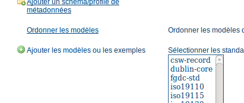
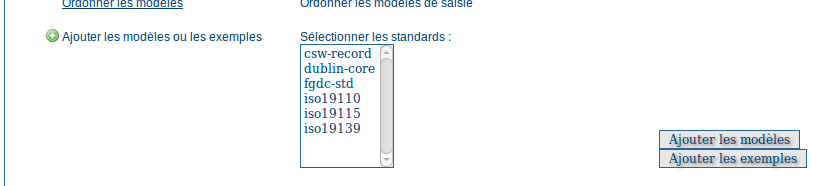
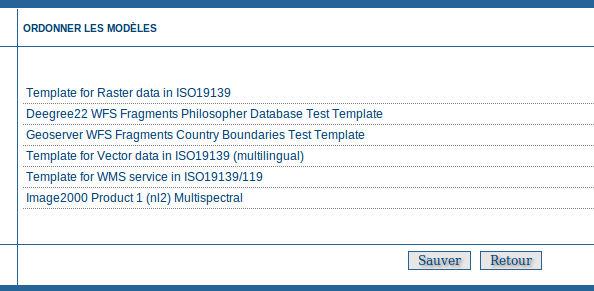
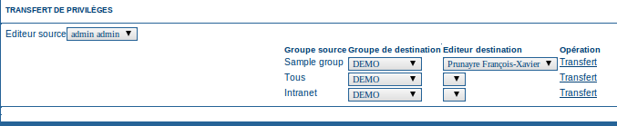
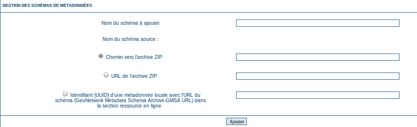

.. _templates:
.. include:: ../../substitutions.txt

Métadonnées et modèles
======================

*Modèle de métadonnées* : ressources qui servent de canevas à la création de nouvelles fiches de métadonnées.

Ajouter les modèles ou les exemples
-----------------------------------

Cette fonction permet de sélectionnées les standards de métadonnées et les modèles de métadonnées à ajouter au catalogue afin de les rendre disponibles aux éditeurs de métadonnées.

Sélectionnez les standards de métadonnées à importer et cliquez sur le bouton "Ajouter les modèles* pour les importer dans le catalogue.

Cliquez sur le bouton "Ajouter les exemples* pour importer dans le catalogue les exemples de métadonnées associés à ces standards.

Ordonner les modèles
--------------------

Cette fonction permet de réordonner les modèles de métadonnées disponibles.

Dans la page Administration, selectionner le lien *Ordonner les modèles*.
La liste des modèles disponibles est affichée en respectant l'ordre tel qu'il a été précédemment défini.
Pour modifier la position d'un des modèles, cliquez sur son nom et faites-le glisser jusqu'à sa nouvelle position.

Une fois l'ordre des modèles configuré, cliquez sur le bouton *Sauver*.
Pour annuler les modifications et revenir à la page *Administration*, cliquez sur le bouton *Retour*.

Transfert de privilèges
-----------------------

Lorsqu'un éditeur change de fonction, il est parfois nécessaire de réattribuer les métadonnées d'un éditeur vers un autre.
Pour cela, le transfert de privilèges, permet aux administrateurs de :

- sélectionner un éditeur

- pour chaque groupe source définir un groupe de destination

- pour chaque groupe de destination définir un éditeur de ce groupe

Le bouton **transfert** lance le traitement.

.. _admin_add_standard:

Ajouter un standard de métadonnée
---------------------------------

Depuis la page d'administration, le menu *Ajouter des standards* permet l'ajout dynamique (c'est à dire sans redémarrage du catalogue)
d'un standard de métadonnée. Un standard peut être un nouveau schéma XSD décrivant un format de métadonnée ou un profil ISO
(eg. profil France de métadonnée).

Un standard pour le catalogue est caractérisé par un répertoire de configuration. Celui-ci doit contenir les éléments suivants :

- schema-ident.xml : définition du standard

- schema.xsd : définition du point d'entré du schéma

- schema : fichiers XSD

- schema-substitutes.xml : définition des substitutions

- schema-suggestions.xml : définition des suggestions

- loc : fichiers de traduction

- present : XSL de présentation (pour le catalogue et le CSW)

- sample-data : données exemples au format MEF

- templates : modèles de saisie au format XML

- process : XSL de transformation (optionel)

- suggest.xsl : Définition des règles pour le mécanisme de suggestion (dépendant du répertoire process)

- schematron-rules*.xsl : règles schématron (optionel)

- extract*.xsl et set*.xsl : XSL définnissant les règles d'extraction et de définition de certaines informations (uuid, geométrie)

- convert : utilitaire

Pour l'ajout d'un standard, il est possible d'utiliser un ZIP contenant le standard à ajouter ou l'URL d'un ZIP. 
Le mécanisme par utilisation de l'UUID est expérimental.

L'ensemble des standards supportés par |project_name| en complément de ceux disponibles par défaut sont accessibles 
https://geonetwork.svn.sourceforge.net/svnroot/geonetwork/schemaPlugins/trunk.

