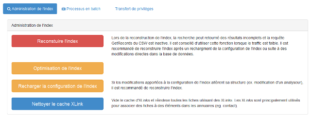
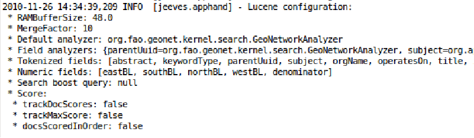
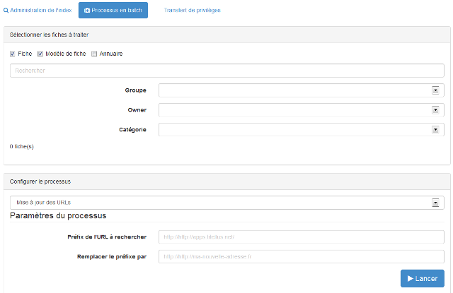
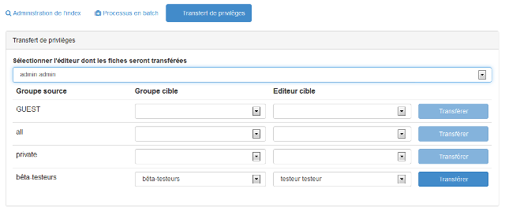

.. include:: ../../substitutions.txt

.. _outils:
Outils
======

Administration de l'index
~~~~~~~~~~~~~~~~~~~~~~~~~

A partir de la page d'administration, il est possible de réaliser les actions suivantes :

- Définir les mots vides ou à ignorer lors de l'indexation : Cette option n'est valable que si un GeoNetworkAnalyzer est utilisé
  dans la configuration de l'index (cf :ref:`lucene_index_adv`).
- Regénérer l'index du catalogue
- Optimisation de l'index Lucene
- Recharger la configuration Lucene
- Vider le cache d'XLink et reconstruire l'index

Le fichier WEB-INF/config-lucene.xsl permet une configuration fine de l'index du catalogue.

Il est possible de configurer :

- Paramètre de l'index :

 - RAMBufferSizeMB
 
 - MergeFactor
 
 - LuceneVersion
 
- Recherche

 - Calcul du score (**trackDocScores**) : Affecte les performances de recherche
 
 - Possibilité d'améliorer la pertinence des résultats en définition des "Boosters" (eg. RecencyBoostingQuery, stopwords)
 
- Indexation

 - Définition des "Analyzers" pour chaque champs
 
 - Définition des listes de mots à ignorer (stopwords)
 
 - Défintion des champs à découper lors de l'analyze
 
 - Définition des champs numérique

Il est possible de modifier à chaud (catalogue opérationnel sans redémarrage) cette configuration, 
puis de la recharger avec le bouton dans l'administration. En général après toute modification de ce fichier,
il est recommandé de regénerer l'index.

Processus en batch
~~~~~~~~~~~~~~~~~~

Le nombre de métadonnées augmentant, il est de plus en plus fréquent de devoir apporter des corrections ou améliorations aux fiches. Ce module permet de lancer sur une sélection de métadonnées des traitements pour apporter des modifications en masse (eg. corriger des URL, modifier des mots clés, remplacer des contacts).

Les différentes étapes sont les suivantes :

1. Rechercher
2. Sélectionner
3. Choisir et configurer le traitement
4. Rapport

  *Page de configuration des processus en batch*
  
  

Transfert de privilèges
~~~~~~~~~~~~~~~~~~~~~~~

Il est possible de transférer les droits associés aux certaines fiches d'un utilisateurs à un autre. Pour cela, il suffit de :

1. Sélectionner le groupe et l'utilisateur dont les fiches seront transférées
2. Sélectionner le groupe et l'utilisateur cible
3. Cliquer sur *Transférer*

