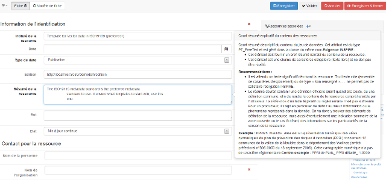
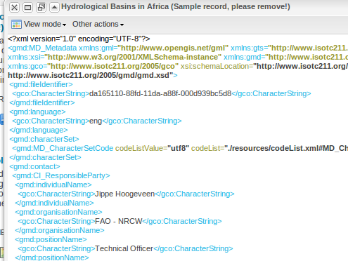
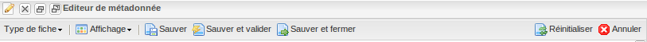

.. _editor_gui:
.. include:: ../../substitutions.txt

L'interface d'édition
=====================


.. _metadata_edit_mode:

Les vues
--------

Les vues disponibles dans l'éditeur peuvent être configurée (cf. :ref:`how_to_config_edit_mode`).
Elles sont fonctions du standard de métadonnée utilisé. Les vues pour une métadonnée
en ISO sont différentes d'une métadonnée en dublin core.

La description ci-dessous présente les vues pour les métadonnées au format ISO.

La vue par défaut
`````````````````
La vue par défaut présente l'ensemble des champs remplis dans la fiche ou le modèle
utilisé. Elle permet d'avoir une vision simple de la métadonnée par contre il
ne sera pas possible de saisir des éléments non visible. Il faut alors passer
dans un autre mode, en général le mode avancé.

Cette vue est également disponible pour les autres standards.

Dans Géosource, la vue par défaut correspond à la vue INSPIRE (cf. ci-dessous).

La vue INSPIRE ou vue découverte
````````````````````````````````
Cette vue a été mise en place en ayant pour objectif d'organiser l'éditeur
tel que présenté dans les `régles d'implémentation sur les métadonnées
de la directive INSPIRE <http://inspire.jrc.ec.europa.eu/index.cfm/pageid/101>`_.

Cette vue a été complètement revue dans la version |version|. elle a pour objectif d'être la plus simple possible, avec l'ensemble des éléments de métadonnées dans une seule et unique page.


   
   *Interface d'édition*

La vue ISO
``````````
Les 3 onglets core, minimum et all reprennent les groupes d'information définis
par la norme ISO.


La vue complète
```````````````

Cette vue permet de visualiser et éditer **l'ensemble** des descripteurs 
du standard de la métadonnée. Les onglets correspondent aux grandes sections
de l'ISO.

Cette vue se décompose de la manière suivante :

- Identification
- Distribution
- Qualité
- Informations spatiales
- Système de référence
- Informations sur les métadonnées

Les onglets suivants ont été regroupés dans un seul onglet :
- Information sur le contenu (données attributaire). Cet onglet correspond aux métadonnées ISO 19110 (catalogue d'attributs)
- Représentation
- Contraintes sur les métadonnées
- Maintenance des métadonnées
- Information sur les extensions


La vue XML
``````````

La **vue XML** montre l'ensemble du contenu de la
métadonnée dans la structure hiérarchique d'origine; La structure XML est
composée de balises, à chacune des balises doit correspondre une balise fermée. Le contenu est entièrement placé entre les
deux balises:

::

  <gmd:language>
    <gco:CharacterString>eng</gco:CharacterString>
  </gmd:language>


Cependant, l'utilisation de la vue XML requiert une connaissance minimale du
langage XML.



   *Vue XML*


Barre de menu
-------------


   
   *Barre d'outil en mode édition*
   
La barre de menu propose les actions suivantes :

- **Affichage (icône représentant un oeil)** : une des vues possible pour le standard de la métadonnée en cours d'édition (cf. :ref:`metadata_edit_mode`)
- **Type de fiche** : la fiche en cours d'édition est sauvegardée en tant que modèle ou simple métadonnée
- **Modification des privilèges de la fiche** : permet de modifier le groupe associé à la fiche ("public" permet de publier la fiche)
- **Enregistrer** : sauvegarde la fiche et recharge la page
- **valider** : sauvegarde et valide la fiche (cf. :ref:`metadata_validation`)
- **Annuler** : annule les changements effectués depuis l'ouverture de la fiche en édition
- **Enregistrer et fermer** : Sauvegarde la fiche et ferme l'interface d'édition

A noter que la sauvegarde de la fiche est effectuée automatiquement à chaque modification.