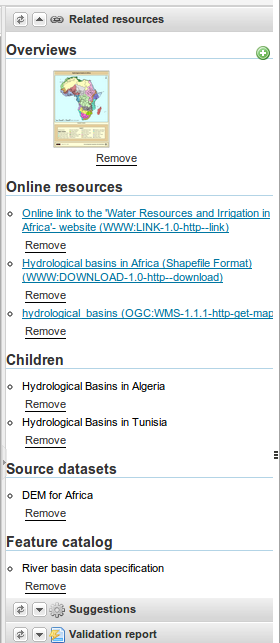
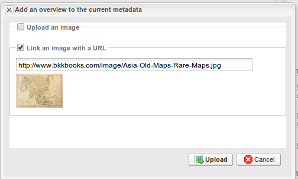
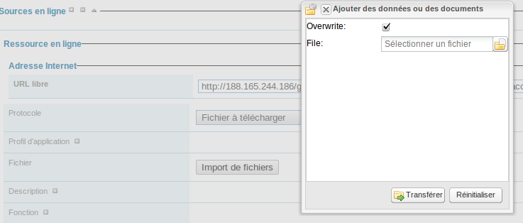
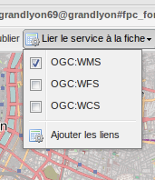
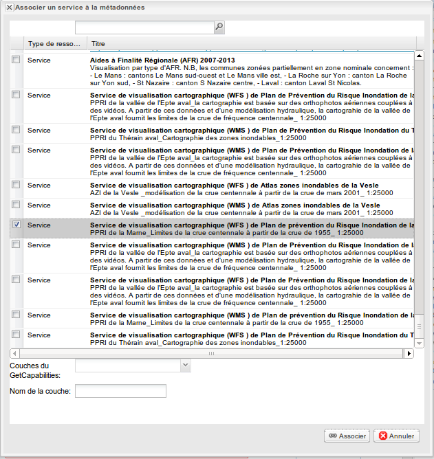
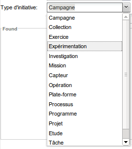
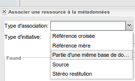

.. _metadata_link:

Associer des ressources à une fiches
====================================

Les ressources associées à une métadonnée peuvent être de différents types :

 * un aperçu (associé par une URL ou par le téléchargement d'une image)
 * un fiche parent
 * une métadonnée de service
 * une métadonnée de donnée
 * une donnée source
 * une ressource en ligne (eg. une URL, un service web)
 * un catalogue d'attributs ou dictionnaire de données
 * une autre fiche (eg. document, études, capteurs)

Il existe 2 manières d'associer des ressources :

 * en utilisant l'outil de gestion des relations
 * ou en utilisant le formulaire d'édition.

L'outil de gestion des relations est disponible pour les métadonnées au format ISO19139 ou profils de l'ISO19139. Cependant, les
ressources associées peuvent être dans des formats différents (eg. ISO19110 pour catalogue d'attibuts, dublin core).

L'outil de gestion des relations permet de consulter, ajouter et supprimer les relations:




Pour l'ajout, utilisez le menu:

.. figure:: link/geonetwork-relation-manager-actions.png

Associer des aperçus
--------------------

Au sein d'une fiche de métadonnée, dans la section identification, il est possible
d'ajouter des aperçus. Le catalogue permet d'associer 2 types d'aperçus : 

- les aperçus téléchargés dans le catalogue
- les aperçus associés par un lien sur le web


L'ensemble des aperçus sont présentés en mode édition dans le paneau de droite de gestion des relations, en mode 
consultation et dans les résultats de recherche.


Le premier type d'aperçu est chargé dans le catalogue via l'assistant suivant :

.. figure:: link/geonetwork-add-thumbnails.png

Une petite et une grand vignette peuvent être créée. Elles sont alors automatiquement
référencées dans la métadonnée. Ces vignettes seront présentes dans le répertoire public du format MEF (cf. :ref:`mef`).


Il est également possible de saisir l'URL d'une image disponible sur Internet :



L'outil de gestion des relations permet également la suppression des imagettes.

Lors de l'ajout d'un aperçu, le fragment XML suivant est ajouté à la fiche:

.. code-block:: xml
    
    <!-- Thumbnail added by  upload -->
    <gmd:graphicOverview>
        <gmd:MD_BrowseGraphic>
            <gmd:fileName>
                <gco:CharacterString>http://localhost:8080/geonetwork/srv/eng/resources.get?uuid=7e512c38-f916-43ba-8367-85f17dcadca1&amp;fname=thumbnail.jpg</gco:CharacterString>
            </gmd:fileName>
            <gmd:fileDescription>
                <gco:CharacterString>large_thumbnail</gco:CharacterString>
            </gmd:fileDescription>
            <gmd:fileType>
                <gco:CharacterString>jpg</gco:CharacterString>
            </gmd:fileType>
        </gmd:MD_BrowseGraphic>
    </gmd:graphicOverview>


Lorsque un aperçu est ajouté via une URL:

.. code-block:: xml
    
    <!-- Thumbnail added by URL -->
    <gmd:graphicOverview>
        <gmd:MD_BrowseGraphic>
            <gmd:fileName>
                <gco:CharacterString>http://organization.org/images/thumbnail.jpg</gco:CharacterString>
            </gmd:fileName>
        </gmd:MD_BrowseGraphic>
    </gmd:graphicOverview>


Dans les 2 cas, les informations concernant les aperçus peuvent être mis à jour via l'éditeur dans 
la vue avancée > section identification.


Associer des données par URL ou par téléchargement de fichier
-------------------------------------------------------------

Il est possible de télécharger des fichiers dans le catalogue et ainsi associer
des données ou des documents à une fiche (eg. ESRI Shapefile, ZIP, PDF, image). Ces fichiers sont alors
accessible fonction des privilèges de téléchargement associés à la fiche.

L'outil de gestion des relations permet l'ajout de ressource en ligne par téléchargement ou référencement d'URL.
Les informations suivantes sont nécessaires:

 * URL de la ressource ou fichier à télécharger 
 * nom
 * description 
 * protocole


.. figure:: link/geonetwork-add-simple-online-resource.png


Pour télécharger des documents, suivre les étapes suivantes :

#. Vérifier que la taille du fichier est raisonnable (par défaut, la taille maximale est configurée à 100Mo).
 
#. Le champ URL peut être laissé vide. Celui-ci sera mis à jour après l'ajout.

#. Sélectionner le **protocole** fichier à télécharger. Cette sélection déclenchera l'affichage du bouton d'ajout.

#. Cliquer sur le bouton **import de fichier** puis sélectionner un fichier sur votre machine.

#. Valider en cliquant sur le bouton **transférer**




Il est recommandé d'ajouter une **description** qui sera utilisée comme nom du lien hypertexte pour le fichier.


Les informations concernant ces ressources peuvent être mis à jour via l'éditeur dans 
la vue avancée > section distribution.


Associer un service WMS pour la visualisation des données
---------------------------------------------------------

Vous pouvez associer une donnée publiée dans un service OGC WMS via la section ressource en ligne.

#. Editer la métadonnée

#. Aller dans l'onglet distribution

#. Saisir dans le champ URL l'adresse URL du service (eg. http://services.sandre.eaufrance.fr/geo/ouvrage)

#. Choisir le protocole WMS (ie. OGC Web Map Service = OGC-WMS)

#. Saisir dans le nom, le nom de la couche tel que défini dans le document GetCapabilities du service (eg. REPOM)

#. Eventuellement, saisir une description permettant d'avoir un libellé plus pertinent que le nom de la couche

#. Sauvegarder

.. figure:: linkwms.png


Vous avez alors un bouton carte interactive dans les résultats de recherche.


La representation XML sera la suivante :

::

      <gmd:transferOptions>
        <gmd:MD_DigitalTransferOptions>
          <gmd:onLine>
            <gmd:CI_OnlineResource>
              <gmd:linkage>
                <gmd:URL>http://services.sandre.eaufrance.fr/geo/ouvrage</gmd:URL>
              </gmd:linkage>
              <gmd:protocol>
               <gco:CharacterString>OGC:WMS-1.1.1-http-get-map</gco:CharacterString>
              </gmd:protocol>
              <gmd:name>
                <gco:CharacterString>REPOM</gco:CharacterString>
              </gmd:name>
              <gmd:description>
                <gco:CharacterString>Installations portuaires</gco:CharacterString>
              </gmd:description>
            </gmd:CI_OnlineResource>
          </gmd:onLine>
        </gmd:MD_DigitalTransferOptions>
      </gmd:transferOptions>
    </gmd:MD_Distribution>
  </gmd:distributionInfo>


.. _editor_geopublication:


Publier les données téléchargées en WMS, WFS, WCS
-------------------------------------------------

Les interactions avec un serveur cartographique tel que GeoServer permettent à l'utilisateur de rapidement configurer les données pour leur diffusion.

Les serveurs cartographiques supportés sont :

- GeoServer embarqué avec le catalogue

- Un GeoServer distant (version 2.x ou sup.)


.. figure:: geopub-tiff.png


Ce mécanisme permet aux utilisateurs la publication de fichier de type :

- RASTER GeoTiff, ECW : non zippé, zippé ou URL du fichier

- ESRI Shapefile : zippé ou URL du fichier

- Table PostGIS


Dans le cas des fichiers zippés, le jeu de données doit être associé à la métadonnée tel que décrit dans 
le chapitre `associer des données à télécharger <#associer-des-donnees-a-telecharger>`_.
Une fois téléchargé, un bouton permet de publier la couche dans le service cartographique. 
Un autre permet la mise à jour de la section ressource en ligne pour associer le service
ou les services.


Configuration
`````````````
Si après l'ajout de la données à une fiche, vous ne voyez pas le bouton de géopublication, 
demandez à l'administrateur de vérifier la configuration dans l'administration du système.

Associer vos données
````````````````````

Pour associer un jeu de données, la procédure est la suivante :

* Editer une fiche de métadonnée

* Dans le cas d'un zip ou d'une image à télécharger, déposer un fichier tel que décrit dans le 
  chapitre `associer des données à télécharger <#associer-des-donnees-a-telecharger>`_

============   ============================================================= ===============================
Champs         Vecteur (Shapefile zippé)                                     RASTER (zippé ou non)
============   ============================================================= ===============================
URL            URL vers le fichier générée par le catalogue lors du dépôt    idem
               http://localhost:8080/geonetwork/srv/en/resources.get?id=1631
               &fname=CCM.zip&access=private                                 
Protocole      Fichier à télécharger                                         idem
               WWW:DOWNLOAD                                                  
Nom            Nom du fichier (lecture seul)                                 idem
============   ============================================================= ===============================

* Dans le cas d'une table PostGIS ou d'un fichier sur le réseau local, saisir les informations suivantes :

============   ============================================================= ===============================
Champs         Vecteur (Table PostGIS)                                       RASTER
============   ============================================================= ===============================
URL            Chaîne de connexion à la base de données                      Nom du répertoire 
               jdbc:postgresql://localhost:5432/login:password@db            file:///home/geodata/
Protocole      Table PostGIS                                                 Fichier RASTER
               DB:POSTGIS                                                    FILE:RASTER
Nom            Nom de la table                                               Nom du fichier
============   ============================================================= ===============================


Publier vos données
```````````````````

Une fois associé par téléchargement ou par référencement de l'URL du fichier ou de la table, l'assistant de géopublication 
est disponible en mode édition pour chaque ressource en ligne. L'édition des ressources en ligne est en générale accessible
depuis la majorité des modes d'édition. Quoiqu'il en soit, il est possible en mode avancé, d'aller dans la 
section ISO distribution > ressource en ligne pour accèder à l'ensemble des champs. Le bouton d'ouverture de l'assistant 
est placé à côté du champ fichier :

.. figure:: geopub-wizard-button.png


Remarque :

  Si le bouton n'apparaît pas et que le système semble bien configuré, cliquer sur le bouton sauver pour rafraîchir l'éditeur.


Une fois l'assistant ouvert, les étapes sont les suivantes :

* Choisir un noeud vers lequel publier la donnée depuis la liste des serveurs cartographiques disponibles

.. figure:: geopub-node-selector.png


* le catalogue vérifie alors :

    - que le fichier est valide (eg. le ZIP contient un seul Shapefile ou tiff)
    - que la couche est déjà publiée dans le serveur distant. Dans l'affirmative, la couche est ajoutée à l'aperçu.

.. figure:: geopub-menu.png

* Le bouton **publier** publie la couche dans le serveur cartographique. Si la donnée est déjà présente, elle est mise à jour.
* Le bouton **dépublier** supprime la donnée du serveur cartographique sélectionné.
* Le bouton **style** est disponible si un outil de gestion de style est installé et déclaré
  dans la configuration du serveur cartographique.

Aucun nom de couche n'est demandé à l'utilisateur car celui-ci est généré à partir du nom du fichier.
Dans le cas de fichier ZIP, le nom du fichier ZIP DOIT être égale à celui du Shapefile ou du GeoTiff 
(ie. dans le cas de rivers.shp, le fichier ZIP sera rivers.zip). Un entrepôt, une couche et un style
sont créés pour chaque couche.


Référencer les données après publication
````````````````````````````````````````

Le bouton **lier le service à la fiche** ajoute les informations pour faire la liaison avec la couche dans les services sélectionnés :

     - sélectionner un ou plusieurs protocoles (WMS, WFS, WCS) fonction du serveur cartographique et de la donnée publiée
     - cliquer sur ajouter les liens



La création de ces liens permettra par la suite au catalogue de créer les boutons ajouter à la carte pour visualiser les 
données sur la carte interactive (cf. `associer un service WMS <#associer-un-service-wms-pour-la-visualisation-des-donnees>`_).


Gérer les relations de type parent/enfants
------------------------------------------

Pour créer des relations parents/enfants, l'éditeur peut sélectionner l'option créer un enfant dans le menu autres actions.
En utilisant cette option, l'identifiant du parent est automatiquement mis à jour lors de la copie de la fiche sélectionnée; 
le reste de la métadonnée est copiée.


Lors de l'édition d'une fiche, sélectionner "associer une fiche parent" afin de définir l'association. Une fois la fiche 
du parent trouvée, créer l'association.

.. figure:: link/geonetwork-add-parents.png


Lors de l’ajout, le fragment XML suivant est ajouté à la fiche:


.. code-block:: xml
    
    <gmd:parentIdentifier>
        <gco:CharacterString>SDN:PRODUCT:1850:Time Series Tributyltin (TBT) in Sediment</gco:CharacterString>
    </gmd:parentIdentifier>


Une fois le parent sélectionner, il apparaîtra dans le menu des relations.


Si une métadonnée à un ou plusieurs fiches filles associées, l'outil de gestion des relations propose
le mécanisme de mise à jour des enfants qui permet de propager les informations
du parent vers l'ensemble de ses enfants. L'interface suivant permet de configurer le transfert d'information :

.. figure:: relationUpdateChild.png


Associer une donnée source
--------------------------


Dans la section qualité des données > généalogie, il est possible d'identifier les
données ayant servies à la création d'un jeu de données.

Lors de l’ajout, le fragment XML suivant est ajouté à la fiche:

.. code-block:: xml
    
    <gmd:source uuidref="095cdc57-f44b-4613-894c-f09f1b672140">
    </gmd:source>


L'outil de gestion des relations permet d'associer les données sources :

.. figure:: link/geonetwork-edit-sources.png


Les informations concernant ces ressources peuvent être mis à jour via l'éditeur dans 
la vue avancée > section qualité.


Ajouter un catalogue d'attributs
--------------------------------


Le catalogue d'attributs sont stockés selon le standard ISO 19110. La relation entre catalogue d'attributs et métadonnée de données
sont réalisés avec le menu associer un catalogue d'attribut. 

Lors de l’ajout, le fragment XML suivant est ajouté à la fiche:

.. code-block:: xml
    
    <gmd:contentInfo>
        <gmd:MD_FeatureCatalogueDescription>
            <gmd:includedWithDataset/>
            <gmd:featureCatalogueCitation uuidref="46ce9c2f-6c37-4ae7-9511-63940ece5760" xlink:href="http://localhost:8080/geonetwork/srv/en/csw?service=CSW&amp;request=GetRecordById&amp;version=2.0.2&amp;outputSchema=http://www.isotc211.org/2005/gmd&amp;elementSetName=full&amp;id=46ce9c2f-6c37-4ae7-9511-63940ece5760"/>
        </gmd:MD_FeatureCatalogueDescription>
    </gmd:contentInfo>


L'outil de gestion des relations permet d'associer un catalogue d'attributs :

.. figure:: link/geonetwork-edit-fcats.png


Les informations concernant ces ressources peuvent être mis à jour via l'éditeur dans 
la vue avancée > section information sur le contenu.


Associer métadonnées de données, métadonnées de services
--------------------------------------------------------


Les services (eg. WMS, WFS) pourront être référencés dans le catalogue.


La métadonnée de service (MDS) est saisie dans la norme ISO19139/ISO19119.

 
L'ISO19119 définie la section "identification du service".


Il est alors possible de décrire 4 types de relations dans les MDD et MDS :

#. Les métadonnées de données >> la couche correspondante diffusée par le service
   Aucune méthode n'est définie par l'ISO ou INSPIRE pour créer cette relation. Cependant, le catalogue
   a utilisé la section distribution pour cela. Voir `la section sur l'association d'un service WMS <#associer-un-service-wms-pour-la-visualisation-des-donnees>`_.
   
#. Les métadonnées de service OGC >> métadonnée de données
   
   Cette relation est stockée de la manière suivante dans le document XML :

   .. code-block:: xml

         <srv:operatesOn uuidref="9fe71d39-bef7-4d45-a3b3-12afbd01908f" xlink:href=""/>
       </srv:SV_ServiceIdentification>
     </gmd:identificationInfo>
    
   Le catalogue propose une popup de recherche et sélection pour faire l'association. Une fois la relation 
   présente, il est possible de naviguer de la métadonnée de service, vers la métadonnée de données.
   
#. Les métadonnées du service >> le service  
   La métadonnée de service décrit les opérations du service ainsi que son point d'accès en général 
   saisie dans la section distribution.
   

#. Les métadonnées du service >> les couches diffusées par le service   
   La spécification CSW définit la manière d'associer les données diffusées par un service et sa métadonnée. 
   Cette information reste de moindre importance car le client par demande du GetCapabilities peut rapidement 
   obtenir cette information.
   L'élément coupledResource est utilisé pour décrire la relation :
   
   .. code-block:: xml

      <srv:coupledResource>
        <srv:SV_CoupledResource>
          <srv:operationName>GetMap</srv:operationName>
          <srv:identifier>9fe71d39-bef7-4d45-a3b3-12afbd01908f</srv:identifier>
          <gco:ScopedName>REPOM</gco:ScopedName>
        </srv:SV_CoupledResource>
      </srv:coupledResource>
   
   
   
L'interface suivante permet l'association entre une métadonnée de données et une métadonnée de service :




L'éditeur peut définir la nom de la couche en utilisant la liste déroulante 
(qui si le service est en ligne est remplie par interrogation du GetCapabilities du service WMS)
ou en saisissant le nom de la couche dans le champ texte. 
Cette information est nécessaire pour afficher les données sur la carte interactive.


Seul les relations au sein d'un même catalogue sont gérées. L'utilisation d'XLink n'est pas totalement supportée
pour la création de ces relations.


Les informations concernant ces ressources peuvent être mis à jour via l'éditeur dans 
la vue avancée > section identification.


Ajouter une autre ressource (eg. document, étude, capteurs)
-----------------------------------------------------------


Une métadonnée au format ISO19139 peut être associée à d'autres fiches décrivant des ressources de 
différents types. Ces informations sont référencées dans l'éléments aggregationInfo. Ces associations
sont caractérisées par : 

 * un type d'initiative



et

 * un type d'association
 



Pour créer une relation :

 * sélectionner un type d'association
 * sélectionner un type d'initiative
 * rechercher la fiche à associer

.. figure:: link/geonetwork-add-siblings.png

Plusieurs fiches peuvent être associées simultanément avec un type d'assocaition et d'initiative différents :

.. figure:: link/geonetwork-add-multiple-siblings.png


Une fois associée, l'outil de gestion des relations affiche les liens :

.. figure:: link/geonetwork-add-siblings-ref.png

Lors de l’ajout, le fragment XML suivant est ajouté à la fiche:

.. code-block:: xml
    
    <gmd:aggregationInfo>
        <gmd:MD_AggregateInformation>
            <gmd:aggregateDataSetIdentifier>
                <gmd:MD_Identifier>
                    <!-- optional gmd:authority here: could have details of a register describing the some details of the sibling record -->
                    <!-- code is UUID/urn of the sibling record, could be a gmx:Anchor -->
                    <gmd:code>
                        <gco:CharacterString>urn:marine.csiro.au:project:1532</gco:CharacterString>
                    </gmd:code>
                </gmd:MD_Identifier>
            </gmd:aggregateDataSetIdentifier>
            <gmd:associationType>
                <gmd:DS_AssociationTypeCode codeList="http://...#DS_AssociationTypeCode" 
                                            codeListValue="crossReference">crossReference</gmd:DS_AssociationTypeCode>
            </gmd:associationType>
            <!-- initiative type describes the type of sibling relationship - in this case the code is a project 
                 related to the record that contains this aggregateInformation -->
            <gmd:initiativeType>
                <gmd:DS_InitiativeTypeCode codeList="http://...#DS_InitiativeTypeCode" 
                                           codeListValue="project">project</gmd:DS_InitiativeTypeCode>
            </gmd:initiativeType>
        </gmd:MD_AggregateInformation>
    </gmd:aggregationInfo>


Les informations concernant ces ressources peuvent être mis à jour via l'éditeur dans 
la vue avancée > section identification.


