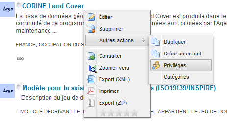
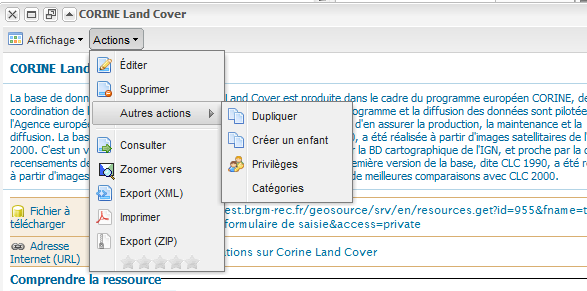
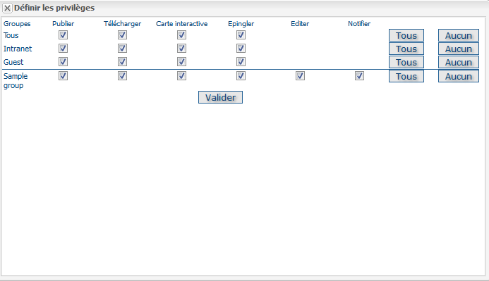
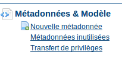
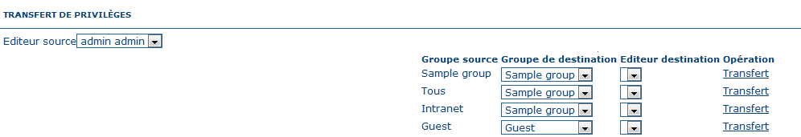

.. _ownership:
.. include:: ../../substitutions.txt

Gestion des privilèges
======================

NB : Une métadonnée publique est une métadonnée accessible à tous.

Visualisation
`````````````

Un administrateur peut afficher toutes les métadonnées.

Un relecteur peut afficher une métadonnée si :

- Le propriétaire des métadonnées est membre de l'un des groupes affectés au relecteur.

- Il/elle est le propriétaire des métadonnées.

Un éditeur peut visualiser :

- Toutes les métadonnées accessibles à l’un des membres du groupe, dont il/elle fait partie. 

- Toutes les métadonnées qu’il/elle crée.

Un utilisateur enregistré peut afficher :

- Toutes les métadonnées qui sont accessible par l’un des membres du groupe dont il/elle fait partie.

Un administrateur peut consulter toutes les métadonnées du catalogue.

Les métadonnées publiques peuvent être consultées par tous les utilisateurs (connectés ou pas).

Edition
```````

Un administrateur peut éditer tous les types de métadonnées.

Un relecteur peut éditer les métadonnées si :

- Le propriétaire de métadonnées est le membre d'un des groupes qui lui sont assignés.

- Il/elle est le propriétaire des métadonnées.

Un éditeur peut uniquement éditer les métadonnées dont il/elle est le créateur.

Privilèges
----------

La page d'administration des privilèges est accessible seulement par :

- Tous les administrateurs

- Tous les relecteurs membres de l'un des groupes affecté au propriétaire de métadonnées.

- Le propriétaire des métadonnées

Les privilèges attribués à tous et aux groupes de l'Intranet peuvent être édités uniquement par les administrateurs et les relecteurs.

Attribuer les privilèges
------------------------

A n'importe quel moment, vous pouvez attribuer des privilèges à vos métadonnées et vos données associées pour la visualisation, le téléchargement, ...

Par exemple, vous pouvez définir si les renseignements et les services associés sont visibles par tous (utilisateurs Internet) ou simplement des utilisateurs internes (Intranet). Les privilèges sont attribués par groupe. L'accès à ces fonctions peut différer selon le profil de l'utilisateur au sein d'un même groupe.

Pour affecter des privilèges, procédez comme suit:

- Dans la page de résultats, la gestion des privilèges est accessible soit dans Autres actions puis Privilèges au niveau du bouton Actions situé près du titre de la métadonnée (privilèges sur une métadonnée unique), soit dans Autres actions puis Mettre à jour les privilèges dans les actions sur une sélection de métadonnées.



	*Bouton de Privilèges dans la page de résultats*

- Dans une fiche en consultation, dans Autres actions puis Privilèges au niveau du bouton Actions situé dans la barre supérieure.



  *Bouton de Privilèges dans une fiche en consultation*

- Cliquez sur le bouton Privilèges de la barre de menu. Une nouvelle fenêtre s’affiche. Vous pouvez affecter certains privilèges à des groupes spécifiques, en les sélectionnant ou en les désélectionnant, depuis cette fenêtre. Cliquez simplement dans la petite case pour assigner un privilège ou désélectionnez-le pour le retirer. "**Tous**" et "**Aucun**"  vous permettent de sélectionner et de retirer les coches.



  *Paramètres des privilèges.*

Voici une brève description de chaque privilège, pour vous aider à identifier ceux que vous souhaitez assigner aux différents groupes.

**Publier** : Les utilisateurs dans le groupe spécifié sont autorisés à visualiser la métadonnée, suite à une recherche basée sur des critères spécifiques.

**Télécharger** : Les utilisateurs dans le groupe spécifié peuvent télécharger la carte.

**Carte interactive** : Les utilisateurs dans le groupe spécifié sont en mesure d'obtenir une carte interactive. La carte interactive est créée séparément, à l'aide d'un serveur web (non intégré par défaut dans |project_name|).

**Epingler** : Une fois sélectionnée, la métadonnée est placée dans la page d'accueil, où elle apparait aléatoirement. 

**Editer** : Une fois sélectionnée, les éditeurs du groupe(s) concerné(s) peuvent éditer les enregistrements respectifs de métadonnées.

**Notifier** : Un email de notification est envoyé à l'adresse email du groupe, l’informant que la carte a été téléchargée.

Transfert de privilèges
-----------------------

Lorsque le privilège d'une métadonnée doit être transférée d'un utilisateur à un autre, pour un ou tous les enregistrements spécifiques à la métadonnée, l'option de transfert de privilèges est disponible dans la page d'Administration.



    *Comment ouvrir la page de transfert de privilèges*

Initialement, la page affiche une liste déroulante uniquement pour l’éditeur de la source (l'actuel propriétaire des métadonnées). La liste déroulante est constituée de tous les utilisateurs de |project_name|, qui ont un rôle d'éditeur et/ou qui possède certaines métadonnées. Sélectionner un éditeur et vous sélectionnerez toutes les métadonnées, dont il a la gestion. Une liste déroulante vide signifie : 

- Qu'il n'y a aucun éditeur avec des métadonnées associées ;

- Par conséquent aucun transfert n'est possible.

Notez que la liste déroulante est constituée de tous les éditeurs visibles par votre statut. Si vous n'êtes pas un administrateur, vous n’afficherez qu’un sous-ensemble de l’ensemble des éditeurs.



    *Page de transfert de privilèges*

Lorsque l'éditeur de la source est sélectionné, un ensemble de lignes s'affiche. Chaque ligne fait référence à un groupe de l'éditeur sur lesquels il a des privilèges. La signification de chaque colonne est la suivante :

- *Groupe source*: Il s'agit d'un groupe possédant des privilèges pour les métadonnées qui appartiennent à l'Editeur de la source. D'une autre manière, si l'un des éditeurs de métadonnées possède des privilèges sur un groupe, alors ce groupe est listé ici.

- *Groupe de destination*: Le processus de transfert est à destination de ce groupe. Tous les privilèges appartenant au groupe de la source sont transférés au groupe cible. La liste déroulante des groupes cibles est constituée de tous les groupes d'utilisateurs connectés (généralement un administrateur ou un administrateur d'utilisateur). Par défaut, le groupe Source est sélectionné dans la liste déroulante des groupes cibles. Les privilèges du groupe "ALL" (tous) et des groupes internes (Intranet) ne sont pas transférables.
 
- *Éditeur destination*: Une fois qu'un groupe cible est sélectionné, ce menu déroulant est constitué de tous les éditeurs qui appartiennent à ce groupe cible.

- *Opération*: Actuellement seul l'opération de transfert est possible.

En sélectionnant l'opération de transfert, si le groupe Source est différent de celui du groupe cible le système effectue :

- Le transfert de privilège ;

- Affiche un bref résumé ;

- Supprime la ligne en cours puisqu'il n'y aucun privilège de plus à transférer.


