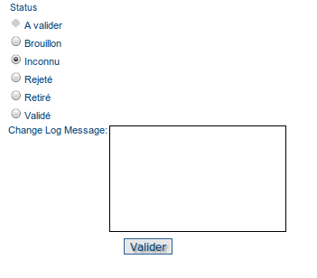
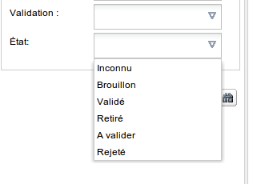

.. _metadata_status:
.. include:: ../../substitutions.txt

Gestion du cycle de vie des métadonnées
=======================================

Le cycle de vie des métadonnées est habituellement constitué d'une succession d'états (ou statuts). Par exemple, lors de la création d'un
nouvel enregistrement par un éditeur, la fiche est à l'état dit **brouillon**.

Les différents états
--------------------

Par défaut, les états sont les suivants :

 * Inconnu
 
 * Brouillon
 
 * A valider
 
 * Validé
 
 * Rejeté
 
 * Retiré

La gestion de l'état d'une fiche est accessible depuis la page de résultat ou dans la page de consultation d'une fiche 
dans le menu **Autres actions**.

Un certain nombre de règles est disponible par défaut :

 * Lorsqu'un éditeur modifie l'état de **brouillon** ou **inconnu** à **a valider**, le relecteur du groupe est informé par email 
   du changement d'état.
 
 * Lorsqu'un relecteur modifie l'état de **a valider** à **validé** ou **rejeté**, le rédacteur de la fiche en est informé par email.
 
 * Si une fiche est à l'état **validé** est que l'éditeur n'utilise pas la fonction **édition mineure** lors d'une mise à jour, l'état 
   de la fiche passe alors à **brouillon**

Pour que les mécanismes d'alerte par email fonctionnent, il est nécessaire de configurer les informations relatives au 
serveur de mail (cf. :ref:`configuration_system_email`)

Recherche par état
------------------

Le formulaire de recherche permet la recherche par état :

Personnalisation des états
--------------------------

Le catalogue est configuré par défaut avec une liste pré-défini d'états. Ces états sont stockés dans la base de données
du catalogue. Il est possible de modifier cette liste ainsi que de modifier les mécanismes d'alertes par défaut.
