.. include:: ../../substitutions.txt

.. _metadata_create:

Création et édition de métadonnées
==================================

Cette partie présente la manière de créer et saisir des métadonnées dans le catalogue
en utilisant l'éditeur en ligne. Pour cela le système de modèles (templates en anglais) est utilisé.
Les sujets abordés sont les suivants :

.. contents:: :local:

Pour ajouter et éditer une métadonnée, un utilisateur doit être **enregistré** comme **Editeur** dans au moins un groupe. 
Si ce n'est pas le cas, contactez l'administrateur.

Pour la création d'une métadonnée utilisant l'éditeur en ligne, 2 options sont possibles :

- partir d'un modèle de saisie à partir du menu **Créer une métadonnée**
- dupliquer un fiche à partir des résultats de recherche


Les modèles de saisie
---------------------

Le catalogue fournit un
certain nombre de modèle de métadonnées basés sur les différents standards supportés (cf. :ref:`supported_format`). Ces modèles
permettent de décrire divers types de ressources (eg. données vecteur ou raster, services
WMS/MFS, service de téléchargement) avec un nombre minimal d'éléments pré-remplis. 
Ces modèles peuvent être édités et complétés avec des éléments de la vue
avancée tout comme une métadonnée.

Si aucun modèle n'est disponible, il est possible de les ajouter à partir de l'interface d'administration (cf. :ref:`samplemetadata`).


Créer une nouvelle métadonnée
-----------------------------

Une fois authentifié (cf. :ref:`how_to_login`), **dans la barre d'outil de présentation des résultats** 
ou bien dans la page d'accueil, survoler avec la souris la zone d'authentification, puis cliquer sur cliquer sur **"nouvelle métadonnée"**, ou cliquer sur **Administration** puis cliquer sur l'icône située en haut à droite (**Ajouter des données, des services ou des cartes**) :

.. figure:: quick_admin_tools.png

  *Outils d'administration rapides*

Ensuite :

#. Selectionner le type de modèle de métadonnée à utiliser entre données, carte et service.
#. Selectionner le modèle de métadonnée, sachant que d'autres modèles peuvent être créés.
#. Selectionner le **Groupe** auquel sera rattaché la métadonnée. Les groupes proposés sont ceux autorisés par l'administrateur pour l'utilisateur en cours d'édition.
#. Cliquez sur **"créer"**.

  .. figure:: create.png

   *Formulaire de création d'une métadonnée*

Une nouvelle métadonnée basée sur le modèle sélectionné est ensuite créée. Un identifiant unique lui est attribué (élément fileIdentifier). Par défaut, 
elle n'est visible que pour les utilisateurs du groupe.


Panneau de sélection des vues
`````````````````````````````

Les vues ont été présentées précédemment (cf. :ref:`metadata_edit_mode`).

Lorsque vous créez un nouvel enregistrement, vous pouvez choisir entre
les différentes vues du standard. Pour charger la vue, cliquez simplement sur l'icône représentant un oeil (voir ci-dessous).

La vue désactivée dans le menu correspond à la vue courante.

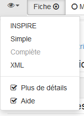

   *Panneau de sélection des vues*

Le panneau permet également deux actions supplémentaires :
   
- Plus de détails : permet d'afficher ou masquer les attributs de substitution, par exemple la raison de l'absence d'information pour un élément de métadonnées (attribut "nilReason").

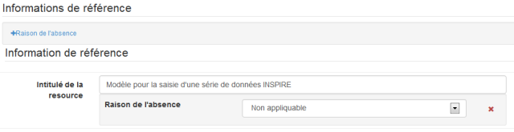


- Aide : permet d'activer ou non les tooltips contenant l'aide à la saisie


Les champs obligatoires et conditionnels
````````````````````````````````````````
Les champs obligatoires sont en gras avec un cadre gris ou rouge s'ils ont une valeur invalide.

.. figure: invalidField.png

   Champ titre obligatoire valide mais un résumé invalide (car vide)


Les champs dont la saisie est invalide sont entourés en rouge.
Il peut s'agir :

- d'un champ obligatoire non rempli
- d'un champ numérique contenant du texte (avec ou sans décimale)
- d'une adresse email invalide.


Il existe par ailleurs des champs conditionnels.
Par exemple, pour les contacts, 

- un des champs nom, organisation ou position pour un contact
  doit être renseigné pour le standard ISO 19139.
- un des champs organisation ou email doit être renseigné pour les règles d'implémentation d'INSPIRE 

  .. figure: PoC_Maint.png

  *Point de contact*

Pour identifier les erreurs sur les champs conditionnels, utiliser le rapport
de validation (cf. :ref:`metadata_validation`).


L'aide
``````

La définition de chacun des champs est disponible en cliquant sur le libellé ou sur la zone de saisie correspondants.

Cette aide indique :

Dans la vue INSPIRE, les références au guide de recommandations du CNIG :

- le nom du champ
- la définition
- des recommandations
- des exemples/contre-exemples

Dans les autres vues, les informations relatives à la norme ISO 19115 :

- le nom du champ
- la définition
- l'identifiant du standard
- le nom de la balise de l'élément (eg. gmd:title)
- la description de l'élément parent est également présentée.

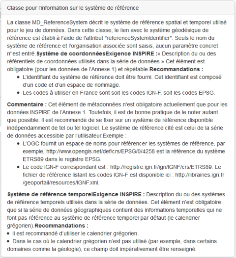

   *Tooltip contenant l'aide à la saisie*


.. _editor_control:

Utiliser les contrôles des champs de l'éditeur
``````````````````````````````````````````````

Différents types de champs existent :

- les champs de type texte simple
- les champs de type zone de texte

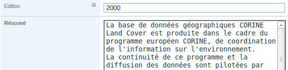


- les listes de valeurs
- les dates

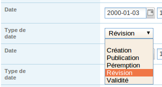

   Champ date avec une liste de valeur pour le type de date

- la saisie d'emprise géographique (cf. :ref:`geobox_editor`)
- la saisie des champs de type périodes

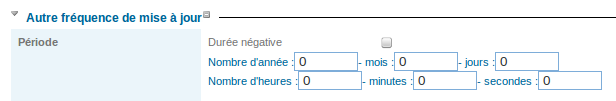

   Champ de type période


La cardinalité des champs est définie dans le schéma du standard de métadonnées. Ce schéma est utilisé pour placer les 
contrôles correspondants à côté des champs de saisie.

Ces contrôles sont :

- le plus pour ajouter un champ
- le moins pour supprimer un champ
- la flêche vers le haut pour déplacer le champ vers le haut
- la flêche vers le bas pour déplacer le champ vers le bas


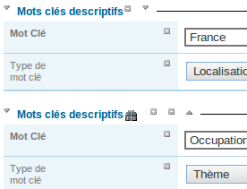

   Bouton de contrôle dans l'éditeur


En complément, l'icône jumelle permet la recherche dans des dictionnaires. Elle est disponible pour les champs de type :

- mots clés
- projection
- (optionel) contact

La flêche présente devant les titres de section permettent de cacher le bloc placé en dessous.

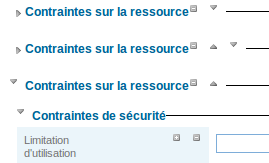


Saisir les métadonnées pour vos données géographiques
-----------------------------------------------------

.. TODO : cf la version anglaise http://geonetwork-opensource.org/manuals/trunk/users/quickstartguide/new_metadata/index.html#entering-metadata-for-your-map


.. _geobox_editor:

Saisir une emprise géographique
-------------------------------

Dans la section identification, il est possible de saisir l'emprise géographique de la métadonnée.
Celle-ci est en générale un rectangle (ie. LatLongBoundingBox). L'interface de saisir permet :

- la saisie manuelle des coordonnées dans une des projections configurées pour le catalogue
- la saisie d'un rectangle sur la carte
- le choix d'une région dans la liste déroulante
- l'effacement de l'objet


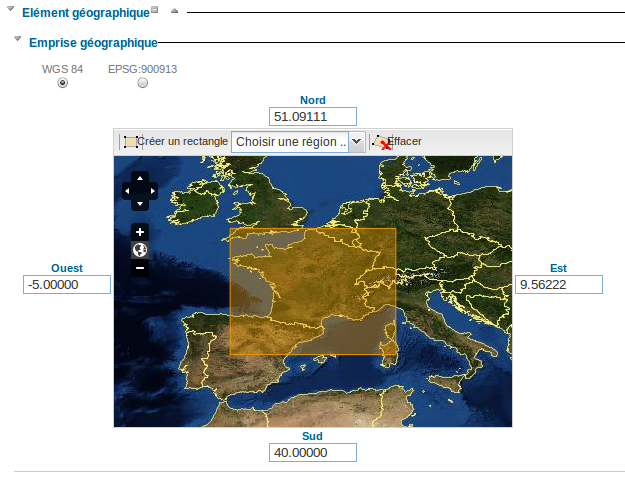


A noter qu'il est également possible de calculer l'emprise à partir des mots clés géographique (cf. :ref:`compute_extent`).

Il est possible de saisir plusieurs emprises pour une fiche de métadonnée. Ceci se révèle util pour un jeu de donnée
sur la france métropolitaine et les COM par exemple.


Le standard ISO permet également la saisir d'un polygone. Dans ce cas, l'interface de saisir propose un
outil de saisie de polygone ou de cercle.

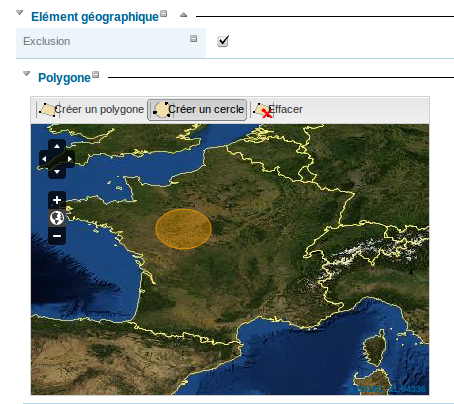

La case à cocher **Exclusion** permet d'indiquer si le polygone est une surface recouverte par des données ou ne comportant pas de données.


L'aide à la saisie
------------------

Suggestion simple
`````````````````

Pour certains champs, il est possible d'avoir une liste de suggestion. Cette liste est placé à côté du champ de saisie.


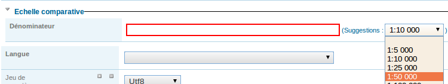

   Suggestion pour le champ niveau d'échelle


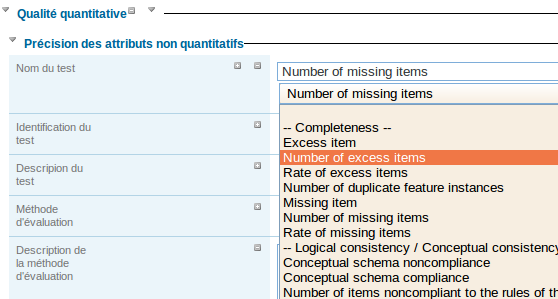

   Suggestion pour les champs nom du test et définition (Annexe C de l'ISO19138)
   
   
Une suggestion permet d'accèder rapidement à des listes classiques de valeurs et de simplifier la saisie.


.. _auto_correction:

Mécanisme de suggestion par analyse des métadonnées et correction automatique
`````````````````````````````````````````````````````````````````````````````

Dans le paneau droit de l'éditeur, le bloc **Suggestion** permet d'avoir les règles applicables à la métadonnée en cours d'édition.
Ces règles dépendent du standard de métadonnées.

Prenons le cas d'une métadonnée contenant un mot clé contenant des virgules :


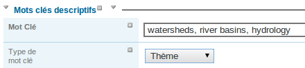
   
   Mots clés contenant des virgules comme séparateur. Ceci n'est pas recommandé.


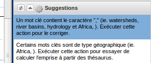
 
   Le mécanisme d'auto-correction, propose à l'éditeur de séparer les mots clés.


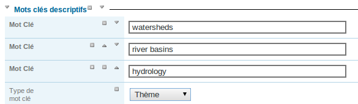

   Résultat après le traitement automatique
  
  
Les mécanismes de contrôle pour le standard ISO19139 sont les suivants :

- Séparation des mots clés contenant des virgules
- Correction des niveaux d'échelle contenant des 1/25000 ou 1:25000 en 25000
- Calcul de l'emprise à partir des mots clés géographique
- Ajout d'une section conformité INSPIRE si un thème INSPIRE se trouve dans les mots clés
- Ajout des systèmes de projection si un service WMS est associé
- Ajout d'un aperçu si un service WMS est associé
- Ajout de l'emprise si un service WMS est associé


.. _metadata_validation:

Valider les métadonnées
-----------------------

Dans le paneau droit de l'éditeur, le bloc **Validation** permet d'obtenir le niveau de validité de la métadonnée en cours d'édition
vis à vis :

- du schéma du standard (Schéma XSD)
- des recommandations ISO
- des recommandations INSPIRE (optionel)
- des recommandations |project_name|


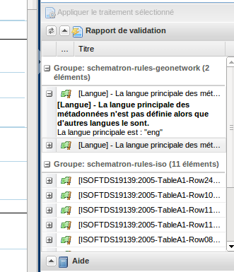


Saisir des métadonnées en plusieurs langues
-------------------------------------------

De prime abord, il pourrait être envisagé de dupliquer une fiche pour la rendre accessible en plusieurs langues.
Cependant la norme ISO19139 définie une manière de traduire tout ou partie d'une métadonnées.

Un éditeur peut donc créer des métadonnées ISO en plusieurs langues. Pour cela, il est nécessaire de déclarer une
nouvelle langue dans la fiche :

- Tout d'abord, vérifiez que la langue de la métadonnée est définie dans la section sur les métadonnées.

- Ensuite, ajouter une ou plusieurs autres langues dans cette même section.


En édition, chaque élément pouvant être traduit est composé de :

- une zone de texte

- une liste de sélection de la langue (langues déclarées dans la section autres langues)


Par défaut, la langue sélectionnée est la langue de l'interface si la langue est définie dans la métadonnée. 
Sinon la langue principale de la métadonnée est affichée.


.. figure:: editor-multilingual.png


En option, le service de traduction de Google peut être utilisé. 
Les traductions peuvent être suggérées pour l'éditeur en cliquant sur la petite icône située à droite du sélecteur de langue. 
Le service de traduction traduit le texte dans la langue principale de la métadonnée dans la langue sélectionnée.


En mode consultation, en fonction de langue de l'interface, si cette langue est définie dans les métadonnées, 
les éléments sont affichés dans cette langue
sinon dans la langue par défaut de la métadonnée.
Ce comportement est également appliqué pour les réponses au format dublin-core via CSW pour une fiche en ISO.


Associer des logos aux contacts
-------------------------------

Pour chaque contact, il est possible d'ajouter le logo de l'organisme. Le logo est renseigné dans l'élément
instruction pour le contact (ie. gmd:contactInstruction). En édition, si ce champ n'est pas visible, basculer
dans la vue avancée et ajouter le champ au contact.

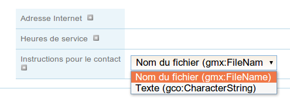

Choisir "nom du fichier" dans la liste pour ajouter les informations sur le contact ainsi que le logo de
l'organisme (ou "texte" pour uniquement ajouter les instruction sur le contact).

Sélectionner le logo dans la liste des logos disponible dans le catalogue.

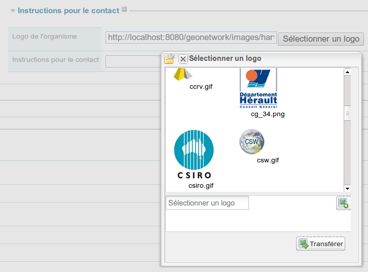


Les logos sont affichés dans la page de consultation de la fiche et dans les résultats de la recherche.

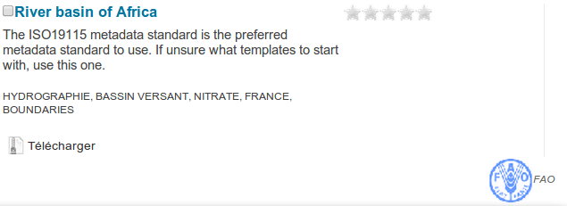


L'information est stockée dans la fiche de la manière suivante :


.. code-block:: xml

  <gmd:contactInstructions>
    <gmx:FileName src="http://localhost:8080/geonetwork/images/harvesting/fao.gif"/>
  </gmd:contactInstructions>

.. _compute_extent:

Calcul de l'étendue par analyse des mots clés
---------------------------------------------

L'éditeur peut demander à |project_name| d'analyser les mots clés de la fiche en cours d'édition pour calculer l'emprise. Ce mécanisme permet une saisie plus efficace.
Par exemple, dans la section identification saisissez "FRANCE", "GUADELOUPE", "MARTINIQUE" dans les mots clés puis cliquer sur calculer les emprises pour ajouter les 3 emprises automatiquement.

L'approche est la suivante :

- Pour chaque mot clé

- Recherche le mot clé dans les thésaurus du catalogue

- Si le mot clé à une étendue

- Ajoute une étendue avec sa description dans la métadonnée


Ce processus peut être lancé selon 2 modes :

- Ajout : Conserve les étendues existantes et rajoute les nouvelle à la fin.
- Remplace : Supprime les étendues n'ayant que des éléments de type emprise (les emprises temporelle, verticale ou polygone englobant ne sont pas supprimées), et ajoute les nouvelles à la fin

L'éditeur peut supprimer les étendues inutiles après le processus.

Ce processus ne fonctionne que si des thésaurus de type géographique sont installés dans le catalogue.


.. figure:: computebbox-selectkeyword.png


Le lancement du processus se fait par le menu autres actions.

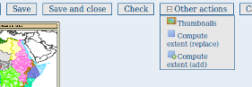


La métadonnée est sauvegardée pendant le processus.

.. figure:: computebbox-results.png


Sauvegarder la métadonnée avant le lancement de l'opération si vous avez fait des modifications.


Attribuer des catégories
------------------------

Pour finaliser le tout, vous pouvez assigner des catégories à vos métadonnées. 
Les catégories choisies vont déterminer sous quelles catégories votre fiche 
va s'afficher dans la page de recherche.
Pour assigner des catégories à une carte, suivrez ces étapes :

 - Trouver votre fiche en utilisant le formulaire de recherche.
   En fonction du nombre de résultats, positionnez-vous sur la fiche, 
   ou sur le menu **Autres actions** (sur la droite). Vous allez voir 
   une liste de boutons, incluant un bouton **Catégories**.

 - Cliquez sur le bouton **Catégories**. Cela va afficher une nouvelle 
   fenêtre. Vous pouvez assigner une ou plusieurs catégories en les sélectionnant 
   ou désélectionnant sur cette page. Cocher ou décocher simplement 
   les petites cases en face des catégories.


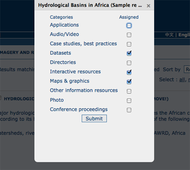


Si vous n'avez pas accès à ces informations, consulter :ref:`admin_category`.


