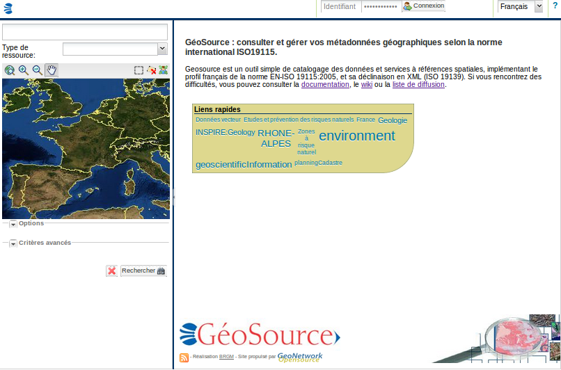
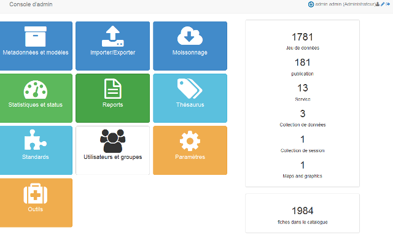
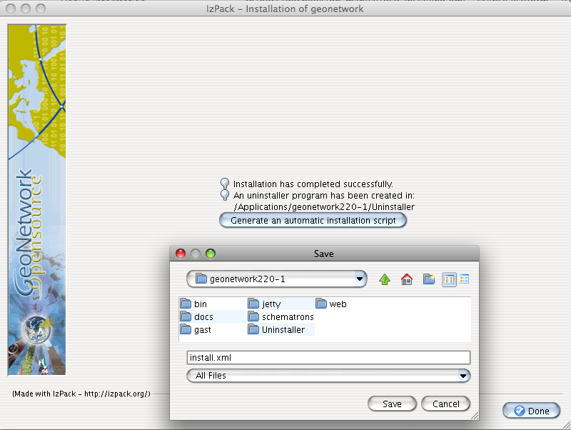
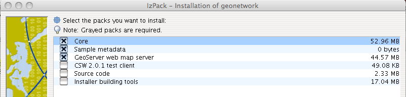
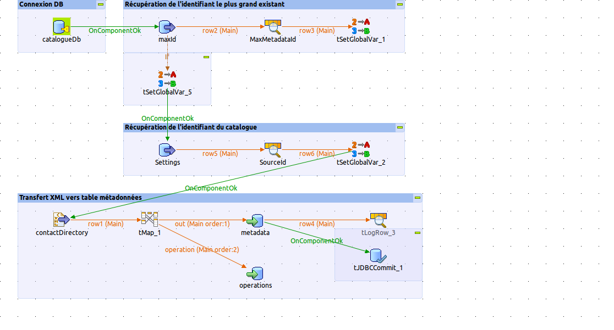

.. _installing:

.. include:: ../../substitutions.txt

Installation
============

Nouvelle version - nouvelles fonctionnalités
--------------------------------------------

Version 2.11.0
``````````````



    *Page d'accueil*

- Intégration de nouvelles technologies pour l'interface d'édition et d'administration (Bootstrap 3, AngularJS, ...)

- Nouvelle interface d'édition

Un nouveau formulaire de saisie simplifié remplace la vue INSPIRE actuelle. Elle a pour objectif de permettre la saisie des métadonnées conformes à INSPIRE et aux recommandations nationales du CNIG.

Au-delà du formulaire simplifié, les fonctions suivantes ont été mises en oeuvre dans l’interface d’édition :

	- Ajout de tooltips contenant l’aide pour la saisie des champs (définitions, exemples, …)

	- Saisie par autocomplétion (thésaurus, contacts, système de coordonnées)

	- Sauvegarde automatique du formulaire lors de la saisie

	- Navigation simplifiée entre les différentes catégories de métadonnées
	
	- etc.
	
.. figure:: edition.png

    *Nouvelle interface d'édition*

	
- Nouvelle interface d'administration



    *Nouvelle interface d'administration*

En complément de la reprise de l’ensemble des fonctionnalités existantes dans la section administration, les fonctionnalités suivantes ont été ajoutées :

- La section statistique a été revue afin de présenter des informations complètes aussi bien sur les statistiques de recherche que sur le contenu du catalogue

- Ajout d'un module permettant de lancer sur une sélection de métadonnées des traitements pour apporter des modifications en masse (eg. corriger des URL, modifier des mots clés, remplacer des contacts)

- Une simplification et clarification des interfaces :

	- amélioration de la cliquabilité (logos, icônes, barres de navigation)

	- simplification de l’interface (eg. si aucune catégorie définie, aucune liste ou menu ne propose une liste vide)

	- ajout de mécanisme de filtrage

	- mise en place de barre de progression (eg. indexation, import, upload, mise à jour en batch)

	- rapport d’erreurs

	- glisser/déposer pour les opérations d’upload simple/multiple

- etc.

	

Version 2.9.x
`````````````

- Recherche

 - Recherche à facettes
 
 - Téléchargement de données WFS
 
 - Support du format DCAT/RDF (http://www.w3.org/TR/vocab-dcat/) pour les services de recherche et de consultation avec ajout du support de sitemap sémantique

- Editeur

 - Support des aggrégats (en ISO19139) pour associer des études, capteurs, ...
 
 - Possibilité de cacher des sections d'information pour les utilisateurs non identifiés (en ISO19139).

- Administration 

 - :ref:`monitoring`

 - Amélioration du mécanisme d'authentification via LDAP, CAS (cf. :ref:`authentication`) 

 - :ref:`geonetwork_data_dir`
 
 - Support des profils multiples par utiisateurs
 
 
Version 2.7.x
`````````````

- Nouvelle traduction : finlandais

- Nouvelle interface de consultation et d'édition

- Recherche

 - Recherche distribuée utilisant le protocole Z39.50 (interface classique)

 - CSW virtuel
 
 - Recherche multilangue
 
 - Affichage, pour les séries, des métadonnées associées dans les résultats de recherche
 
 - Index / Document and field boosting (http://trac.osgeo.org/geonetwork/wiki/proposals/DocumentAndFieldBoosting)

- Editeur

 - Amélioration du formulaire de saisie et consultation pour le dublin-core 

 - Possibilité de faire une modification mineure

 - :ref:`editor_geopublication`
 
  - Support de la publication de ressources externes (fichier ou url)

  - Possibilité de choisir les types de liens à ajouter (WMS et/ou WFS et/ou WCS)
 
 - Persistence des résultats de validation
 
 - :ref:`auto_correction`
 
 - Suivi du statut des métadonnées
 
 - Gestion des versions des métadonnées
 
- Administration

 - Nouvelle interface de gestion des thésaurus

 - Nouvelle interface de création d'annuaires (eg. annuaire de contact)
 
 - Moissonnage / Protocol GeoNetwork / Transfert des catégories et des données associées

 - Support des opérations CSW Harvest
 
 - Module de statistiques sur les recherches (cf. :ref:`stat_config`)

 - Module de surveillance du catalogue
 
 - Chargement de thésaurus par URL
 
 - :ref:`logo_config`

 - Configuration avancée de l'index Lucene (cf. :ref:`lucene_index`)
 
 - :ref:`system_info`

 - :ref:`wfs_harvesting`

 - :ref:`thredds_harvester`
 
 - :ref:`z3950_harvester`
 
- Architecture / répertoire de configuration (cf. :ref:`geonetwork_data_dir`)

- Base de données / Support JNDI

- GAST supprimé

- Standard
 
 - :ref:`admin_add_standard`
 
 - Amélioration de la compatibilité INSPIRE (cf. :ref:`inspire`)
  

`Liste des changements <http://trac.osgeo.org/|project_name|/query?status=assigned&status=closed&status=new&status=reopened&order=priority&col=id&col=summary&col=status&col=type&col=priority&col=milestone&col=component&milestone=v2.7.0>`_


Version 2.6 (Septembre 2010)
````````````````````````````

- Recherche

 - Migration Intermap vers OpenLayers/GeoExt
 
- Administration

 - Notification de noeuds distant : Configurer la mise à jour distante de dépôt
 
- Développement

 - Migration Maven


Version 2.5 (Mai 2010)
``````````````````````

- Recherche & indexation

 - Z39.50 SRU
 
 - Recherche temporelle
 
 - Analyse des types de documents MIME

 - Amélioration des performances
 
 - Export CSV
 
 - Affichage des liens
 
- Edtition

 - Vue INSPIRE
 
 - Saisie multilingue
 
 - Mise à jour des enfants
 
 - Calcul des emprises à partir des mots clés
 
 - Cartographie dynamique pour la saisie des emprises
 
 - Assistant de saisie des projections
 
 - Assistant pour la saisie des mots clés
 
 - Amélioration du rapport de validation
 
 - Gestion des relations entre métadonnées de données et métadonnées de services
 
 - Support ISO19110
 
- Administration

 - Configuration des catégories
 
 - MEF 2
 
 - :ref:`arcsde_harvester`


Version 2.4 (juillet 2009)
``````````````````````````


- Recherche & indexation
 
 - Panier de sélection

 - Critères de recherche INSPIRE

 - Impression PDF des résultats

 - Amélioration des performances

 - Amélioration du protocole OGC CSW 2.0.2

- Edition
 
 - Editeur de métadonnées Ajax

 - Opération de mise à jour en masse

- Administration

 - Authentification Shibboleth

  - Enregistrement libre des utilisateurs


Version 2.3
```````````

- Support ISO19119

  
Où télécharger le programme d'installation ?
--------------------------------------------

Vous trouverez les différentes versions de |project_name| sur le dépôt SourceForge.net http://sourceforge.net/projects/geonetwork/files/.

Utiliser l'installer multi plate-forme (.jar), l'installer exécutable pour Windows (.exe) ou l'archive web (.war).


.. _installation_requirements:

Pré-requis système
------------------


|project_name| est multi plate-forme. Il fonctionne sous **MS Windows**, **Linux** ou **Mac OS X** .

Pré-requis système :

**Processeur** : 1 GHz ou sup

**Mémoire (RAM)** : 512 MB ou sup

**Espace disque** : 250 MB minimum. L'espace est essentiellement consommé lors de l'ajout de données aux métadonnées.

**Autres logiciels** : 

- `Java Runtime Environment <http://www.oracle.com/technetwork/java/index.html>`_ (JRE 1.6.0 ou sup). 

- Jetty ou Apache Tomcat ou tout autre container Java

- une base de données compatible JDBC (H2, MySQL, Postgres, PostGIS, Oracle, SQLServer).

Autres logiciels
````````````````

Ces logiciels ne sont pas nécessaires pour le fonctionnement de |project_name| mais peuvent être utilisés en complément :

#. `Druid <http://druid.sourceforge.net/>`_ pour voir le contenu de la base de données McKoi 

#. `Luke <http://www.getopt.org/luke/>`_ pour voir le contenu de l'index Lucene


Navigateurs supportés
`````````````````````

|project_name| devrait fonctionner normalement avec les navigateurs suivant :

#. Firefox v1.5 ou sup
#. Internet Explorer v7 ou sup
#. Safari v3 ou sup
#. Chrome
#. Opera


.. _how_to_install:

Comment installer |project_name| ?
----------------------------------

Avant d'installer |project_name|, vérifier que les pré-requis (cf. :ref:`installation_requirements`) sont disponibles et en particulier vérifier que Java est disponible.


Création de la base de données
``````````````````````````````
Si l'utilisateur ne souhaite pas utiliser la base de données par défaut (ie. `H2 <http://www.h2database.com/>`_), 
il est nécessaire de créer une base de données au préalable. Par exemple, dans le cas de `PostgreSQL <http://www.postgresql.org/>`_, 
il faut donc installer PostgreSQL puis créer une base de données (avec `PgAdmin <http://www.pgadmin.org/>`_ par exemple). 


Une fois créée, il est nécessaire de configurer |project_name| pour utiliser cette 
base de données au lancement. Pour cela modifier la configuration dans le fichier web/|project_name|/WEB-INF/config.xml (cf. :ref:`admin_how_to_config_db`).


La base de données est créée au lancement de |project_name|. Il est également possible de la créer manuellement en utilisant les scripts SQL
placés dans /web/|project_name|/WEB-INF/classes/setup/sql/create et /web/|project_name|/WEB-INF/classes/setup/sql/data.


Archive web
```````````

Le déploiement de l'archive web se fait par copie du fichier .war dans le répertoire webapp du container Java (eg. webapp pour tomcat).


Installer multi plate-forme
```````````````````````````

L'installer (un fichier .jar) doit démarrer avec un simple double clic. 
En cas d'échec, le menu contextuel peut vous proposer une option pour l'ouvrir avec la version de Java installée sur votre machine.
Si cela ne fonctionne toujours pas, il est possible de lancer l'installation en ligne de commande. Pour cela, ouvrir un terminal, aller dans le répertoire où l'installer se trouve, puis lancer l'installer.


:: 

    cd /repertoire/de/telechargement/de/l/installer
    java -jar |project_name|-install-x.y.z.jar


Suivre les instructions à l'écran.


A la fin de l'installation il est possible de sauvegarder le fichier de configuration de l'installation.


   

Installer sous Windows
``````````````````````

Si vous utilisez Windows, il est également possible d'utiliser l'exécutable. Les étapes sont les suivantes :

1. Double cliquer sur **|project_name|-install-x.y.z.exe** pour lancer l'installation de |project_name| 
2. Suivre les instructions à l'écran
3. Après l'installation, un menu '|project_name|' est ajouté dans le menu principal de Windows
4. Cliquer Start\>Programs\>|project_name| \>Start server pour lancer |project_name|  Web server (ie. Jetty par défaut).
5. Cliquer Start\>Programs\>|project_name| \>Open |project_name| pour ouvrir votre navigateur sur la page d'accueil de |project_name|, ou lancer votre navigateur sur la page `http://localhost:8080/|project_name|/ <http://localhost:8080/|project_name|/>`_

.. figure:: installer.png

   *Installer*



   *Sélection des modules*


   

Installation en ligne de commande sans interface graphique
``````````````````````````````````````````````````````````

Le plus simple en cas d'absence d'interface graphique sur le serveur est de faire une installation standard sur une machine puis de copier l'ensemble du répertoire sur le serveur.

Sinon, il est possible de réaliser une installation en ligne de commande

::

    java -jar |project_name|-install-x.y.z.jar install.xml
    [ Starting automated installation ]
    [ Starting to unpack ]
    [ Processing package: Core (1/3) ]
    [ Processing package: Sample metadata (2/3) ]
    [ Processing package: GeoServer web map server (3/3) ]
    [ Unpacking finished ]
    [ Writing the uninstaller data ... ]
    [ Automated installation done ]

Pour activer le mode trace ajouter le paramètre *-DTRACE=true*::

  java -DTRACE=true -jar |project_name|-install-x.y.z.jar


Installation des standards
--------------------------

Par défaut, le catalogue installe les standards suivants :

* ISO19139
* ISO19110
* Dublin core

D'autres standards sont disponibles dans `le dépôt des schémas <https://github.com/geonetwork/schema-plugins/>`_.

Pour utiliser les standards suivants, il est nécessaire d'utiliser une version 2.10.x ou antérieure :
* ISO19115-FDIS
* FGDC


Configurer le catalogue
-----------------------

Après l'installation, il est recommandé de modifier les paramètres
Nom, Hôte, Port à partir de l'interface de configuration (cf. :ref:`configuration_system`).


Configurer le serveur web
-------------------------

Par défaut, le serveur web `Jetty <http://jetty.codehaus.org/jetty/>`_ est installé. Pour modifier la configuration de Jetty, 
modifier le fichier **jetty.xml placé dans le répertoire bin**. Il est possible, entre autre, de modifier :

- le port (8080 par défaut)

- d'autoriser jetty à écouter sur l'ensemble des adresses de la machine en commentant la ligne suivant (**par défaut Jetty n'écoute que sur localhost**)::


            <Set name="host"><SystemProperty name="jetty.host" default="localhost"/></Set>


Il est également possible d'utiliser le catalogue avec `Tomcat <http://tomcat.apache.org/>`_ ou tout autre container Java.


.. _how_to_migrate:

Comment migrer une installation existante ?
-------------------------------------------

La procédure de migration est réalisée en 4 étapes :

- Sauvegarde de l'ancienne

- Installation de la nouvelle version

- Migration de la base de données

- Migration des données.
 

Tout d'abord, réaliser une installation par défaut (cf. :ref:`how_to_install`).

|project_name| Version 2.6.x et supérieure
``````````````````````````````````````````

Depuis la version 2.6.x, |project_name| dispose d'un **mécanisme de migration de la base de données automatique** au démarrage.
Ce mécanisme fonctionne pour la plupart des versions. Pour vérifier, si la version utilisée peut être migrée automatiquement,
vérifier dans la table *Settings* la valeur du paramètre *version*, puis vérifier qu'un répertoire 
existe dans */web/|project_url|/WEB-INF/classes/setup/sql/migrate/{ancienne-version}-to-{nouvelle-version}*.
Si ce n'est pas le cas, il est possible d'utiliser le fichier SQL le plus proche de la version utilisée et l'exécuter manuellement.

Configurer la connexion à la base de données (cf. :ref:`admin_how_to_config_db`).

Lancer la nouvelle version. Dans le fichier *|project_url|.log*, il est possible de vérifier la présence du message suivant::

	2011-01-12 18:34:26,681 INFO  [jeeves.apphand] -   - Migration ...
	2011-01-12 18:34:26,681 DEBUG [jeeves.apphand] -       Webapp   version:2.7.0 subversion:SNAPSHOT
	2011-01-12 18:34:26,681 DEBUG [jeeves.apphand] -       Database version:2.4.1 subversion:0
	2011-01-12 18:34:26,682 INFO  [jeeves.apphand] -       Migrating from 2.4.1 to 2.7.0 (dbtype:postgres)...
	2011-01-12 18:34:29,225 INFO  [jeeves.apphand] -       Setting catalogue logo for current node identified by: 207e9569-9027-487f-922c-652dd3039a9a
	2011-01-12 18:34:29,233 INFO  [jeeves.apphand] -       Successfull migration.
	      Catalogue administrator still need to update the catalogue
	      logo and data directory in order to complete the migration process.
	      Lucene index rebuild is also recommended after migration.
	2011-01-12 18:34:29,233 INFO  [jeeves.apphand] -   - Thesaurus..


Si une nouvelle installation est lancée sur une ancienne base |project_name| et qu'aucun script de migration n'est défini, le message suivant est affiché dans les logs:::

	No migration task found between webapp and database version.
	The system may be unstable or may failed to start if you try to run
	the current |project_name| 2.7.0 with an older database (ie. 2.4.0
	). Try to run the migration task manually on the current database
	before starting the application or start with a new empty database.
	Sample SQL scripts for migration could be found in WEB-INF/sql/migrate folder.


Une fois lancée, il est nécessaire de **migrer les données** :

- Tout d'abord, les données associées aux métadonnées. Pour cela, il faut copier le contenu du répertoire data
  (par défaut à la racine de l'installation de |project_name|) vers la nouvelle installation (par défaut dans le répertoire web/|project_name|/WEB-INF/data). 

- Ensuite les logos. Copier le répertoire web/|project_url|/images/logos et web/|project_url|/images/harvesting vers la nouvelle installation.


Depuis la version 2.7, les thésaurus sont placés dans le répertoire des données.


|project_name| Version 2.4.x
````````````````````````````

GAST permet de réaliser la migration d'une version précédente (2.2.x ou 2.0.x) vers la série des versions 2.4.x.

Pour ces versions là, il est également recommandé d'utiliser GAST pour migrer les métadonnées de l'ancien format ISO19115 vers l'ISO19139.


|project_name| Version 2.7
``````````````````````````
Cf. |project_name| Version 2.6.x et supérieure dans :ref:`how_to_migrate`.

|project_name| Version 2.3
``````````````````````````
La procédure de migration vers la version 2.3 est accessible à l'adresse : http://trac.osgeo.org/geonetwork/wiki/Fr_HowToMigrateTo23


Migration des annuaires de contacts de GéoSource 2.7.0 ou inf.
``````````````````````````````````````````````````````````````

Le format de l'annuaire de contact a été modifié dans la version 2.7.1 de GéoSource. Pour la migration, il est donc
nécessaire de charger l'annuaire de contact au format XML dans la base de données (GéoSource 2.7.1 ou sup). Pour cela,
un utilitaire est disponible dans la liste des modules lors de l'installation.


Celui-ci est un programme autonome permettant la conversion des données du format XML dans la base de données du catalogue.

Le processus est le suivant :





Pour lancer le processus, tout d'abord dézipper l'archive.

Ensuite, 2 solutions sont disponibles pour l'exécution :

- Lancer en ligne de commande

Pour cela, modifier les paramètres suivant du processus dans le fichier
 loadContactDirAsSubTemplate/geonetwork/loadcontactdirassubtemplate_0_1/contexts/\*.properties ::

 - jdbcUrl : URL de connexion à la base de données (cf. config.xml du catalogue)
 
 - jdbcUsername : Nom d'utilisateur pour la connexion à la base de données (cf. config.xml du catalogue)
 
 - jdbcPassword : Mot de passe

 - backupFile : Chemin vers le fichier de sauvegarde
 
 - xmlFile : Chemin vers l'annuaire de contact au format XML

Une fois les paramètres adaptés, se placer dans le répertoire loadContactDirAsSubTemplate et lancer le script de lancement loadContactDirAsSubTemplate_run.bat sous Windows et loadContactDirAsSubTemplate_run.sh sous Unix/Max/Linux (éventuellement éditer ce fichier pour modifier le paramètre --context=).


- Lancer dans Talend Open Studio, importer le job, configurer les paramètres et lancer le job.


Mise à jour des XLinks
``````````````````````

Certains catalogue utilise le mécanisme des XLinks pour associer les mots-clés ou les contacts. Dans le cas où la nouvelle
installation est déployée sur un autre serveur (modification du nom de la machine ou du port), il est nécessaire de réaliser une mise
à jour des XLinks. Observer les logs pour vérifier que des problèmes de résolutions des liens sont bien présents.


La procédure de mise à jour des XLinks est la suivante :

- Recherche l'ensemble des fiches à traiter : http://localhost:8080/|project_url|/srv/fr/xml.search

- Les sélectionner : http://localhost:8080/|project_url|/srv/fr/metadata.select?id=0&selected=add-all

- Lancer le processus de mise à jour des XLinks :
 
 - le paramètre **search** étant l'ancienne URL du serveur, le paramètre **replace** étant le nouvelle.
 
 - http://localhost:8080/|project_url|/srv/en/metadata.batch.processing?process=xlinks-href-update&search=http://localhost:8080/old_url&replace=http://localhost:8080/new_url


