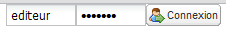

.. _getting_strated:

.. include:: ../../substitutions.txt

Accéder au catalogue et s'identifier
====================================

Accès au catalogue
------------------

Si vous avez installé et démarré |project_name| sur votre ordinateur, l'adresse par défaut
de la page d'accueil est http://localhost:8080/|project_name|. Sinon, utilisez l'adresse qui vous a été fournie par l'administrateur du catalogue.

.. _how_to_login:

Identification
--------------

Vous pouvez utiliser le catalogue sans être identifié. Un utilisateur non identifié (utilisateur anonyme) 
peut effectuer des recherches et accéder à toutes les informations publiques contenues dans le catalogue. 

Pour accéder aux informations non publiques et aux fonctions avancées du catalogue
vous devez disposer de privilèges adéquates. Ces privilèges sont gérés sous la forme de profils 
et de groupes d'utilisateurs. Les profils d'utilisateurs définis dans |project_name| sont décrits brièvements
ci-dessous (dans l'ordre décroissant du nombre de privilèges) :

- Administrateur (administre le catalogue - dispose de tous les droits)
- Administrateur d'utilisateurs (administre un groupe d'utilisateurs)
- Relecteur (dispose des droits pour rendre public des fiches de métadonnées)
- Editeur (crée, modifie et supprime des fiches de métadonnées; les publie pour les groupes auxquels il appartient)
- Utilisateur Enregistré (peut télécharger des données en accès restreint)
- Utilisateur Anonyme (utilisateur non identifié)

Les droits/privilèges associés aux profils d'utilisateurs sont décrits de manière plus approfondie dans le chapitre Administration (cf. :ref:`user_profiles`).

Pour se connecter, il suffit de se rendre sur la page d'accueil, de saisir son nom
d'utilisateur et son mot de passe dans l'angle en haut à droite et de cliquer sur le
bouton de connexion.

   Bouton de connexion au catalogue

Chaque utilisateur inscrit dans le catalogue est membre d'un ou plusieurs groupes d'utilisateurs
ce qui lui donne accès aux ressources particulières de ces groupes.

Compte administrateur par défaut
--------------------------------

Par défaut, une version fraichement installée de |project_name| dispose d'un compte administrateur dont le nom et le mot de passe sont "admin".
Pour une question de sécurité, il est très important de modifier le mot de passe de ce compte dans la page Administration après s'être identifié sous ce compte.