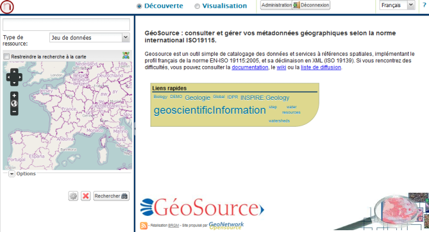
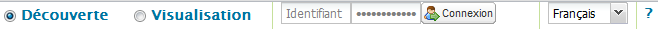
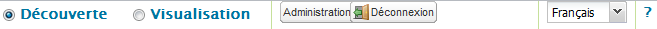
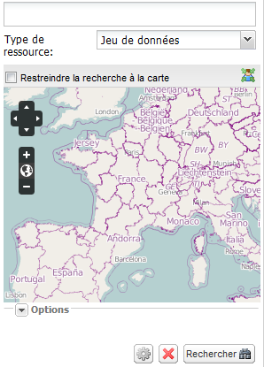
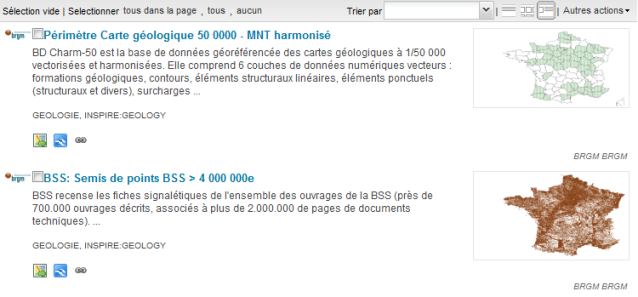
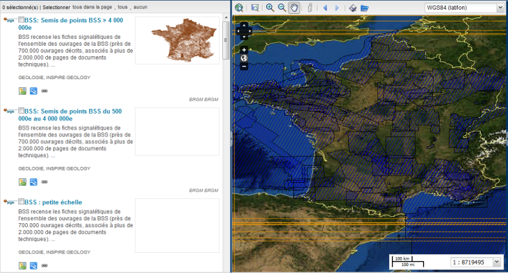
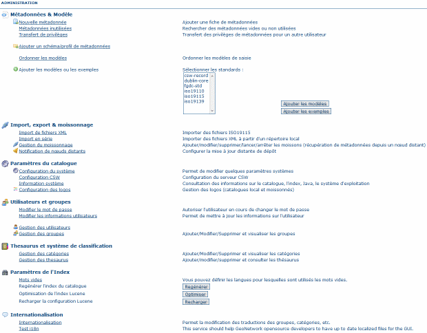

.. _overview:

.. include:: ../../substitutions.txt

Présentation générale de l'interface
====================================



   Vue globale de l'interface du catalogue


Menu principal
--------------

Le menu principal situé dans la partie haute de l'IHM du catalogue
est composé des éléments suivants (de gauche à droite) :

- Boutons Découverte et Visualisation. Le mode Découverte permet de réaliser des recherches sur les ressources cataloguées. 
  Le mode Visualisation permet de les visualiser sur un fond de carte.
- Boutons d'identification
- Liste de sélection de la langue de l'IHM
- Bouton d'aide



   Menu principal lorsque l'utilisateur n'est pas identifié



   Menu principal lorsque l'utilisateur est authentifié

Notez que lorsque l'utilisateur est authentifié deux boutons apparaissent :

- un bouton Administration qui permet à l'utilisateur d'aller sur la page Administration
- un bouton Déconnexion pour quitter une session d'utilisateur authentifié


Page d'accueil
--------------

  
Panneau de recherche
````````````````````

Le panneau "Recherche" situé à gauche de la page d'accueil permet à l'utilisateur de saisir ses critères de recherche. 
Plusieurs modes de recherches sont disponibles :

- Recherche simple (recherche par défaut) : l'utilisateur peut saisir un ou plusieurs termes dans un champ textuel, 
  une zone géographique grâce à la minicarte
- Recherche avancée : l'utilisateur peut appliquer des filtres sur différents champs de métadonnées sémantiques et 
  temporels en plus des critères de la recherche simple

La partie "Options" du formulaire de recherche permet de configurer l'affichage des résultats de la recherche.

Le bouton "Rechercher" lance la recherche.

Le bouton "Réinitialiser" remplace les critères saisis par l'utilisateur par les valeurs par défaut.



   Panneau de recherche simple
  

Panneau des résultats de la recherche
`````````````````````````````````````

Par défaut, les résultats sont triés par ordre de pertinence, par page de 20 ressources.
Chaque résultat fait l'objet d'une description textuelle et graphique. Une série de
bouton permet d'appliquer des actions à la ressource. Ces actions sont différentes en
fonction du profil de l'utilisateur et des privilèges associés à la ressource.



   Exemple d'une ressource présentée dans le résultat d'une recherche
  

La barre d'outils au sommet du panneau des résultats de la recherche permet de changer le mode de tri et 
de présentation des résultats. Les modes de représentations disponibles par défaut sont :

- liste textuelle
- tableau des aperçus
- liste avec l'aperçu


   Barre d'outils pour modifier le mode de tri et de représentation du résultat de la recherche


Mode visualisation
``````````````````

Le mode Visualisation permet d'afficher les emprises des ressources et les données elles-mêmes dans une carte interactive.



  Mode visualisation d'une recherche
  

Page d'administration
---------------------

La page Administration donne accès à toutes les fonctions d'administration du catalogue :

- Métadonnées et modèles
- Import, export et moissonnage
- Paramètres du catalogue
- Utilisateurs et groupes
- Thesaurus et système de classification
- Paramètres de l'index
- Internationalisation



  Page d'administration

Les fonctions d'administration sont détaillées au chapitre :ref:`administration`.
