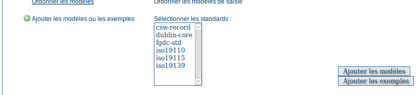

.. include:: ../../substitutions.txt

.. _samplemetadata:

Charger des exemples de métadonnées
===================================

À partir de la page d'accueil, s'authentifier avec le nom d'utilisateur et mot de passe par défaut : admin/admin.

Allez dans la page d'administration, sélectionnez les standards de métadonnées pour lesquels vous souhaitez charger
les modèles et exemples, puis actionnez les boutons *Ajouter les modèles* et *Ajouter les exemples* :

   Ajout des modèles et des exemples de métadonnées
