.. _searchUi:

.. include:: ../substitutions.txt

Recherche et consultation
#########################

Critères de recherche
=====================

|project_name| dispose des critères de recherche suivant par défaut :

- La recherche plein texte permet d'effectuer une recherche sur l'ensemble du contenu de la métadonnées
- Le type de ressource correspond au type de données (décrit dans le descripteur niveau de hiérarchie du standard ISO19115)
- L'emprise géographique de la mini-carte est utilisée comme critère de recherche géographique lorsque la case à cocher est activée
- L'organisation correspond aux organisations en lien avec la métadonnée et/ou la ressource
- Les mots clés
- Les catégories
- La date de mise à jour des métadonnées
- L'étendue temporelle des données
- Le type de représentation spatiale (par exemple "Vecteur")
- Le niveau d'échelle
- Le catalogue source (Cf :ref:`how_to_harvest`)
- pour les utilisateurs authentifiés:
 - Le groupe auquel la métadonnée appartient
 - Le type de métadonnée (modèle de saisie ou métadonnée)
 - Le niveau de validation
 - L'état de la fiche
 
 
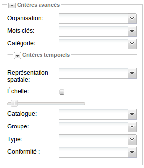

Afin d'améliorer la pertinence des recherches, un mécanisme d'auto-complétion est actif sur les critères :

- Plein texte
- Les organisations
- Les mots clés

Ce mécanisme propose à l'utilisateur des mots clés présents dans les métadonnées du catalogue contenant le mot saisi.

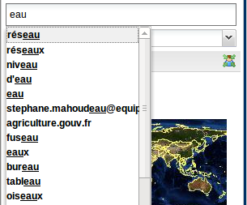

   Mécanisme d'auto-complétion sur la recherche plein text

Options de recherche
====================

La section Options permet de définir :

- L'ordre de tri (par défaut pertinence)
- Le nombre de résultat par page

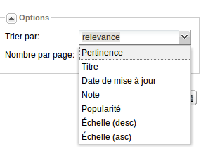

   Options de recherche

Ces options sont également présentes dans la barre d'outil des résultats de recherche.

Les options de tri sont :

- La pertinence : calculer par le moteur de recherche par analyse des critères de recherche et les ressources indexées
- Le titre
- La date de mise à jour
- La note : repose sur les notations des utilisateurs du catalogue
- La popularité : repose sur le nombre de fois où la fiche d'une ressource a été consultée
- L'échelle : le niveau d'échelle

.. _faceted_search:

Recherche à facettes
====================

La recherche à facettes permet un filtrage rapide des résultats. Elle est composée de 2 éléments :

 * une synthèse des résultats par catégories (eg. organisation, type de ressource). Il est possible de 
   sélectionner une valeur pour définir de nouveaux filtres
 * une liste des facettes sélectionnées

.. figure:: facet.png

A partir de chaque facette sélectionnée, il est possible de basculer vers d'autres valeurs.

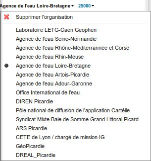

Consultation des résultats
==========================

Le résultat d'une recherche est constitué d'une liste de ressource correspondant aux critères demandés.
Au survol d'une fiche, l'emprise de la ressource est mise en surbrillance sur la(ou les) carte(s). Il est possible de double cliquer 
sur un résultat pour zoomer vers son emprise.

Les modes d'affichage
---------------------

Ces résultats présentent pour chaque élément différentes informations. Celles-ci dépendent du mode d'affichage :

- Mode complet : des informations détaillées sur la ressource sont présentée (titre, résumé, mots-clés, 
  aperçu, catégories, contacts, liens, auteur, date de mise à jour)
- Mode aperçu : le titre et l'aperçu principalement
- Mode simple : le titre et les mots clés donnant une vue rapide des résultats de recherche.

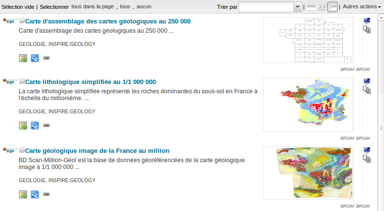

   Mode complet

.. figure:: modeThumbnail.png

   Mode avec aperçu

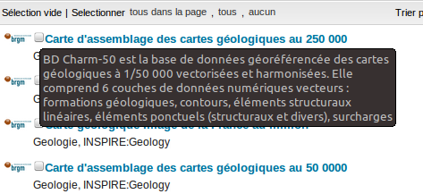

   Mode sous forme de liste

Le mode d'affichage peut être modifié à partir des icônes situées à droite la barre d'outil.

En mode complet, les informations sur le statut de validation de la fiche est disponible. Ce statut est décrit par :

- son état : valide, non valide, non déterminé
- le nombre de règles invalides / le nombre de règles testés pour chaque type de validation (cf. :ref:`metadata_validation`).

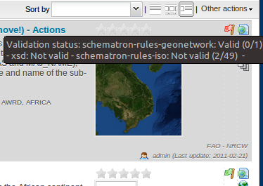

A côté du statut de validation, les icônes correspondent aux catégories auxquelles appartient la ressource.

.. _metadata_view:

Consulter une fiche
-------------------

Pour consulter la fiche, le plus simple est de cliquer sur le titre de la ressource.

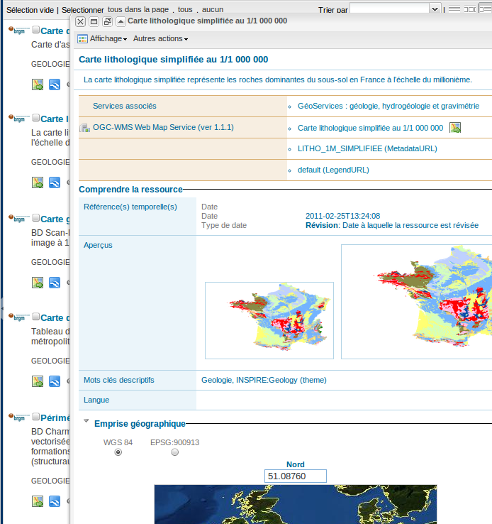

   Fiche de métadonnée en mode consultation

La barre d'outil propose la gestion du mode d'affichage proposant une liste de vue et le menu des actions (cf. :ref:`metadata_actions`).

La vue par défaut est une vue simple présentant :

- le titre et le résumé
- l'ensemble des ressources associées (autres métadonnées, liens vers des sites internet, vers des services OGC, ...)
- une section **Comprendre la donnée**
- une section **Contact**
- une section **Information technique**

.. _window_tools:

Options de la barre de titre
~~~~~~~~~~~~~~~~~~~~~~~~~~~~

La fenêtre de consultation propose les options suivantes dans la barre de titre :

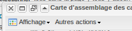

+-----------------------------------+-----------------------+
| Icônes                            | Signification         |
+===================================+=======================+
| .. image:: metadataTools-x.png    | Fermer la fenêtre     |
+-----------------------------------+-----------------------+
| .. image:: metadataTools-max.png  | Maximiser la fenêtre  |
+-----------------------------------+-----------------------+
| .. image:: metadataTools-nw.png   | Nouvelle fenêtre      |
+-----------------------------------+-----------------------+
| .. image:: metadataTools-col.png  | Minimiser             |
+-----------------------------------+-----------------------+

.. _metadata_actions:

Les actions possibles sur une métadonnée
----------------------------------------

Au survol d'une fiche, un menu **Actions** apparaît à la droite du titre pour obtenir plus d'option sur le résultat.

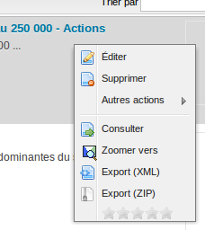

Ce menu propose un ensemble d'actions fonction des privilèges de l'utilisateur :

- Utilisateurs authentifiés

 - **Éditer** pour passer en mode édition (cf. :ref:`metadata_create`)
 - **Supprimer** pour supprimer la fiche
 - **Autres actions**
 
  - **Dupliquer** pour faire une copie de la fiche (sans les données associées ni les aperçus)
  - **Créer un enfant** pour créer une fiche dont la référence vers le parent sera la fiche en cours
  - **Privilèges** pour gérer les droits de visibilités pour la fiche
  - **Catégories**
  
- Tout utilisateur

 - **Consulter** pour ouvrir le mode consultation
 - **Zoomer vers** pour zoomer sur l'emprise de la ressource (également disponible par double clic sur le résultat)
 - **Export XML**
 - **Export ZIP** (cf. :ref:`mef`)
 - **Notation** pour attribuer une note à la fiche
 

Ce menu est accessible par :

- clic droit sur le résultat
- clic sur le menu Actions
- dans la barre d'outil en mode consultation (cf. :ref:`metadata_view`)

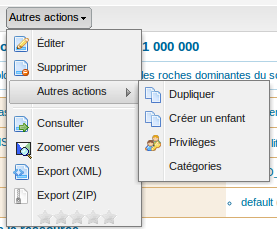

   Ensemble des actions possible sur une métadonnée

Plus d'information sur une ressource
------------------------------------

Dans la page de résultat ou dans la fenêtre de consultation, un certain nombre de boutons permettent de consulter
les ressources associées aux métadonnées. Ces ressources peuvent être de différents types :

+-----------------------------------+---------------------------------+
| Icônes                            | Signification                   |
+===================================+=================================+
| .. image:: link.png               | Lien vers un site internet      |
+-----------------------------------+---------------------------------+
| .. image:: map_go.png             | Ajouter à la carte              |
+-----------------------------------+---------------------------------+
| .. image:: google-earth-link.png  | Ouvrir dans GoogleEarth         |
+-----------------------------------+---------------------------------+
| .. image:: folder_page_white.png  | Télécharger                     |
+-----------------------------------+---------------------------------+

Ces liens sont définis dans la section distribution des métadonnées (cf. TODO).

- **Télécharger** : Selon les privilèges
  associés à chaque résultat, lorsque ce bouton est présent, le jeu de données
  est disponible et téléchargeable. En cliquant sur ce bouton, il est alors possible de télécharger tout
  ou partie des données associées.
- **Carte interactive** : Le service
  cartographique est également fonction des privilèges. Lorsque ce bouton est visible, un
  service WMS (et optionnellement une couche de ce service) ont été déclaré dans la section distribution de cette métadonnée (cf. TODO).
  En cliquant sur ce bouton, le mode visualisation est activé et la couche ajoutée (cf. :ref:`add_wms`).

.. _metadata_selection:

Faire une sélection
-------------------

Il est possible de sélectionner tout ou partie des résultats d'une recherche pour effectuer des actions sur un lot.

Pour sélectionner ou déselectionner un ensemble de fiches utiliser les options dans la barre d'outil :

- tous dans la page
- tous
- aucun

La barre d'outil indique le nombre de fiche dans la sélection en cours.

Pour sélectionner la fiche, cocher la case située à gauche du titre (cf. :ref:`metadata_selection`).

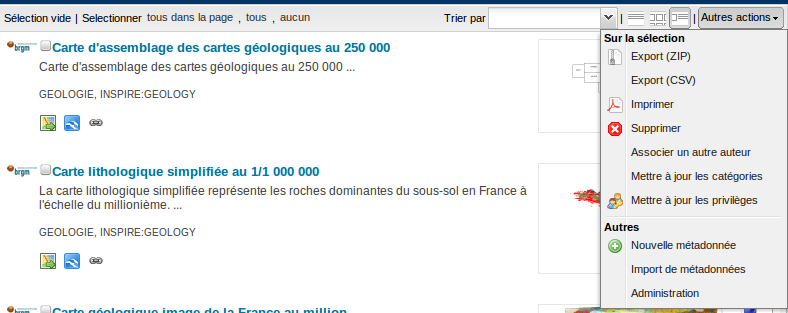

Les actions possible sont accessibles depuis le menu **Autres actions** de la barre d'outil :

- **Export ZIP**
- **Export CSV**
- **Imprimer**
- **Supprimer**
- **Associer un autre auteur**
- **Mettre à jour les catégories**
- **Mettre à jour les privilèges**

Cartographie dynamique
======================

Le module de cartographie dynamique permet la consultation des données au format WMS référencées dans les métadonnées.

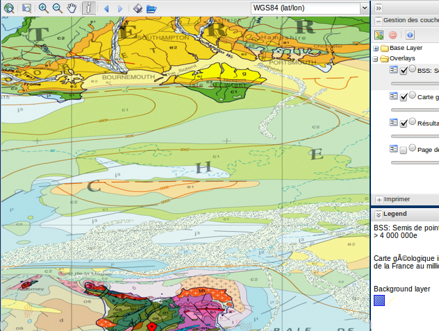

Les fonctionnalités sont :

- navigation (zoom, déplacement, ...)
- intérrogation des couches (GetFeatureInfo)
- sauvegarde/chargement d'une carte (via le format Web Map Context de l'OGC)
- échelle
- légende
- gestion des couches (transparence, information, ordre, ...)
- ajout de couches WMS
- impression PDF

.. _add_wms:

Ajouter une couche depuis un service de visualisation
-----------------------------------------------------

Il est possible d'ajouter des couches à partir des métadonnées du catalogue. 
L'interface d'ajout vous permet de rechercher les services référencés dans le catalogue puis d'interroger
ce service (via le GetCapabilities). Cliquer sur la couche puis le bouton ajouter.

Il est également possible de saisir l'URL d'un service WMS.

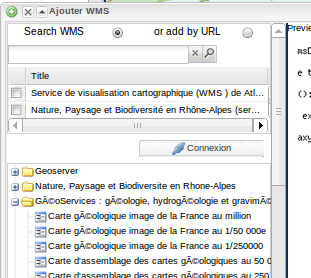

Basculer en mode administration
===============================

Une fois authentifié, il est possible de passer en mode administration avec le bouton placé en haut de la page.

Depuis la barre d'outil des résultats les actions suivantes d'administration sont disponibles :

- **Nouvelle métadonnée** (cf. :ref:`metadata_create`)
- **Import de métadonnée** (cf. :ref:`file_import`)
- **Administration** (cf. :ref:`administration`)

