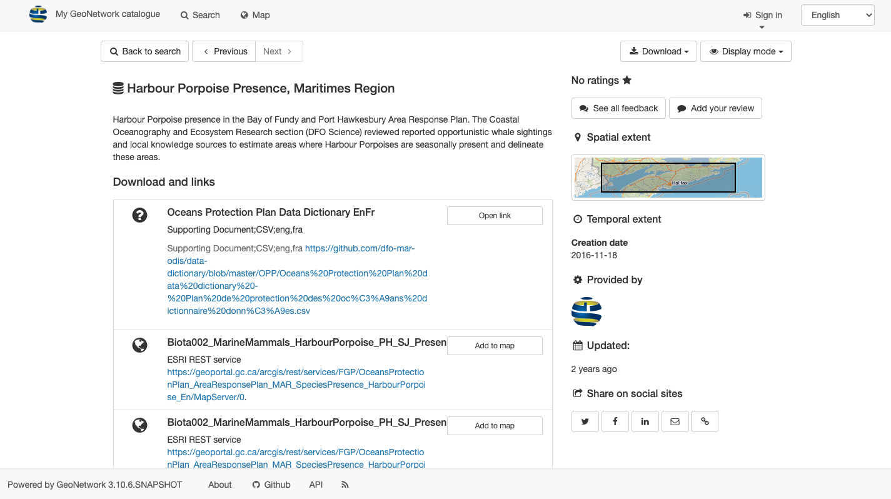

# Voir l'enregistrement {#view-record}

Consultez le contenu de l'enregistrement pour découvrir des détails plus approfondis sur l'enregistrement et le jeu de données décrit.

Localisez l'enregistrement à visualiser :

1.  Utilisez le champ de **recherche**: `Ocean`

2.  Localisez l'enregistrement avec le titre `Ocean`.

    L'arrière-plan de l'enregistrement devient gris lorsque votre souris se trouve au-dessus de l'enregistrement. `Harbour Porpoise Presence, Maritimes Region` l'enregistrement.

    Cliquez sur l'enregistrement à visualiser.

     *Recherche dans l'océan*

3.  Le contenu de l'enregistrement est affiché, en utilisant le mode d'affichage initial **Default View**.

     *Vue par défaut*

4.  Enregistrez les actions pour les visualiser et les télécharger :

    -   Boutons \"**Suivant** \" et \" **Précédent\"** utilisés pour consulter les résultats de la recherche.
    -   **Téléchargement** utilisé pour [exporter les enregistrements](download.md#download-from-record-view) sous forme de `ZIP`, `XML` ou `PDF`.
    -   Le menu déroulant **Mode d'affichage** permet de passer de l'**affichage par défaut** à l'**affichage complet** (voir la section suivante).

     *Enregistrer les actions*

## Vue par défaut {#default-view}

La **vue par défaut** fournit un résumé rapide du contenu de l'enregistrement :

1.  Utilisez le menu déroulant **Mode d'affichage** pour sélectionner l'**affichage par défaut**.

     *Modifier le mode d'affichage pour passer à l'affichage par défaut*

2.  Le titre et la description de l'enregistrement sont affichés en haut de la page.

     *Description de l'enregistrement*

3.  **À propos de cette ressource** fournit des informations sur le contenu, telles que la catégorie du sujet.

     *À propos de cette ressource*

4.  Les**informations techniques** fournissent des détails sur le format des données.

     *Informations techniques*

5.  Les**informations sur les métadonnées** fournissent un bouton pour télécharger l'enregistrement XML, les informations de contact et l'identifiant unique.

     *Informations sur les métadonnées*

6.  Sur le côté droit :

    -   L'**étendue spatiale** est représentée visuellement sur une carte.
    -   Informations sur les mises à jour et le retour d'information.

     *Vue par défaut*

## Vue d'ensemble {#full-view}

La **vue complète** est utilisée pour afficher le contenu complet de l'enregistrement.

1.  Utilisez le menu déroulant du **mode d'affichage** pour sélectionner **Vue complète**.

2.  La vue avancée divise l'enregistrement en plusieurs onglets :

    -   Identification
    -   Distribution
    -   Qualité
    -   Représentation spatiale
    -   Systèmes de référence
    -   Métadonnées

3.  L'onglet **Identification** fournit les informations suivantes

    -   Informations sur les citations :

         *Détails de la citation*

    -   Statut et contraintes juridiques (telles que la politique de diffusion des données).

         *Résumé et mots-clés*

    -   Informations complémentaires, y compris l'étendue temporelle et spatiale

         *Informations d'identification supplémentaires*

4.  L'onglet **Distribution** précise les modalités d'accès au contenu.

     *Détails de la distribution des données*

5.  L'onglet **Qualité** répertorie les informations relatives à la qualité des données.

     *Détails sur la qualité des données*

6.  L'onglet **Représentation spatiale** fournit un résumé de la représentation spatiale.

     *Détails de la représentation spatiale*

7.  L'onglet **Système de référence** contient des informations sur le système de référence spatiale utilisé.

    Il est fourni sous la forme d'un code lisible par machine au système de référence.

    L'exemple utilise le code `http://www.opengis.net/def/crs/EPSG/0/26917` pour le `NAD83 / UTM zone 17N]` système de référence.

8.  L'onglet **Métadonnées** couvre l'identifiant unique du fichier et fournit un lien pour consulter le document XML, ainsi que des informations sur le point de contact pour l'enregistrement.

     *Enregistrer les détails des métadonnées*

## Enregistrement XML {#xml-record}

1.  L'enregistrement XML peut être affiché à partir de l'un ou l'autre :

    -   L'en-tête**View** metadata**par défaut** comporte un bouton **Download met** adata.

         *Vue par défaut des métadonnées de téléchargement*

    -   L'onglet métadonnées de l'**affichage complet** fournit un lien vers **XML**.

         *Vue complète des métadonnées de téléchargement*

2.  Le fichier XML est téléchargé ou affiché directement dans votre navigateur.

     *Le téléchargement XML s'affiche dans FireFox*

3.  Gardez à l'esprit que l'enregistrement XML n'inclut pas les documents joints ou les vignettes.

    Pour télécharger les informations complètes sur les enregistrements, voir la section [téléchargement](download.md).
