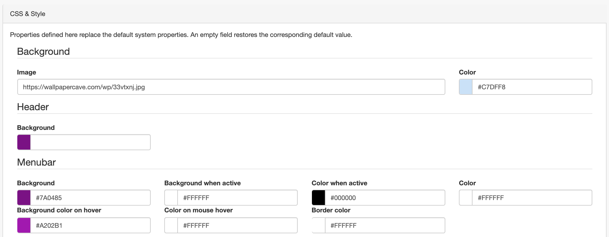
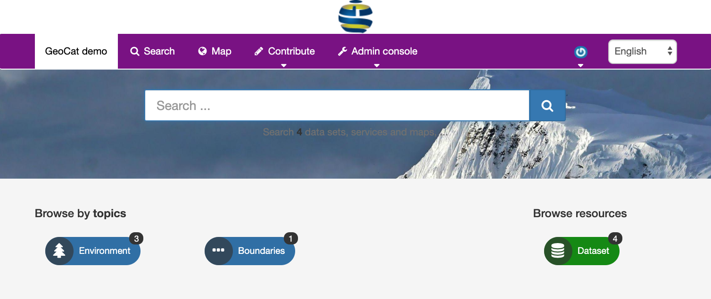

# Configuring CSS & Style {#css-configuration}

To get to the CSS & Style configuration, you must be logged on as administrator. Open 'Settings' from the Administration page and select ``CCS & Style`` configuration.

This page allows you to change various colors of page elements. Note that 'background' refers to the background color of elements, and 'color' to the font color used in the element. The above configuration will result in the visualization below:

There is also an option to link to a background image. When linking to an image, make sure to use (the full web address to) an image from a https source if you're running GeoNetwork in https. Placing the image (upload as logo) on the same server is the best option to prevent potential browser blocks.

Note that you can save a configuration locally for reuse later or on alternative servers. Saving a configuration will take a long time, because all scripts and styles will be rebuilt from sources. Temporary files are stored on the server in an application folder, you may need to revisit this page after an upgrade the system (or redeploy of a docker container).
