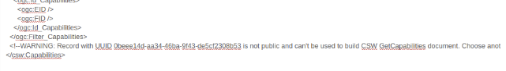

# Configuring CSW {#csw-configuration}

To get to the CSW server configuration, you must be logged on as administrator first. Open 'Settings' from the Administration page and select CSW Server configuration.


The CSW service provides a description of itself, the human who administers it, and other information through a `GetCapabilities` request (eg. <http://localhost:8080/geonetwork/srv/en/csw?request=GetCapabilities&service=CSW&version=2.0.2>). This form allows you to configure the CSW server and fill out some of the properties returned in response to a GetCapabilities request.

Configuration options:

-   *CSW Enabled*: By default CSW endpoint is enabled, but it can be disabled.

    

    The Open Geospatial Catalogue Service for the Web (OGC-CSW) service, is a self-describing service that allows query, update and insertion of metadata records.

-   *Record to use for GetCapabilities*: The capabilities document is created using the record selected here.

-   *Inserted metadata is public*: By default, metadata inserted with the CSW Harvest and CSW Transaction operations is not publicly viewable. A user with the appropriate access rights could do this after the CSW Harvest and CSW Transaction operations, but this is not always convenient. If this option is checked all metadata inserted using the CSW Harvest and CSW Transaction operations will be publicly viewable.

-   *Create element if it does not exist when using XPath in CSW transaction.*: If not checked, only existing elements can be updated.

## Service Metadata Record {#csw-configuration_service_record}

In order to create a custom capabilities, it is recommended to create a dedicated service metadata record (using ISO19115-3 or ISO19139 standards). This record is used to build the capabilities document using the template `web/src/main/webapp/xml/csw/capabilities.xml`.

When creating such record, the following information will be used to create the capabilities:

-   title
-   abstract
-   keywords
-   fees (from Distribution --> ordering instructions field)
-   Access constraints (from Access constraints --> Other constraints field)
-   Contact (from Identification --> First point of contact)

The service record MUST be public.

If an error occurred while building the capabilities document from the service record, a WARNING is reported using a comment and the default capabilities is used:



## CSW Configuration for INSPIRE {#csw-configuration_inspire}

If your catalogue also focus on INSPIRE (see [Configuring for the INSPIRE Directive](inspire-configuration.md)), it may be relevant to also populate the following to properly configure your discovery service:

-   metadata language (+ additional languages if any) (use for SupportedLanguages, DefaultLanguage)
-   INSPIRE themes
-   temporal coverage
-   metadata contact
-   metadata conformity regarding Commission regulation 1089/2010

With this information the CSW can be validated using the INSPIRE validator.

## CSW post processing

In some situation, user may want to modify XML encoding of records when retrieved using CSW. For example:

-   to make record more consistent
-   to adapt encoding in order to validate records with INSPIRE rules (eg. as a workaround for workaround for <https://github.com/inspire-eu-validation/community/issues/95>)

For this, user can add extra conversion step during output of GetRecords and GetRecordById operation:

-   Adding post process to srv/eng/csw by creating for each output schema a file eg. for gmd, present/csw/gmd-csw-postprocessing.xsl
-   Adding post process to a portal inspire/eng/csw by creating for each output schema a file eg. for gmd, present/csw/gmd-inspire-postprocessing.xsl

For a portal INSPIRE, create an "inspire" portal in the admin --> settings --> sources. User can then setup a post processing phase for the INSPIRE CSW of the portal. Create a post processing file gmd-inspire-postprocessing.xsl in yourschema/present/csw folder. The following example, remove contact with no email and link not starting with HTTP to conform to INSPIRE validator rules.

``` xml
<?xml version="1.0" encoding="UTF-8"?>
<xsl:stylesheet version="2.0" xmlns:xsl="http://www.w3.org/1999/XSL/Transform"
                xmlns:gn="http://www.fao.org/geonetwork"
                xmlns:gmd="http://www.isotc211.org/2005/gmd"
                xmlns:gco="http://www.isotc211.org/2005/gco"
                xmlns:srv="http://www.isotc211.org/2005/srv"
                exclude-result-prefixes="#all">

  <!-- Remove all contact not having an email -->
  <xsl:template match="*[gmd:CI_ResponsibleParty
                         and count(gmd:CI_ResponsibleParty/gmd:contactInfo/*/gmd:address/*/gmd:electronicMailAddress[*/text() != '']) = 0]"
                priority="2"/>

  <!-- Remove all online source not using HTTP to conform with
  https://github.com/inspire-eu-validation/community/issues/95
  -->
  <xsl:template match="*[gmd:CI_OnlineResource
                         and count(gmd:CI_OnlineResource/gmd:linkage/gmd:URL[not(starts-with(text(), 'http'))]) > 0]"
                priority="2"/>


  <!-- Remove geonet:* elements. -->
  <xsl:template match="gn:*" priority="2"/>

  <!-- Copy everything. -->
  <xsl:template match="@*|node()">
    <xsl:copy>
      <xsl:apply-templates select="@*|node()"/>
    </xsl:copy>
  </xsl:template>
</xsl:stylesheet>
```

The service can be tested with:

``` shell
curl 'http://localhost:8080/geonetwork/inspire/eng/csw' \
  -H 'Content-type: application/xml' \
  --data-binary $'<csw:GetRecordById xmlns:csw="http://www.opengis.net/cat/csw/2.0.2" service="CSW" version="2.0.2"                   outputSchema="http://www.isotc211.org/2005/gmd"><csw:ElementSetName>full</csw:ElementSetName><csw:Id>3de9790e-529f-431f-ac4f-e86d827bde8e</csw:Id>\n</csw:GetRecordById>'
```
