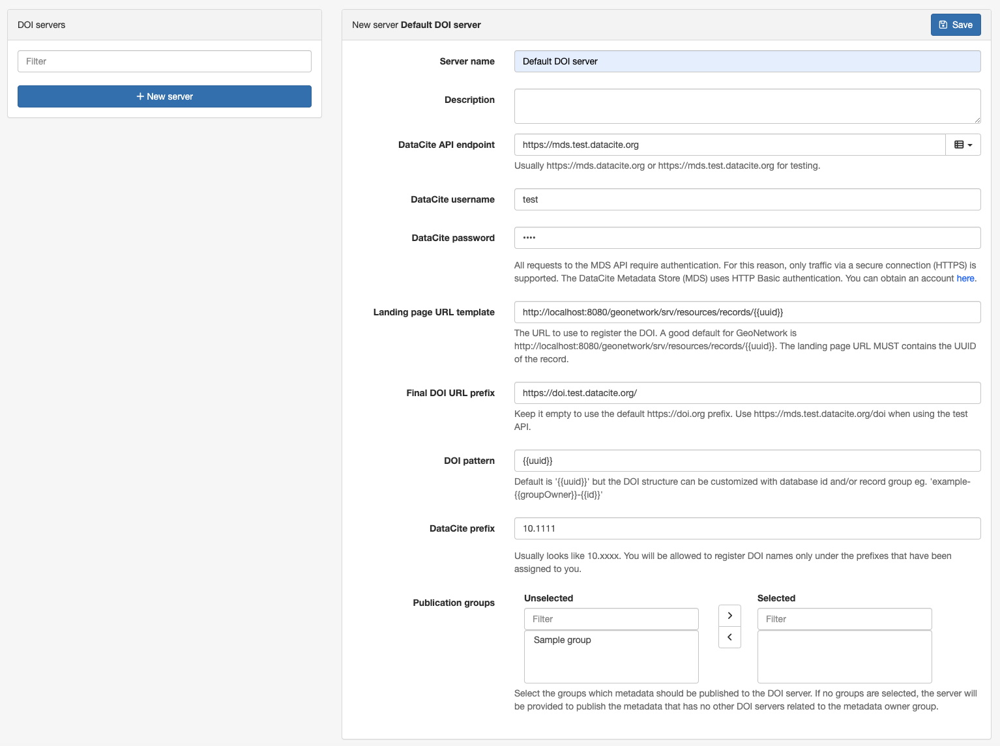

# DOI configuration {#doi-configuration}

This page describes how an administrator configures the catalogue to create Digital Object Identifiers (DOI) for metadata records. See [Digital Object Identifier (DOI)](../../user-guide/associating-resources/doi.md) in the user guide for how to request and create a DOI for a record.

## Settings

In `Admin console` --> `Settings` --> `Publication`:

-   **Enable DOI publication** Enables the creation of DOI for metadata records.
-   **Notify DOI task owner** Sends a mail notification to the DOI task owner when a metadata DOI is published. It requires the mail server to be configured (see [Feedback](system-configuration.md#system-config-feedback)).

## DOI servers

The catalogue supports DOI creation using:

-   [DataCite API](https://support.datacite.org/docs/mds-api-guide).
-   EU publication office API <https://ra.publications.europa.eu/servlet/ws/doidata?api=medra.org>

Configure the DOI API access point to publish the metadata in the `Admin console --> Settings --> DOI servers`:

Provide the following information:

- `Name`: A descriptive name for the server.
- `Description`: (Optional) A verbose description of the server.
- `DataCite API endpoint`: The API url, usually https://mds.datacite.org or https://mds.test.datacite.org for testing.
- `DataCite username` / `DataCite password`: Credentials required to publish the DOI resources.
- `Landing page URL template`: The URL to use to register the DOI. A good default for GeoNetwork is http://localhost:8080/geonetwork/srv/resources/records/{{uuid}}. The landing page URL MUST contains the UUID of the record.
- `Final DOI URL prefix`: (Optional) Keep it empty to use the default https://doi.org prefix. Use https://mds.test.datacite.org/doi when using the test API.
- `DOI pattern`: Default is `{{uuid}}` but the DOI structure can be customized with database id and/or record group eg. `example-{{groupOwner}}-{{id}}`.
- `DataCite prefix`: Usually looks like `10.xxxx`. You will be allowed to register DOI names only under the prefixes that have been assigned to you.
- `Record groups`: (Optional) When creating a DOI, only DOI server(s) associated with the  selected record group(s) will be suggested in the editor. If a record belongs to a group that is not matched against any DOI server, only DOI servers without associated groups will be suggested.

A record can be downloaded using the DataCite format from the API using: `http://localhost:8080/geonetwork/srv/api/records/da165110-88fd-11da-a88f-000d939bc5d8/formatters/datacite?output=xml`

## Customizing the DataCite mapping {#doi-datacite-mapping}

The mapping between the metadata standards and the DataCite format (see [the mapping table](../../user-guide/associating-resources/doi.md#creating-the-doi)) can be customized in:

-   ISO19139 `schemas/iso19139/src/main/plugin/iso19139/formatter/datacite/view.xsl`
-   ISO19115-3.2018 `schemas/iso19115-3.2018/src/main/plugin/iso19115-3.2018/formatter/datacite/view.xsl`
