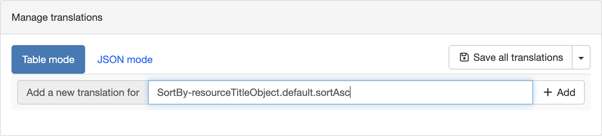
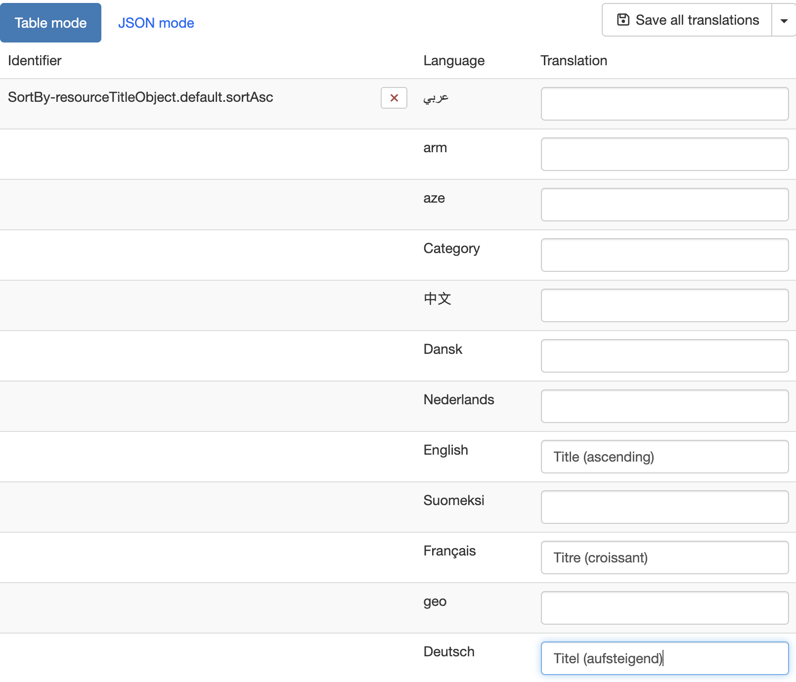
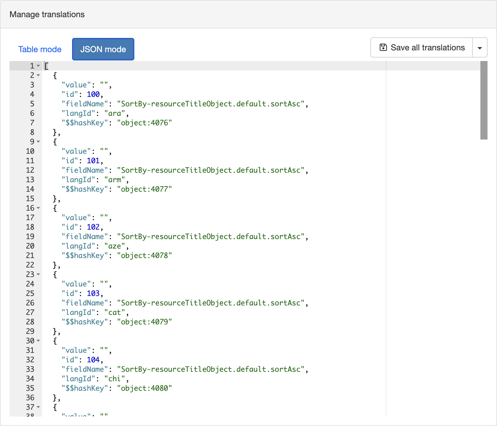

# Languages and translations

Go to `Admin console` --> `Settings` --> `Languages and translations` to manage the languages registered in the catalog and to add or override any translation used in the user interface.

The `Registered languages in database` panel lists the languages stored in the database, used for database entities such as group names or portal titles. This is not the list of languages offered to catalog users, which is configured separately (see [User Interface Configuration](user-interface-configuration.md)).

The `Manage translations` panel lets an administrator add a translation for any key used by the application, or override an existing one, without rebuilding the application. For example, this is useful when configuring the [Application banner](system-configuration.md#application-banner) message, if you want to improve the choice of words, or need to add a label for which no translation exists in your language yet.

-   **Table mode** Enter the key to translate in the `Add a new translation for` field and click `Add`. This creates one translation field per registered language for that key.

-   **JSON mode** Provides direct access to the same data as a JSON array, which can be useful to review or edit several translations at once.

Once the translations are entered, click `Save all translations` to persist them.

!!! tip "Finding the key of an untranslated string"

    When the interface has no translation for a key, it displays the raw key instead of a readable label, for example `SortBy-resourceTitleObject.default.sortAsc` in a sort-by dropdown. If you come across this, copy the text exactly as shown and use it as the key in the `Manage translations` panel to add the missing translation.
