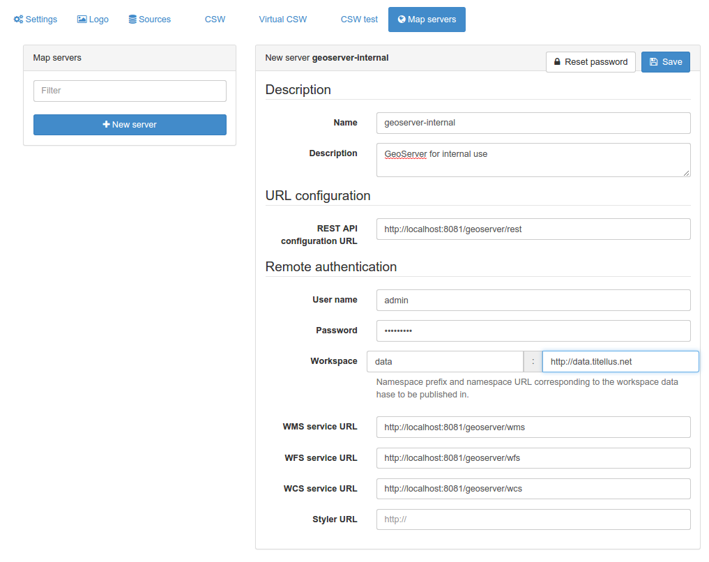

# Map servers configuration for geopublication {#map-server-configuration}

To publish information from the catalog as OGC services (WMS, WFS, WCS), catalog administrator need to register one or more map servers to publish on. Map servers MUST support the GeoServer REST API in order to work with the catalog. The 2 following implementations have been tested:

-   [GeoServer](http://geoserver.org)
-   [Mapserver](http://mapserver.org) and [Mapserver REST API](https://github.com/neogeo-technologies/mra)

Setup you map server and then register it from the administration interface:

The following parameters are required:

-   Name: The map server label which will be displayed when geopublishing information.
-   Description: The map server description.
-   REST API configuration: The URL of the service providing access to the remote configuration using the REST API.
-   Username and password to be used to connect to the REST API.
-   Workspace prefix and URL: The workspace information in which data will be pushed into.
-   WMS/WFS/WCS service URL: URLs of services which will be used when adding references to the services in the metadata record after publication.

See [Publishing GIS data in a map server](../../user-guide/workflow/geopublication.md).
