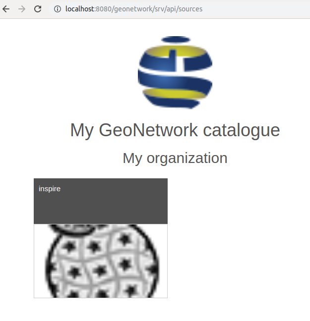

# Portal configuration

Portals can be configured under the `sources` section in `admin console` --> `settings`.

There are 3 types of sources:

-   the main catalogue,
-   sub-portal, which can be a subset of the main catalogue
-   harvesters.

The main catalogue corresponds to the current installation.

When harvesting, at least one source is created to represent the harvester. When harvesting from another GeoNetwork node, sources from the target catalogue are also harvested to keep track of the true origin of records. This only applies to the GeoNetwork protocols which use MEF ([Metadata Exchange Format (MEF)](../../annexes/mef-format.md)) which contain the source catalogue information.

The last type is sub-portal, which is described in details below.

## Configuring a sub-portal

Sub-portals can be used to create a space in the main catalogue only focusing on a subset of records.

A sub-portal is defined by:

When creating a sub-portal with an identifier `ìnspire` for example, a new entry point on your catalogue will be available: <http://localhost:8080/geonetwork/inspire/>. Accessing the catalogue through it will only provide access to records matching the filter defined for this sub-portal. The `search filter` parameter value uses the Lucene query parser syntax (see <http://lucene.apache.org/java/2_9_1/queryparsersyntax.html>) and is applied to all searches.

User privileges apply as in the main instance.

The logo and name of the sub-portal will be displayed instead of the main instance information in case the option `Display in the portal switcher` is selected:

A CSW service is also available for this sub-portal <http://localhost:8080/geonetwork/inspire/eng/csw> (and replacing the virtual CSW feature).

A sub-portal can also use a specific user interface configuration.

The list of sub-portal available is at <http://localhost:8080/geonetwork/srv/api/sources>

## Example of usage

### Creating an INSPIRE directive sub-portal

For the INSPIRE directive, a catalogue administrator needs to publish an entry point providing access only to INSPIRE related records. An INSPIRE sub-portal can be created with a filter on keywords `+thesaurusName:"GEMET - INSPIRE themes, version 1.0"`.

### Creating a sub-portal for partners

Some organizations need to open the catalogue to a set of partners. In such cases, each partner generally accesses the catalogue and creates their records in dedicated groups. A good example is <https://www.geocat.ch/> providing a main search filter `catalogue`.

The concept of a sub-portal allows the possibility of creating a dedicated URL for each partner. The header can contain the partner identification with name and logo. Optionally the user interface can also be customized (see [User Interface Configuration](user-interface-configuration.md)).

To setup this kind of configuration, the basic principle is to have:

-   One group for each partner with one or more users
-   One sub-portal for each partner with a filter matching records in that group

To configure this, apply the following steps:

-   Create a group for the partner eg. `oca` (see [Creating group](../managing-users-and-groups/creating-group.md)).
-   Create at least one user for the partner (see [Creating user](../managing-users-and-groups/creating-user.md)). The user must be member of the group `oca`. If you want the user to be able to configure the sub-portal (eg. change the name, choose a logo), the user must have at least the `UserAdmin` profile for the group `oca`.
-   Create a sub-portal. This can have the same name as the group, eg. `oca` but this is not essential. The filter can be created using the fact that a record published in the group `oca` should be in this sub-portal, using the syntax `+_groupPublished:oca`. Once created the sub-portal is accessible at <http://localhost:8080/geonetwork/oca>.
-   (Optional) Link the sub-portal to a user admin group to allow `UserAdmin` to configure their sub-portal.

With this type configuration, ie. one partner = one group = one sub-portal and users are only member of one group, then when connecting to a partner sub-portal:

-   user will only see records published in that group in the entire application
-   when creating new records, no group selection is provided because user is member of one group only

Remember that a record is visible in the `oca` sub-portal because it is published in the group `oca`:

If the `publish` operation is removed from `oca` group, then records will not longer be visible in that sub-portal.

In some situations, you also want to share templates among partners. There are 2 options for this:

-   Publish the template in all partner's groups. The main drawback in this case is that if a new group is added, the templates need to be published to that new group.
-   Create a dedicated group for shared records eg. `sharedGroup`. Publish templates in that shared space. Alter the sub-portal filter to match either the partner group or the shared one. `+_groupPublished:(oca OR sharedGroup)`.
