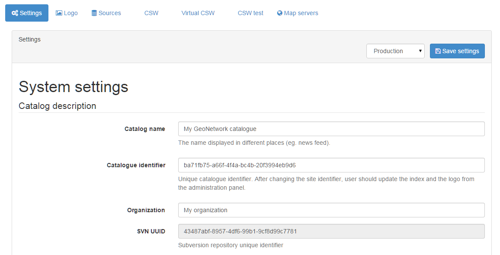
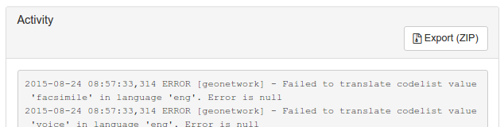
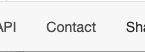
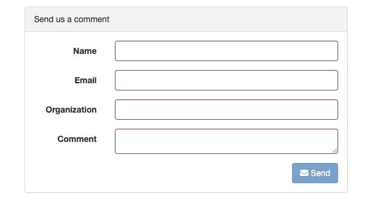
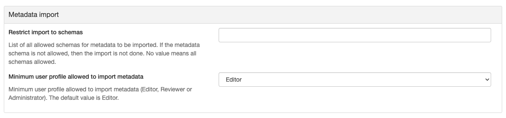
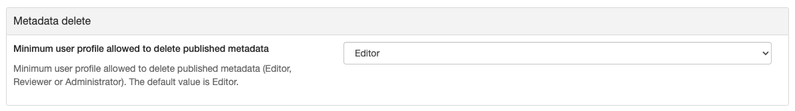
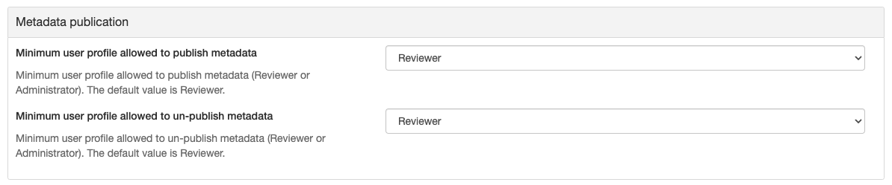
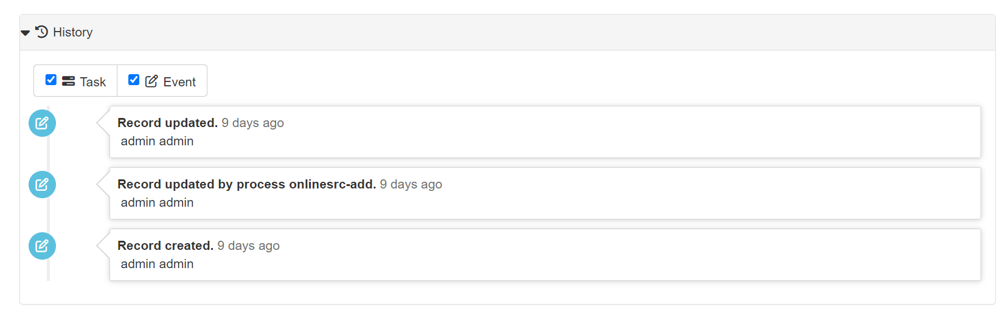
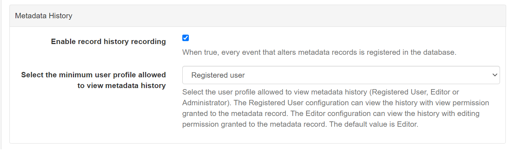

# System configuration

Most of the system configuration parameters can be changed by administrator users using the web interface in `Admin console` --> `Settings`.

!!! info "Important"

    Configuration of these parameters is critically important for the catalog in an operational context. Misunderstanding some settings may result in a system that does not function as expected. For example, downloads may fail to be correctly processed, or metadata harvesting from other servers may not work.

Since the settings form is a long form, the `save` button is repeated between the sections and will save all settings.

## Catalog description

-   **Catalog name** The name of the node. Information that helps identify the catalogue to a human user. The name is displayed on the banner, in the CSW GetCapabilities.
-   **Catalog identifier** A universally unique identifier (uuid) that distinguishes your catalog from any other catalog. This a unique identifier for your catalogue and its best to leave it as a uuid. It will be used by harvester using GeoNetwork protocol to identify the source catalog.
-   **Organization** The organization the node belongs to. Again, this is information that helps identify the catalogue to a human user.
-   **SVN UUID** Subversion repository attached to the node. This identifier is created and/or checked on startup to verify that the database match the SVN repository. The repository is used for metadata versioning.

## Catalog

-   **Version** The version of the catalog (readonly, version of the database)
-   **Minor version** The minor version of the catalog (readonly, version of the database)

## Catalog Server {#system-config-server}

-   **Host** The node's name or IP number (without <http://>). For example, they are used during metadata editing to create resource links and when returning the server's capabilities during a CSW request.
    -   If your node is publicly accessible from the Internet, you have to use the domain name.
    -   If your node is hidden inside your private network and you have a firewall or web server that redirects incoming requests to the node, you have to enter the public address of the firewall or web server. A typical configuration is to have an Apache web server on address A that is publicly accessible and redirects the requests to a Tomcat server on a private address B. In this case you have to enter A in the host parameter.
-   **Port** The server's port number (usually 80 or 8080). If using HTTP, set it to 80.
-   **Preferred Protocol** Defined the protocol to access the catalog. The HTTP protocol used to access the server. Choosing http means that all communication with the catalog will be visible to anyone listening to the protocol. Since this includes usernames and passwords this is not secure. Choosing https means that all communication with the catalog will be encrypted and thus much harder for a listener to decode.
-   **Log level** Define the logging level of the application. After modification, log can be checked in the `Statistics & status` section under `Activity`.

## Intranet parameters

A common need for an organisation is to automatically discriminate between anonymous internal users that access the node from within an organisation (Intranet) and anonymous external users from the Internet. The catalog defines anonymous users from inside the organisation as belonging to the group *Intranet*, while anonymous users from outside the organisation are defined by the group *All*. To automatically distinguish users that belong to the Intranet group you need to tell the catalog the intranet IP address and netmask.

-   **Network** The intranet address in IP form (eg. 147.109.100.0). It can be a comma separated list of IP addresses.
-   **Netmask** The intranet netmask (eg. 255.255.255.0). Define as many netmask and IP addresses.

If intranet parameters are empty, the group *Intranet* will not be displayed in the sharing panel.

## Proxy server

The settings page offers to set the configuration of a proxy server. This configuration is used by the application to access the internet to get online resources, for example as part of a harvest process.

-   **Use proxy** Enable the proxy in case the catalog is behind a proxy and need to use it to access remote resources.
-   **Proxy Host** The proxy IP address or name
-   **Port** The proxy port
-   **Proxy username** The username
-   **Proxy user password** The username password
-   **Ignore host list** To bypass specific hosts enter a specific IP address or host name such as www.mydomain.com or an address range using wildcards, such as 192.168.2.*. Use | to separate the different host values.

JVM proxy parameters may also be required to properly set the proxy for all remote access.

## Feedback {#system-config-feedback}

Email may be sent by the catalog.

-   you are using the User Self-registration system
-   you are using the metadata status workflow (See [Life cycle](../../user-guide/workflow/life-cycle.md))
-   a file uploaded with a metadata record is downloaded and notify privilege is selected

This section configure the mail server to use.

-   **Email** This is the administrator's email address used to send feedback.
-   **SMTP host** The mail server name or IP address to use for sending emails.
-   **SMTP port** The SMTP port.
-   **Use SSL** Enable SSL mode
-   **User name** Username if connection is required on the SMTP server
-   **Password** Username password if connection is required on the SMTP server

## Metadata search results

Configuration settings in this group determine what the limits are on user interaction with the search results.

-   **Maximum Selected Records** The maximum number of search results that a user can select and process with the batch operations eg. Set Privileges, Categories etc. This parameter avoid to trigger long action which could generate out of memory error.

## Catalog Service for the Web (CSW)

See [Configuring CSW](csw-configuration.md).

## Shibboleth

See [Configuring Shibboleth](../managing-users-and-groups/authentication-mode.md#authentication-shibboleth).

## User self-registration

Enable the self registration form. See [User Self-Registration](../managing-users-and-groups/user-self-registration.md).

You can configure optionally re-Captcha, to protect you and your users from spam and abuse. And a list of email domains (separated by commas)
that can request an account. If not configured any email address is allowed.

## User application feedback

Enabling the setting, displays in the application footer a link to a page that allows sending comments about the application.

It requires an email server configured.

## Link in metadata records

!!! warning "Deprecated"

    3.0.0 Defined by the formatter.

## Metadata rating

If enabled, the catalog will calculate user ratings for metadata from this node only (not distributed among other GeoNetwork nodes). This only applies to records harvested using the GeoNetwork protocol.

## Metadata XLink {#xlink_config}

The XLink resolver replaces the content of elements with an attribute @xlink:href (except for some elements like srv:operatesOn) with the content obtained from the URL content of @xlink:href. The XLink resolver should be enabled if you want to harvest metadata fragments or reuse fragments of metadata in your metadata records (eg. when using a contact directory).

-   **Enable XLink resolution**: Enables/disables the XLink resolver.
-   **Enable local XLink** Local XLinks are using local://<lang>/<service> URL to make references to related sections instead of HTTP URL. Local XLinks are usually faster than HTTP XLinks.

!!! info "See Also"

    To improve performance the catalog will cache content that is not in the local catalog. Clear the cache of XLink from the `Admin console` --> `Tools` if the fragments were updated.

## Metadata update

For each metadata schema, the catalog has an XSL transformation (`update-fixed-info.xsl`) that it can apply to a metadata record belonging to that schema. The aim of this transformation is to allow fixed schema, site and catalog information to be applied to a metadata record every time the metadata record is saved in the editor. As an example, this transformation is used to build and store the URL of any files uploaded and stored with the metadata record in the editor.

-   **Automatic Fixes**: Enabled by default. It is recommended you do not use the metadata editor when auto-fixing is disabled. See <http://trac.osgeo.org/geonetwork/ticket/368> for more details.

## Search Statistics {#search_stats_config}

Enables/disables search statistics capture. Search statistics are stored in the database and can be queried using the `Search Statistics` page.

There is very little compute overhead involved in storing search statistics as they are written to the database in a background thread. However database storage for a very busy site must be carefully planned.

## Open Archive Initiative (OAI-PMH) Provider

Options in this group control the way in which the OAI Server responds to OAIPMH harvest requests from remote sites.

-   **Datesearch**: OAI Harvesters may request records from GeoNetwork in a date range. GeoNetwork can use one of two date fields from the metadata to check for a match with this date range. The default choice is *Temporal extent*, which is the temporal extent from the metadata record. The other option, *Modification date*, uses the modification date of the metadata record in the GeoNetwork database. The modification date is the last time the metadata record was updated in or harvested by GeoNetwork.
-   **Resumption Token Timeout**: Metadata records that match an OAI harvest search request are usually returned to the harvester in groups with a fixed size (eg. in groups of 10 records). With each group a resumption token is included so that the harvester can request the next group of records. The resumption token timeout is the time (in seconds) that GeoNetwork OAI server will wait for a resumption token to be used. If the timeout is exceeded GeoNetwork OAI server will drop the search results and refuse to recognize the resumption token. The aim of this feature is to ensure that resources in the GeoNetwork OAI server are released.
-   **Cache size**: The maximum number of concurrent OAI harvests that the GeoNetwork OAI server can support.

Restart the catalog to take all OAI settings into account.

## INSPIRE Directive configuration

See [Configuring for the INSPIRE Directive](inspire-configuration.md).

## INSPIRE Atom Feed

Allows to define the configuration of Atom Feeds referenced by the metadata to provide services related to the [INSPIRE technical guidance for download services](https://inspire.ec.europa.eu/documents/Network_Services/Technical_Guidance_Download_Services_3.0.pdf):

-   Select the type of atom feed:

    -   Remote: retrieve the atom feeds referenced by the metadata in the online resources.
    -   Local (to implement in future versions): create the atom feed using the metadata content.

-   Schedule for feed retrieval: the retrieval of the atom feeds can be scheduled to be done periodically.

-   Atom protocol value: value of the protocol in the metadata online resources to identify the atom feed resources (the default value is INSPIRE Atom). GeoNetwork identifies an Atom file from other resources by looking at the protocol value of the onlineresource. Since there is no general accepted value for this protocol, GeoNetwork allows an administrator to set the value to be used as protocol identifying Atom resources:

        <gmd:transferOptions>
            <gmd:MD_DigitalTransferOptions>
              <gmd:onLine>
                <gmd:CI_OnlineResource>
                  <gmd:linkage>
                    <gmd:URL>http://geodata.nationaalgeoregister.nl/atom/index.xml</gmd:URL>
                  </gmd:linkage>
                  <gmd:protocol>
                    <gco:CharacterString>INSPIRE Atom</gco:CharacterString>
                  </gmd:protocol>
                </gmd:CI_OnlineResource>
              </gmd:onLine>
            </gmd:MD_DigitalTransferOptions>
          </gmd:transferOptions>

The following services are available:

-   <http://SERVER/geonetwork/opensearch/eng/UUID/OpenSearchDescription.xml>
-   <http://SERVER/geonetwork/opensearch/eng/UUID/search?queryParams>
-   <http://SERVER/geonetwork/opensearch/eng/search?queryParams>
-   <http://SERVER/geonetwork/opensearch/eng/UUID/describe?queryParams>
-   <http://SERVER/geonetwork/opensearch/eng/describe?queryParams>

In above URLs {UUID} is the fileidentifier of the download service metadata.

In the service feed of your download service make sure to add the GeoNetwork OpenSearch endpoint as the OpenSearchDescription for the service:

    <link rel="search" href="http://SERVER/geonetwork/opensearch/eng/{uuid}/OpenSearchDescription.xml" 
    type="application/opensearchdescription+xml" title="Open Search document for INSPIRE Download service"/>

The INSPIRE Atom/OpenSearch implementation can be verified with the Atom tests in Esdin Test Framework (<http://elfproject.eu/documentation/geotool/etf>) or INSPIRE metadata validator (<http://inspire-geoportal.ec.europa.eu/validator2>).

## Multi-Threaded Indexing

Configuration settings in this group determine how many processor threads are allocated to indexing tasks in GeoNetwork. If your machine has many processor cores, you can now determine how many to allocate to GeoNetwork indexing tasks. This can bring dramatic speed improvements on large indexing tasks (eg. changing the privileges on 20,000 records) because GeoNetwork can split the indexing task into a number of pieces and assign them to different processor cores.

*Number of processing threads* The maximum number of processing threads that can be allocated to an indexing task.

Note: this option is only available for databases that have been tested. Those databases are PostGIS and Oracle. You should also carefully consider how many connections to the database you allocate in the database configuration as each thread could tie up one database connection for the duration of a long indexing session (for example). See the advanced configuration for more details of how to configure the number of connections in the database connection pool.

## Metadata Privileges

*Only set privileges to user's groups*: If enabled then only the groups that the user belongs to will be displayed in the metadata privileges page (unless the user is an Administrator). At the moment this option cannot be disabled and is likely to be deprecated in the next version of GeoNetwork.

## Metadata import {#editing_harvested_records}

-   **Restrict import to schemas** List of all allowed schemas for metadata to be imported. If the metadata schema is not allowed, then the import is not done. Use an empty value to allow all schemas.
-   **Minimum user profile allowed to import metadata** Minimum user profile allowed to import metadata (`Editor`, `Reviewer` or `Administrator`). The default value is `Editor`.

## Metadata delete

Allows to configure the user profile allowed to delete published metadata.

-   **Minimum user profile allowed to delete published metadata** Minimum user profile allowed to delete metadata (`Editor`, `Reviewer` or `Administrator`). The default value is `Editor`.

## Metadata publication

Allows to configure the user profile allowed to publish and un-publish metadata.

-   **Minimum user profile allowed to publish metadata** Minimum user profile allowed to publish metadata (`Reviewer` or `Administrator`). The default value is `Reviewer`.
-   **Minimum user profile allowed to un-publish metadata** Minimum user profile allowed to un-publish metadata (`Reviewer` or `Administrator`). The default value is `Reviewer`.

## Metadata History

Allows to view metadata history

-   **Minimum user profile allowed to view metadata history** Minimum user profile allowed to delete metadata (`Registered User`, `Editor` or `Administrator`). The default value is `Editor`.

-   **Registered User Configuration** The user who has granted view permission to the metadata record can view the history.
-   **Editor Configuration** The user who has granted editing permission to the metadata record can view the history.
-   **Administrator Configuration** The user who has granted system administrator permission can view the history.

## Harvesting

*Allow editing on harvested records*: Enables/Disables editing of harvested records in the catalogue. By default, harvested records cannot be edited.
