# System configuration

Most of the system configuration parameters can be changed by administrator users using the web interface in `Admin console` --> `Settings`.

!!! info "Important"

    Configuration of these parameters is critically important for the catalog in an operational context. Misunderstanding some settings may result in a system that does not function as expected. For example, downloads may fail to be correctly processed, or metadata harvesting from other servers may not work.


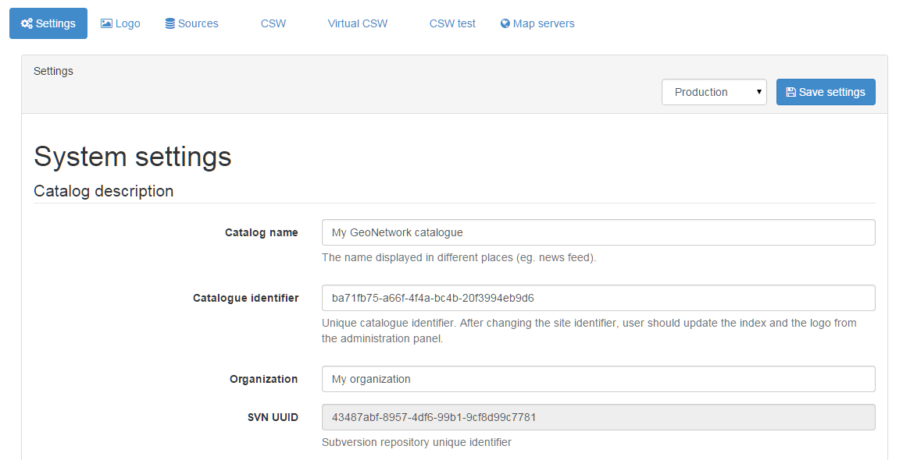

Since the settings form is a long form, the `save` button is repeated between the sections and will save all settings.

## Catalog description

-   **Catalog name** The name of the node. Information that helps identify the catalogue to a human user. The name is displayed on the banner, in the CSW GetCapabilities.
-   **Catalog identifier** A universally unique identifier (uuid) that distinguishes your catalog from any other catalog. This a unique identifier for your catalogue and its best to leave it as a uuid. It will be used by harvester using GeoNetwork protocol to identify the source catalog.
-   **Organization** The organization the node belongs to. Again, this is information that helps identify the catalogue to a human user.
-   **SVN UUID** Subversion repository attached to the node. This identifier is created and/or checked on startup to verify that the database match the SVN repository. The repository is used for metadata versioning.

## Catalog

-   **Version** The version of the catalog (readonly, version of the database)
-   **Minor version** The minor version of the catalog (readonly, version of the database)

## Catalog Server {#system-config-server}

-   **Host** The node's name or IP number (without `http://`). For example, they are used during metadata editing to create resource links and when returning the server's capabilities during a CSW request.
    -   If your node is publicly accessible from the Internet, you have to use the domain name.
    -   If your node is hidden inside your private network and you have a firewall or web server that redirects incoming requests to the node, you have to enter the public address of the firewall or web server. A typical configuration is to have an Apache web server on address A that is publicly accessible and redirects the requests to a Tomcat server on a private address B. In this case you have to enter A in the host parameter.
-   **Port** The server's port number (usually 80 or 8080). If using HTTP, set it to 80.
-   **Preferred Protocol** Defined the protocol to access the catalog. The HTTP protocol used to access the server. Choosing http means that all communication with the catalog will be visible to anyone listening to the protocol. Since this includes usernames and passwords this is not secure. Choosing https means that all communication with the catalog will be encrypted and thus much harder for a listener to decode.
-   **Log level** Define the logging level of the application. After modification, log can be checked in the `Statistics & status` section under `Activity`.
-   **Timezone** The timezone used to store dates in the database and to interpret the time in the cron expressions of the harvesters `Frequency` field. If not set, the JVM default timezone is used.

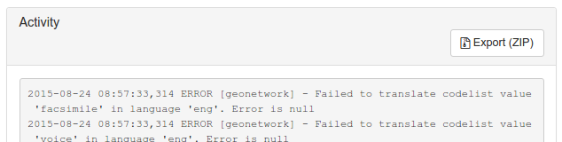

## Intranet parameters

A common need for an organisation is to automatically discriminate between anonymous internal users that access the node from within an organisation (Intranet) and anonymous external users from the Internet. The catalog defines anonymous users from inside the organisation as belonging to the group *Intranet*, while anonymous users from outside the organisation are defined by the group *All*. To automatically distinguish users that belong to the Intranet group you need to tell the catalog the intranet IP address and netmask.

-   **Network** The intranet address in IP form (eg. 147.109.100.0). It can be a comma separated list of IP addresses.
-   **Netmask** The intranet netmask (eg. 255.255.255.0). Define as many netmask and IP addresses.

If intranet parameters are empty, the group *Intranet* will not be displayed in the sharing panel.

## Proxy server

The settings page offers to set the configuration of a proxy server. This configuration is used by the application to access the internet to get online resources, for example as part of a harvest process.

-   **Use proxy** Enable the proxy in case the catalog is behind a proxy and need to use it to access remote resources.
-   **Proxy Host** The proxy IP address or name
-   **Port** The proxy port
-   **Proxy username** The username
-   **Proxy user password** The username password
-   **Ignore host list** To bypass specific hosts enter a specific IP address or host name such as www.mydomain.com or an address range using wildcards, such as 192.168.2.*. Use | to separate the different host values.

JVM proxy parameters may also be required to properly set the proxy for all remote access.

## CORS configuration

-   **CORS allowed hosts** Comma separated list of hosts for which CORS headers are added. Use `*` to allow all hosts, or an empty value to disable CORS. This setting is only used when the `allowedHosts` parameter of the `CORSResponseFilter` in `WEB-INF/web.xml` is set to `db`, otherwise it is ignored. See [Cross-origin resource sharing](https://en.wikipedia.org/wiki/Cross-origin_resource_sharing) for more details.

## Documentation configuration

-   **Base manual url** Base URL of the application manual used by the help links in the user interface. Defaults to the official manual (`https://docs.geonetwork-opensource.org/{{version}}/{{lang}}`) and can be customised to use a self hosted documentation with a custom branding. The following placeholders are supported:
    -   `{{lang}}` to display the manual in the user interface language, when available.
    -   `{{version}}` to use the application version.
    -   `{{section}}` to insert the manual sub section of the current page. When this placeholder is not provided, the sub section is appended to the end of the URL.

## Feedback {#system-config-feedback}

Email notifications are sent by the catalog.

-   When using the User Self-registration system.
-   When using the metadata status workflow (See [Life cycle](../../user-guide/workflow/life-cycle.md)).
-   When a file uploaded with a metadata record is downloaded and notify privilege is selected.

This section configure the mail server to use.

-   **Email** This is the administrator's email address used to send feedback.
-   **SMTP host** The mail server name or IP address to use for sending emails.
-   **SMTP port** The SMTP port.
-   **Use SSL** Enable Secure Sockets Layer (SSL) mode
-   **User name** Username if connection is required on the SMTP server
-   **Password** Username password if connection is required on the SMTP server
-   **Use TLS** Enable use of Transport Layer Security (TLS)
-   **Ignore errors caused by the mail server's SSL certificate** Accept the mail server certificate even if it is not valid (eg. self-signed certificate). Only use it for trusted mail servers.

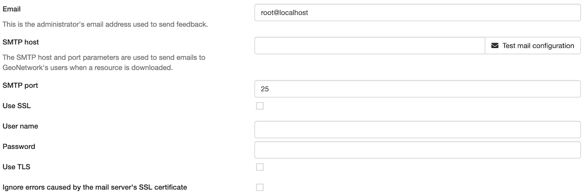

Additional settings are available to respect user language preference:

-  **Language for system generated emails** The UI language will be used when sending notification emails by default. To override this behaviour and generate a multi-lingual notification email, list the languages to be used.

-  **Translation follows text** Provide an introduction phrase indicating a multi-lingual notification follows.

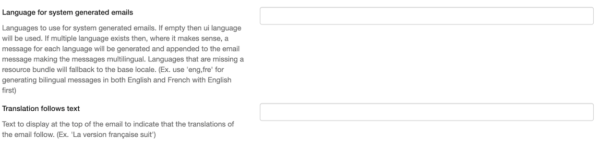

!!! note
    
    Email notifications for metadata publication are sent as `text/html` messages, this can be changed using ```WEB-INF/config.properties``` configuration:
    
    ```properties
    # Configure the metadata publication notification mails to be sent as HTML (true) or TEXT (false)
    metadata.publicationmail.format.html=true
    ```
    
## Metadata search results

Configuration settings in this group determine what the limits are on user interaction with the search results.

-   **Maximum Selected Records** The maximum number of search results that a user can select and process with the batch operations eg. Set Privileges, Categories etc. This parameter avoid to trigger long action which could generate out of memory error.

## Catalog Service for the Web (CSW)

See [Configuring CSW](csw-configuration.md).

## Shibboleth

See [Configuring Shibboleth](../managing-users-and-groups/authentication-mode.md#authentication-shibboleth).

## User self-registration

Enable the self registration form. See [User Self-Registration](../managing-users-and-groups/user-self-registration.md).

-   **Enable self-registration** Enables the self-registration form. When enabled, make sure a mail server is also configured (see [Feedback](#system-config-feedback)).
-   **Enable re-captcha** Protects you and your users from spam and abuse. This is highly recommended when you enable feedback or self-registration. Create your re-captcha key on <https://www.google.com/recaptcha/>.
-   **Re-captcha public key** / **Re-captcha secret key** The keys provided by the re-captcha service.
-   **Email domains allowed** Comma separated list of email domains that can request an account. If not configured, any email address is allowed.

## User feedback

It requires an email server configured. See [Feedback](#system-config-feedback).

-   **Enable application feedback** Displays the link to send feedback about the application to the system administrator. Displays in the application footer a link to a page that allows sending comments about the application.

    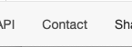
    
    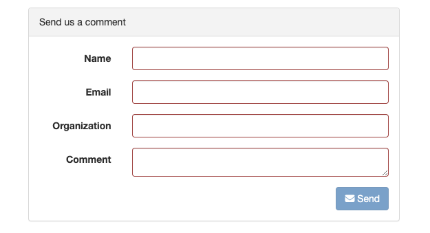

-   **Enable metadata feedback** Allows users to send feedback about a metadata record to the metadata owner and the system administrator.

## Application banner

In certain situations it can be useful to display a banner in the application to inform users, for example to announce a maintenance window or an outage.

Enabling this setting displays a banner in the public pages of the application.

-   **Enable** If set, the application banner is displayed with the message configured.

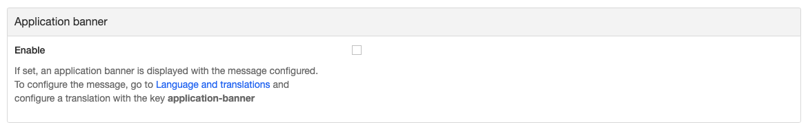

To configure the banner message, go to `Admin console` --> `Settings` --> `Languages and translations` and add a translation entry with the key **application-banner**. See [Languages and translations](languages-and-translations.md) for details.

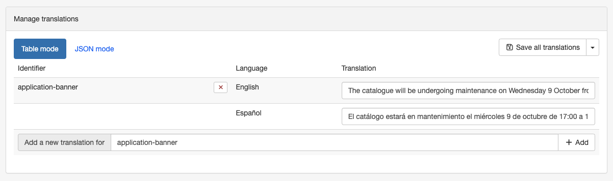

The banner is shown at the top of the public search page.

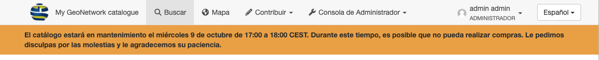

## Link in metadata records

!!! warning "Deprecated"

    3.0.0 Defined by the formatter.

-   **Clickable hyperlinks** If set, the catalog displays clickable hyperlinks in the metadata.


## Metadata rating

-   **Local rating** If enabled, the catalog will calculate user ratings for metadata from this node only (not distributed among other GeoNetwork nodes). This only applies to records harvested using the GeoNetwork protocol.
-   **Notification level** Define which users to alert when a metadata is rated.
-   **Groups to notify in case of rating** List of groups, separated by the char `|`, to notify in case of rating (for `Notify the group(s) emails` notification level).

## Metadata XLink {#xlink_config}

The XLink resolver replaces the content of elements with an attribute @xlink:href (except for some elements like srv:operatesOn) with the content obtained from the URL content of @xlink:href. The XLink resolver should be enabled if you want to harvest metadata fragments or reuse fragments of metadata in your metadata records (eg. when using a contact directory).

-   **Enable XLink resolution**: Enables/disables the XLink resolver.
-   **Enable local XLink** Local XLinks are using local://<lang>/<service> URL to make references to related sections instead of HTTP URL. Local XLinks are usually faster than HTTP XLinks.
-   **Elements to ignore by XLink resolution** Comma separated list of elements to ignore by the XLink resolver (eg. `srv:operatesOn`).
-   **Allow deletion of subtemplates referenced through an xlink** If enabled, a subtemplate (eg. a contact from the directory) can be removed even if it is referenced by records.

!!! info "See Also"

    To improve performance the catalog will cache content that is not in the local catalog. Clear the cache of XLink from the `Admin console` --> `Tools` if the fragments were updated.


## Metadata update

For each metadata schema, the catalog has an XSL transformation (`update-fixed-info.xsl`) that it can apply to a metadata record belonging to that schema. The aim of this transformation is to allow fixed schema, site and catalog information to be applied to a metadata record every time the metadata record is saved in the editor. As an example, this transformation is used to build and store the URL of any files uploaded and stored with the metadata record in the editor.

-   **Automatic Fixes**: Enabled by default. It is recommended you do not use the metadata editor when auto-fixing is disabled. See [ticket #368](http://trac.osgeo.org/geonetwork/ticket/368) for more details.

## Search Statistics {#search_stats_config}

!!! warning "Not currently functional"

    This setting has no effect. Search statistics capture was removed when the catalog migrated from Lucene to Elasticsearch, with the intention of rebuilding it on top of Elasticsearch and Kibana. That work has not been completed, so enabling this option does not collect any data and there is no `Search Statistics` page to query.

    See [issue #4499](https://github.com/geonetwork/core-geonetwork/issues/4499) for the current status.

    To collect usage statistics in the meantime, configure a web analytics service using ```WEB-INF/config.properties```:

    ```properties
    analytics.web.service=matomo
    analytics.web.jscode=<tracking code provided by the analytics service>
    ```

## Open Archive Initiative (OAI-PMH) Provider

Options in this group control the way in which the OAI Server responds to OAIPMH harvest requests from remote sites.

-   **Datesearch**: OAI Harvesters may request records from GeoNetwork in a date range. GeoNetwork can use one of two date fields from the metadata to check for a match with this date range. The default choice is *Temporal extent*, which is the temporal extent from the metadata record. The other option, *Modification date*, uses the modification date of the metadata record in the GeoNetwork database. The modification date is the last time the metadata record was updated in or harvested by GeoNetwork.
-   **Enable**: Enable or disable the OAI-PMH service. If disabled, the OAI-PMH API returns an error message.
-   **Resumption Token Timeout**: Metadata records that match an OAI harvest search request are usually returned to the harvester in groups with a fixed size (eg. in groups of 10 records). With each group a resumption token is included so that the harvester can request the next group of records. The resumption token timeout is the time (in seconds) that GeoNetwork OAI server will wait for a resumption token to be used. If the timeout is exceeded GeoNetwork OAI server will drop the search results and refuse to recognize the resumption token. The aim of this feature is to ensure that resources in the GeoNetwork OAI server are released.
-   **Cache size**: The maximum number of concurrent OAI harvests that the GeoNetwork OAI server can support.
-   **Maximum records**: The maximum number of records to return in OAI responses.

Restart the catalog to take all OAI settings into account.

## INSPIRE Directive configuration

See [Configuring for the INSPIRE Directive](inspire-configuration.md).

-   **INSPIRE** Enables INSPIRE CSW (ie. language support and INSPIRE GetCapabilities document) and INSPIRE indexing. The INSPIRE themes thesaurus must be installed to properly index themes and annexes. It does not enable the INSPIRE editor view mode (see `iso19139/layout/config-editor.xml`).
-   **INSPIRE remote validation URL** URL of the INSPIRE validator, to enable the remote validation of records from the editor. See [INSPIRE validation](inspire-configuration.md).
-   **INSPIRE remote validation URL (Query)** When using the official INSPIRE validator, in order to preserve the quotas, set this value to `https://inspire.ec.europa.eu/validator/`. It is used for all operations except `/v2/TestRuns`, which uses the INSPIRE remote validation URL (API gateway). If you use your own instance of the INSPIRE validator, leave this value empty.
-   **Node id** / **API key** Credentials used to access the INSPIRE validator API gateway, when required.

## INSPIRE Atom Feed

Allows to define the configuration of Atom Feeds referenced by the metadata to provide services related to the [INSPIRE technical guidance for download services](https://inspire.ec.europa.eu/documents/Network_Services/Technical_Guidance_Download_Services_3.0.pdf):

-   Select the type of atom feed:

    -   Remote: retrieve the atom feeds referenced by the metadata in the online resources.
    -   Local (to implement in future versions): create the atom feed using the metadata content.

-   Schedule for feed retrieval: the retrieval of the atom feeds can be scheduled to be done periodically.

-   Atom protocol value: value of the protocol in the metadata online resources to identify the atom feed resources (the default value is INSPIRE Atom). GeoNetwork identifies an Atom file from other resources by looking at the protocol value of the onlineresource. Since there is no general accepted value for this protocol, GeoNetwork allows an administrator to set the value to be used as protocol identifying Atom resources:

        <gmd:transferOptions>
            <gmd:MD_DigitalTransferOptions>
              <gmd:onLine>
                <gmd:CI_OnlineResource>
                  <gmd:linkage>
                    <gmd:URL>http://geodata.nationaalgeoregister.nl/atom/index.xml</gmd:URL>
                  </gmd:linkage>
                  <gmd:protocol>
                    <gco:CharacterString>INSPIRE Atom</gco:CharacterString>
                  </gmd:protocol>
                </gmd:CI_OnlineResource>
              </gmd:onLine>
            </gmd:MD_DigitalTransferOptions>
          </gmd:transferOptions>

The following services are available:

-   <http://SERVER/geonetwork/opensearch/eng/UUID/OpenSearchDescription.xml>
-   <http://SERVER/geonetwork/opensearch/eng/UUID/search?queryParams>
-   <http://SERVER/geonetwork/opensearch/eng/search?queryParams>
-   <http://SERVER/geonetwork/opensearch/eng/UUID/describe?queryParams>
-   <http://SERVER/geonetwork/opensearch/eng/describe?queryParams>

In above URLs {UUID} is the fileidentifier of the download service metadata.

In the service feed of your download service make sure to add the GeoNetwork OpenSearch endpoint as the OpenSearchDescription for the service:

    <link rel="search" href="http://SERVER/geonetwork/opensearch/eng/{uuid}/OpenSearchDescription.xml" 
    type="application/opensearchdescription+xml" title="Open Search document for INSPIRE Download service"/>

The INSPIRE Atom/OpenSearch implementation can be verified with the Atom tests in Esdin Test Framework (<http://elfproject.eu/documentation/geotool/etf>) or INSPIRE metadata validator (<http://inspire-geoportal.ec.europa.eu/validator2>).

## Indexing

Configuration settings in this group determine how many processor threads are allocated to indexing tasks. When indexing a large set of records (eg. changing the privileges on 20,000 records), the catalog can split the task into a number of pieces and process them in parallel, which can bring significant speed improvements on machines with many processor cores.

-   **Number of indexing threads** The maximum number of processing threads that can be allocated to an indexing task. The default value is `1`.

!!! note

    Multi-threaded indexing is only used with databases that have been tested: PostgreSQL/PostGIS and Oracle. With other databases, only one thread is used whatever the value of this setting.

    Each thread may use a database connection for the duration of the indexing task, so make sure the database connection pool is large enough (see the advanced configuration for details).

## Metadata Privileges

- **Only set privileges to user's groups**: If enabled then only the groups that the user belongs to will be displayed in the metadata privileges page (unless the user is an Administrator).
- **Publication by users reviewer in record group only**: Allow publication by administrator and reviewer member of record group. If disabled, then also all users reviewer in group with editing rights can publish/unpublish a record.
- **Manage the publication date automatically**: When enabled the publication date of the metadata is set automatically when the metadata is published and removed when the metadata is unpublished.
- **Notification level when a metadata is published / unpublished**: Define which users to alert when a metadata is published / unpublished.
- **Groups to notify when a metadata is published / unpublished**: List of groups, separated by the char |, to notify when a metadata is published / unpublished (for 'Notify the group(s) emails' notification level).

## Groups & users

-   **User identicon** Icon displayed for users without an avatar. Set to an empty value for no icon. Use `gravatar` to use the default [Gravatar](https://en.gravatar.com/site/implement/images/) mode. The icon type can be defined using `mp`, `identicon`, `monsterid`, `wavatar`, `retro` or `robohash`, and forced using a configuration like `gravatar:identicon` or `gravatar:retro:y`.

## Metadata create

### Generate UUID

When enabled, GeoNetwork automatically assigns a **random UUID** to each new metadata record.

- This ensures that every record has a unique and globally identifiable ID.
- Disable this option if you want to assign metadata UUIDs manually.
- When disabled, you must specify a **metadata UUID prefix** that will be used when generating the record's UUID.

### Publish for group editors

When enabled, newly created metadata records are **automatically published** and made editable by **editors in the group that owns the record** (the group in which the record was created).

- Enables collaborative editing within the owning group without requiring manual sharing after creation.
- You can **override this behavior** on the metadata creation page if a specific record should not be editable.

### Copy attachments

When enabled, **attachments** (e.g., documents, images, or data files) from the **source template or record** are automatically copied into the new record.

- Useful when creating similar metadata records that share supporting files.
- Disable this option if you prefer to start with an empty record.
- You can **override this behavior** on the metadata creation page if a specific record’s attachments should not be copied.

### Skip metadata creation page

When enabled, if there is **only one available group** and **one available template**, the system automatically creates the metadata record using default options and skips the creation page.

- Speeds up creation in environments with a single group or standardized template.
- If multiple groups or templates exist, the creation page will still appear.

### Preferred metadata group owner

Specifies the **default group owner** that will be preselected on the metadata creation page.

- Helps users who frequently create records under the same group avoid repetitive selection.
- You can still choose a different group when creating a record if needed.

### Preferred metadata template

Specifies the **default template** that will be preselected on the metadata creation page.

- Useful when most new records are based on the same template type.
- You can still select a different template when creating a record if required.

## Metadata configuration {#metadata_configuration}

### Allowed file mime types to attach to a metadata record

Specifies the **file types** that can be attached to a metadata record.

- Enter a **pipe (|)** separated list of MIME types.
- Supports **exact** and **wildcard** patterns (e.g. `image/*` for all images, `*/*` for all types).
- If left **empty**, file uploads are **not allowed**.

**Examples:**
- `image/*|text/plain|application/xml|application/pdf` — allows images, text, XML, and PDF files.
- `*/*` — allows all file types.

### Other metadata configuration settings

-   **Prefer Group Logo** If enabled, the logo of the record owner group is displayed for the record instead of the catalog (source) logo.
-   **Virtual 'All' Thesaurus** If enabled, a virtual thesaurus is created that contains all keywords from all other thesauri. This is useful in the editor when only the keyword matters, not the thesaurus it comes from. To keep the keyword blocks consistent, `update-fixed-info` assigns each keyword selected from the `All` thesaurus to a keyword block with the correct thesaurus.
-   **Local thesaurus namespace pattern** Pattern used to suggest a namespace when creating a new thesaurus. The pattern can contain `{{type}}` and `{{filename}}` placeholders.
-   **Remove schema location for validation** If enabled, the `schemaLocation` attribute in the root element of the metadata is removed during validation and on metadata save. It ensures that the local schema is always used for the metadata.

## Link to metadata

-   **Sitemap and permalink URL template** URL template to build the links to the metadata in the catalogue sitemap (`/api/sitemap`) and permalinks. The following placeholders are supported: `{{UUID}}` (metadata UUID), `{{LANG}}` (request language) and `{{RESOURCEID}}` (resource identifier). For example, `http://www.example.com/external/metadata/html?uuid={{UUID}}`. If not set, the default URL is used.
-   **Use DOI for sitemap URL if present** If enabled, the record DOI is used in the sitemap instead of the URL template when the record has one.
-   **Portal URL template** Link in the record landing page to open the catalogue application. If not set, the default application is used.

## Resource identifier prefix

-   **Resource identifier prefix** In the editor, a suggestion allows to compute the resource identifier automatically, by concatenating this prefix with the metadata identifier (eg. `http://localhost:8080/geonetwork/srv/a1fd6bb7-6425-48b6-bca3-13c9e1bc4ab1`).

## Metadata links analysis

-   **Excluded URL pattern** Regular expression of URLs to exclude when analysing the links of the metadata records (see `Admin console` --> `Statistics & status` --> `Link analysis`).

## Version Control System (VCS)

-   **Enable VCS** Records metadata changes using SVN. This functionality is experimental and it is not operational on NFS filesystems. The application needs a restart once enabled.

## Metadata / ISO19139 / Nil reason attribute withheld

-   **Enable logging** Logs the elements with the `gco:nilReason="withheld"` attribute that are removed from the records returned to users without editing rights.

## Metadata History

Allows to view metadata history

-   **Enable record history recording** When enabled, every event that alters metadata records is registered in the database.

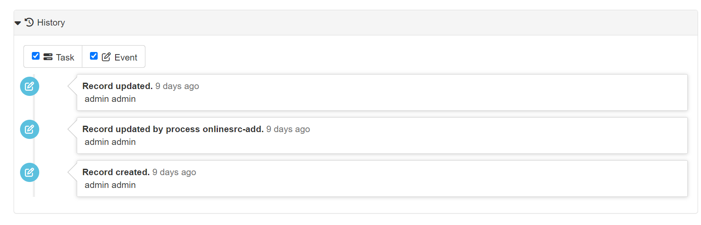

-   **Minimum user profile allowed to view metadata history** Minimum user profile allowed to delete metadata (`Registered User`, `Editor` or `Administrator`). The default value is `Editor`.
    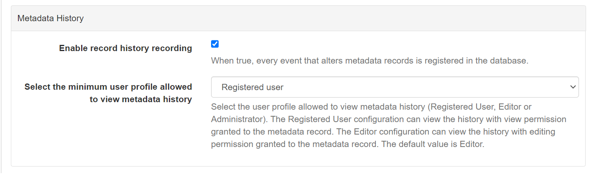

-   **Registered User Configuration** The user who has granted view permission to the metadata record can view the history.
-   **Editor Configuration** The user who has granted editing permission to the metadata record can view the history.
-   **Administrator Configuration** The user who has granted system administrator permission can view the history.

## Metadata import {#editing_harvested_records}

-   **Restrict import to schemas** List of all allowed schemas for metadata to be imported. If the metadata schema is not allowed, then the import is not done. Use an empty value to allow all schemas.
-   **Minimum user profile allowed to import metadata** Minimum user profile allowed to import metadata (`Editor`, `Reviewer` or `Administrator`). The default value is `Editor`.

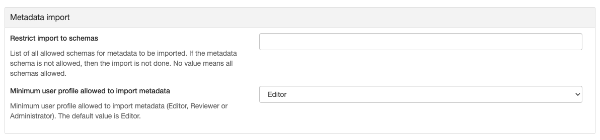

## Metadata Batch Editing

-   **Minimum user profile allowed to access batch editing** Minimum user profile allowed to access batch editing (`Editor`, `Reviewer` or `Administrator`). The default value is `Editor`.

## Metadata delete

Allows to configure the user profile allowed to delete published metadata.

-   **Minimum user profile allowed to delete published metadata** Minimum user profile allowed to delete metadata (`Editor`, `Reviewer` or `Administrator`). The default value is `Editor`.
-   **Backup Options** Overrides the backup option sent by the API client when deleting a record:
    -   `Force backup` Always makes a backup, ignoring the API parameter.
    -   `Force no backup` Never makes a backup, ignoring the API parameter.
    -   `Use API parameter` Uses the value provided by the API client. If not provided, a backup is made (default).

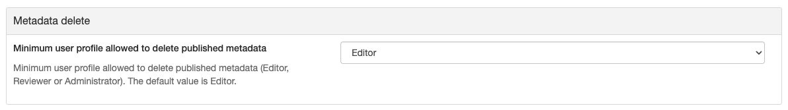

## Metadata workflow

Allows to configure the metadata approval workflow (record life cycle). See [Life cycle](../../user-guide/workflow/life-cycle.md) for details about how the workflow is used.

-   **Enable workflow** Enables the metadata approval workflow. When enabled, editors work on a draft copy of approved records and changes must be submitted and approved before they become visible to users outside the owner group. The default value is disabled.
-   **Activate workflow for record created in** Restricts the groups for which the workflow is automatically activated when a record is created. Choose `Any group` to activate it for all groups, or `Selected groups` to provide a regular expression matching the group names where records must be set to draft status automatically. eg. `MYOCEAN-.*` to match all groups starting with `MYOCEAN-`, `GROUP1|GROUP2` to match `GROUP1` or `GROUP2`.
-   **Allow submission/approval of invalid metadata** Allows the submission/approval of metadata that is not valid according to xsd or schematron rules. The default value is enabled.
-   **Allow publication of non-approved metadata** Allows the publication of metadata that is not approved. The default value is enabled.

## Metadata publication

Allows to configure the publication of metadata records.

The settings in this section apply whether or not the metadata approval workflow is enabled.

The required user profile is evaluated on the metadata owner group (per-group role), not the user's global profile. The user must have exactly this profile in the record owner group. For example, with `Reviewer`, only users who are `Reviewer` in the owner group are allowed (not `UserAdmin`). Global `Administrator` is always allowed.

-   **Required profile to publish metadata** Profile required to publish metadata, evaluated in the record owner group (`Reviewer` or `Administrator`). The default value is `Reviewer`.
-   **Required profile to un-publish metadata** Profile required to un-publish metadata, evaluated in the record owner group (`Reviewer` or `Administrator`). The default value is `Reviewer`.
-   **Allow publication of invalid metadata** Allows the publication of metadata that is not valid according to xsd or schematron rules. When disabled, a record that is invalid cannot be published to the `All` group. The default value is enabled.
-   **Automatic unpublication of invalid metadata** Automatically unpublishes metadata that, once edited, becomes not valid according to xsd or schematron rules. The default value is disabled.
-   **Enable scheduled publication** If disabled, the scheduled publication task is not available and the scheduled publication process is not executed.

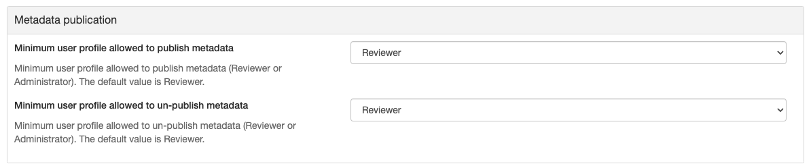

## Metadata save

Allows to configure the behaviour when a metadata record is saved and the editor is closed.

This setting applies whether or not the metadata approval workflow is enabled.

-   **Force validation on metadata save** When enabled, the validation of the metadata is forced (and its validation status stored) each time the record is saved and the editor is closed. The default value is disabled.

## Metadata selection - zip export

Allows to configure the zip export of metadata records and their attachments.

-   **Total size of attachments allowed in zip export (MB)** Maximum total size of attachments allowed in zip export (in MB). If the total size of attachments linked to the selected metadata is above this value, exporting as zip (with attachments) is not allowed. Leave empty for no limit.

## Metadata selection - pdf report

Allows to configure the PDF report generated from a selection of metadata records.

-   **Cover pdf** URL of the cover pdf for the PDF report. If not defined, no cover page is added.
-   **Introduction pages pdf** URL of the pdf with the introduction pages for the PDF report. If not defined, no introduction pages are added.
-   **Add table of contents (TOC) page** Adds a table of contents page to the report.
-   **Header text (left)** / **Header text (right)** / **Footer text (left)** / **Footer text (right)** Text displayed in the header and footer of the pages. The template values `{date}` and `{siteInfo}` are allowed.
-   **Report file name** File name of the report. The template fields `{year}`, `{month}`, `{day}`, `{date}` (`yyyyMMdd` format) and `{datetime}` (`yyyyMMddHHmmss` format) are replaced with the related date values.
-   **Top banner file name** Image used as the top banner of the report instead of the default one. Add the image first using the `Logos` feature in the `Admin console`.

## Metadata selection - csv export

-   **CSV export file name** File name of the CSV export. The same template fields as the pdf report file name are allowed.

## Backup archive

-   **Enable** Activates a nightly backup archive of the metadata on the server, and adds a button to download the archive in `Admin console` --> `Tools`.

## Metadata workflow

The following settings control what metadata can be published when the metadata workflow is active. They are found under `Administration` --> `Settings` --> `Metadata Workflow`.

-   **Allow publication of invalid metadata**  
    When enabled, metadata records can be published regardless of its validation status.  
    When disabled, only records that passe all required XSD and schematron validation rules can be published.  
    *This setting applies to metadata records only, metadata templates exempt from this check, as they are incomplete by design.*
-   **Allow submission/approval of invalid metadata**   
    When enabled, records can be submitted or approved even when validation fails.  
    When disabled, records must be valid before they can move to `Submitted` or `Approved` workflow status.  
    *This setting applies to metadata records only, metadata templates exempt from this check, as they are incomplete by design.*
-   **Allow publication of non-approved metadata**  
    When enabled, metadata records and templates can be published regardless of its workflow status.  
    When disabled, only metadata records and templates with an `Approved` workflow status can be published. 

## Harvesting

-   **Allow editing on harvested records** Enables/Disables editing of harvested records in the catalogue. By default, harvested records cannot be edited.
-   **Only allow privileges management on harvested records** Allows to manage the privileges of harvested records without enabling editing. Configure the harvester to append to existing privileges if the record exists.
-   **Disabled harvester protocols** Comma or space separated list of harvester protocols that cannot be used. For example: `arcsde, csw, filesystem, geonetwork, geonetwork20, geoPREST, oaipmh, ogcwxs, thredds, wfsfeatures`.

### Harvester email notifications

-   **Activate harvester notification** Sends an email when a harvester run finishes.
-   **Email notification to** Recipient of the notification emails.
-   **... on success** / **... on warning** / **... on error** Harvester results that trigger a notification.
-   **Subject** Subject of the notification email.
-   **Success template** / **Warning template** / **Error template** Body of the notification email for each result.

The following strings can be used in the subject and templates. They will be replaced by the actual values:

| Placeholder             | Value                                      |
|-------------------------|--------------------------------------------|
| `$$total$$`             | Total number of metadata imported          |
| `$$added$$`             | Number of metadata added                   |
| `$$updated$$`           | Number of metadata updated                 |
| `$$unchanged$$`         | Number of metadata unchanged               |
| `$$unretrievable$$`     | Number of metadata unretrievable           |
| `$$removed$$`           | Number of metadata removed                 |
| `$$doesNotValidate$$`   | Number of metadata that does not validate  |
| `$$harvesterName$$`     | Harvester name                             |
| `$$harvesterType$$`     | Harvester type                             |
| `$$errorMsg$$`          | Error message                              |

## Translation service

Configures an automatic translation service, used to translate metadata content (eg. in the editor or during harvesting).

-   **Translation service provider** The translation service to use.
-   **Service URL** URL of the translation service.
-   **API Key** API key to access the translation service.

## Region API

Configures the `GetMap` request used to render the region and metadata extent images (eg. in the metadata extent thumbnail).

-   **Background map, URL or Named Layer ID** Background layer of the map. Use a WMS GetMap URL or the id of a named layer (eg. `osm`).
-   **Width** Width (in pixels) of the map image.
-   **Summary width** Width (in pixels) of the map image in summary views.
-   **Map projection** Projection of the map image (eg. `EPSG:3857`).
-   **Display geodesic extents** By default, the displayed metadata extents are planar (i.e. rectangular). If enabled, the metadata extents are geodesic. If the map uses a projected coordinate system, this may lead to non-rectangular extents (e.g. trapezoid).

## User interface configuration

-   **Choose the user interface to use** The user interface configuration used by default. See [User Interface Configuration](user-interface-configuration.md).

## Publication

-   **Enable DOI publication** Enables the creation of Digital Object Identifiers (DOI) for metadata records. See [DOI configuration](doi-configuration.md).
-   **Notify DOI task owner** Sends a mail notification to the DOI task owner when a metadata DOI is published.

## Security

-   **Password min. length** / **Password max. length** Minimum and maximum length of user passwords.
-   **Password restrictions** Requires that the password contains at least 1 uppercase, 1 lowercase, 1 number and 1 symbol.

An additional setting, not available by default, allows administrators to reset a user password without the old password. See [Administrator reset without old password](../managing-users-and-groups/user-reset-password.md#admin_reset_password).

## Audit changes

-   **Allow auditing changes** When enabled, changes in users configuration are audited.
