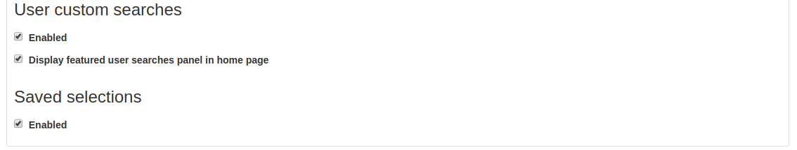
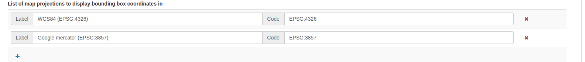

# User Interface Configuration

Most of the configuration parameters for the user interface can be changed by an administrator using the web interface in `Admin console` --> `Settings` --> `User Interface`.

!!! info "Important"

    Configuration of these parameters is critically important for the catalog in an operational context. Misunderstanding some settings may result in a system that does not function as expected. For example, the map can become unusable.


By default the catalog will use the default UI configuration, named `srv`. To view and edit the settings for this configuration, choose `Create a default UI configuration`.

To add a new configuration, such as for a sub-portal (see [Portal configuration](portal-configuration.md)) choose `Add new UI configuration` and choose one or more portal identifiers from the dropdown list `UI Configuration identifier`. Additional configurations can also be used for building an external JS application, which is able to load a specific configuration.

!!! note

    Since the settings form is a long form, the `save` button is repeated at the base of the page. In either case, all settings are saved.


-   **Filter settings**: This search box can be used to filter settings in the form, for example searching for "social" will show only the settings related to the Social Bar.


## General options

-   **Humanize dates**: check this box to show dates in a human-friendly format. If not set, the full date will be shown.


## Footer {#user-interface-config-footer}

-   **Footer**: Select this checkbox to determine whether the GeoNetwork footer is shown. If not set, no footer will be visible.
-   **Social bar**: Select this check box to show the social bar (links to twitter, facebook, linkedin etc) in the footer.


## Top Toolbar {#user-interface-config-toptoolbar}

-   **Top toolbar**: Select this check box to determine whether the GeoNetwork top toolbar will be shown. If not set, no toolbar will be visible.
-   **List of languages**: Choose the languages from the list that should be available for translating the interface strings (available from the dropdown list in the top toolbar). If only one language remains, then no dropdown will be shown. Note that additional languages can be added, if translations are available, by selecting the `+` button below the list and adding the appropriate ISO codes.


-   **Show the logo in the header**: This determines where the catalog logo should be positioned. If selected, the logo will be positioned in the header, above the top toolbar and the toolbar logo (default) removed. If unset, the logo will appear in the top toolbar.
-   **Position of logo**: These options determine where on the header the logo will be positioned.


## Home Page {#user-interface-config-homepage}

-   **Home page**: Select this check box to determine whether the Logo and Link to the Home Page are visible in the top toolbar. If not set, no logo and link is shown.
-   **Application URL**: Define the URL for the home page. In the majority of cases this can be left as the default.
-   **Fluid container for Home and Search**: Select this check box to determine whether the search box is full width in the browser page or if it is fixed width and centred.


## Search application {#user-interface-config-searchpage}

-   **Search application**: Select this check box to determine whether the search application is visible in the top toolbar. If not set, no link is shown.
-   **Application URL**: Define the URL for the search application. In the majority of cases this can be left as the default.
-   **Number of records per page**: Define the options to determine the number of records shown per page of results, and the default.
-   **Type of facet**: Define the set of search facets should be visible in the search page. The default is `details` but `manager` can be used to show the facets more normally used on the editor page.
-   **Default search**: Define a default filter for the search.


-   **Facet field to display using tabs**: This option creates a tab for each configured facet above the search results. This can be used to further narrow down the search results. The list of facet names can be found at <https://github.com/geonetwork/core-geonetwork/blob/master/web/src/main/webapp/WEB-INF/config-summary.xml#L82>. For example, to include the Topic Category filter above the search results, the administrator would add `topicCat` as the facet field to display.
-   **List of facets**: This can be used to restrict the facets available for searching. For example, adding `topicCat` to this list would restrict the search options to `Topic Category` only. This can be useful for restricting the search options in a sub-portal or external web application. To add additional facets to the list, select the blue `+` button.
-   **Filters**: Define additional search criteria added to all searches and again are used primarily for external applications and sub-portals.


-   **Type of sort options**: Define the different ways by which a user can sort a set of search results. The **default sort by option** is shown below. Note that to search for example on `title` in alphabetical order it is necessary to set the order to `reverse`.
-   **List of templates for search results**: This section allows the administrator to configure templates for the layout of the search results. The default is `grid` whereas `list` is the default for the editor board.


-   **Default template used for search results**: Define the template page for the search. Generally this can be left as the default.
-   **List of formatter for record view**: Determine the formatter used to display the search results. See [Customizing metadata views](../../customizing-application/creating-custom-view.md) for information on creating a new formatter. To add an additional view, click the blue `+` button below the list and provide a name and a URL.


### Search results configuration {#user-interface-config-searchresults}

-   **Related metadata types to query**: Use this section to define the metadata types displayed when showing search results in the grid. format To add additional types, click the blue `+` button. The possible types are shown below the form.


### List of link types {#user-interface-config-linktypes}

-   **Links**: This section determines the types of links displayed when showing search results in the grid format. They are separated into `links`, `downloads`, `layers` and `maps` and for each type, a new entry can be added by clicking the blue `+` button below the list.


-   **Display filter tags in the search results**: When checked, the filter tags are visible above the search results. The default is to not show them.

### User custom searches {#user-interface-customsearches}

-   **Enabled**: If checked the user will have the ability to create and save custom searches in the search tab. This functionality will be visible above the facets list on the left.
-   **Display featured user searches panel in home page**: If this is also enabled, an additional tab will be shown on the home page alongside `Latest news` and `Most popular`.

### Saved Selections

-   **Enabled**: If checked the user will have the ability to save a selection of records in the search tab.



## Map Application {#user-interface-config-mappage}

This section describes how an administrator can configure the different maps in the user interface (the main map, the mini map displayed on the search result page, and the map used in the editor to draw an extent).

-   **Map Application**: The initial checkbox allows the main map tab to be disabled. In this case there will be no map tab shown in the top toolbar but the mini map and extent map described above will still be visible.
-   **Application URL**: This defines the URL for the map tab. In the majority of cases this can be left as the default.

### External viewer

-   **Use an external viewer**: This option allows a third party mapping application to be used in place of the default GeoNetwork map. In this case, most of the settings below will no longer be used.
-   **Allow 3D mode**: If enabled, the user has the option to switch to 3D mode in the main map (see [Quick start](../../user-guide/quick-start/index.md)).
-   **Allow users to save maps as metadata record**: This option enables users to save layers and base maps configuration as a record in the catalog. Optionally users can add a title and an abstract.
-   **Export map as image**: If enabled, users can export the map as an image but requires CORS to be enabled on any external WMS services displayed on the map. This option is disabled by default to avoid issues with WMS layers.


-   **User preference persistence**: This option determines the behaviour of cookies related to the map. The various options are listed below.
-   **Bing Map Key**: If this option is filled in, then it is possible to use Bing Maps as base layers within the map application. You must get your own key for this to work.


### List of preferred OGC services

Default **wms** and **wmts** services can be defined here that will be available by default to the end user. New services can be added using the blue `+` button below the protocol lists.

You can configure each map with different layers and projections.

-   **Map Projection** This is the default projection of the map. Make sure the projection is defined in **Projections to display maps into** below.


-   **List of map projections to display bounding box coordinates in** This is used in the map when editing a record and defining the bounding box extent. Note that the coordinates will be stored in WGS84 regardless of the projection used to draw them.



-   **Projections to display maps into** This is where the different projections available to the map are defined. All projections will be shown in the `Projection Switcher` tool of the map.


In order to enable a new projection it must be defined here using the **proj4js** syntax, which can be found at <https://proj4js.io>. Additionally the default bounding box extent, maximum bounding box extent, and allowed resolutions (if required) can be defined.

Ensure that the coordinates inserted are in the correct units for and are local to the projection. A list of resolutions is only relevant if the main map layer has a XYZ source, which does not follow the common tiling pattern.

Check that this configuration is valid by opening the map.


!!! info "Important"

    If the configuration of a projection is incomplete or invalid, the map may fail to load.


If a projection is defined which is not supported by the source of the map layer, the map application will reproject map images at the client side. This may cause unexpected behaviour, such as rotated or distorted labels.

-   **Optional Map Viewer Tools** The checkboxes in this section define the tools available to the user in the right toolbar of the main map. Elements that are not checked are not visible.
-   **OGC Service to use as a graticule**: This is optional and allows the use of an external service to display the graticule on the map.

### Viewer Map Configuration {#user-interface-config-viewermap}

This section is for configuring the map shown when viewing a record.

-   **Path to the context file (XML)**: An optional path to an XML file defining base layers and other configuration options. See `web/src/main/webapp/WEB-INF/data/data/resources/map/config-viewer.xml` for an example.
-   **Extent, expressed in current projection**: Use this option to override the extent defined in the context file.


-   **Layer objects in JSON**: Define additional layers to be shown on the map using JSON syntax. The supported types are:
    -   **wms**: generic WMS layer, required properties: `name, url`.
    -   **wmts**: generic WMTS layer, required properties: `name, url`.
    -   **tms**: generic TMS layer, required property: `url`.
    -   **osm**: OpenStreetMap default layer, no other property required.
    -   **bing_aerial**: Bing Aerial background, required property: `key` containing the license key.


All layers can also have some optional extra properties:

-   **title** The title/label of the layer.
-   **projectionList** Projection array to restrict this layer to certain projections on the map.

Examples of layers:


This WMS layer will be shown but only when the map is on `EPSG:4326`:

``` json
{"type":"wms","title":"OI.OrthoimageCoverage","name":"OI.OrthoimageCoverage",
"url":"http://www.ign.es/wms-inspire/pnoa-ma?request=GetCapabilities&service=WMS",
"projectionList":["EPSG:4326"]}
```

### Search Map Configuration

This section defines the configuration for the mini map shown on the search page. It uses the same options as in [Viewer Map Configuration](user-interface-configuration.md#user-interface-config-viewermap).

### Editor Map Configuration

This section defines the configuration for the map shown when editing a record. It uses the same options as in [Viewer Map Configuration](user-interface-configuration.md#user-interface-config-viewermap).

## Gazetteer

-   **Gazetteer**: If enabled a gazetteer will be shown in the top left of the main map.
-   **Application URL**: Set the application URL used for the gazetteer. In general this should be left as the default, but additional filtering can be applied using the syntax described at <https://www.geonames.org/export/geonames-search.html>, for example to restrict results to a particular country (`country=FR`).


## Record View

-   **Record view**:
-   **Show Social bar**: If enabled the social bar (links to facebook, twitter etc) are enabled in record view.

## Editor Application

-   **Editor application**: If enabled the editor page, or contribute tab is available to users with the appropriate privileges. If not enabled the contribute tab is not shown in the top toolbar.
-   **Application URL**: This is the URL to the editor application and can generally be left as the default.
-   **Only my records**: If this checkbox is enabled then the "Only my records" checkbox in the editor dashboard will be checked by default.
-   **Display filters in dashboard**: If enabled, the currently selected facets will be shown above the search results in both the editor dashboard the batch editor page.
-   **Fluid container for the Editor**: If enabled, the editor application will have a full width container. If disabled it will have a fixed width and centered container.
-   **New metadata page layout**: Choose from the options for the layout of the `add new metadata` page. The default is `Horizontal` but a vertical layout can be chosen, or a custom layout based on a supplied template.
-   **Editor page indent type**: Choose from the options for the indent style when editing a record. The default is for minimal indents, select `Colored indents` to use the style shown below:


## Admin console

-   **Admin console**:
-   **Application URL**: Set the application URL for the admin console. In general this should be left as the default.

## Sign in application

-   **Sign in application**:
-   **Application URL**: Set the application URL for the sign in page. In general this should be left as the default.

## Sign out application

-   **Application URL**: Set the application URL for the sign out. In general this should be left as the default.

## Search application

-   **Search application**:
-   **Application URL**: Set the application URL for the search page. In general this should be left as the default.

## JSON Configuration

This section shows the JSON configuration for the currently applied User Interface settings. From here, the json can be saved to a file (by copying and pasting).

-   **Test client configuration**: Click this button to test the configuration in a new browser tab.
-   **Reset configuration**: Click this button to reset the configuration back to the default. Note that this will revert any changes you have made in the above page.


