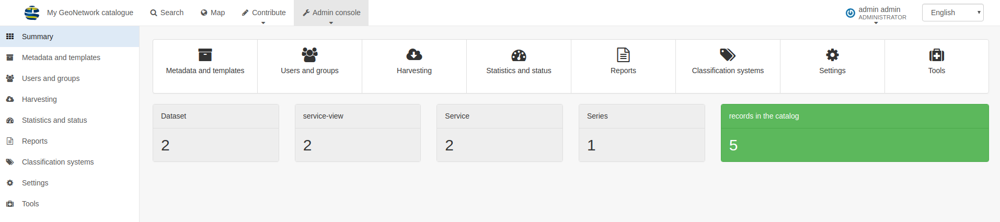

# Administrator guide

-   [Configuring the catalog](configuring-the-catalog/index.md)
-   [Managing users and groups](managing-users-and-groups/index.md)
-   [Managing classification system](managing-classification-systems/index.md)
-   [Managing metadata & template](managing-metadata-standards/index.md)
-   [Managing anonymous links](managing-anonymous-links/index.md)

All Admin functions are available from the Admin Dashboard from the main menu. On the Admin Dashboard you will find shortcuts to any administration option your role can access.
