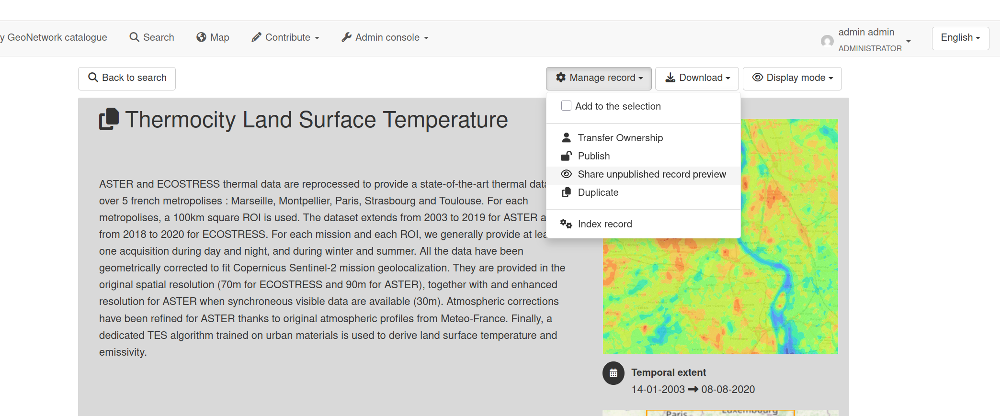
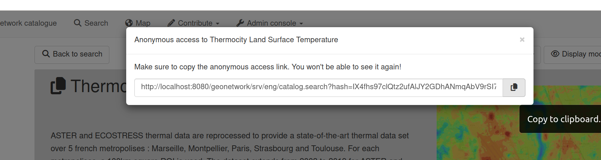

# Create Link

Each time a new metadata needs to be reviewed before it can be published, the reviewer needs to be granted special permission (admin user, ...). To enable an anonymous user to view an unpublished metadata, a link could also be created. This link will be used by the anonymous user to access the metadata.

> Only an administrator can create such a link.

The link can be copied to the clipboard by clicking on the copy to clipboard icon. The administrator can then share the link with the anonymous user, by any means, he sees fit.

The creation of a link is impossible for published metadata.
