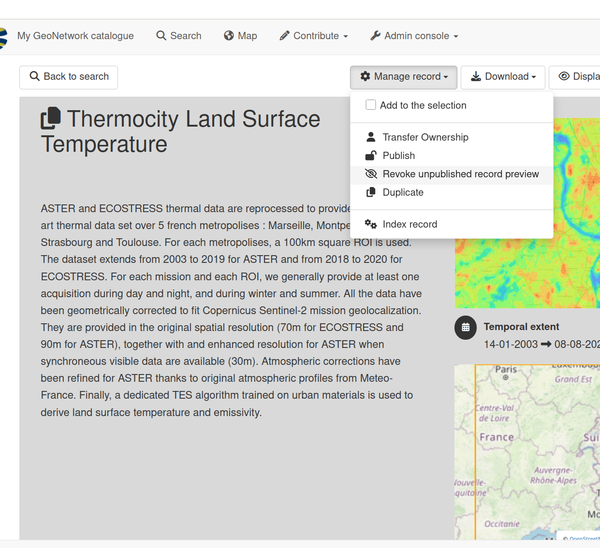

# Delete Link

To revoke an anonymous link, open the metadata, click on the **Revoke unpublished record preview** menu.

The link is automatically revoked when the metadata is published or deleted.

