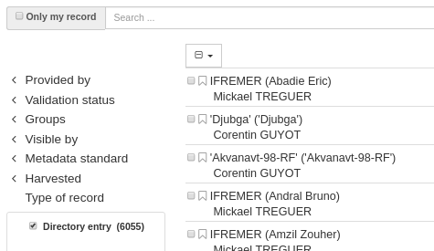
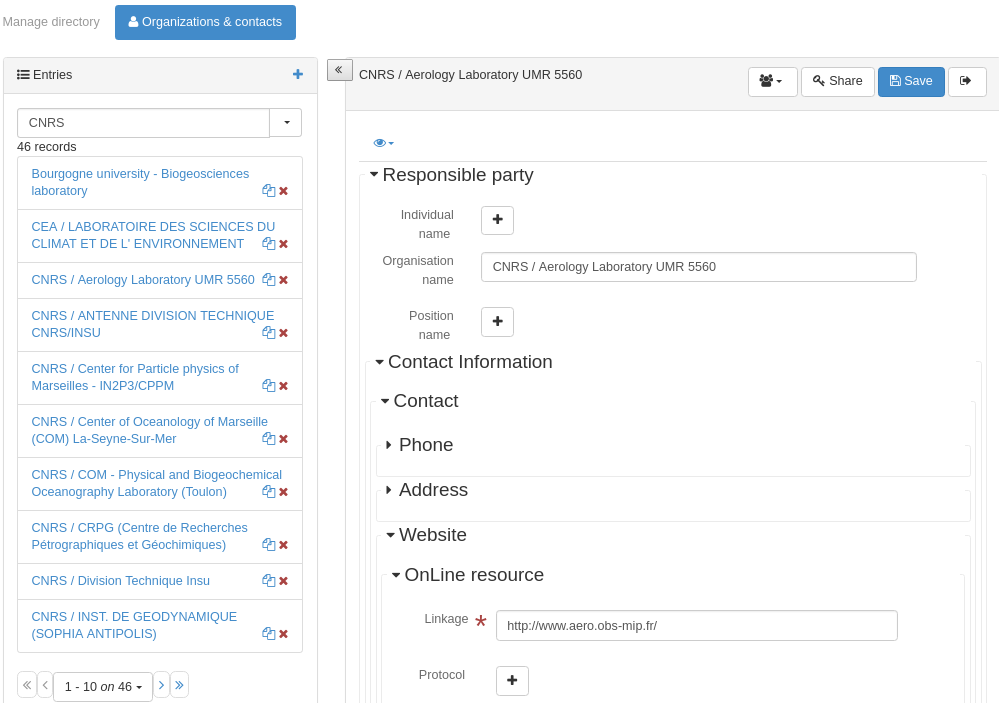
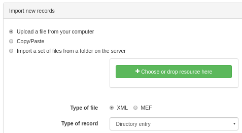
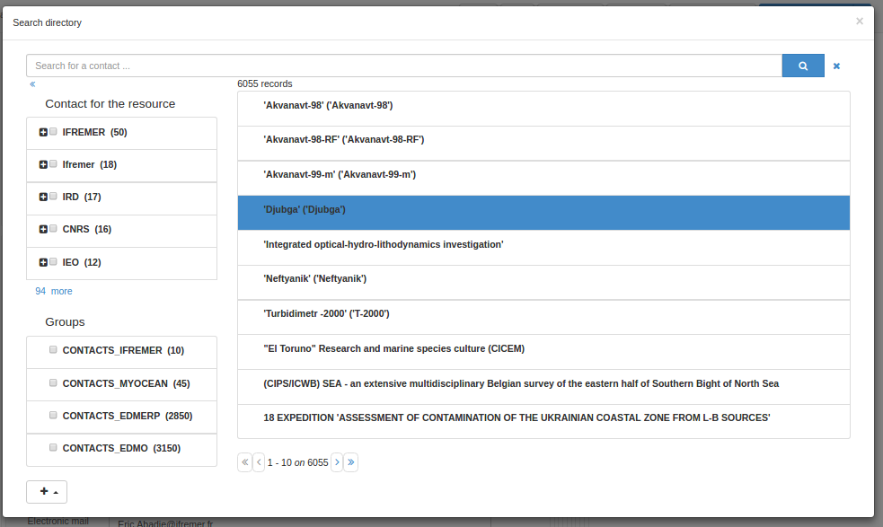
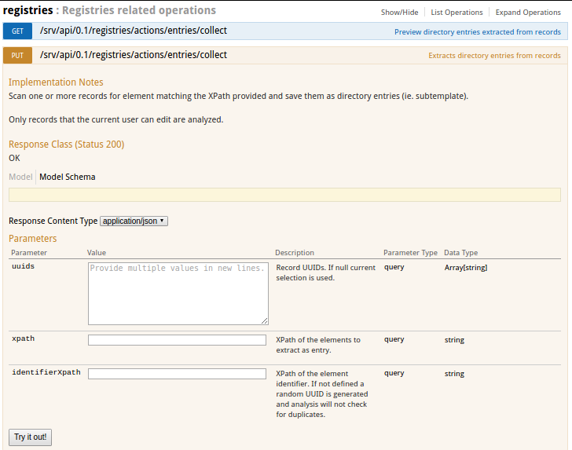
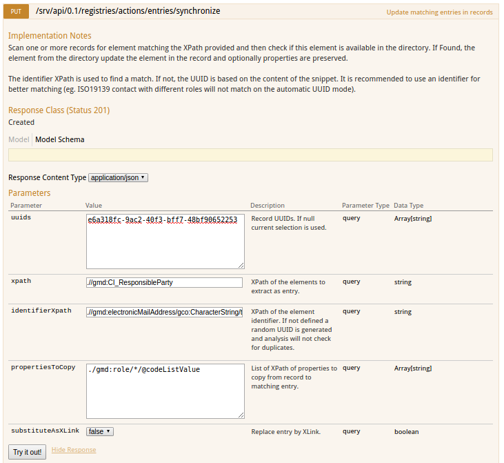
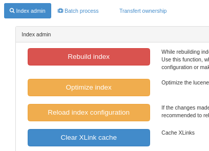

# Managing directories

The catalog supports metadata records that are composed from fragments of metadata. The idea is that the fragments of metadata can be used in more than one metadata record.

Here is a typical example of a fragment. This is a responsible party and it could be used in the same metadata record more than once or in more than one metadata record if applicable.

``` xml
<gmd:CI_ResponsibleParty xmlns:gmd="http://www.isotc211.org/2005/gmd" xmlns:gco="http://www.isotc211.org/2005/gco">
  <gmd:individualName>
    <gco:CharacterString>John D'Ath</gco:CharacterString>
  </gmd:individualName>
  <gmd:organisationName>
    <gco:CharacterString>Mulligan &amp; Sons, Funeral Directors</gco:CharacterString>
  </gmd:organisationName>
  <gmd:positionName>
    <gco:CharacterString>Undertaker</gco:CharacterString>
  </gmd:positionName>
  <gmd:role>
    <gmd:CI_RoleCode codeList="./resources/codeList.xml#CI_RoleCode" codeListValue="pointOfContact"/>
  </gmd:role>
</gmd:CI_ResponsibleParty>
```

Metadata fragments that are saved in the catalogue database are called subtemplates. This is mainly for historical reasons as a subtemplate is like a template metadata record in that it can be used as a 'template' for constructing a new metadata record.

Fragments can be inserted in metadata record in 2 modes:

-   by copy/paste
-   by link (if xlink support is enabled. See [Metadata XLink](../configuring-the-catalog/system-configuration.md#xlink_config))

When using XLinks, if the fragment is updated, then the related fragment in all metadata records will also be updated (check the XLink cache).

Fragments may be created by harvesting (see [Harvesting Fragments of Metadata to support re-use](../../user-guide/harvesting/index.md#harvesting_fragments)) or imported using the metadata import page.

This section of the manual describes:

-   how to manage directories of subtemplates
-   how to extract fragments from an existing set of metadata records and store them as subtemplates
-   how to manage the fragment cache used to speed up access to fragments that are not in the local catalogue

## Managing Directories of subtemplates

There are some differences between the handling of subtemplates and metadata records. Unlike metadata records, subtemplates do not have a consistent root element, the metadata schema they use may not be recognizable, they do not appear in the main search results (unless they are part of a metadata record). Therefore, the editor board allows you to search and manage privileges for directory entries.



From the editor board, choose `Manage directory` to access the editor for directory entries:



If you do not see the `Organizations and Contacts` tab then ensure that you have created subtemplates for contacts for your metadata profile, and that you have loaded them using the `Metadata and Templates` section.

From this page, editors can choose a type of directory using the top tabs, edit/remove/import new subtemplates.

To import new entries, use the metadata import page and choose the appropriate type of record:



Like metadata records, they are allocated an integer id and are stored in the catalog metadata table (with template field set to "y").

## Insert a directory entry in a metadata record

From the metadata editor, the directory can be used to populate contacts for example.


Open the directory selector, choose a contact and then choose the contact role.



## Extracting subtemplates from metadata records

Many sites have existing metadata records with common information eg. contact information in an ISO CI_Contact element. Directory entries such as these can be extracted from a selected set of metadata records using the "Extract subtemplates" API.

To use this function the following set of steps should be followed:

-   Make sure you understand what an XPath is - see <http://www.w3schools.com/xpath/default.asp> for example.
-   Identify fragments of metadata that they would like to manage as reusable subtemplates in the metadata record. This can be done using an XPath. eg. the XPath `.//gmd:CI_ResponsibleParty` identifies all responsible party in a records. An example of such a fragment (taken from one of the sample records) is shown in the following example:

``` xml
<gmd:CI_ResponsibleParty xmlns:gmd="http://www.isotc211.org/2005/gmd" xmlns:gco="http://www.isotc211.org/2005/gco">
   <gmd:individualName>
      <gco:CharacterString>Jippe Hoogeveen</gco:CharacterString>
   </gmd:individualName>
   <gmd:organisationName>
      <gco:CharacterString>FAO - NRCW</gco:CharacterString>
   </gmd:organisationName>
   <gmd:positionName>
      <gco:CharacterString>Technical Officer</gco:CharacterString>
   </gmd:positionName>
   <gmd:contactInfo>
      <gmd:CI_Contact>
         <gmd:phone>
            <gmd:CI_Telephone>
               <gmd:voice gco:nilReason="missing">
                  <gco:CharacterString/>
               </gmd:voice>
               <gmd:facsimile gco:nilReason="missing">
                  <gco:CharacterString/>
               </gmd:facsimile>
            </gmd:CI_Telephone>
         </gmd:phone>
         <gmd:address>
            <gmd:CI_Address>
               <gmd:deliveryPoint>
                  <gco:CharacterString>Viale delle Terme di Caracalla</gco:CharacterString>
               </gmd:deliveryPoint>
               <gmd:city>
                  <gco:CharacterString>Rome</gco:CharacterString>
               </gmd:city>
               <gmd:administrativeArea gco:nilReason="missing">
                  <gco:CharacterString/>
               </gmd:administrativeArea>
               <gmd:postalCode>
                  <gco:CharacterString>00153</gco:CharacterString>
               </gmd:postalCode>
               <gmd:country>
                  <gco:CharacterString>Italy</gco:CharacterString>
               </gmd:country>
               <gmd:electronicMailAddress>
                  <gco:CharacterString>jippe.hoogeveen@fao.org</gco:CharacterString>
               </gmd:electronicMailAddress>
            </gmd:CI_Address>
         </gmd:address>
      </gmd:CI_Contact>
   </gmd:contactInfo>
   <gmd:role>
      <gmd:CI_RoleCode codeList="http://standards.iso.org/ittf/PubliclyAvailableStandards/ISO_19139_Schemas/resources/codelist/ML_gmxCodelists.xml#CI_RoleCode"
                       codeListValue="pointOfContact"/>
   </gmd:role>
</gmd:CI_ResponsibleParty>
```

-   Identify and record the XPath of a field or fields within the fragment which text content will be used as the id of the subtemplate. This XPath should be relative to the root element of the fragment identified in the previous step. So for example, in the fragment above we could choose `.//gmd:electronicMailAddress/gco:CharacterString/text()` as the id for the fragments to be created.
-   On the API page, choose the registries / collect operation:



-   Fill in the form with the information collected in the previous steps.
-   Extracted subtemplates can be previewed using the GET mode and once validated, use the PUT method to save results in the catalog.

Finally, go to the subtemplate directory management interface and you should be able to select the root element of your subtemplates to examine the extracted subtemplates.

Subtemplate indexing is based on the schema (see index-fields folder for details). Currently ISO19139 index subtemplates using as root element:

-   gmd:CI_ResponsibleParty
-   gmd:MD_Distribution
-   gmd:CI_OnlineResource
-   gmd:EX_Extent

In ISO19115-3

-   cit:CI_Responsibility
-   *[mdq:result]
-   gex:EX_Extent

Other configuration examples to collect:

-   Parties in ISO19115-3
    -   `xpath`: `.//cit:CI_Responsibility`
    -   `identifierXpath`: `.//cit:electronicMailAddress/*/text()`
-   Quality specifications in ISO19115-3
    -   `xpath`: `.//*[mdq:result]`
    -   `identifierXpath`: `.//cit:title/*/text()`
-   Extent in ISO19115-3
    -   `xpath`: `.//gex:EX_Extent`
    -   `identifierXpath`: `concat(.//gex:westBoundLongitude/*/text(), ', ', .//gex:eastBoundLongitude/*/text(), ', ', .//gex:southBoundLatitude/*/text(), ', ',.//gex:northBoundLatitude/*/text())` or `gex:description/*/text()`
-   Constraints in ISO19115-3
    -   `xpath`: `.//mri:resourceConstraints/*`

## Synchronizing subtemplates with metadata records

Once created, the catalog provides the capability to synchronize metadata records with directory entries. For this, use the API testing page.

The synchronize process use the same parameters as the collecting process with 2 optionals arguments:

-   `propertiesToCopy` to preserve some element which may be defined in the fragment in the metadata (eg. contact role)
-   `substituteAsXLink` to indicate if copy/paste mode or XLink mode should be used.



## Managing the fragment cache

If metadata records in your catalog link in fragments from external sites, the catalog caches these fragments after the first look up so as to reduce the amount of network traffic and speed up the display of metadata records in search results.

The cache is handled automatically using the Java Cache System (JCS). JCS handles large caches intelligently by:

-   defining a maximum number of cached objects
-   using as much main memory as possible before moving to secondary storage (disk)
-   providing cache persistence: the cache is saved to disk when the web application is shutdown and restores the cache from disk when restarting

You can configure JCS parameters in GeoNetwork using the JCS configuration file in **INSTALL_DIR/web/geonetwork/WEB-INF/classes/cache.ccf**.

Some operations in the catalog (such as harvesting) that generate metadata fragments, will automatically refresh the XLink cache when a new fragment is generated. However, if you are linking fragments from an external site, then depending on how often the change, you will need to manually refresh the XLink cache. To do this you should navigate to the Administration page and select the "Clear XLink Cache and Rebuild Index of Records with XLinks" function as highlighted in the following screenshot of the "Administration" page.


