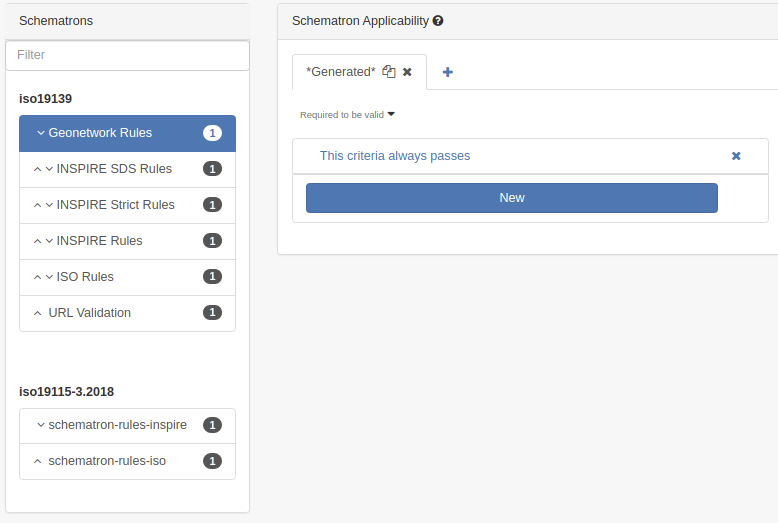
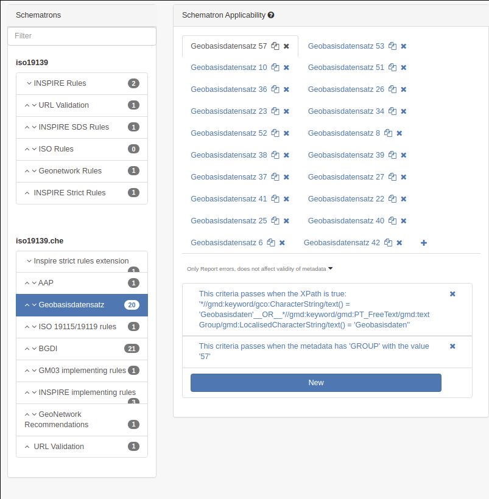

# Configuring validation levels {#configure-validation}

Each standard defines validation levels (using schematron - see [Implementing schema plugins](../../customizing-application/implementing-a-schema-plugin.md)). By default, ISO19139 proposes validation using:

-   ISO rules
-   INSPIRE rules (TG v1.3)
-   GeoNetwork rules (only related to multilingual records)
-   URL checker

All levels will be applied by default during validation and the admin interface allows customization if a rule:

-   is required to be valid (will be reported in green/red depending on the status)
-   is for information only (will be reported in blue)
-   is ignored.

Also conditions can be set to only apply rules to specific records. The condition can be defined on:

-   XPath
-   Group
-   User profile
-   Keyword

For example, [geocat.ch](https://www.geocat.ch/) defines for the GM03 ISO19139 profile rules depending on groups (ie. partners) and the type of dataset eg. a basic geodata.

