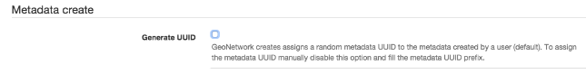
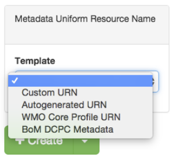
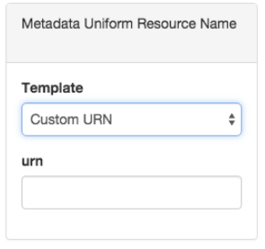
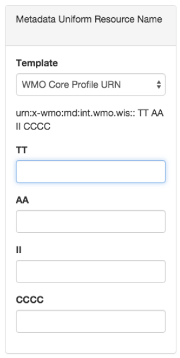
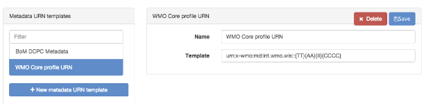

# Configuring metadata identifier {#metadata_identifier}

Some organisations require the definition of metadata identifiers using [URN](https://en.wikipedia.org/wiki/Uniform_Resource_Name) templates.

From the `admin console` --> `metadata and template` --> `Metadata identifier templates` users can customise the behaviour of the catalog when creating new metadata:

-   Create a random UUID. This is the "standard" behaviour of GeoNetwork and it's set as default.
-   Use metadata URN templates to define the metadata identifiers. This option allows the user to enter a metadata identifier from the metadata URN templates defined by an administrator user.

To enable the usage of metadata URN templates for the metadata identifiers, the user should disable the following setting:

Once enabled the metadata create page displays a new panel, that allows the user to select the metadata identifier template:

-   Custom identifier: Allows the user to enter a free-text value for the metadata identifier.

-   Autogenerated identifier: the catalog creates a random UUID.
-   A list of custom templates: A list of the metadata identifier templates. When the user selects one of these templates, the form request the different template values.

New templates can be added in the configuration interface:

For each template a user can define some parameters to fill in the metadata create form. Parameters are defined between curly braces. For example:

-   <urn:x-wmo:md:int.wmo.wis>::{TT}{AA}{II}{CCCC}
-   au.gov.bom::{IDCODE}
